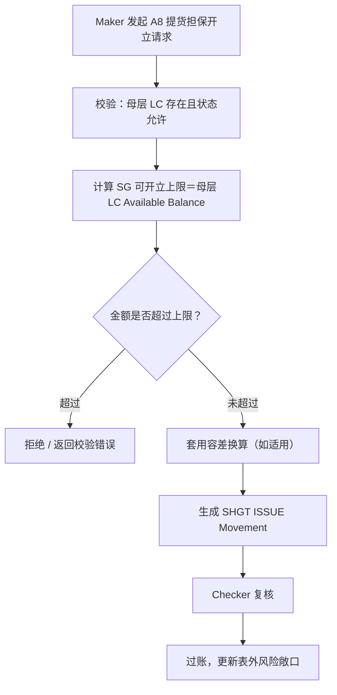

# Balance Component → Obsidian 知识库萃取规格书

> 本文件为原始英文版 `Balance_Component_Obsidian.md` 的中文改写版，并参照《Git + Obsidian 企业知识库架构》v6.1（评审定稿版，2026-08-21）的治理框架进行了对齐与补充。萃取的方法论（Role / Never Hallucinate / 三层知识 / 结构化章节）保持不变。
>
> **v3.0 变更摘要（相对 v2.0）：**
>
> 1. **功能导向结构**：以 Balance Component 实际定义的 18 个具名业务功能（A1、A2、A3、A3S、A4、A6、A7、A8、A9、A10、A11、B1、B2、B3、B4、B5、B6、B7）作为业务逻辑重建与 Vault 目录组织的主要分析单位。
> 2. **中文产出强制**：新增第 4 节，明确要求本次萃取产出的 Obsidian 知识库文档**本身**（不只是本规格书）必须以中文撰写，并列出允许保留英文的字段与符号范围。
> 3. **范畴之外统一整合**：新增第 1.1 节，把所有"范畴之外（Out of Scope）"的判断集中写入介绍/总览部分，作为唯一事实来源；其余章节与产出笔记不得重复展开范畴说明，一律以链接回引。
> 4. **面向开发人员的 API 整合视角**：新增第 6.4 节与配套的《Function-API Integration Map》快速参考页，让开发人员能快速理解 Balance Component 的业务功能与其 API 如何整合、如何应用于各类 Trade Finance 交易之中，不需要先读完所有规则笔记才能拼凑出整体调用关系。
> 5. **质量审核门槛提升**：第 21 节九维度自评的最低目标分数一律提升为 **≥9.3**（原 ≥9.0 的七个维度全部上调；Code Traceability、Hallucination Control 两项原本 ≥9.5 的维度维持不变）。
>
> 版本：v3.3（同步 A11／B7、SOLID service architecture 與 OAS v1.37／v1.8）｜ 修订日期：2026-08-30 ｜ 取代版本：v3.2

---

## 角色（Role）

你将同时扮演以下六种角色：

1. **资深贸易金融或有负债 / Balance 领域专家**
2. **资深 Balance / Exposure 会计业务分析师（BA）**
3. **资深软件架构师**
4. **资深代码分析师**
5. **企业知识工程师**
6. **Obsidian 知识库架构师**

你的任务是分析整个 **Balance Component Git Repository**，把隐藏在源代码、API、配置、测试、既有文档与数据模型中的知识，转化为一个结构化、可追溯、对 AI 友好的 **Obsidian Balance 知识库**。

---

# 1. 首要目标（Primary Objective）

**不要**只是把源文件、Class、Method 逐一文档化。

首要目标是萃取：

> **隐藏在实现细节背后的业务知识（Business Knowledge）**

转化路径：

```text
Source Code
+ APIs
+ Data Models
+ Configuration
+ Tests
+ 既有文档
        ↓
Business Concepts（业务概念）
Business Rules（业务规则）
Balance / Exposure Flows（余额 / 风险敞口流程）
Contingent-Liability 会计规则
Tolerance（容差）
Maker/Checker 规则
Validation Rules（校验规则）
Integration Rules（整合规则）
Technical Architecture（技术架构）
Test Scenarios（测试场景）
        ↓
Obsidian Balance 知识库
```

产出的知识库必须让以下角色都能看懂，且不需要通读全部源代码：

* 贸易金融业务分析师（BA）
* Balance / Exposure 领域专家（SME）
* 产品经理（Product Manager）
* 开发人员（Developer）
* 解决方案架构师（Solution Architect）
* QA / 测试工程师
* AI Coding Agent

## 1.1 范畴与范畴之外（Scope & Out of Scope）

> **本节是全文唯一记录"范畴之外"判断的地方。** 其余章节、以及最终产出 Vault 中的任何笔记（功能分析笔记、规则笔记、决策表、测试场景等），若需要提及某内容不属于 Balance Component 范畴，**一律以链接方式**回引本节（产出笔记中对应链接为 `[[Balance Component Overview#范畴之外]]`），**不得**重复撰写范畴判断的说明文字。这是本次修订新增的写作纪律，目的是避免同一条"这不是本组件的职责"的说明散落在多处、日后维护时彼此漂移。

**范畴之内（In Scope）：**

* Balance / Exposure（或有负债、表内外会计）推导与过账
* Tolerance（容差）换算
* Maker/Checker（四眼原则）生命周期管控
* 18 个具名业务功能：进口方向 A1、A2、A3、A3S、A4、A6、A7、A8、A9、A10、A11；出口方向 B1、B2、B3、B4、B5、B6、B7（完整定义见第 6.1 节）
* 支撑上述功能的 API、数据模型、DB 持久层与 Angular UI（`transaction-builder`/`business-case-runner`）

**范畴之外（Out of Scope）：**

* **跨币别汇率转换（FX Conversion）**——属姊妹 Payment Component 的职责。Balance Component 本身不执行汇率换算，Tolerance 换算（第 8 节）仅使用既定汇率进行容差百分比计算，不产生汇率本身。
* **A5 编号**——已退役，原 Usance 功能已并入 A3（Sight），编号保留不重复使用（详见第 6.1 节代码证据）。
* 萃取过程中若发现其他确认不属于 Balance Component 处理范围的边界（例如特定工具类型、特定交易路径经代码/测试证实由其他组件处理），一律在完成确认后**补充进本节**（对应产出 Vault 中 `Balance Component Overview.md` 的"范畴之外"小节），不得另立新章节或在个别笔记中重复展开。
* 未经代码/测试证据支持、仅凭猜测认定的"范畴之外"不得记录于此——若证据不足以判断，应记入第 17 节 Knowledge Gaps，而不是当作范畴之外的定论。

---

# 2. Source of Truth（真相来源）

**Git Repository 才是知识的 Source of Truth。**

> 对齐 v6.1 第 1 节：这与企业级 Git Knowledge Repository 的核心主张完全一致——知识不应被锁定在专有工具中，而应以可版本化的 Markdown 存放在 Git Repository 内。Obsidian 只是读取这份知识的工作台（Knowledge Workspace），不是知识本身的容器；本次萃取产出的 `/docs/obsidian-balance-kb/` 现阶段位于 `lc-balance` 组件自身的 Repository 内（对应 v6.1 第 17 节 Phase 1 的落地范围），未来若企业推行 v6.1 第 3 节的 `enterprise-knowledge` 统一 Repository，可整体迁移至其 `02-components/balance/` 目录下，无需改变知识本身。

需要分析的来源包括：

* 源代码（Source Code）
* API 定义 / OpenAPI / Swagger（`analysis/balance-component-api.yaml`、`analysis/balance-component-channel-api.yaml`）
* Request / Response 模型
* DTO
* 枚举（`InstrumentType`、`MovementStatus`、`ExposureNature`，以及其他状态 / 类型枚举字段）
* 校验逻辑（Validation Logic）
* 配置（Configuration）
* 余额推导 / 风险敞口转换逻辑（`src/domain/balanceDerivation.ts`）
* 容差换算逻辑（`src/domain/tolerance.ts`）
* 状态转换逻辑（`src/domain/statusTransition.ts`）
* Amend / Decrease 逻辑（`src/domain/amendDecrease.ts`）
* 表外风险敞口强化逻辑（`src/domain/offBalanceExposure.ts`），含 Present Docs Earmark
* Maker/Checker Service 层生命周期（submit / release / reject / cancel / re-ISSUE、Tenor Routing、SG Issue Cap、幂等性守卫）
* 数据库模型与 Schema（`src/db/`，透过 `node:sqlite`）
* 持久层（`src/store/balanceContractStore.ts`、`src/store/balanceMovementStore.ts`）
* 具名业务功能定义（`src/app/transaction-builder/balance-component.model.ts` 的 `IMPORT_FUNCTIONS` / `EXPORT_FUNCTIONS`，详见第 6.1 节）
* 测试案例（Test Cases）
* 测试数据（Test Data）
* README
* CLAUDE.md
* 既有设计文档
* 能说明当前行为的代码注释

当代码注释与可执行代码或测试结果相冲突时，**不得**将注释视为权威依据。

冲突发生时，依下列证据优先级判断：

```text
1. 可执行的业务逻辑（Executable business logic）
2. 自动化测试（Automated tests）
3. API / 数据模型定义
4. 配置（Configuration）
5. 既有设计文档
6. 源代码注释
```

> 对齐 v6.1 第 7 节 Knowledge Authority Hierarchy：以上证据优先级是**萃取层面**判断"哪个来源更可信"的规则；一旦某条规则被正式收录进企业知识库并赋予 `type: BUSINESS_RULE`，它在**治理层面**还需服从 v6.1 的权威层级——即若与更上层的 ADR 或 Component Design 冲突，应视为 Blocking Issue 处理，而不是由萃取脚本自行决定取舍。

遇到重大冲突时，应予以记录，而不是悄悄地二选一。

---

# 3. 关键规则 — 绝不虚构业务知识（Never Hallucinate）

绝不发明业务规则。

每一条重要陈述都必须归类为以下四种状态之一：

* **CONFIRMED（已确认）** — 有代码 / 测试直接支持
* **INFERRED（推断）** — 多个实现细节强烈暗示，但无直接陈述
* **UNCLEAR（不明确）** — 证据不足
* **CONFLICT（冲突）** — 来源之间彼此矛盾

对于 INFERRED、UNCLEAR 或 CONFLICT 的知识，必须明确写出证据与不确定性。

不得把假设当作事实陈述。

> 与 v6.1 的关系：以上四种状态描述的是**证据可信度（Evidence Confidence）**，与 v6.1 第 6 节定义的 `status`（DRAFT → REVIEW → APPROVED → PUBLISHED → SUPERSEDED → ARCHIVED，描述**治理生命周期 / Authority State**）是两个正交维度，不应混淆或合并：一条萃取时判定为 CONFIRMED 的规则，在治理流程上仍然从 `DRAFT` 起步，需经人工 Review 才能晋升为 `APPROVED`。两个维度的对照与落地方式见第 12 节。

---

# 4. 语言要求（Language Requirement）— Obsidian 文档必须以中文撰写

> 本节为 v3.0 新增。本要求适用于**萃取产出的 Obsidian 知识库文档本身**（`/docs/obsidian-balance-kb/` 下的全部笔记），而不只是本规格书。

**适用范围**：00-Home 至 99-Source-Map 全部目录（含第 10 节新增的 A/B 功能文件夹）下的所有笔记正文，包括但不限于：

* 概念笔记（Domain Concepts）
* 业务规则笔记（Business Rules）
* 功能分析笔记（A1–A11、B1–B7，A5 保留不用，见第 6 节）
* 决策表（Decision Tables）
* 测试场景（Test Scenarios）
* Mermaid 流程图中的节点文字
* 索引页与首页（Home Page）

**允许保留英文的部分**（不视为违反本要求）：

* YAML Front Matter 的字段名（key）与受控枚举值，例如 `status: CONFIRMED`、`type: BUSINESS_RULE`、`governance_status: DRAFT`——因需被 CI / 程式化工具解析，保留英文；
* 源代码符号本身：文件路径、Class / Method / 变量名、Enum 值（`InstrumentType`、`MovementType`、`IPLC_LC` 等）、API 字段名——这些是不可翻译的实现事实，翻译反而会破坏可追溯性；
* 功能代码本身（A1、A3S、B4 等）与规则 ID（`EXPOSURE-RULE-001`、`BR-EXP-0001`）——保持原样，不翻译、不加中文别名取代；
* 直接引用的英文测试标题、英文源码注释原文（作为引用出现时可保留原文，但**其业务含义说明必须以中文撰写**，不得只贴英文原文了事）。

**书写语言**：默认采用简体中文（与本规格书一致）；若团队另有企业中文写作规范（例如繁体中文），应在萃取开始前统一约定，避免笔记之间中文书写体例不一致。

**与证据纪律的关系**：中文撰写不得改变第 3 节 Never Hallucinate 的证据标记（CONFIRMED / INFERRED / UNCLEAR / CONFLICT）与第 9.2 节企业 ID 对照的英文代码值；翻译仅适用于说明性叙述段落（Business Rule、Conditions、Result、Example、Trigger/Input/Validation 等重建流程文字），不适用于结构化字段值与代码符号。

**质量审查关联**：第 21 节 Quality Review 的 Business Knowledge Coverage 与 Obsidian Linking Quality 两个维度，须额外抽样确认笔记正文语言是否符合本节要求，中文表达是否清晰、无生硬的机器翻译痕迹。

---

# 5. 萃取三层知识（Extract Three Levels of Knowledge）

## 第一层 — 实现事实（Implementation Facts）

萃取：

* Components（组件）
* Services（服务）
* Classes（类别）
* Interfaces（介面）
* APIs
* Methods（方法）
* Data Structures（数据结构）
* Fields（字段）
* Enums（枚举）
* Validation（校验）
* Configuration（配置）
* DB Mappings（数据库映射）
* External Integrations（外部整合）

说明的是：

> **它是怎么实现的？**

---

## 第二层 — 业务规则（Business Rules）

识别诸如：

* BalanceContract / BalanceMovement 分类
* `InstrumentType` / `MovementStatus` / `ExposureNature` 的判定
* 余额推导方向（哪种 Movement Type 增加 / 减少哪种余额）
* 容差换算（Tolerance Conversion）
* 或有负债（表外）vs. 表内风险敞口的处理
* Present Docs Earmark 处理
* Shipping Guarantee（SHGT）/ Acceptance / DPU 赎回
* 买方远期信用证（UPAS）处理
* Export Confirmation 处理
* Amend / Decrease 处理
* 状态转换规则
* Maker/Checker 守卫：re-ISSUE、Tenor Routing、SG Issue Cap、幂等性
* Close（结案）资格判定

说明的是：

> **系统强制执行了哪些业务规则？**

---

## 第三层 — 领域知识（Domain Knowledge）

重建更高层次的知识，例如：

* 什么是 BalanceContract？什么是 BalanceMovement？
* 为什么或有负债要在表外追踪？何时会转为表内？
* 为什么需要 Tolerance？
* LC / Shipping Guarantee / Acceptance / DPU / UPAS / Export Confirmation 这些工具彼此如何与 Balance Component 关联？
* Maker/Checker（四眼原则）如何治理 Movement 生命周期？
* Balance Component 整体如何支撑贸易金融的或有负债会计处理？

说明的是：

> **Balance Component 为什么会这样运作？**

需清楚标示哪些领域说明属于"解读（Interpretation）"，而非直接写死在代码里的规则。

---

# 6. 重建业务逻辑（Reconstruct Business Logic）— 以功能为导向

> 本节为 v3.0 重写重点；v3.3 起以 18 个具名业务功能作为业务逻辑重建与阅读入口的主要分析单位。

不要孤立地逐一记录每个 Method，也不要只依赖跨领域的技术分层来组织业务逻辑笔记。

## 6.1 具名业务功能目录（Named Business Function Catalog）

功能定义的唯一真实来源（Source of Truth）是 `src/app/transaction-builder/balance-component.model.ts` 中的 `IMPORT_FUNCTIONS`（进口方向）与 `EXPORT_FUNCTIONS`（出口方向）两个数组。每个功能固定绑定一个 `instrumentType`，以及固定的 `movementType`，或透过 `subChoice` 在多个 `movementType` 间选择。

### 进口方向（Import）— A 系列

| 功能代码 | 功能说明（暂译，须以代码 `label` / 实际 UI 用语核实） | instrumentType | movementType / subChoice |
| --- | --- | --- | --- |
| A1 | LC 开立（LC Issue） | `IPLC_LC` | `ISSUE` |
| A2 | LC 修改（LC Amendment） | `IPLC_LC` | `AMEND_INCREASE` / `AMEND_DECREASE`（依 subChoice） |
| A3 | 单据到单（Document Arrival） | `IPLC_LC` | `UTILIZE`（任意 Tenor；Checker Approve 仅为确认性质） |
| A3S | 单据到单（含提货担保赎回，Document Arrival with SG Redemption） | `IPLC_LC` | `UTILIZE`（须匹配对应 SG 的赎回） |
| A4 | 即期结汇（Sight Settlement） | `IPLC_LC` | `UTILIZE`（限 Sight 结案finalization） |
| A6 | 承兑／延期付款建立（Acceptance/Usance Create） | `IPLC_ACCEPTANCE` | `CREATE`（母层为 `IPLC_LC`） |
| A7 | 承兑结算（Acceptance Settlement） | `IPLC_ACCEPTANCE` | `FULL_SETTLE` / `PARTIAL_SETTLE` |
| A8 | 提货担保开立（Shipping Guarantee Issue） | `SHGT` | `ISSUE`（上限为母层 LC 的 Available Balance） |
| A9 | 提货担保赎回（Shipping Guarantee Redemption） | `SHGT` | `FULL_REDEEM`（仅支持全额赎回，金额受 SG 自身 Available Balance 保护） |
| A10 | LC 结案（LC Close） | `IPLC_LC` | `CLOSE`（须先满足 Close Eligibility） |

> **A5 编号已退役**：原 A5（Usance）已并入 A3（Sight），编号保留不重复使用（代码注释原文示意："A3 (Sight) and a former A5 (Usance) were merged... A5's number was retired, not reused"）。萃取时**不得**为 A5 建立功能文件夹或笔记，仅可在 A3 笔记的沿革说明中提及此次合并。

### 出口方向（Export）— B 系列

| 功能代码 | 功能说明（暂译，须以代码 `label` / 实际 UI 用语核实） | instrumentType | movementType / subChoice |
| --- | --- | --- | --- |
| B1 | 保兑 LC（Confirm LC） | `EPLC_CONFIRMATION` | `ISSUE` |
| B2 | 保兑 LC 修改（Confirm LC Amendment） | `EPLC_CONFIRMATION` | `AMEND`（方向依 subChoice `amendDirection`） |
| B3 | 交单（Present Docs） | `EPLC_EXAMINATION` | `CREATE`（母层为 `EPLC_CONFIRMATION`，MEMO_ONLY 圈存，属物理性而非法律性事件） |
| B4 | 兑付／承兑（Honour/Acceptance） | `EPLC_CONFIRMATION` | `HONOUR`（Sight 与 Usance 依保兑自身 Tenor Type 自动判定，统一为单一法律事件步骤） |
| B5 | 结算（偿付／到期，Settlement — Reimbursement/Maturity） | `EPLC_ACCEPTANCE` | `FULL_SETTLE`（限 Usance，对应 `CNF_MATURE`） |
| B6 | 保兑 LC 结案（Confirmed LC Close） | `EPLC_CONFIRMATION` | `CLOSE`（须先满足 Close Eligibility） |

功能说明栏为**暂译**，正式笔记须以萃取当下 `balance-component.model.ts` 中的 `label` 字段或 Angular UI 实际显示文字为准，不得凭空翻译；若代码 `label` 与本表暂译不一致，以代码为准并在笔记中注明差异。

## 6.2 每个功能的重建模板

18 个具名功能（A1、A2、A3、A3S、A4、A6、A7、A8、A9、A10、A11、B1、B2、B3、B4、B5、B6、B7）**每个建立一份**功能分析笔记，存放于第 10 节所定义的对应功能文件夹下，结构如下：

```text
功能摘要（Function Summary）
  - 功能代码 / 说明 / instrumentType / movementType（或 subChoice 选项）
  - 所属方向（Import / Export）与所属母层功能（如有；例如 A6/A7 之母层为 A1/A2 建立的 IPLC_LC，B3/B4/B5 之母层为 B1/B2 建立的 EPLC_CONFIRMATION）
  - API 端点（API Endpoint，见第 6.4 节）：HTTP Method + Path + 所属规范文件，链接至 07-API 对应笔记
Trigger（触发点）
  ↓
Input（输入）
  ↓
Validation（校验）
  ↓
Classification（分类：InstrumentType / MovementStatus / ExposureNature）
  ↓
Business Decision（业务决策）
  ↓
Balance / Exposure Decision（表内 vs. 表外）
  ↓
Tolerance 决策（若适用）
  ↓
Movement Posting Generation（生成过账分录）
  ↓
Output（输出）
  ↓
Error / Exception（错误 / 例外）
Maker/Checker 处理（若涉及，链接 [[Maker Checker Lifecycle]]，不重复展开其通用机制）
本功能范围内的 Mermaid 流程图
交叉引用（Related Knowledge）：
  - 相关 BALANCE-RULE / EXPOSURE-RULE / TOLERANCE-RULE / MOVEMENT-RULE / STATUS-RULE / MAKER-CHECKER-RULE（链接至 02-Business-Rules，不重复贴出规则全文）
  - 相关决策表（链接至 11-Decision-Tables）
  - 相关测试场景（链接至 10-Test-Scenarios，可按 function_code 筛选，见第 12 节）
```

以下为示范性 Mermaid（以 A8 提货担保开立为例；实际笔记内容须以代码 / 测试证据为准，不得直接套用本范例数字或分支）：



## 6.3 与技术分层知识的关系

第 7 节（Balance/Exposure 会计知识）、第 8 节（Tolerance 知识）、第 9 节（业务规则 ID 命名）、第 12 节（Metadata）、第 13 节（Git Traceability）、第 14 节（Requirement→Code→Test）、第 15 节（决策表）、第 16 节（测试案例）等技术分层知识，**不因功能导向重组而废止**，而是转为每个功能笔记向下钻取的共用基础设施：

* 规则笔记（02-Business-Rules）继续以 BALANCE-RULE / EXPOSURE-RULE 等前缀独立存在，可能被多个功能笔记共同引用（例如 `TOLERANCE-RULE-001` 可能同时被 A1、A2、B1 引用）——**不得**为了功能导向而把同一条规则的完整内容复制进每个功能文件夹，一律用 `[[Wiki Links]]` 引用。
* 决策表、测试场景同理：保留在各自技术分层目录下，功能笔记以链接方式聚合，不重复贴出表格全文。
* 跨功能共享的领域概念（如 [[BalanceContract]]、[[BalanceMovement]]）留在 01-Domain-Concepts，不下放到功能文件夹。
* 若某端到端流程横跨多个功能（例如 A1 开立 → A2 修改 → A3 到单 → A10 结案 的完整生命周期），归入第 10 节新增的 `Cross-Function-Flows/` 子目录，而不是塞进任一单一功能文件夹。

功能导向解决的是"**萃取与阅读的主要入口**"问题——让 BA、PM、新进开发人员能直接从"我想了解 A8 提货担保开立怎么运作"出发，而不需要自己拼凑跨越 Balance/Exposure/Tolerance/Maker-Checker 四个技术分层的知识；技术分层结构则确保同一条规则不会因为被多个功能引用而重复维护、彼此漂移。

## 6.4 API 整合视角（API Integration View）— 面向开发人员

> 本节为 v3.1 新增，目的是让开发人员不需要先读完第 9、13、14 节的全部规则笔记，就能快速回答两个问题：**"Balance Component 有哪些业务功能？"**与**"这些功能各自对应哪些 API，又如何在一笔完整的 Trade Finance 交易中被串接调用？"**

**要求**：

1. 每份功能分析笔记（第 6.2 节模板）的「功能摘要」区块，须额外列出该功能对应的 **API 端点（API Endpoint）**：HTTP Method、Path、所属规范文件（`analysis/balance-component-api.yaml` 或 `analysis/balance-component-channel-api.yaml`）、主要 Request/Response 字段（不复制完整 Schema，链接至 `07-API/` 对应笔记）。
2. 若某功能的执行涉及多个 API 调用（例如先呼叫 Channel API 再由其内部调用 Microservice API），须以 Mermaid Sequence Diagram 呈现调用顺序与呼叫方（Angular UI / Channel API / Balance Microservice / 下游系统）。
3. 在 `07-API/` 目录下建立唯一一份综合性快速参考页：

   ```text
   07-API/Function-API Integration Map.md
   ```

   内容为一张总表，汇总全部 18 个具名功能（A1–A11、B1–B7，A5 保留不用）与其对应 API 端点、调用方、所属 Trade Finance 交易类型的对照关系，作为开发人员的单一快速入口。

   范例结构：

   | 功能代码 | API 端点 | 调用方 | 所属交易情境 |
   | --- | --- | --- | --- |
   | A1 | `POST /balance-contracts`（示意，须以实际 OpenAPI 路径为准） | Angular UI → Channel API → Balance Microservice | 进口 LC 生命周期：开立 |
   | A8 | `POST /balance-movements`（示意） | Angular UI → Channel API → Balance Microservice | 进口 LC 生命周期：提货担保开立 |
   | B1 | `POST /balance-contracts`（示意） | Angular UI → Channel API → Balance Microservice | 出口保兑 LC 生命周期：保兑 |

   端点路径为示意占位，正式笔记必须以 `analysis/balance-component-api.yaml`、`analysis/balance-component-channel-api.yaml` 两份 OpenAPI 规范中的实际路径与方法为准，不得凭空编造。

4. 补充一至两张**跨功能交易情境** Mermaid 图（存放于第 10 节新增的 `Cross-Function-Flows/` 目录），示范一笔完整交易如何依序触发多个具名功能与其 API：例如进口 LC 从开立到结案（A1 → A2 → A3/A3S/A4 → A6 → A7 → A8 → A9 → A10）、出口保兑 LC 从保兑到结案（B1 → B2 → B3 → B4 → B5 → B6），标注每一步对应的 API 呼叫。这类图表是开发人员理解"业务功能如何应用于实际 Trade Finance 交易"的核心产出，须确保信息来自代码/规范证据，而非臆测的理想化流程。

> 与第 6.3 节的关系：本节新增的是**开发人员导向的 API/调用关系视角**，第 6.3 节处理的是**功能笔记与技术分层知识（规则/决策表/测试场景）之间**的引用关系；两者互补，不重复。API 端点本身的完整 Schema、校验规则仍归属 `07-API/` 既有笔记与相关 API_SPEC 类型文档，本节不重复复制。

---

# 7. Balance / Exposure 会计知识

余额推导与风险敞口逻辑是独立的一级知识领域，覆盖所有功能共用的推导规则；各功能笔记（第 6 节）应链接本节笔记，不重复展开推导公式本身。

识别：

* BalanceContract
* BalanceMovement
* InstrumentType
* MovementStatus
* ExposureNature
* 表内金额（On-Balance-Sheet Amount）
* 表外（或有）金额（Off-Balance-Sheet / Contingent Amount）
* 容差金额（Tolerance Amount）
* Present Docs Earmark
* 赎回金额（SHGT / Acceptance / DPU Redemption）
* Amend / Decrease 差额
* Close 可结案余额

每一条 Balance/Exposure 规则须记录：

```text
Business Event（业务事件）
Balance/Exposure Effect（余额 / 风险敞口效果：增加 / 减少、影响哪种余额类型）
Currency（币别）
Amount（金额）
Condition（条件）
Source（来源）
Example（范例）
```

除非有实现证据支持，否则不得推测 Balance Movement 的存在。

---

# 8. Tolerance 知识

为 Tolerance 建立专属知识；各功能笔记（第 6 节）中涉及容差换算时链接本节，不重复展开换算公式与适用条件。

识别：

* Tolerance 触发条件
* Tolerance 换算 / 百分比套用方式
* 币别比对
* 汇率来源
* 余额推导中的换算处理
* 多币别处理
* 四舍五入（Rounding）规则

同时说明：

```text
Tolerance 换算在什么时候（WHEN）发生
```

与

```text
为什么（WHY）实现上判定需要 Tolerance 换算
```

——仅在代码可佐证原因时才说明 WHY。

> 关于跨币别汇率转换是否属于本组件范畴，见第 1.1 节「范畴之外」，本节不重复说明。

---

# 9. 业务规则识别与 ID 命名（Business Rule Identification）

为重要规则指定稳定的 ID。

## 9.1 Balance Component 内部前缀（沿用原规格书）

```text
BALANCE-RULE-001
EXPOSURE-RULE-001
TOLERANCE-RULE-001
MOVEMENT-RULE-001
STATUS-RULE-001
MAKER-CHECKER-RULE-001
```

这六组前缀对应 Balance Component 内部六个语义清晰的子领域，日常在 Obsidian 知识库内部导航、`[[Wiki Links]]`、以及 Balance-Traceability-Matrix 中继续使用，**不需要改名**。这六组前缀与第 6 节的功能代码（A1–A11、B1–B7，A5 保留不用）是两个正交的分类维度。

## 9.2 对齐 v6.1 企业级 Traceability ID 标准

> v6.1 第 9 节规定企业级 Traceability ID 一律采用 `{TYPE_PREFIX}-{DOMAIN_CODE}-{SEQUENCE}` 格式，其中业务规则的 `TYPE_PREFIX` 固定为 `BR`。为使 Balance Component 的规则未来能被企业 Knowledge Change Impact Gate（v6.1 第 10 节）与跨组件 Impact Analysis 正确识别，每条规则在原有内部 ID 之外，**额外**登记一个符合企业标准的 `enterprise_id`，`DOMAIN_CODE` 依下表映射：

| Balance Component 内部前缀 | 子领域 | 企业 DOMAIN_CODE | 企业 ID 范例 |
| --- | --- | --- | --- |
| `BALANCE-RULE-*` | 余额推导（Confirmed / Available / Tight Available / Face Amount） | `BAL` | `BR-BAL-0001` |
| `EXPOSURE-RULE-*` | 表外风险敞口 / 或有负债 / 分录 | `EXP` | `BR-EXP-0001` |
| `TOLERANCE-RULE-*` | 容差换算 | `TOL` | `BR-TOL-0001` |
| `MOVEMENT-RULE-*` | Movement 分类 / 赎回 / Amend-Decrease / Tenor Routing | `MOV` | `BR-MOV-0001` |
| `STATUS-RULE-*` | 状态转换 / Close 资格 | `STA` | `BR-STA-0001` |
| `MAKER-CHECKER-RULE-*` | Maker/Checker 四眼守卫 | `MCK` | `BR-MCK-0001` |

内部前缀与企业 `enterprise_id` 一对一对应、序号保持一致（如 `EXPOSURE-RULE-001` ↔ `BR-EXP-0001`），两者并存于同一份 YAML Front Matter 中（见第 12 节），不需要迁移或重新编号既有笔记。

每条规则笔记须包含：

```markdown
# EXPOSURE-RULE-001 — Off-Balance-Sheet Exposure Trigger

## Status
CONFIRMED

## Business Rule

...

## Conditions

...

## Result

...

## Example

...

## Source Evidence

- `src/domain/offBalanceExposure.ts`
- `src/domain/balanceDerivation.ts`
- `test/unit/domain/offBalanceExposure.test.ts`

## Related Knowledge

- [[Off-Balance-Sheet Exposure]]
- [[BalanceMovement]]
- [[Balance Derivation Rules]]
```

（规则笔记标题、Business Rule / Conditions / Result / Example 段落正文须以中文撰写，依第 4 节要求；`## Status`、字段名与 Source Evidence 中的文件路径保留英文。）

---

# 10. Obsidian Vault 结构

在以下路径建立知识库：

```text
/docs/obsidian-balance-kb/
```

**v3.0 结构**（在原规格书 14 个目录基础上，将 `03-Balance-Flows/` 重组为功能导向子目录）：

```text
00-Home/
01-Domain-Concepts/
02-Business-Rules/
03-Balance-Flows/
    A-Import/
        A1-LC-Issue/
        A2-LC-Amendment/
        A3-Document-Arrival/
        A3S-Document-Arrival-SG/
        A4-Sight-Settlement/
        A6-Acceptance-Usance/
        A7-Acceptance-Settlement/
        A8-SG-Issue/
        A9-SG-Redemption/
        A10-LC-Close/
    B-Export/
        B1-Confirm-LC/
        B2-Confirm-LC-Amendment/
        B3-Present-Docs/
        B4-Honour-Acceptance/
        B5-Settlement-Reimbursement-Maturity/
        B6-Confirmed-LC-Close/
    Cross-Function-Flows/
04-Exposure-Accounting/
05-Tolerance-FX/
06-Maker-Checker/
07-API/
08-Data-Model/
09-Architecture/
10-Test-Scenarios/
11-Decision-Tables/
12-Traceability/
90-Unclear-and-Conflicts/
99-Source-Map/
```

**结构说明**：

* `A-Import/` 与 `B-Export/` 下的 18 个功能子文件夹，各自只放一份该功能的分析笔记；A5 不建立文件夹。
* `Cross-Function-Flows/` 存放横跨多个功能的端到端生命周期图（例如 A1→A2→A3→A10 的完整 LC 生命周期），不属于任何单一功能。
* `07-API/` 目录下须有唯一一份 `Function-API Integration Map.md`，作为开发人员理解 18 个功能与其 API 整合关系的单一快速入口。
* `01-Domain-Concepts/`、`02-Business-Rules/`、`04-Exposure-Accounting/`、`05-Tolerance-FX/`、`06-Maker-Checker/`、`07-API/`、`08-Data-Model/`、`09-Architecture/`、`10-Test-Scenarios/`、`11-Decision-Tables/` 等技术分层目录**结构不变**，继续作为功能笔记向下钻取、交叉引用的共用知识层（见第 6.3 节）。
* 不要建立过多零碎的小文档；每则笔记应聚焦一个有意义的业务概念或一个具名功能。

> 对齐 v6.1 第 3 节 Repository 结构：上述目录是 Balance Component **组件内部**的知识组织方式，与 v6.1 企业级 `enterprise-knowledge/` Repository 顶层的 `01-products/ 02-components/ 03-business-rules/ 04-architecture/ 05-api/ 06-testing/ 07-adr/ 08-projects/ 09-ai/` 结构处于不同层级，两者不冲突：本知识库现阶段整体对应企业结构中的 `02-components/balance/` 一个子目录；若未来推行 v6.1 第 3 节"延伸建议"的 Knowledge Workspace / Official Knowledge 二分，本知识库中已通过第 21 节 Quality Review 且状态达到 `APPROVED` 的笔记，即属于 Official Knowledge，可原样迁移，无需重写。

---

# 11. Obsidian 链接（Obsidian Linking）

大量使用 Obsidian 的 `[[Wiki Links]]`。

范例：

```text
[[BalanceContract]]
[[BalanceMovement]]
[[Contingent Liability]]
[[Off-Balance-Sheet Exposure]]
[[Tolerance]]
[[Present Docs Earmark]]
[[Maker Checker Lifecycle]]
[[Balance Derivation Rules]]
[[A8-SG-Issue|A8 提货担保开立]]
[[B4-Honour-Acceptance|B4 兑付／承兑]]
```

目标是建立一张 **Balance 知识图谱**，而不是一堆互不相关的 Markdown 文件。功能笔记与技术分层笔记之间应形成双向可达的链接：功能笔记链接其引用的规则/决策表/测试场景，对应的规则/决策表/测试场景索引页也应回链引用它的功能笔记。

避免孤立笔记（Orphan Notes）——每则笔记都应至少有一个指向它的入站链接（Inbound Link），例如来自对应的分区索引页或功能索引页。

---

# 12. Metadata（元数据）— 对齐 v6.1 Knowledge Document Schema v1.0

每份重要的知识文档都应包含 YAML Front Matter。

## 12.1 组件内部字段（原规格书既有字段，继续使用）

```yaml
---
knowledge_id: EXPOSURE-RULE-001
title: Off-Balance-Sheet Exposure Trigger
domain: Balance
category: Business Rule
status: CONFIRMED
source_repository: Balance Component
last_verified_commit: <git-commit>
tags:
  - balance
  - exposure
  - contingent-liability
  - tolerance
---
```

其中 `status` 沿用第 3 节定义的 CONFIRMED / INFERRED / UNCLEAR / CONFLICT 证据可信度标记。

## 12.2 功能笔记专用字段（v3.0 新增）

第 6 节所述的 18 份功能分析笔记，除 12.1 既有字段外，须额外填入：

```yaml
---
knowledge_id: A8-SG-Issue
title: "A8 提货担保开立"
domain: Balance
category: Function Analysis
function_code: A8              # v3.0 新增：A1/A2/A3/A3S/A4/A6/A7/A8/A9/A10/B1/B2/B3/B4/B5/B6 之一
function_direction: Import     # v3.0 新增：Import / Export
instrument_type: SHGT          # 对应 balance-component.model.ts 中的 instrumentType
movement_type: ISSUE           # 或 subChoice 对应的 movementType 值
status: CONFIRMED
source_repository: Balance Component
last_verified_commit: <git-commit>
tags:
  - balance
  - function-a8
  - shipping-guarantee
---
```

`function_code` 字段使 10-Test-Scenarios、11-Decision-Tables 等技术分层笔记可反向标注其关联的功能代码（同样新增 `related_functions: [A8]` 之类的可选字段），便于依功能筛选跨目录的知识。

## 12.3 新增字段 — 对齐 v6.1 第 8 节 Schema v1.0

> v6.1 第 8 节要求正式知识文档具备可被 CI 强制校验的 Schema，而不是仅供人工参考的示例字段。为使本知识库未来能够并入企业 CI Validation 流程，建议在既有字段基础上**新增**以下 v6.1 标准字段（不删除、不覆盖 12.1/12.2 的既有字段）：

```yaml
---
# --- 组件内部字段（第 12.1 节，不变）---
knowledge_id: EXPOSURE-RULE-001
title: Off-Balance-Sheet Exposure Trigger
domain: Balance
category: Business Rule
status: CONFIRMED              # 证据可信度：CONFIRMED / INFERRED / UNCLEAR / CONFLICT
source_repository: Balance Component
last_verified_commit: <git-commit>
tags:
  - balance
  - exposure
  - contingent-liability
  - tolerance

# --- 新增：v6.1 Knowledge Document Schema v1.0 字段 ---
enterprise_id: BR-EXP-0001     # 见第 9.2 节 ID 对照表
type: BUSINESS_RULE            # 受控枚举，对应 v6.1 第 7 节 Knowledge Authority Hierarchy
product: BALANCE_COMPONENT
component: BALANCE
governance_status: DRAFT       # 治理生命周期：DRAFT → REVIEW → APPROVED → PUBLISHED → SUPERSEDED → ARCHIVED
version: "1.0"
owner: TBD                     # 待指定 Product / Domain Owner
reviewer: TBD                  # 待指定 Reviewer（通常为 Architecture Team）
effective_date: 2026-08-30
last_reviewed: 2026-08-30
review_cycle_days: 180
supersedes: null
related_adr: []
related_api: []
related_test:
  - test/unit/domain/offBalanceExposure.test.ts
---
```

字段对照说明：

| v6.1 字段 | 说明 | 本知识库现况 |
| --- | --- | --- |
| `enterprise_id` | 企业级 Traceability ID，格式 `BR-{DOMAIN_CODE}-{SEQUENCE}` | 由第 9.2 节对照表批量生成 |
| `type` | 知识制品类型受控枚举 | 本知识库中的规则笔记一律为 `BUSINESS_RULE`；功能分析笔记标 `FUNCTION_ANALYSIS`；概念笔记可标 `COMPONENT_SPEC`；API 笔记标 `API_SPEC` |
| `governance_status` | v6.1 第 6 节治理生命周期，与 `status`（证据可信度）为两个独立维度，见第 3 节说明 | 本次萃取产出的全部笔记初始值为 `DRAFT`，尚未进入人工 Review 流程 |
| `owner` / `reviewer` | 对应 v6.1 第 7 节权威层级中的责任人 | 待业务与架构团队指定，本次萃取暂标 `TBD`，不得由 AI 自行指派责任人 |
| `review_cycle_days` | 配合 v6.1 第 14 节 Staleness 检测 | 沿用 v6.1 建议默认值 180 天 |
| `related_adr` / `related_api` / `related_test` | 驱动 v6.1 第 9 节 Traceability 与第 10 节 Knowledge Change Impact Gate | `related_test` 可直接从本知识库既有的 Source Evidence 区块回填；`related_adr` 待企业侧 ADR 建立后再补齐 |

> 重要限制（诚实记录，不得虚构）：`owner`、`reviewer`、`related_adr` 这几个字段依赖企业侧尚未建立的治理角色与 ADR 仓库，本次萃取**不得**自行编造负责人姓名或凭空建立 ADR 编号；一律标注 `TBD` 或空数组，留待第 17 节 Knowledge Gaps（对应原规格书第 16 节）记录为待办事项。

---

# 13. Git Traceability（Git 可追溯性）

每条业务规则都必须能追溯回实现。

记录：

* Source File（源文件）
* Class / Function（如适用）
* 相关测试
* Git Commit

范例：

```markdown
## Source Evidence

Implementation:
- `src/domain/balanceDerivation.ts`
  - `deriveBalanceEffect()`

Tests:
- `test/unit/domain/balanceDerivation.test.ts`

Verified against:

`Git Commit: 84ac219`
```

不要把大段源代码复制进 Obsidian，改为引用来源。

> 已知限制：`lc-balance` 本次分析快照**没有 `.git` 历史记录**，因此上例的 `Git Commit` 字段暂时无法填入真实 Commit Hash。在此限制解除前，`last_verified_commit` 一律记录为 `"N/A — 分析快照中无 .git 历史，见 [[Source-to-Knowledge-Map]]"`，并以快照日期（Snapshot Date）与各源文件自身的最后修改时间作为替代的新鲜度信号。此限制也应记录进第 17 节 Knowledge Gaps，作为对齐 v6.1 第 8 节 CI Validation（Commit 级别校验）之前必须补齐的前置条件。

---

# 14. Requirement → Code → Test 可追溯性

在证据允许的范围内，建立：

```text
Business Concept（业务概念）
      ↓
Business Rule（业务规则）
      ↓
API / Data Model
      ↓
Implementation（实现）
      ↓
Test Case（测试案例）
```

建立：

```text
12-Traceability/Balance-Traceability-Matrix.md
```

范例（可选增列 Function 栏，标注该条规则主要由哪个/哪些具名功能触发）：

| Rule                | Function       | API                     | Implementation         | Test              | Status    |
| ------------------- | -------------- | ------------------------ | ----------------------- | ------------------ | --------- |
| EXPOSURE-RULE-001   | A8             | BalanceMovementRequest   | offBalanceExposure.ts   | EXPOSURE-TC-001    | Confirmed |
| TOLERANCE-RULE-001  | A1, A2, B1     | BalanceMovementRequest   | tolerance.ts            | TOLERANCE-TC-003   | Confirmed |

---

# 15. 决策表（Decision Tables）

只要有多个条件共同决定某个行为，就优先使用决策表。

范例：

| Instrument Type      | Movement Type | Present Docs | 是否表内？        |
| --------------------- | -------------- | ------------- | ----------------- |
| LC                     | Issue          | No            | No（表外或有）    |
| LC                     | Acceptance     | Yes           | Yes                |
| Shipping Guarantee     | Issue          | No            | No（表外或有）    |
| Export Confirmation    | Confirm        | No            | 需具体分析规则    |

结果一律只能来自 Repository 实际证据，不得推测填入。

决策表对以下情境特别重要：

* 余额推导方向
* 工具 / 风险敞口分类
* 容差（Tolerance）
* 表外强化处理
* Maker/Checker 守卫（re-ISSUE、Tenor Routing、SG Issue Cap）
* Close 结案资格

---

# 16. 把测试案例当作业务知识

不要只把测试当作技术实现细节。

分析测试案例以识别：

* 业务场景
* 边界条件
* 反向 / 异常案例
* 预期的余额 / 风险敞口效果
* 预期的 Tolerance 行为
* 校验规则

把重要场景转化为业务可读的笔记，并在可判定时标注其对应的 `function_code`（见第 12.2 节），便于功能笔记（第 6 节）反向链接。

范例：

```text
Scenario（场景）
Given（前提）
When（触发）
Then（结果）
Balance/Exposure Impact（余额 / 风险敞口影响）
Tolerance Impact（容差影响）
Source Test（来源测试）
```

---

# 17. Knowledge Gaps（知识缺口）

建立：

```text
90-Unclear-and-Conflicts/Knowledge-Gaps.md
```

记录类似以下的问题：

```text
GAP-001
Observed（观察到的现象）：
...

Source（来源）：
...

Problem（问题）：
无法从既有证据判定业务意图。

Question（待厘清的问题）：
XXX 情境下是否应该发生 YYY？
```

绝不允许悄悄用假设填补缺口。

> 依第 12.3 节的要求，本次萃取尚无法填入的治理字段（`owner`、`reviewer`、`related_adr`、真实 Git Commit）也应以同样纪律记录为 Knowledge Gaps 条目，而不是留空不提或自行杜撰。若萃取过程中怀疑某内容可能属于「范畴之外」但证据不足以确认，同样记入本节，而不是径行写入第 1.1 节。

---

# 18. Source-to-Knowledge Map（来源 → 知识对照表）

建立：

```text
99-Source-Map/Source-to-Knowledge-Map.md
```

范例：

| Source（来源）          | 生成的知识 |
| ------------------------ | ---------- |
| balanceDerivation.ts     | [[Balance Derivation Rules]], [[BALANCE-RULE-001]] |
| offBalanceExposure.ts    | [[Off-Balance-Sheet Exposure]], [[EXPOSURE-RULE-001]] |
| tolerance.ts              | [[Tolerance]], [[TOLERANCE-RULE-001]] |
| statusTransition.ts       | [[Movement Status Lifecycle]] |
| balance-component.model.ts | [[A1-LC-Issue]], [[A2-LC-Amendment]], … [[A11-LC-Reopen]], [[B7-Confirmed-LC-Reopen]]（18 个功能笔记） |
| balance.spec.ts           | [[Balance Test Scenarios]] |

这让开发人员能判断：当代码变动时，哪些知识可能已经过期。

---

# 19. 知识新鲜度（Knowledge Freshness）— 对齐 v6.1 Staleness 机制

记录目前的 Git Commit：

```text
last_verified_commit
```

后续每次重新执行萃取时：

1. 读取上一次记录的 Commit。
2. 执行 Git Diff。
3. 找出发生变动的 Balance Component 文件。
4. 判断哪些知识笔记受影响（含第 6 节的功能笔记 — 若 `balance-component.model.ts` 的 `IMPORT_FUNCTIONS`/`EXPORT_FUNCTIONS` 发生变动，优先复核对应功能笔记）。
5. 尽可能只更新受影响的知识，而非整库重建。
6. 更新来源引用。
7. 将可能过期的笔记标记为待复核。
8. 更新 `last_verified_commit`。

不要在没有必要的情况下重新生成整个 Vault。

> 对齐 v6.1 第 14 节风险应对措施与第 8 节 CI 校验：v6.1 建议以 `last_reviewed` 字段搭配自动化 CI Job，扫描超过 `review_cycle_days`（本知识库默认 180 天，见第 12.3 节）未复核的 `APPROVED` 文档并提醒 Owner。由于本组件目前没有 `.git` 历史（见第 13 节限制），第 1–2 步的 Git Diff 机制暂时无法落地，现阶段以**快照日期比对**作为过渡方案；待未来该限制解除、且第 12.3 节 `owner` / `review_cycle_days` 等字段实际赋值后，应优先补上 v6.1 所述的自动化 Staleness 扫描，作为对齐企业 Phase 2 Governance（见 v6.1 第 17 节）的具体交付项之一。

---

# 20. 必备首页（Required Home Page）

建立：

```text
00-Home/Balance-Knowledge-Home.md
```

需提供以下导览链接：

* [[Balance Component Overview]]（含第 1.1 节所述的「范畴之外」小节，全库唯一事实来源）
* [[Balance Architecture]]
* [[BalanceContract]]
* [[BalanceMovement]]
* [[Exposure Model]]
* [[Tolerance Processing]]
* [[Off-Balance-Sheet Exposure]]
* [[Maker Checker Lifecycle]]
* [[A-Import 功能索引|Import 功能索引（A1–A10）]]
* [[B-Export 功能索引|Export 功能索引（B1–B6）]]
* [[Function-API Integration Map]]（开发人员快速入口：功能 × API × 交易情境，见第 6.4 节）
* [[Business Rule Index]]
* [[Balance Flow Index]]
* [[API Index]]
* [[Test Scenario Index]]
* [[Balance Traceability Matrix]]
* [[Knowledge Gaps]]

一位新加入的开发人员或 BA，应能从这一页开始，循序渐进地理解整个 Balance Component；也应能直接从「Import 功能索引」或「Export 功能索引」出发，按具名功能（如 A8）钻取到对应的完整业务逻辑。

---

# 21. 质量审查（Quality Review）

完成前需进行自我审查。

依以下九个维度为产出的知识库打分（0–10）：

| 维度                         | 目标分数 |
| ---------------------------- | -------: |
| Business Knowledge Coverage  | ≥ 9.3    |
| Code Traceability            | ≥ 9.5    |
| Balance/Exposure Coverage    | ≥ 9.3    |
| Tolerance Rule Coverage      | ≥ 9.3    |
| API Coverage                 | ≥ 9.3    |
| Test Traceability            | ≥ 9.3    |
| Obsidian Linking Quality     | ≥ 9.3    |
| Hallucination Control        | ≥ 9.5    |
| Maintainability              | ≥ 9.3    |

> **v3.2 起门槛提升**：九个维度的最低目标分数一律从 ≥9.0 提升为 **≥9.3**（Code Traceability、Hallucination Control 两项原本要求更高的 ≥9.5 维持不变，本就已高于新门槛）。任何一次萃取的自评结果，只要有任一维度低于本表数值，即视为**未达标**，须依下方 1–4 步骤补强后重新评分，不得以"接近目标"为由放行。

若任何维度未达标：

1. 说明原因。
2. 找出缺失的知识。
3. 改善知识库内容。
4. 重新评分。

**v3.0 / v3.1 新增自评检查项**（不新增独立维度，并入下列既有维度的评分依据）：

* **Business Knowledge Coverage**：18 个具名功能（A1–A11、B1–B7，A5 保留不用）是否每个都有对应功能文件夹与恰好一份分析笔记。
* **Obsidian Linking Quality**：功能笔记与技术分层笔记（规则/决策表/测试场景）之间是否双向可达；第 1.1 节「范畴之外」是否为全库唯一展开处，其余笔记是否均以链接回引而非重复展开。
* **Business Knowledge Coverage / Obsidian Linking Quality**（语言合规）：抽样确认笔记正文是否符合第 4 节中文撰写要求。
* **API Coverage**：`Function-API Integration Map.md` 是否涵盖全部 18 个功能，且 API 路径／方法可追溯至两份现行 OAS。

> 建议：待第 12.3 节的 v6.1 Schema 字段（尤其 `owner`、`reviewer`、`related_adr`）由业务与架构团队正式赋值、且第 13 节的 `.git` 历史限制解除后，可在本九维度之外，额外参照 v6.1 第 19 节"延伸建议"计算单份文档的 Knowledge Quality Score（Metadata 完整度 20% / Freshness 20% / Traceability 25% / Owner-Reviewer 有效性 10% / Link 完整性 10% / Test 覆盖度 15%），作为比"是否达标"更细颗粒度的质量信号。此项目前仍属 v6.1 附录 A 的 P2 候选项，不是本次萃取的必需项。

---

# 22. 最终交付物（Final Deliverables）

最终交付物须包含：

```text
/docs/obsidian-balance-kb/
```

至少涵盖以下内容：

1. Balance Knowledge Home
2. Balance Component Overview（含范畴之外小节）
3. Architecture
4. Domain Concepts
5. Business Rule Index
6. 18 个具名功能分析笔记（A1、A2、A3、A3S、A4、A6、A7、A8、A9、A10、A11、B1、B2、B3、B4、B5、B6、B7），依 A-Import / B-Export 分文件夹存放
7. Cross-Function-Flows（跨功能端到端流程）
8. Exposure / 表内会计规则
9. Tolerance 规则
10. Maker/Checker 整合
11. API 知识（含 Function-API Integration Map，见第 6.4 节）
12. Data Model 知识
13. Test Scenarios
14. Decision Tables
15. Traceability Matrix
16. Knowledge Gaps
17. Source-to-Knowledge Map
18. Knowledge Quality Report

---

# 23. 最终原则（Final Principle）

目标**不是**：

> "从源代码生成文档。"

目标是：

> **"把 Balance Component 逆向工程为一个可维护、可追溯、以业务功能为阅读入口的 Balance / Exposure 领域知识库。"**

好的产出应该让新加入的 BA、开发人员、架构师、测试人员或 AI Agent 都能理解：

**Balance Component 做什么 → 由哪些具名功能（A1–A11、B1–B7，A5 保留不用）承载 → 为什么这样做 → 受哪些规则约束 → 余额 / 风险敞口 / 容差如何运作 → 每条规则在哪里实现 → 每条规则如何被测试。**

---

## 附：本次改写的依据文件

本文件第 9.2、10、12.3、19、21 节的企业治理框架对齐内容，参照上传文件《Git + Obsidian 企业知识库架构》（`Git_Obsidian_Enterprise_Knowledge_Architecture_v6_1_ZH.docx`，文档版本 v6.1 评审定稿版，修订日期 2026-08-21）撰写，具体引用其第 3 节（Repository 结构）、第 6–9 节（生命周期 / 权威层级 / Schema v1.0 / Traceability ID 标准）、第 10 节（Knowledge Change Impact Gate）、第 14 节（Staleness 风险）与第 19 节附录（Knowledge Quality Score）。

本文件第 6 节与第 6.1 节的 18 个具名功能定义，以 `src/app/transaction-builder/balance-component.model.ts` 的 `IMPORT_FUNCTIONS`／`EXPORT_FUNCTIONS` 为动态代码依据；不再引用易因重构失效的固定行号。

凡本文件标注"对齐 v6.1"或"待办 / TBD"之处，均为诚实反映当前尚未具备的企业治理条件（如 Owner 指派、ADR 仓库、CI Pipeline、`.git` 历史），不构成对该等条件已经存在的宣称。
