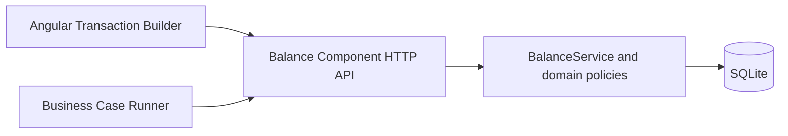

# System Overview

> [!important] Source of truth
> 本筆記由目前 repository 產生。若文件與程式不一致，以 Source Code、測試及 OAS 為準。

Balance Component 由 Angular／Web Component UI、Business Case backend orchestration 與 Balance Component microservice 組成。

UI 提供 Balance Account Number、Transaction Builder 與 Business Case Runner。Microservice 負責合約、movement、餘額推導、Maker／Checker、虛帳與生命週期規則。
