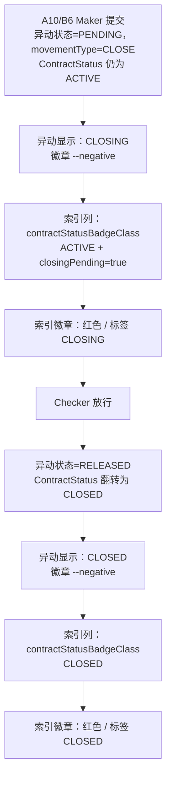

# A10/B6 Close — status/badge progression from Submit to Release

CLOSE 异动自身状态标签的业务流程，独立于上方的预扣（earmark）流程之外——CLOSE 永远优先走专属的 CLOSING/CLOSED 分支，不进入预扣/一般异动的分岔；而合约层级的徽章（另一个不同的函数 contractStatusBadgeClass）只有在该异动真正被 Release、且 ContractStatus 本身翻转为 CLOSED 之后，才会永久性地变为红色。

## Source Evidence

- `balance-component.model.ts:598-663 (isCloseMovement, displayStatus/statusBadgeClass CLOSE branch, contractStatusBadgeClass/contractStatusLabel)`
- `CLAUDE.md decision log: 'A10/B6 Close — write off the remaining Confirmed Balance and retire the LC/Confirmation' and 'U03 應該是CLOSING狀態' closingPending fix`

## Related Knowledge

- Angular Domain Model (balance-component.model.ts)
- [[Business-Rule-Index]]
