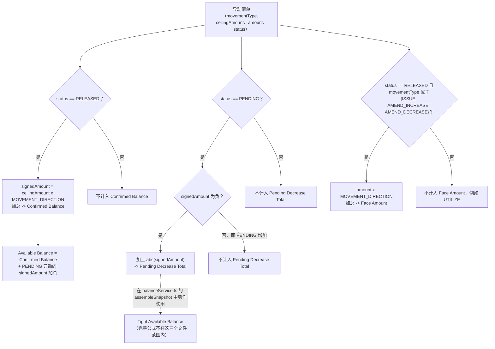

# Balance derivation pipeline (Confirmed -> Available -> Pending Decrease Total -> Face Amount)

这四个数字全部在查询时刻由同一份原始异动数组计算而来，从不存储。Confirmed Balance 是仅计入 RELEASED 状态的基础数字；Available Balance 在此基础上叠加了 PENDING 异动的净影响；Pending Decrease Total 是另一个范围更窄、独立计算的加总（仅计入呈减少型态的 PENDING 部分），作为其他地方（这三个文件之外）计算 Tight Available Balance 的一个组成部分；Face Amount 则使用同一份异动清单独立计算，使用原始的 amount 而非 ceilingAmount。

## Source Evidence

- `microservices/balance-component/src/domain/balanceDerivation.ts (full file)`

## Related Knowledge

- Balance Derivation, Status Transition, Tenor Routing
- [[Business-Rule-Index]]
