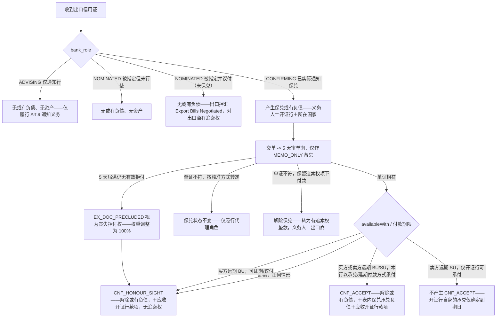

# 出口保兑——角色决定风险暴露，兑付/议付/承兑三分支

同一笔出口信用证会根据 bank_role 产生零条、一条或两条风险暴露分录，一旦保兑成立，还会依据可用付款期限（tenor availability）进一步分支。

## 来源证据

- `TF_Contingent_Liability_Lifecycle-en.txt §6, §7.3, §7.4, §7.5, §7.6, §13 (Export)`

## 相关知识

- Foundational Design-Rationale Docs（TF Balance Spec + Contingent Liability Lifecycle 基础设计原理文档）
- [[Business-Rule-Index]]
