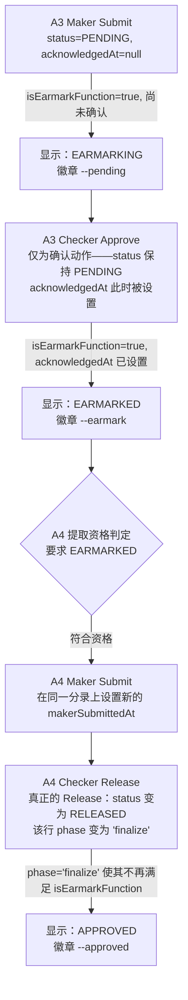

# 进口单据到达——状态标签在 A3（预留/earmark）与 A4（终结）阶段间的演进

该业务流程由 isEarmarkFunction() 的 phase 参数、以 acknowledgedAt 为门槛区分的 EARMARKING/EARMARKED 拆分共同推导得出，并与 CLAUDE.md 决策记录中"4-eyes（双人复核）：要求 EARMARKED，而非仅 EARMARKING"这一规则相互印证。A3 自身的 Checker Approve 只是确认（acknowledgment），从来不是真正的 Release，因此分录在整个 A3 生命周期内始终保持 PENDING——只有后续 A4 真正的 Release 才会改变 MovementStatus。所展示的各标签，是 displayStatus()/statusBadgeClass() 根据同一底层分录（IPLC_LC, UTILIZE）在各阶段计算出的结果。

## 来源证据

- `balance-component.model.ts:505-560 (doc comment + isEarmarkFunction + displayStatus)`
- `CLAUDE.md decision log: 'A4/A6 picker eligibility now requires genuine 4-eyes: EARMARKED (Checker-acknowledged), not just EARMARKING'`
- `CLAUDE.md decision log: 'A finalized Sight Document Arrival splits into a create + finalize row in the merged timeline'`

## 相关知识

- Angular Domain Model（balance-component.model.ts，Angular 领域模型）
- [[Business-Rule-Index]]
</content>
