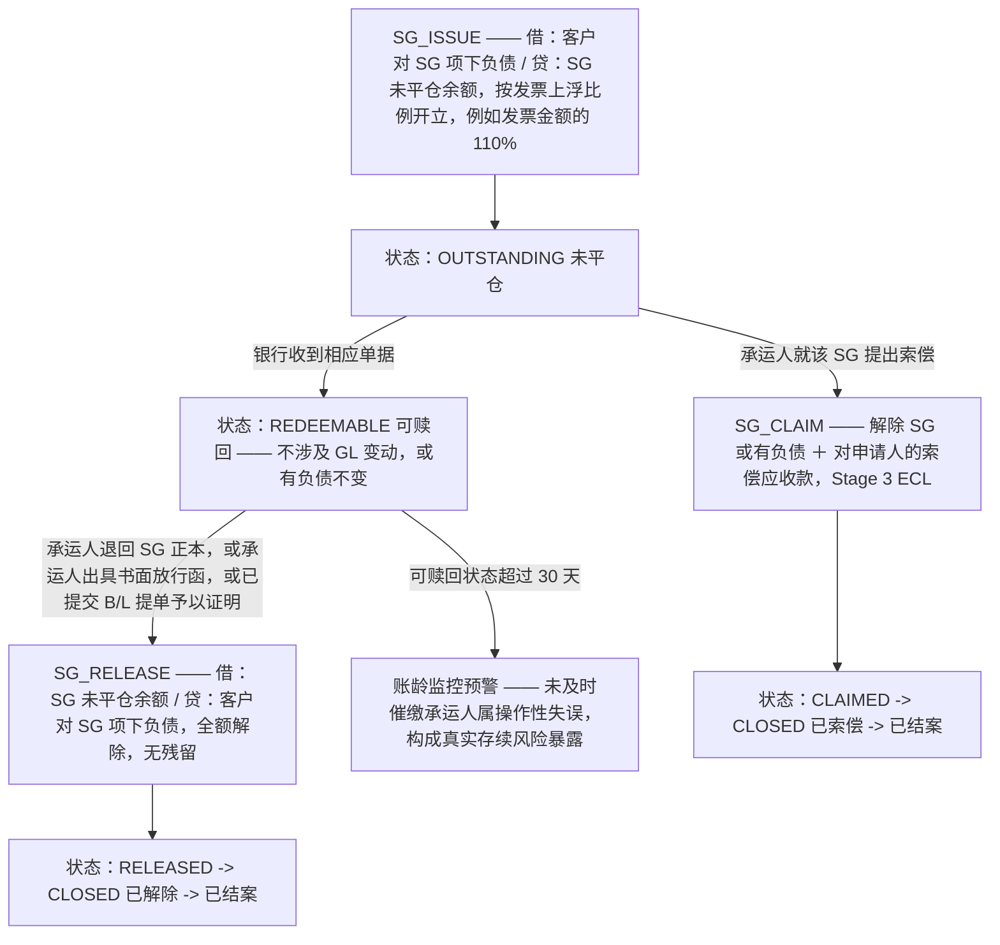

# 船公司保函（Shipping Guarantee）生命周期——以票据本身为准的两阶段解除

SG 或有负债按发票金额的上浮比例开立，只能通过真正来自承运人一方的行为解除（绝不能以匹配单据金额的方式解除）。存在两个独立阶段：收到单据（仅变更状态，不涉及 GL）与承运人放行（全额解除，无余额残留）。

## 来源证据

- `TF_Contingent_Liability_Lifecycle-en.txt §4.4, §13 Revised lifecycle architecture`

## 相关知识

- Foundational Design-Rationale Docs（TF Balance Spec + Contingent Liability Lifecycle 基础设计原理文档）
- [[Business-Rule-Index]]
</content>
