# Auto Expiry and Auto Close

> [!important] Source of truth
> 本筆記由目前 repository 產生。若文件與程式不一致，以 Source Code、測試及 OAS 為準。

## Runtime cycle

Server 依 `EXPIRY_SWEEP_INTERVAL` 呼叫同一 lifecycle cycle，順序固定為 Auto Expiry 後 Auto Close。現行 demo／dev 設定為每 30 秒；兩項功能各有獨立 enabled flag，目前皆為 true。單一 candidate 失敗只回傳該 contract 的 error，不中止其餘 candidates。

## Auto Expiry

| Rule | Current source behavior |
|---|---|
| Candidate | status=ACTIVE、root instrument 為 `IPLC_LC`／`EPLC_LC`／`EPLC_CONFIRMATION`，而且有 `expiryDate` |
| Date gate | `asOf > expiryDate + mailFloatGraceDays`；calendar days |
| Grace source | contract captured value優先；否則 Import／Export config，目前皆為 5 days |
| Eligibility | 整個 event tree 不得有 open events |
| Outstanding child balances | SG／Acceptance 可以仍有 balance；Auto Expiry 不套用 Close 的 zero-balance rule |
| Movement | 建立 `EXPIRE`，amount 必須等於當時 Confirmed Balance |
| Actors | `BATCH_MAKER` 建立、`BATCH_CHECKER` Release，維持 Maker／Checker separation |
| Contract effect | Release 後 `ACTIVE → EXPIRED`，並以 release time 寫入 `effectiveTo` |
| Financial effect | EXPIRE 寫出剩餘 contingent balance，具有實際 accounting／regulatory impact |

沒有 expiry date 的 contract 永遠不會被 Auto Expiry 選取。Expiry grace 不是 UCP presentation period，不可混用。

## Auto Close

| Rule | Current source behavior |
|---|---|
| Candidate | status=EXPIRED 的上述三種 root instruments |
| Date gate | `asOf > effectiveTo + AUTO_CLOSE_GRACE_PERIOD_BUSINESS_DAYS` |
| Current grace | 2 business days；Phase 1 只跳過 Saturday／Sunday，尚未接 holiday service |
| Eligibility recheck | SG Balance=0、Acceptance Balance=0，且整個 event tree 無 open events |
| Movement | 建立並 Release `CLOSE`；reason code固定為 `NATURAL_EXPIRY_ALL_BALANCES_CLEARED` |
| Contract effect | `EXPIRED → CLOSED`，更新 `effectiveTo` |
| Financial effect | 已 EXPIRED 的 balance 通常已由 EXPIRE 歸零；CLOSE 是 status finalization，不重複產生 expiry write-off |

Auto Close grace 以「成為 EXPIRED 的時間」為 anchor，使用 business days；它和 Auto Expiry 的 mail-float calendar days 是兩套不同規則。

## Reopen protection and restoration

若最新 movement 是已 RELEASED 的 `REOPEN`，在一個 sweep interval 內 Auto Expiry／Auto Close 都會跳過，避免同一個 cycle 立即再次關閉。A11／B7 restoration amount 是由最後一段連續 RELEASED `EXPIRE`／`CLOSE` movements 的 `ceilingAmount` 加總；遇到第一個非 EXPIRE／CLOSE movement 即停止，因此不會重複恢復較早 lifecycle chain。

## Sequence

```mermaid
stateDiagram-v2
  [*] --> ACTIVE: A1/B1 Release
  ACTIVE --> EXPIRED: Auto EXPIRE Release
  EXPIRED --> CLOSED: Auto CLOSE Release
  EXPIRED --> ACTIVE: Expiry Date Amendment Release
  CLOSED --> ACTIVE: A11/B7 Reopen; expiry still future
  CLOSED --> EXPIRED: A11/B7 Reopen; expiry already passed
```

