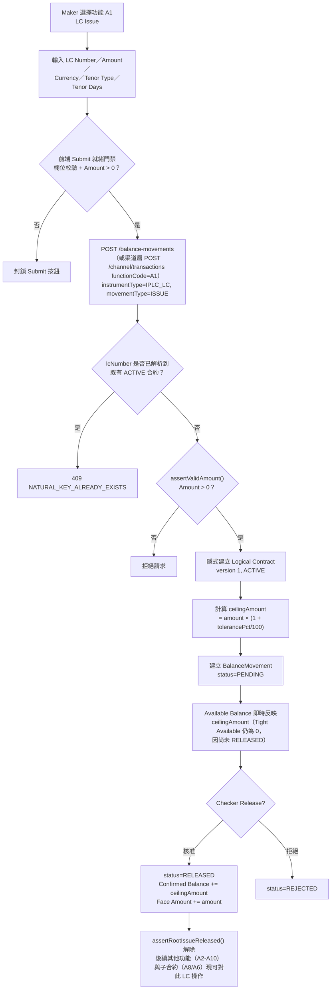

# A1 — 進口信用狀開立（LC Issue）

## 功能摘要

| 項目 | 內容 |
|---|---|
| 功能代碼 | A1 |
| 功能說明（label） | LC Issue（`balance-component.model.ts` 中 `code: 'A1'` 項目的真實 label） |
| instrumentType | `IPLC_LC` |
| movementType | `ISSUE` |
| subChoice | 無——A1 沒有 `subChoice` 欄位，movementType 固定為 `ISSUE` |
| 所屬方向 | 進口 Import（`side: 'IMPORT'`） |
| 所屬母層功能 | 無——A1 本身即為根層功能（建立全新 `IPLC_LC` Logical Contract） |
| tenorTypeOptions | `ALL_TENOR_OPTIONS`（Sight / Seller's Usance / Buyer's Usance）——LC 自身聲明的付款期限，決定後續 A3 會路由到 A4（Sight）或 A6（Usance） |
| 代碼內建說明（help text） | "Establish a new Import LC, with Tolerance on a Maximum Exposure Basis. Tenor Type is the LC's own stated payment term, declared at issuance (Design doc §7) — determines whether A3 routes to A4 (Sight) or A6 (Usance) later." |

**API 端點**（真實查證，來自 `analysis/balance-component-api.yaml` 與 `analysis/balance-component-channel-api.yaml`）：

- **微服務層（Microservice API，`balance-component-api.yaml`）**：`POST /balance-movements`——通用端點，由 request body 的 `instrumentType: 'IPLC_LC'` + `movementType: 'ISSUE'` 決定行為；`naturalKey` 尚未解析到任何 ACTIVE 合約時，此呼叫會**隱式建立**新的 Logical Contract（version 1, ACTIVE），並產生一筆 PENDING BalanceMovement。
- **渠道層（Channel/façade API，`balance-component-channel-api.yaml`）**：`POST /channel/transactions`——以 `functionCode: 'A1'` 驅動，請求 body 為 `ChannelOriginTransactionRequest` 形狀（A1/B1 專屬：`currency` 為必填的使用者輸入欄位，其餘功能一律不接受此欄位、由伺服器端推導）。規範內附有明確的 A1 範例（`a1_lc_issue`）。

## Trigger（觸發點）

Maker 在 Transaction Builder（`transaction-builder/`）選擇功能 A1，代表要為一組全新的 LC 編號（自然鍵 `lcNumber`）建立進口信用狀。CONFIRMED（`balance-component.model.ts` IMPORT_FUNCTIONS 陣列）。

## Input（輸入）

- LC Number（自然鍵，`naturalKey.lcNumber`）
- Amount（面額，Maker 鍵入的原始金額，非 ceilingAmount）
- Currency Code（**A1/B1 專屬**——唯一由使用者直接輸入、且成為該合約永久幣別的功能；其餘功能一律 CARRIED，由既有合約/母合約推導，不接受此欄位）——CONFIRMED（[[MAKER-CHECKER-RULE-049]]，代碼於 `builder-fields.ts` 中設有「Currency Code 從 A1/B1 攜帶並鎖定」邏輯）
- Tenor Type（Sight / Seller's Usance / Buyer's Usance，來自 `ALL_TENOR_OPTIONS`）
- Tenor Days（依 Tenor Type 而定：Sight 應歸零，Usance 應大於 0）
- tolerancePct（容差百分比，選填）
- Event Seq、Created By（系統欄位，唯讀）

## Validation（校驗）

- **前端 Submit 就緒門禁**：A1/B1 不需要「已選定合格目標」（因為是建立全新合約），但仍需通過欄位有效性校驗與通用 Amount > 0 檢查——CONFIRMED（[[MAKER-CHECKER-RULE-027]]）。
- **Tenor Days 正規化兜底**：`validateSubmit()` 在提交時會將 Sight 的 Tenor Days 強制歸零、Usance 要求其大於 0，但此兜底邏輯僅套用在 `selectedFunction.code === 'A1'`（`submit-rules.ts:100`）；即時 Formly 表達式（`builder-fields.ts:139`）則同時套用於 A1 與 B1。兩處判斷條件不一致，B1 在提交階段缺乏對應兜底——CONFLICT（[[MAKER-CHECKER-RULE-024]]）。
- **伺服器端金額校驗**：`assertValidAmount()` 在 `createMovement()`（於 `resolveOrCreateContract()` 之前）與 `release()` 兩處都會執行，一般 ISSUE 要求金額嚴格 > 0——CONFIRMED（[[MOVEMENT-RULE-011]]）。
- **重複 ISSUE 防護（Re-ISSUE Guard）**：若 `lcNumber` 已解析到一份 ACTIVE 合約，再次對其執行 A1 ISSUE 會被拒絕，回傳 `409 NATURAL_KEY_ALREADY_EXISTS`，既有合約的 Confirmed Balance 不受影響——CONFIRMED（[[MAKER-CHECKER-RULE-008]]、[[MOVEMENT-RULE-009]]）。此防護僅在應用層（`createMovement()`）實現，非資料庫 UNIQUE 約束強制。
- **渠道層 Currency Code schema 校驗**：非 A1/B1 的 `functionCode` 若帶入 `currency` 欄位會被 Channel API 的 OAS schema（`additionalProperties:false`）拒絕（400）；此為規格層要求，微服務本身尚未強制執行——CONFIRMED（[[MAKER-CHECKER-RULE-049]]）。
- **Expiry Date 強制必填（2026-08-26 新增）**：A1 對根層 `IPLC_LC` 的 ISSUE，`expiryDate` 由原本選填改為強制必填，三層防線一致（Angular 表單 `required` 綁定／Submit 兜底守衛／服務端 `assertExpiryDateRequired()`，於 `resolveOrCreateContract()` 建立合約之前執行）——CONFIRMED（[[MOVEMENT-RULE-075]]）。動機是 AUTO EXPIRY 批次掃描只挑選 `expiry_date IS NOT NULL` 的合約，缺此欄位的 ISSUE 將永遠無法被自動到期處理。
- **Expiry Date 必須為真實本國營業日（2026-08-26 新增）**：在必填之上，`expiryDate` 進一步要求不得是週六/週日或本國（台灣）公眾假期，檢查順序為先週末、後假日（`domesticCalendar.ts`）——CONFIRMED（[[MOVEMENT-RULE-076]]）。2026-2028 範圍外的年份被刻意視為「未知」而非拒絕（週末檢查仍生效，僅假日檢查查無資料），與兄弟服務 `business-days-mock` 自身的 fail-closed 姿態相反，屬已記錄的刻意設計差異。Checker `release()` 對已持久化的 `contract.expiryDate` 做同一邏輯復檢，但此復檢僅在該值本身非空時才觸發——見 [[MOVEMENT-RULE-075]] 對此非對稱之處的完整說明。

## Classification（分類）

A1 屬於「創設型」（creating）movementType（`ISSUE`），在 `functionActionIcon()` 的 5 組分類中歸入 `issue` 群組（與 A6/A8/B1 同組，區別於 `amend`/`utilize`/`redeem`/`cross`）——CONFIRMED（[[MOVEMENT-RULE-018]]，`balance-component.model.ts` 的 `ISSUE_GROUP_CODES`）。

## Business Decision（業務決策）

- A1 建立的是**根層合約**（root instrumentType，`IPLC_LC`）。在其自身的 ISSUE 尚未被 Checker Release 之前，該合約雖已是 `ACTIVE` 狀態（Maker Submit 時即設定），但任何其他 movementType（包含子合約如 SHGT/Acceptance 的建立）都會被 `assertRootIssueReleased()` 以 `409 IllegalStateTransitionError` 拒絕，提示「Release the Issue first.」——CONFIRMED（[[STATUS-RULE-008]]）。
- 同一守衛也反映在 Maker 端選取器上：`requireIssueReleased` 目錄過濾會將自身 ISSUE 仍為 PENDING 的自然鍵排除在所有 Maker 操作類選取器之外，直到其 ISSUE 經 Checker 放行——CONFIRMED（[[MAKER-CHECKER-RULE-006]]）。

## Balance/Exposure Decision（表內 vs 表外）

- A1 屬於 Balance Component 範疇內的**表外／或有風險敞口**（Off-Balance-Sheet Contingent Exposure）處理，不涉及表內分錄——這是 Balance Component 的既定範疇邊界（Exposure Rule 一般性規則，非 A1 專屬單獨規則）。
- **或有分錄科目族**：`deriveContingentAccountEntry()` 依 `instrumentType` 查找科目族，`IPLC_LC` → `LC_FAMILY`（Folio 1），並按 tenor 加後綴（Sight / 買方遠期 / 賣方遠期）。範例：`IPLC_LC`/`ISSUE`/`SIGHT` → 借方「Customers' Liability under DC — Sight」，貸方「Documentary Credits Outstanding — Sight」——CONFIRMED（[[EXPOSURE-RULE-007]]）。
- **方向固定**：`MOVEMENT_DIRECTION` 表對 `IPLC_LC`/`ISSUE` 有固定的 +1（增額）方向，用於所有餘額推導函式——CONFIRMED（[[MOVEMENT-RULE-001]]）。
- **Face Amount**：僅追蹤 RELEASED 狀態的 ISSUE/AMEND_INCREASE/AMEND_DECREASE 的原始 `amount`（非 ceilingAmount）——A1 一旦 Release，即計入 Face Amount——CONFIRMED（[[BALANCE-RULE-005]]）。

## Tolerance 決策（若適用）

A1（`IPLC_LC`/`ISSUE`）**適用**容差換算：

- Instrument-Type 門控：`IPLC_LC` ∈ {IPLC_LC, EPLC_LC, EPLC_CONFIRMATION}——通過——CONFIRMED（[[TOLERANCE-RULE-002]]）。
- Movement-Type 門控：`ISSUE` ∈ {ISSUE, AMEND_INCREASE, AMEND_DECREASE, AMEND}——通過——CONFIRMED（[[TOLERANCE-RULE-003]]）。
- 雙重門控刻意同時檢查 instrumentType 與 movementType，以避免 SHGT 自身的 `ISSUE`（A8）與 LC 的 `ISSUE`（A1）在字串比對上被誤判——CONFIRMED（[[TOLERANCE-RULE-004]]）。
- **Ceiling Amount 公式**：`ceilingAmount = faceAmount × (1 + tolerancePct/100)`；範例：`amount='100000', tolerancePct='10', movementType='ISSUE', instrumentType='IPLC_LC' → ceilingAmount='110000'`——CONFIRMED（[[TOLERANCE-RULE-001]]）。
- **一笔剛 Submit、仍 PENDING 的 A1 ISSUE 在自身獲 Checker 核准前完全無法被動用**（`tightAvailableBalance` 由 Confirmed Balance 推導，PENDING 的 ISSUE 不會提升該值——「增加從嚴」）——CONFIRMED（[[TOLERANCE-RULE-008]]，範例直接引用 A1）。

## Movement Posting Generation（過帳分錄）

- Submit（Maker）：建立一筆 `status='PENDING'` 的 BalanceMovement，`ceilingAmount` 依上方容差公式計算；若 `naturalKey` 尚未解析到 ACTIVE 合約，同一次呼叫隱式建立 Logical Contract（version 1, ACTIVE）——CONFIRMED（`balance-component-api.yaml` `POST /balance-movements` 端點描述）。
- 可用餘額（Available Balance）在 Submit（PENDING）階段即完整反映此筆變動的全部影響；後續 Release 只是把同一總額在 PENDING／Confirmed 間搬移，數值本身不變——CONFIRMED（[[BALANCE-RULE-002]]，範例明確提及「A1 LC Issue：可用餘額在 Submit 時增加 ceilingAmount，在 Approve 時不變」）。
- Release（Checker）：`POST /balance-movements/{movementId}/release`——狀態轉為 `RELEASED`，Confirmed Balance 隨之增加，Face Amount 也開始計入此筆金額。
- 冪等性：Submit 端點在 `(balanceContractId, eventSeq)` 上冪等——重複提交同一組合會回傳既有記錄（200），不會重複計數或報錯。

## Output（輸出）

- 新建的 `BalanceContract`（`IPLC_LC`，`ACTIVE`）與其首筆 `BalanceMovement`（`ISSUE`，初始 `PENDING`，Checker 核准後轉 `RELEASED`）。
- Look Up Current Balance／Inquire Events 可查詢到此 LC 的餘額快照與事件時間軸；A1 本身無 Step-2 次要選取器（建立全新 LC，非對既有目標操作）。
- A1/B1 在 Submit 或 Release 成功時才更新 Look Up Current Balance 對應該筆 LC Number 的查詢結果（與其他功能「一選取 LC 即自動查詢」的行為不同，因為 A1/B1 尚無既有 LC 可供選取）。

## Error/Exception（錯誤/例外）

| 情境 | 回應 |
|---|---|
| `lcNumber` 已解析到既有 ACTIVE 合約，仍提交 A1 ISSUE | `409 NATURAL_KEY_ALREADY_EXISTS`——CONFIRMED（[[MAKER-CHECKER-RULE-008]]、[[MOVEMENT-RULE-009]]） |
| Amount ≤ 0 | 伺服器端 `assertValidAmount()` 於 Submit／Release 兩處均拒絕——CONFIRMED（[[MOVEMENT-RULE-011]]） |
| `sourceTransactionRef` 於同一 `balanceContractId` 下重複使用（非相同 eventSeq 的重試） | `400 sourceTransactionRef already used`——CONFIRMED（OAS 端點描述） |
| 貨幣精度不符該幣別小數位規則 | 請求層拒絕——CONFIRMED（一般性規則，非 A1 專屬） |
| （渠道層）非 A1/B1 的 functionCode 帶入 `currency` 欄位——與 A1 本身無直接關係，但為理解 A1「Currency Code 為何是例外」所需的對照規則 | `400 REQUEST_VALIDATION_FAILED`（規格層要求，微服務未強制）——CONFIRMED（[[MAKER-CHECKER-RULE-049]]） |
| B1 是否有等效於 A1 的 Tenor Days Submit 時兜底正規化 | UNCLEAR／CONFLICT——`submit-rules.ts:100` 僅檢查 `'A1'`，`builder-fields.ts:139` 同時檢查 `'A1' \|\| 'B1'`，兩處程式碼路徑矛盾——CONFLICT（[[MAKER-CHECKER-RULE-024]]） |

## Mermaid Flowchart

## 交叉引用（Related Knowledge）

- [[Balance Component Overview]]
- [[MAKER-CHECKER-RULE-008]] — 重複 ISSUE 防護（409 NATURAL_KEY_ALREADY_EXISTS）
- [[MOVEMENT-RULE-009]] — Re-ISSUE 防護（naturalKey 路徑）
- [[MAKER-CHECKER-RULE-024]] — A1 Tenor Days Sight/Usance 正規化兜底（與 B1 不一致，CONFLICT）
- [[MAKER-CHECKER-RULE-049]] — 渠道 API 僅 A1/B1 允許輸入 Currency Code
- [[MAKER-CHECKER-RULE-006]] — requireIssueReleased 目錄過濾（下游功能需等待 A1 Release）
- [[STATUS-RULE-008]] — 根合約自身 ISSUE 必須先 RELEASED（assertRootIssueReleased）
- [[BALANCE-RULE-002]] — 可用餘額公式（範例直接引用 A1）
- [[BALANCE-RULE-005]] — Face Amount 僅追蹤 RELEASED 的 ISSUE/AMEND_INCREASE/AMEND_DECREASE
- [[EXPOSURE-RULE-007]] — 或有分錄科目族查找（LC_FAMILY，按 tenor 加後綴）
- [[MOVEMENT-RULE-001]] — MOVEMENT_DIRECTION 固定方向表
- [[MOVEMENT-RULE-011]] — assertValidAmount() 伺服器端金額 > 0 兜底
- [[TOLERANCE-RULE-001]] — Ceiling Amount 公式
- [[TOLERANCE-RULE-002]] — 容差換算 instrumentType 適用性門控
- [[TOLERANCE-RULE-003]] — 容差換算 movementType 適用性門控
- [[TOLERANCE-RULE-004]] — 雙重門控碰撞防護（SHGT ISSUE vs LC ISSUE）
- [[TOLERANCE-RULE-008]] — 從嚴可用餘額公式（範例直接引用 A1）
- [[MOVEMENT-RULE-075]] — Expiry Date 於 A1/B1 ISSUE 由選填改為強制必填（2026-08-26 新增，三層防線）
- [[MOVEMENT-RULE-076]] — Expiry Date 必須為真實本國營業日（2026-08-26 新增，先查週末後查假日）
- [[Business-Rule-Index]]

## 2026-08-29 更新 —— Delete Pending 與 Fix Pending 上線

> 來源說明：本節引用的「CLAUDE.md 決策日誌」內容，其原始檔案已於 2026-08-29 精簡為純治理文件；施工日誌本體搬遷至 `docs/history/implementation-log.md`，內容與原 CLAUDE.md 對應區間逐一核對一致，本節統一以新路徑＋行號引用。

### Delete Pending（刪除待處理）

- A1 屬於 root-instrumentType 功能（直接操作自己的 `IPLC_LC` 合約與其 ISSUE movement，不涉及任何 child instrumentType），結構上完全不受 2026-08-28 修復的「child-contract Delete Pending 在 Inquire Delete Pending LC Catalog 下不可見」缺陷影響——CONFIRMED（`docs/history/implementation-log.md:3035`，該修復自身範圍說明明確列出 A1/A2/A3/A4/A10/A11、B1/B2/B6/B7 為 root-instrumentType、從未受影響的功能）。
- **A1 Delete Pending 後，合約本身也會被標記 CANCELLED，讓同一個 LC Number 可重新使用**（2026-08-27 使用者追加需求）：修復前 `cancel()` 只更新 movement 自身的 `status`，從不觸碰 `balance_contracts`，導致 Delete Pending 後這張 LC 合約永遠停留在 `ACTIVE`，同一 LC Number 再次 Submit 會被既有 re-ISSUE guard（`resolveOrCreateContract()`／`findActiveByNaturalKey()`）擋下 409 `NaturalKeyAlreadyExistsError`。新增 `BalanceContractStore.markCancelled()`，`BalanceService.cancel()` 中：當被取消的 movement 本身是 ISSUE、且合約屬於 root 類型（`IPLC_LC`/`EPLC_LC`/`EPLC_CONFIRMATION`，即 A1/B1）時一併把合約標成 `CANCELLED`——安全性依據是 `assertRootIssueReleased()` 已保證 root 合約的 ISSUE 尚未 Release 前不可能有其他 movement 存在，取消時等同「此合約從未生效」，可安全退場——CONFIRMED（`analysis/Balance-Component-FixPending-DeletePending-Proposal-zh.md` §9.3；直接核對程式碼 `microservices/balance-component/src/service/balanceService.ts:2463` 起 `cancel()` 的註解區塊）。範圍明確限定 A1/B1（root ISSUE），A6/A7/A8/B3 等建立 child 合約的 CREATE/ISSUE 不在此次範圍內。
- Test Plan §2.1.1 對 A1 的端到端 curl 實測（`lcNumber=A1-EVID-327528, 75000 USD, Sight`）：Submit 201/PENDING → Reject 200/REJECTED → Delete 200/CANCELLED → **同一 lcNumber 重新 Submit 201/PENDING**（證明上述合約層級 CANCELLED 修復生效）→ Release 200/RELEASED——CONFIRMED（`analysis/Balance-Component-DeletePending-TestPlan-zh.md` §2.1.1）。
- `contingentAccountEntry.amount` 現在以 **Ceiling Amount**（已套用 Tolerance 換算後的金額）出帳，而非 Maker 鍵入的原始面額——2026-08-28 使用者直接指出的真實 bug（"A1 B1 A2 B2, LC Balance = Amount * (1 + Tolerance%) 帳務是用LC Balance出帳"）：修復前 `createMovement()`／`editPending()` 呼叫 `deriveContingentAccountEntry()` 時傳入 `req.amount`（面額），而非已計算好的 `ceilingAmount`，導致有 Tolerance 時借貸傳票金額會與實際過帳到 Confirmed Balance 的金額不一致（例：100,000 本金、10% Tolerance 的 A1 ISSUE，傳票原本錯誤地開出 100,000，實際卻對 Confirmed Balance 過帳 110,000）。修復後兩處呼叫皆改傳 `ceilingAmount.toFixed()`——CONFIRMED（`docs/history/implementation-log.md:3226`；直接核對程式碼 `microservices/balance-component/src/service/balanceService.ts:1862`，其上方註解逐字引用此次修復理由）。此修復同時適用於 A1/A2/B1/B2，本節記錄的是其對 A1 自身 ISSUE 的影響。
- `tolerancePct` 現在強制要求 ≥ 0（`assertToleranceNonNegative()`，2026-08-28 使用者直接指示 "Tolerance MUST >= 0"）：A1 是此欄位唯一由 Maker 直接輸入的起點功能（B1 為出口對應），伺服端在 `createMovement()`（A1 Submit 當下）、`editPending()`（A1 自身 Fix Pending）、以及 `release()` 的 `assertReleaseSubmitGuards()`（對已落地資料的防禦性複檢）三處都有此檢查，前端 `submit-rules.ts` 的 `validateMandatoryFields()` 亦有同步鏡射——CONFIRMED（`docs/history/implementation-log.md:3358`；直接核對 `microservices/balance-component/src/service/balanceService.ts:1740` 起的 `assertToleranceNonNegative()` 實作與其三個呼叫點，行 1764/2133/2643）。

### Fix Pending（就地修正）

- A1 從 Fix Pending 最初試點範圍（A1/A3）開始即支援，`FunctionStrategy.fixPendingEnabled: true`——直接核對程式碼 `src/app/transaction-builder/function-strategy.ts:184`——CONFIRMED。A1 屬於**創設型（creating）movementType**（ISSUE），`deriveFixPendingLockFlags()` 因此會**連同 4 個合約層級欄位（`tolerancePct`／`tenorType`／`tenorDays`／`expiryDate`）與 Amount 一起解鎖**，這與 A2/A3 等非創設型功能「僅 Amount 可編輯」的規則不同——CONFIRMED（同檔 180-184 行註解；`docs/history/implementation-log.md:3460`）。
- **Currency 明確排除在 Fix Pending 可修改範圍之外**——業務書面確認（2026-08-27）："Currency 的 FIX PENDING 不許修改。A1、A2 要修改 [Currency]，先 Delete Pending 重新輸入。" 若 A1 的 Currency 真的需要修正，正確路徑是 Delete Pending 該筆交易後重新 Submit，而非透過 Fix Pending 就地編輯——CONFIRMED（`analysis/Balance-Component-FixPending-DeletePending-Proposal-zh.md` §15，業務原文逐字引用於該節）。除 Currency 與 LC Number（本身即為 A1 的主鍵，Fix Pending 從不允許重新指定目標）外，其餘欄位維持可編輯。
- **Fix Pending 不綁定原 Maker、Event Seq 沿用原值**（業務裁示，2026-08-27）：任何具備 Maker 權限的使用者皆可接手 Fix Pending（Audit Trail 完整保留 `createdBy`／`editedBy`／編輯時間／修改前後值），且 Fix Pending 修正的是「同一個 Business Event」，不得產生新的 Event Seq——CONFIRMED（`analysis/Balance-Component-FixPending-DeletePending-Proposal-zh.md` §19）。
- **2026-08-29 技術方案重新定案：Fix Pending Save 改為「原地修正記錄本身」**，取代原先「舊記錄標記＋新記錄」的兩列機制——同一 `movementId` **與** `eventSeq` 直接被修正並回到 `PENDING`，不再建立第二筆記錄。`MovementStatus` 因此移除了原本用來標記「已被 Fix Pending 取代的舊記錄」的內部技術狀態值（不影響 Business Status 既有的四個值 PENDING/RELEASED/REJECTED/CANCELLED）。新增 `fix_pending_audit` 表（結構鏡射既有的 `delete_pending_audit`）保存修正前後快照、原始 Maker／編輯者／時間，作為此次編輯的唯一稽核依據——CONFIRMED（`docs/history/implementation-log.md:4210`；`analysis/Balance-Component-FixPending-DeletePending-Proposal-zh.md` §21）。此變更對 A1 而言是透明的：A1 自身 Fix Pending 的欄位可編輯範圍（Amount + 4 個合約層級欄位，排除 Currency/LC Number）不變，唯一差異是儲存層機制（同一列 UPDATE，不再 INSERT 新列）。
- 稽核走查（"Maker Queue → Fix Pending → Save 必須全程保持同一 Event context"，2026-08-28）確認 A1 本身結構上不受當時發現的兩個真實 bug 影響——那兩個 bug 僅發生在 `lcNumberFromParent`（A8/B3）這個特殊的自然鍵解析路徑上；A1/A2/A3/A3S 皆透過 `selectedContract` 直接解析，Fix Pending 重建時本來就正確——CONFIRMED（`docs/history/implementation-log.md:4177`）。

### 證據來源（本次更新）

- `docs/history/implementation-log.md:3035` — child-contract Delete Pending catalog fix 範圍說明，列舉 A1 為 root-instrumentType、不受影響
- `docs/history/implementation-log.md:3226` — `contingentAccountEntry.amount` Ceiling 修復
- `docs/history/implementation-log.md:3358` — `assertToleranceNonNegative()`
- `docs/history/implementation-log.md:3460` — Fix Pending 試點範圍 A1/A3 → A1/A2/A3/B1
- `docs/history/implementation-log.md:4177` — Maker Queue → Fix Pending → Save event context 稽核
- `docs/history/implementation-log.md:4210` — Fix Pending §19 redesign，原地修正
- `analysis/Balance-Component-FixPending-DeletePending-Proposal-zh.md` §9.3（A1/B1 Delete Pending 後合約 CANCELLED、LC Number 可重用）、§15（Currency 排除）、§19（不綁定原 Maker、Event Seq 沿用原值）、§21（原地修正技術方案）
- `analysis/Balance-Component-DeletePending-TestPlan-zh.md` §2.1.1（A1 端到端 curl 實測證據）
- 原始碼直接核對：`microservices/balance-component/src/service/balanceService.ts:2463`（`cancel()` 含 root-ISSUE CANCELLED 標記邏輯）、`:1740`（`assertToleranceNonNegative()`）、`:1862`（Ceiling Amount 傳入 `deriveContingentAccountEntry()`）；`src/app/transaction-builder/function-strategy.ts:180-184`（A1 registry entry，`fixPendingEnabled: true`）

- Delete Pending（见本页上方专节）
- Fix Pending（见本页上方专节）
