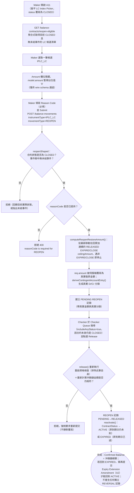

# A11 — 進口信用狀重啟（LC Reopen）

本筆記是 Balance Component 具名業務功能 **A11** 在整個 Obsidian 知識庫中的主要入口。A11 屬於 2026-08-25 上線的 F1 功能史詩（external BA review, 「UCP 600 第16(f)條自動釋放」提案 `analysis/Balance-Component-F1-Expire-Proposal-zh.md` §9-§10）之一部分——本次上線同時新增了 AUTO EXPIRY/AUTO CLOSE 背景批次、`EXPIRE`/`REVERSAL`/`AMEND_EXPIRY_DATE`/`REOPEN` 四個新 movementType，以及本功能自身的具名業務代碼。A11 上線當天內即歷經 v1.19.0→v1.24.0 共 6 次現場 UAT 導向的重新設計（見下方「業務決策」一節與 `analysis/balance-component-api.yaml` 自身的變更記錄），本筆記僅依 2026-08-26 快照當下的**最終**行為撰寫，並在「業務決策」一節保留已被取代的舊設計供對照。

## 功能摘要

| 項目 | 內容 |
|---|---|
| 功能代碼 | A11 |
| 功能說明（原始 label） | LC Reopen |
| instrumentType | `IPLC_LC` |
| movementType | `REOPEN`（`requiresReopenEligibility: true`） |
| subChoice | 無——與 A10 相同，A11 沒有 tenor/方向等次選項 |
| 所屬方向 | Import（進口） |
| 所屬母層功能 | 無父層概念——與 A10/B6 相同形態的「扁平 Catalog 選取器」，但過濾條件反過來：只顯示目前狀態為 **CLOSED** 且具備重啟資格（reopen-eligible）的 LC，而非 A10 的 ACTIVE 過濾 |
| 是否為複合提交（compound） | 否——`FunctionStrategy` 為 `NO_SPECIAL_BEHAVIOR` 基底 + `movementDerivation.amountFixed: '0'`，`checkerRelease`／`compoundSubmission`／`selectionFlow` 均維持預設 |
| Amount 欄位 | 完全不顯示於 UI（`amountFixed` 不同於 A10 的 `amountAutoFilledFrom`：A10 是「唯讀顯示 Confirmed Balance 並鎖定」，A11 是「欄位整個隱藏」，選取合約當下即把 `model.amount` 設為佔位字串 `'0'`，僅為滿足 wire schema 必填 MonetaryAmount 格式；伺服端在 Submit 當下會無條件覆寫並丟棄這個 `'0'`，改用自己重算出的真實復原金額） |
| Reason Code | 必填（與 A10/B6 相同的規則，見 [[MAKER-CHECKER-RULE-059]]） |

以上定義已用 Read 工具核實於 `src/app/transaction-builder/balance-component.model.ts`（`IMPORT_FUNCTIONS` 陣列，`code === 'A11'` 項，第 441-450 行）；`help` 文字明確載明：「Reopens a CLOSED LC — restores whatever Confirmed Balance the LC had immediately before its EXPIRE/CLOSE write-off chain (sums every not-yet-reversed EXPIRE/CLOSE movement in its history, not only the last one). Only CLOSED LCs with no open Events anywhere in the tree are shown below. Status returns to ACTIVE, or to EXPIRED if the original Expiry Date has since passed... No Amount to type — the server derives it from the LC's own balance history at Submit and generates a real Account Entries pair immediately, so the Checker reviews the actual restoration BEFORE approving it.」`function-strategy.ts`（第 155-159 行）之 `A11` 條目與此一致，`movementDerivation.amountFixed: '0'`。CONFIRMED。

### API 端點

依 `analysis/balance-component-api.yaml` 自身的 v1.19.0-v1.24.0 變更記錄（第 531-627 行）與路由原始碼查證：

- **Step-1 Picker 提示（微服務層，權威）**：`GET /balance-contracts/reopen-eligible`（`microservices/balance-component/src/routes/balanceContracts.ts:78-92`，OAS 定義於 `balance-component-api.yaml:931`）——`summary` 明確標註「A11 (Import LC Reopen) / B7 (Export Confirmed LC Reopen) — Step-1 picker hint」；query 帶 `instrumentType`（必填，僅 `IPLC_LC`/`EPLC_LC`/`EPLC_CONFIRMATION`，其他值 400）、可選 `lcNumber`、`page`/`pageSize`；回傳一頁「目前 CLOSED 且已具重啟資格」的根合約清單。實作為 `BalanceService.listReopenEligibleContracts()`（`microservices/balance-component/src/service/balanceService.ts:927-955`），與 A10 的 `listCloseEligibleContracts()` 完全相同的「一次性批次抓取 4 種 movement 清單、記憶體內逐一判定、再分頁」寫法（同一 N+1 修復手法），僅過濾條件不同：CLOSED 狀態、`hasOpenEvents === false`，**沒有** SG/Acceptance 餘額歸零條件。CONFIRMED。
- **Maker Submit（微服務層，權威）**：`POST /balance-movements`（既有通用端點）——body 帶 `instrumentType: IPLC_LC`、`movementType: REOPEN`、`reasonCode`（必填）；`amount` 欄位即使填寫也會被伺服端無條件丟棄並覆寫（`balanceService.ts:1603-1608`：`if (req.movementType === 'REOPEN') { const restoreAmount = computeReopenRestoreAmount(...); req = { ...req, amount: restoreAmount.toFixed() }; this.assertValidAmount(req.movementType, req.amount); }`）。若重啟資格未滿足（合約非 CLOSED，或事件樹中存在未結事件）或缺少 `reasonCode`，分別回傳對應錯誤（見下方 Error/Exception）。CONFIRMED。
- **Checker Release**：`POST /balance-movements/{movementId}/release`——針對 REOPEN 會重新執行一次重啟資格檢查（排除該筆自身）並重新核對「此刻重新計算出的復原金額」是否仍與 Submit 時凍結在 `ceilingAmount` 上的金額完全相等（`balanceService.ts:1877-1898`），通過後才將 `ContractStatus` 依原到期日是否仍在未來而轉為 `ACTIVE` 或 `EXPIRED`（`balanceService.ts:2075-2078`）。CONFIRMED。
- **Checker Queue 查詢**：`checker-panel.component.ts:173-178` 的 `includeAnyStatus = !!this.selectedFunction.requiresReopenEligibility` ——A11/B7 是唯一「Checker 待處理的 PENDING 記錄掛在一個已非 ACTIVE（此處是 CLOSED）合約底下」的功能，若沿用其他功能預設的 ACTIVE-only 合約解析，Checker 搜尋會直接 404（「No Logical Contract exists yet for this natural key」，現場測試曾實際重現此 bug，見該檔案第 168-176 行註解）。CONFIRMED。
- **Channel API 對照**：`analysis/balance-component-channel-api.yaml` 已於 v1.3.0（2026-08-25，第 119-131 行）將 `A11`（`code: A11`，第 1036-1044 行）、`B7`（第 1046-1054 行）正式納入 `functionCode` 列舉——與 A10/B6 當年「規格落差」不同，**A11/B7 從一開始就正確出現在 Channel API 的 functionCode 列舉中**（該次上線同時把 A10/B6 的既有落差追溯修正）。UNCLEAR／CONFLICT：本筆記在查證過程中發現既有的 [[A10-LC-Close]] 筆記中記載的「A10/B6 未列入 channel-api.yaml functionCode 列舉」的 UNCLEAR/CONFLICT 段落，如今已因這次 v1.3.0 追溯修正而過時（stale）——A10/B6 現已同時出現在列舉中。本筆記不逕行修改 A10-LC-Close.md（不在本次任務範圍內），僅在此處記錄供知識庫維護者後續核對更新。

## 端到端流程（Trigger → Output → Error/Exception）

- **Trigger（觸發點）**：Maker 從 A11 的扁平 LC Index Picker 中選取一筆目前 **CLOSED**、且已滿足重啟資格（reopen-eligible）的 `IPLC_LC` 根合約，發起 REOPEN。Picker 本身以 `GET /balance-contracts/reopen-eligible` 的聚合式伺服端調用取得候選清單，且 `maker-panel.component.ts:513-520` 的 `reloadCatalog()` 會將 catalog 查詢的 `status` 參數由預設的 `undefined`（即隱含 `'ACTIVE'`）改寫為明確的 `'CLOSED'`——這個狀態覆寫只對 `requiresReopenEligibility` 的功能生效，A10 本身仍查詢預設的 ACTIVE（已由 `maker-panel.component.spec.ts:3696` 一測直接核實兩者互不影響）。CONFIRMED。

- **Input（輸入）**：LC Number（Flat Catalog 選取，無 Parent 概念）；Reason Code（必填文字欄位，`builder-fields.ts:148-158` 的 `reasonCode` 欄位，`requiresReasonCode = !!selectedFunction?.requiresCloseEligibility || !!selectedFunction?.requiresReopenEligibility`，第 71 行）；Amount 欄位完全不顯示（`hide: isAmendExpiryDate || amountFromFixed`，`builder-fields.ts:120`）——選取合約當下 `onSelectContract()` 立即把 `model.amount` 設為策略表中的固定佔位字串 `'0'`（`maker-panel.component.ts:786-790`），僅供 wire schema 通過驗證，實際金額由伺服端在 Submit 時完全覆寫。CONFIRMED。

- **Validation（校驗）**：
  1. `reopenShaped`（`microservices/balance-component/src/service/balanceService.ts:452-464`）在 Submit 時執行：合約 instrumentType 必須是根層（`IPLC_LC`/`EPLC_LC`/`EPLC_CONFIRMATION`）；合約當前狀態必須是 `CLOSED`（非 CLOSED 一律拒絕，並在錯誤訊息中回顯目前實際狀態）；整棵事件樹（`gatherEventTree()`）中不得有任何仍處未結狀態的事件——此為 F1 提案 §9.8 明確要求的、獨立於既有機制的並發安全檢查（REOPEN 是全新解析路徑，不會自動繼承 A10 既有的保護）。CONFIRMED。
  2. `assertReasonCodeRequired()`（`balanceService.ts:1488-1492`）：`movementType === 'REOPEN'` 且 `reasonCode` 為空（`null`/`undefined`/空字串）一律拒絕（`RequestValidationError`，400），與 CLOSE 共用同一段程式碼（F1 proposal §13.1 item 3(a)，BA-ratified 2026-08-25）。已由 `microservices/balance-component/test/unit/service/expiryExtensionAndReopen.test.ts:455-491` 直接測試核實（省略 `reasonCode` 與傳入 `null` 兩種情形均被拒絕，錯誤訊息符合 `/reasonCode is required for REOPEN/`）。CONFIRMED。
  3. `assertValidAmount('REOPEN', amount)`（`balanceService.ts:1444-1467`，REOPEN 分支於第 1458-1461 行，與 CLOSE/EXPIRE 共用同一段）：只拒絕負數，0 為合法值（例如重啟一筆「EXPIRE 沖銷後又被 AUTO CLOSE、AUTO CLOSE 自己那筆沖銷金額已是 0」的鏈，見下方 Movement Posting Generation 一節的路徑 B 案例）——由於 `req.amount` 在檢查前已被伺服端自己算出的復原金額覆寫，此檢查對正常流程而言等同「防禦性斷言，理論上永不觸發」。CONFIRMED。
  4. Release 時的重新驗證：`balanceService.ts:1877-1898`——重新確認合約狀態仍是 `CLOSED`（否則拋 `IllegalStateTransitionError`）、重新以 `gatherEventTree()`（排除本筆自身）確認無未結事件、並用「排除本筆自身」的移動清單重新呼叫 `computeReopenRestoreAmount()`，若重算出的復原金額與 Submit 時凍結在 `movement.ceilingAmount` 上的金額不完全相等，一律拒絕並要求重新提交（不靜默覆寫）——與 A10/EXPIRE 相同的「Submit-to-Release 視窗内狀態漂移」防護姿態。此重算已由 `expiryExtensionAndReopen.test.ts` 的「REOPEN release-time re-check」測試群組（第 992 行起）直接核實：一筆在 Submit 與 Release 之間被繞過應用層、以原生 SQL 插入的額外 CLOSE 記錄改變了沖銷鏈，Release 會被拒絕。CONFIRMED。

- **Classification（分類）**：instrumentType=`IPLC_LC`、movementType=`REOPEN`。exposureNature：Submit 時未見特別覆寫，沿用通用預設 `req.exposureNature ?? 'CONTINGENT'`（`balanceService.ts` 建立 movement 物件處，緊接在 `contingentAccountEntry` 之後）——REOPEN 本質上是重新建立一筆此前已被沖銷的或有負債，歸類為 `CONTINGENT` 與此語意一致。CONFIRMED。

- **Business Decision（業務決策）**：A11/B7 的設計於 F1 提案上線當天（2026-08-25）經歷了完整的重新設計過程，本節依 `balance-component-api.yaml` 自身的變更記錄逐版摘要，供理解「為何是現在這個形狀」：
  - **v1.19.0（原始設計，已被取代）**：REOPEN 本身是零金額移動（`MOVEMENT_DIRECTION.REOPEN` 曾經是 `0`），真正的餘額復原透過 Release 時額外產生一筆或多筆獨立的 `REVERSAL` 移動作為副作用。現場 UAT 發現此設計的兩個問題：(a) Checker 核准 REOPEN 當下看到的是一筆零金額、無分錄的移動，看不到真實影響（"REOPEN Submit 出 Account Entries (Pending)... 不應該有兩筆"）；(b) Inquire Events/Look Up 對「概念上同一個業務事件」顯示成兩筆獨立記錄。
  - **v1.20.0（2026-08-25，同日重新設計，現行行為）**：REOPEN 改為在 Maker Submit 當下就由伺服端計算出真實、正數的復原金額（`domain/reopenRestoration.ts` 的 `computeReopenRestoreAmount()`），同時產生真實的 `contingentAccountEntry`，讓 Checker 在核准**之前**就能檢視實際的 Dr/Cr 分錄與金額；`MOVEMENT_DIRECTION.REOPEN` 同步由 `0` 改為 `1`。REOPEN 自此不再產生任何 REVERSAL。2026-09-03 起 EXPIRED Expiry Extension 也改為在同一筆 PENDING Amendment 顯示分錄，不另建 REVERSAL；兩者均符合 Checker 先審後核准原則。CONFIRMED。
  - **v1.21.0（同日）**：AUTO EXPIRY/AUTO CLOSE 新增「跳過最近被 Reopen 的合約一個掃描週期」防護（見 [[STATUS-RULE-034]]）。
  - **v1.23.0（同日）**：修正 Expiry Extension Amendment 路徑上的一個「雙重復原」實際重現的線上 bug（見 [[MOVEMENT-RULE-066]] 的驗證說明）。
  - **v1.24.0（同日）**：新增 Auto Close Grace Period（見 [[STATUS-RULE-033]]）與強制 `reasonCode`（見 [[MAKER-CHECKER-RULE-059]]）。
  這種「同一天內連續 6 次現場 UAT 導向重新設計」的節奏在 `analysis/Balance-Component-F1-Expire-Proposal-zh.md` §12 的「程式碼審閱結果」一節與本檔自身的 changelog 中均有完整記錄，本筆記僅依最終（2026-08-26 快照）行為撰寫功能分析，舊設計僅作為理解演進脈絡的背景保留。CONFIRMED。

- **Balance/Exposure Decision（表內 vs 表外）**：REOPEN 使用契約自身歷史上「最近一段連續、尚未被反轉的 RELEASED EXPIRE/CLOSE 沖銷鏈」金額總和，重新建立（而非「恢復」——技術上是一筆全新的、方向為 `+1` 的移動）該合約的 Confirmed Balance；Release 後合約狀態依原 `expiryDate` 是否仍在 Business Date 之後而轉為 `ACTIVE`（原到期日仍未到）或 `EXPIRED`（原到期日已過，§9.2 情況二——此時需再搭配 A2「Expiry Date」子選項提交一次 Expiry Extension Amendment 才能回到 ACTIVE；本實作**尚未**提供 F1 提案 §9.2 選項 B 所設想的「REOPEN WITH EXTENSION」單一複合交易）。詳見下方「復原金額計算」小節與 [[MOVEMENT-RULE-064]]。CONFIRMED。

  **復原金額計算細節**（`domain/reopenRestoration.ts`，全文已讀）：`computeReopenRestoreAmount()` 將該合約的全部移動依 `eventSeq` 排序後，從**最新一筆往回走**，只要仍是 `status === 'RELEASED'` 且 `movementType` 為 `EXPIRE` 或 `CLOSE`，就累加其 `ceilingAmount`，一旦遇到第一筆「既非 RELEASED 也非 EXPIRE/CLOSE」的移動就停止累加。這覆蓋了 F1 提案 §9.7 明確指出的兩種鏈長：
  - **路徑 A**：合約經由一次人工 CLOSE（A10）直接關閉——沖銷鏈長度 1，只反轉這一筆 CLOSE。
  - **路徑 B**：合約先經 AUTO EXPIRY（`EXPIRE`，帶著真實的正數沖銷金額）變成 EXPIRED，再經 AUTO CLOSE（`CLOSE`，此時金額已是 0）變成 CLOSED——沖銷鏈長度 2，REOPEN 必須同時累加 EXPIRE 的真實金額與 CLOSE 的 0，若只反轉最後一筆 CLOSE 只會復原 0，而非合約真正的原始餘額。
  已由 `expiryExtensionAndReopen.test.ts:332-370`（「path B」測試）直接核實：EXPIRE 沖銷 10000，AUTO CLOSE 沖銷 0，REOPEN 的 `ceilingAmount` 正確計算為 `10000`，且 Release 後 `confirmedBalance` 回到 `10000`，過程中不產生任何 REVERSAL 記錄。一筆合約若曾被重啟一次又再度關閉，同一個「往回走、遇到非 EXPIRE/CLOSE 即停止」的邏輯會自然在中間那筆 REOPEN（既非 EXPIRE 也非 CLOSE）處停止，不會重複計算更早的沖銷鏈——`reopenRestoration.ts` 自身的頂部註解對此有明確說明，本輪未見對應的獨立自動化測試專門覆蓋這個「二次重啟」情境，標記 UNCLEAR（邏輯上由程式碼結構保證正確，但未見直接測試證據）。

- **Tolerance 決策**：UNCLEAR——與 A10 相同，本輪查證未在原始碼中找到 REOPEN 對 Tolerance／`ceilingAmount` 換算的特別處理；`computeCeilingAmount()` 對所有 movementType 一律呼叫（`balanceService.ts` createMovement 內固定流程），但 REOPEN 不在 `TOLERANCE_APPLICABLE_MOVEMENT_TYPES` 集合中（`domain/balanceDerivation.ts` 該集合僅列 `ISSUE`/`AMEND_INCREASE`/`AMEND_DECREASE`），故其 `ceilingAmount` 實質上等於 `amount` 本身（伺服端計算出的復原金額），未見證據顯示有另一層 Tolerance 換算，不予臆測。

- **Movement Posting Generation（過帳分錄）**：Maker Submit 建立一筆 `IPLC_LC`／`REOPEN` 的 PENDING 記錄，`ceilingAmount` 即伺服端計算出的真實復原金額，`contingentAccountEntry` 同時生成（`deriveContingentAccountEntry()`，`balanceService.ts:1673-1680` 呼叫；REOPEN 的 `MOVEMENT_DIRECTION` 為固定值 `1`，未落入該函式對 `AMEND_EXPIRY_DATE`／`REVERSAL` 的特殊分支，走一般「查表取得固定方向」路徑，回傳非 null 的真實 Dr/Cr 配對——已由 `expiryExtensionAndReopen.test.ts:312` 的 `expect(reopen.movement.contingentAccountEntry).not.toBeNull()` 直接核實）；Checker Release 時重新執行資格檢查與金額比對，通過後呼叫 `contracts.reactivate(balanceContractId, targetStatus, releasedAt)`（`balanceService.ts:2075-2078`，`targetStatus` 依 `contract.expiryDate && contract.expiryDate > releasedAt ? 'ACTIVE' : 'EXPIRED'` 決定）。`reactivate()` 對 `newStatus === 'EXPIRED'` 的情形會把 `effective_to` 欄位設為 `releasedAt`（而非留 `NULL`）——這是 v1.24.0（F1 proposal §13.7）修正的一個真實 bug：先前留 `NULL` 會讓後續的 Auto Close Grace Period 無「何時變成 EXPIRED」的錨點可用（`microservices/balance-component/src/store/balanceContractStore.ts:400-419`）。CONFIRMED。

- **Output（輸出）**：新建一筆 `IPLC_LC`／`REOPEN` 記錄，帶真實的 Dr/Cr 分錄；Release 後合約 Confirmed/Available Balance 恢復為沖銷鏈總額，`ContractStatus` 依原到期日轉為 `ACTIVE` 或 `EXPIRED`；不再產生任何獨立的 `REVERSAL` 記錄（v1.20.0 之後）。Look Up Current Balance／Inquire Events／Checker Queue 均可透過各自的 `includeAnyStatus`／CLOSED 狀態覆寫查詢到此前 CLOSED 的合約及其 REOPEN 事件。CONFIRMED。

- **Error/Exception（錯誤/例外）**：
  - 合約當前狀態非 CLOSED（含已經是 ACTIVE、EXPIRED、CANCELLED、SUPERSEDED）→ 拒絕，錯誤訊息回顯目前實際狀態（`reopenShaped`，`balanceService.ts:457`）。已由 `expiryExtensionAndReopen.test.ts:438-454`（「rejects Submit on a contract that is not CLOSED」）核實。
  - instrumentType 非根層（`IPLC_LC`/`EPLC_LC`/`EPLC_CONFIRMATION`）→ 拒絕（`reopenShaped`，`balanceService.ts:453-456`）。已由 `expiryExtensionAndReopen.test.ts:407-437`（「rejects Submit on a non-root instrumentType」）核實。
  - 事件樹中存在未結事件（含另一筆並發提交中的 REOPEN 自己）→ 拒絕（`reopenShaped`，`balanceService.ts:459-462`）。已由 `expiryExtensionAndReopen.test.ts:498-548` 核實：第二筆並發 REOPEN Submit 會把第一筆 REOPEN 自己視為未結事件而擋下。
  - 缺少 `reasonCode`（含明確傳入 `null`）→ `400 RequestValidationError`，訊息符合 `/reasonCode is required for REOPEN/`（`assertReasonCodeRequired()`，`balanceService.ts:1489-1491`）。已由 `expiryExtensionAndReopen.test.ts:455-491` 核實。
  - Submit 與 Release 之間沖銷鏈金額發生漂移（例如以 DB-bypass 方式在鏈中插入額外的 CLOSE）→ Release 拒絕，強制要求重新提交（`balanceService.ts:1893-1898`）。已由 `expiryExtensionAndReopen.test.ts:992-1034` 核實。
  - Release 時合約狀態已非 CLOSED（例如已被別的路徑改變）→ `IllegalStateTransitionError`（`balanceService.ts:1878-1880`）。
  - 同一 `(balanceContractId, eventSeq)` 重複提交 → 200，返回既有記錄（冪等，通用規則，與 A10 相同）。
  - UNCLEAR／已知留待未來的落差（`analysis/balance-component-api.yaml:598-602`、F1 proposal §11.4）：本實作**未對** Reopen 做「相關方（受益人）consent 把關」——是否應要求 consent 目前仍是 BA 尚待正式核准的開放問題（proposal §9.4／§11.4 item 3，「風險等級高於 Extension」），本次查證未見任何程式碼層面的 consent 檢查專門針對 REOPEN（僅有前述提及的、與 `AMEND_EXPIRY_DATE`/`REOPEN` 共用的通用被動存證欄位 `consentStatus`——見下方交叉引用，該欄位僅供上游存證，不做業務判斷）。

## 流程圖

## 交叉引用（Related Knowledge）

相關業務規則：
- [[MOVEMENT-RULE-064]] — REOPEN 復原金額由 `computeReopenRestoreAmount()` 在 Submit 時伺服端計算，反轉整條尚未反轉的 RELEASED EXPIRE/CLOSE 沖銷鏈，非僅最後一筆
- [[MOVEMENT-RULE-065]] — `MOVEMENT_DIRECTION.REOPEN = 1`，REOPEN 直接以自身簽署金額建立餘額，2026-08-25 起不再產生任何 REVERSAL 副作用
- [[MOVEMENT-RULE-066]] — 動態反轉方向；EXPIRED Extension 在同一筆 PENDING Amendment 上使用，REOPEN 不使用且不另建 REVERSAL
- [[MOVEMENT-RULE-067]] — CLOSE/EXPIRE/REOPEN 共用的「0 合法、負數拒絕」金額校驗豁免
- [[MOVEMENT-RULE-063]] — EXPIRE 資格判定刻意不比照 CLOSE 的 SG/Acceptance 餘額歸零條件（REOPEN 復原鏈的上游事件）
- [[STATUS-RULE-032]] — REOPEN 對合約狀態的重啟規則：CLOSED → ACTIVE（原到期日未到）或 EXPIRED（已到）
- [[STATUS-RULE-033]] — Auto Close Grace Period：AUTO CLOSE 不會在合約剛變成 EXPIRED（含經 REOPEN 重啟回 EXPIRED）的當下立即撿走它
- [[STATUS-RULE-034]] — `isRecentlyReopened()`：AUTO EXPIRY/AUTO CLOSE 均跳過最近一個掃描週期內剛被 Reopen 的合約
- [[STATUS-RULE-035]] — `findClosedByNaturalKey()`／`findExpiredByNaturalKey()`：僅 REOPEN／AMEND_EXPIRY_DATE 可解析非 ACTIVE 合約
- [[STATUS-RULE-036]] — 合約狀態徽標色彩（EXPIRED 為琥珀色，區別於 CLOSED 的紅色）與 Checker Queue 的 `includeAnyStatus` 覆寫
- [[MAKER-CHECKER-RULE-058]] — `BATCH_MAKER_ACTOR`/`BATCH_CHECKER_ACTOR` 兩個相異系統身份，滿足既有、未經修改的 `assertMakerCheckerSeparation()`，四眼原則不被繞過
- [[MAKER-CHECKER-RULE-059]] — CLOSE／REOPEN 的 Maker Submit 強制要求 `reasonCode`，AUTO CLOSE 以固定內部值滿足此要求
- [[STATUS-RULE-004]] — A10/B6 關閉資格判定（REOPEN 的「反面」條件，供對照）
- [[STATUS-RULE-007]] — Close 釋放的副作用：合約轉為 CLOSED（REOPEN 的前置狀態）
- [[MOVEMENT-RULE-053]] — A10/B6 CLOSE 金額必須與當前 Confirmed Balance 完全相等（REOPEN 沖銷鏈的組成事件之一）

支援技術細節與背景文件（英文/簡中，事實依據來源，僅連結不修改）：
- [[a10-b6-close-eligibility-gate-and-write-off-flow]]
- [[auto-expiry-auto-close-background-sweep-and-grace-period]]

- [[Balance Component Overview]]
