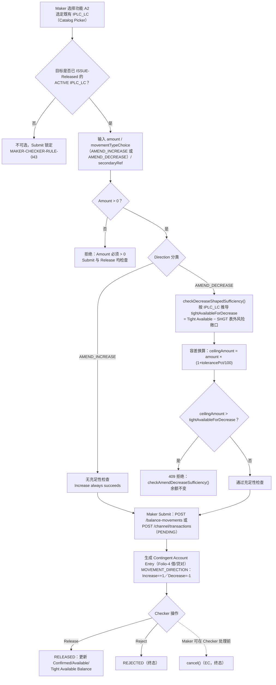

# A2 — 进口信用证修改（LC Amendment）

## 功能摘要

- **功能代码**：A2
- **功能说明**：LC Amendment（进口信用证修改）——对既有 Import LC 的面值金额做增加或减少
- **instrumentType**：`IPLC_LC`
- **movementType（subChoice: 'movementType'，Direction）**：`AMEND_INCREASE`（Increase）／`AMEND_DECREASE`（Decrease），由 Maker 在提交时二选一
- **所属方向**：进口 Import
- **所属母层功能**：[[A1-LC-Issue|A1]]（A2 操作的是 A1 建立的既有 `IPLC_LC` 合约，`hasParent = false`——A2 自身直接 resolve/create `naturalKey` 对应的 `IPLC_LC` 合约，而不是像 A6/A8/A9 那样挂在一个 parent 合约之下）
- **API 端点**（真实查证结果，来自代码库 `analysis/` 下两份 OpenAPI 规范）：
  - **微服务层**（`balance-component-api.yaml`）：
    - `POST /balance-movements`（第 730 行起）——**通用端点**，创建一笔 PENDING 变动记录；A2 通过 request body 的 `instrumentType: 'IPLC_LC'` + `movementType: 'AMEND_INCREASE' | 'AMEND_DECREASE'` 决定行为，规范文件本身并无 A2 专属路径
    - `POST /balance-movements/{movementId}/release`（第 900 行）——Checker 放行
    - `POST /balance-movements/{movementId}/reject`（第 1112 行）——Checker 驳回
    - `POST /balance-movements/{movementId}/cancel`（第 1155 行）——Maker EC/撤回
    - `GET /balance-movements/{movementId}/balance-as-of`（第 873 行）——事件快照查询
  - **Channel API（Web/Mobile 门面）**（`balance-component-channel-api.yaml`）：
    - `GET /channel/functions`（第 133 行）——返回 A2 的 `functionCode/movementTypeChoice/secondaryRefLabel/compoundLegs` 等元数据（第 845-854 行，`code: A2`，`movementTypeChoice.options: [AMEND_INCREASE, AMEND_DECREASE]`）
    - `POST /channel/transactions`（第 292 行）——Maker 提交；规范内含真实的 `a2_lc_amendment` 示例（第 342-351 行）：`functionCode: A2, naturalKey: {lcNumber}, movementTypeChoice: AMEND_INCREASE, amount, secondaryRef: "AMD-01", eventSeq, createdBy`——Currency Code 字段**不接受**（由既有合约携带，非 A1/B1 不可输入）
    - `POST /channel/transactions/{transactionId}/release` / `/reject` / `/cancel`（第 404、452、489 行）——Checker/Maker 操作的门面封装

## Trigger → Output 全流程

### Trigger（触发点）
Maker 在 Transaction Builder 中选择功能 A2，选定既有 `IPLC_LC` 合约（Catalog Picker，条件：ACTIVE 状态，且该 LC 自身的 ISSUE 已经过 Checker Release——`requireIssueReleased`，见 [[MAKER-CHECKER-RULE-043]]）。CONFIRMED，源自 `function-strategy.ts`/`catalog-picker.service.ts`。

### Input（输入）
- `naturalKey`（lcNumber）
- `movementTypeChoice`：AMEND_INCREASE 或 AMEND_DECREASE（Direction subChoice）
- `amount`（金额，必须 > 0）
- `secondaryRef`（"Amendment No./Times"，自由文本次要参考号）
- `eventSeq`、`createdBy`（系统字段，只读）

Currency Code **不作为输入**——由既有 LC 合约携带（`carriedCurrency`）。CONFIRMED。

### Validation（校验）
- 通用 Amount > 0 门禁（客户端 `submit-rules.ts` + 服务端 `assertValidAmount()`，Submit 与 Release 两处都检查）。CONFIRMED，见 [[MOVEMENT-RULE-025]] 类比。
- 目标必须是已 ISSUE-Released 的 ACTIVE `IPLC_LC`（[[MAKER-CHECKER-RULE-043]]、STATUS-RULE-008 类比 assertRootIssueReleased）。
- Submit 就绪门禁：已选定合格目标 + 字段校验通过 + Amount>0（[[MAKER-CHECKER-RULE-027]]，明确提到 "A2-A9/B2-B5 在真正可用的目标记录被挑选之前，会锁定自身的提交按钮与输入字段"）。CONFIRMED。

### Classification（分类）
按 `movementTypeChoice` 二分：
- **AMEND_INCREASE**：面值金额增加分支
- **AMEND_DECREASE**：面值金额减少分支，与 B2（出口信用证修改）自身带负号的 `AMEND` 共用同一个 `isAmendDecreaseDirection` 分类 getter（[[MOVEMENT-RULE-027]]）。

Catalog 选取器在 AMEND_INCREASE 时，0 余额的 LC 仍会显示（零余额排除按 movementType 门禁，非无条件）——[[MAKER-CHECKER-RULE-020]]。

### Business Decision（业务决策）
- **Increase 分支**：CLAUDE.md 决策日志与 `balance-component.model.ts` 的 help 文本均确认 "Increase always succeeds"——不执行充足性检查，直接进入过帐。CONFIRMED。
- **Decrease 分支**：先由 `checkDecreaseShapedSufficiency()`（私有服务方法）按 instrumentType 推导 `tightAvailableForDecrease`——对 `IPLC_LC`，从 Tight Available Balance 出发，净额扣除 SHGT 表外风险敞口（见 [[checkdecreaseshapedsufficiency-per-instrumenttype-tight-available-bala]]）；再由 `checkAmendDecreaseSufficiency()` 纯函数比对 `ceilingAmount` 与该 tight available 值，`ceilingAmount > tightAvailableForDecrease` 时硬性拒绝（见 [[checkamenddecreasesufficiency]]）。

### Balance/Exposure Decision（表内 vs 表外）
A2 影响的是 `IPLC_LC` 自身的 Confirmed/Available/Tight Available Balance（表内合约层面的面值金额与其容差换算后的 ceiling），而非直接产生表外风险敞口（SHGT 表外风险敞口是 A8 SG Issue 的范畴）——但 AMEND_DECREASE 的充足性检查必须把既有的 SHGT 表外风险敞口净额扣除后才能核准，即 "Decrease 从严，不得侵蚀已占用的表外风险敞口"。CONFIRMED，见 [[TOLERANCE-RULE-013]]、[[BALANCE-RULE-007]]。

### Tolerance 决策（若适用）
`ceilingAmount = amount × (1 + tolerancePct/100)`（[[TOLERANCE-RULE-001]]），Face Amount 只追踪 RELEASED 状态的 ISSUE/AMEND_INCREASE/AMEND_DECREASE 原始 `amount`，从不用 `ceilingAmount`（[[BALANCE-RULE-005]]）。容差换算的 instrumentType/movementType 双重门禁确保 A2 自身的 AMEND_INCREASE/AMEND_DECREASE 落入换算范围（[[TOLERANCE-RULE-002]]、[[TOLERANCE-RULE-003]]）。AMEND_DECREASE 的充足性检查专门比对**经容差换算后的 ceilingAmount**，而非原始面值金额（[[MOVEMENT-RULE-006]]），基准是 Tight Available Balance 而非普通 Available Balance——这是 2026-08-2x 的一项业务修正（CLAUDE.md 决策日志"A2/B2 Decrease now checked against Tight Available Balance"），使其与 A3/B3 的规则对齐（[[MOVEMENT-RULE-007]]）。客户端实时预警同步遵循相同两级机制（plain Available → Tight Available），见 [[BALANCE-RULE-011]]。

### Movement Posting Generation（过帐分录）
- `MOVEMENT_DIRECTION` 按 instrument/movementType 组合固定：AMEND_INCREASE = +1，AMEND_DECREASE = −1（[[MOVEMENT-RULE-001]] 类比）。
- 借/贷科目对（Contingent Account Entry）由 instrumentType 决定科目族，A2 对应 Folio-4 账户对；与 B2 的处理方式一致，只是 B2 用单一带符号的 `AMEND` movementType 而非分开的 Increase/Decrease（[[MOVEMENT-RULE-059]]）。
- **CONFLICT/UNCLEAR**：数据库设计文档要求修改类事件应创建新合约版本（`markSuperseded()`），但真实运行的 AMEND_INCREASE/AMEND_DECREASE 流程从未调用该机制——属于死代码；A2 实际上是对**现有、不变的合约版本**新增一笔变动记录，而非新建版本（[[MOVEMENT-RULE-055]]、[[STATUS-RULE-014]]，均标记 ⚠️ CONFLICT）。

### Output（输出）
- `201`：新建 PENDING 变动记录（`POST /balance-movements` 或 `POST /channel/transactions`）
- `200`：同一 `(balanceContractId, eventSeq)` 重复提交，幂等返回原记录
- Checker Release 后：变动记录转为 RELEASED，合约的 Confirmed/Available/Tight Available Balance 相应更新；Maker 亦可在 Checker 处理前调用 `cancel()`（EC）撤回，Checker 则调用 `reject()` 驳回——两者是不同的终态动作，各自有独立审计列（[[MAKER-CHECKER-RULE-003]]）。

### Error/Exception（错误/例外）
- `409`：AMEND_DECREASE 金额超出 Tight Available Balance 时被硬性拒绝，绝不会被默默截断，可证明地不改变合约余额（[[MOVEMENT-RULE-041]]）。
- **UNCLEAR/CONFLICT（已知业务缺口）**：AMEND_DECREASE 在 Maker 提交后即刻入账/占用，并未实现 UCP 600 第 10(a)/(c) 条要求的受益人同意门禁——文档层面要求存在，代码层面完全没有该门禁，属已披露缺口而非本笔记新发现（[[STATUS-RULE-028]]、[[MOVEMENT-RULE-061]]）。
- Checker Queue 范围限定为 A2 自身可能产生的变动记录——即便同一 LC 上存在 A3 的 UTILIZE PENDING，A2 的复核队列也不会显示（[[MAKER-CHECKER-RULE-029]]）。
- Channel API 层面，除 A1/B1 外包括 A2 在内的所有功能都禁止输入 Currency Code（仅规范层面，微服务尚未强制执行）（[[MAKER-CHECKER-RULE-049]]）。

## 流程图

## 交叉引用（Related Knowledge）

**Balance / Tolerance / 充足性检查**
- [[MOVEMENT-RULE-006]] — AMEND_DECREASE 充足性检查针对经容差换算后的 ceilingAmount
- [[MOVEMENT-RULE-007]] — AMEND_DECREASE 充足性检查基准是 Tight Available Balance
- [[MOVEMENT-RULE-008]] — 🟡 INFERRED：该检查被断言涵盖面值金额不得为负的下限检查
- [[MOVEMENT-RULE-041]] — 超出容量的减少被硬性拒绝，绝不默默截断
- [[MOVEMENT-RULE-027]] — isAmendDecreaseDirection 统一归类 A2 AMEND_DECREASE 与 B2 带负号的 AMEND
- [[MOVEMENT-RULE-059]] — A2（分开的 Increase/Decrease movementType）与 B2（单一带符号 AMEND）对 Folio-4 的不同处理方式
- [[MOVEMENT-RULE-061]] — ⚠️ Amendment Decrease 提交后立即入账，未实现受益人同意门禁
- [[MOVEMENT-RULE-055]] — ⚠️ CONFLICT：修改应创建新合约版本，实际是死代码
- [[BALANCE-RULE-005]] — Face Amount 只追踪 RELEASED 状态的 ISSUE/AMEND_INCREASE/AMEND_DECREASE 原始 amount
- [[BALANCE-RULE-007]] — Tight Available Balance 公式（v1.13.0）
- [[BALANCE-RULE-011]] — 客户端实时余额充足性预警两级机制
- [[BALANCE-RULE-014]] — LC Master Records Index 面值金额示例含 A1(ISSUE)+A2(AMEND_INCREASE PENDING)
- [[TOLERANCE-RULE-001]] — Ceiling 金额公式
- [[TOLERANCE-RULE-002]] — 容差换算的 instrumentType 适用性门禁
- [[TOLERANCE-RULE-003]] — 容差换算的 movementType 适用性门禁
- [[TOLERANCE-RULE-013]] — checkAmendDecreaseSufficiency 比对 ceilingAmount 与 Tight Available Balance

**状态机 / 一致性（含已知冲突）**
- [[STATUS-RULE-014]] — ⚠️ CONFLICT：数据库设计文档的"新建合约版本"协议未被真实代码执行
- [[STATUS-RULE-017]] — movement_type 权威合法取值列表来自 BalanceService 注册表
- [[STATUS-RULE-018]] — reject()/cancel() 只有在 PENDING 状态下才是合法操作
- [[STATUS-RULE-028]] — ⚠️ CONFLICT：LC 修改减少缺少 UCP 600 第 10(a)/(c) 条要求的受益人同意门禁

**Maker/Checker 生命周期**
- [[MAKER-CHECKER-RULE-003]] — Maker 的 cancel() 与 Checker 的 reject() 是两个不同的终态操作
- [[MAKER-CHECKER-RULE-020]] — 零余额排除：Catalog/IB-Index 按 movementType 门禁（A2 AMEND_INCREASE 示例）
- [[MAKER-CHECKER-RULE-027]] — Submit 就绪门禁（A2-A9/B2-B5）
- [[MAKER-CHECKER-RULE-029]] — Checker Queue 范围限定为本功能自身可能产生的变动记录
- [[MAKER-CHECKER-RULE-043]] — Maker-ACTION 选择器默认要求自然键自身 ISSUE 已 Checker Release
- [[MAKER-CHECKER-RULE-049]] — 除 A1/B1 外，Channel API 禁止输入 Currency Code

**既有技术细节笔记（英文，待后续批次翻译）**
- [[checkamenddecreasesufficiency]] — `checkAmendDecreaseSufficiency()` 纯函数
- [[checkdecreaseshapedsufficiency-per-instrumenttype-tight-available-bala]] — `checkDecreaseShapedSufficiency()` 按 instrumentType 推导 Tight Available Balance

**总览**
- [[Balance Component Overview]]
