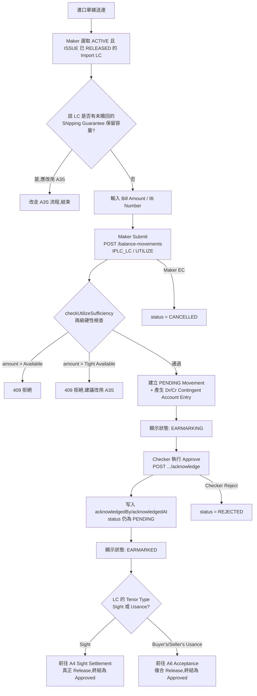

# A3 — 單據到單（Document Arrival）

## 功能摘要

| 項目 | 內容 |
|---|---|
| 功能代碼 | A3 |
| 功能說明 | Document Arrival（單據到單）— 針對任意 Tenor（Sight／Buyer's Usance／Seller's Usance）的 Import LC，在單據送達時建立 Presentation Earmark（PENDING）|
| instrumentType | `IPLC_LC` |
| movementType | `UTILIZE` |
| 方向 | 進口 Import（`side: 'IMPORT'`） |
| 所屬母層功能 | A1（LC Issue）— A3 只能挑選 A1 已建立且 ISSUE 已 RELEASED 的 ACTIVE `IPLC_LC` 合約（`assertRootIssueReleased()` / `requireIssueReleased` 過濾器）|
| 次要參考欄位 | `secondaryRefLabel: 'IB Number'` |
| 姊妹功能 | A3S（Document Arrival w/ Shipping Gtee）— 完全相同的 `IPLC_LC`/`UTILIZE`，差別僅在於是否顯式匹配一筆未贖回的 SG（A8）；A4（Sight Settlement）/ A6（Acceptance/Usance）是 A3 建立的 PENDING 記錄的下游終結功能 |

**CONFIRMED**（`balance-component.model.ts:294-305`）：A3 的 Checker「Approve」在目前架構下**僅為確認性質（acknowledgment only）**——它從不呼叫 `release()`，Movement 狀態永遠停留在 PENDING；唯有 A4（Sight）或 A6（Usance）才會真正終結（finalize）這筆 LC Balance，兩者之間依 LC 自身於 A1 宣告的 `tenorType` 分流。

### API 端點（CONFIRMED，來自 `analysis/` 兩份 OpenAPI 規範的實際查證）

**微服務 API（`balance-component-api.yaml`，權威、真正被呼叫的後端）**：

| 步驟 | Method + Path | 說明 |
|---|---|---|
| Maker Submit（建立 Earmark） | `POST /balance-movements`（第 730 行）| 通用端點，由 request body 的 `instrumentType: 'IPLC_LC'` + `movementType: 'UTILIZE'` 決定行為；建立一筆 PENDING Movement |
| Checker Approve（確認性質） | `POST /balance-movements/{movementId}/acknowledge`（第 1054 行）| **CONFIRMED**：此路由自 2026-08-18 起曾一度移除（原服務 B3），2026-08-19 又「重新啟用」並**改為專屬 A3/A3S 的 `IPLC_LC`/`UTILIZE`**（見 CLAUDE.md 決策記錄「A3/A3S Checker 確認恢復為真正持久化的動作」）；僅設定 `acknowledgedBy`/`acknowledgedAt`，**不改變 `status`**（仍為 PENDING）；單次使用，重複呼叫回 409 |
| Checker Reject | `POST /balance-movements/{movementId}/reject`（第 1112 行）| 標準 4-eyes 駁回，僅 PENDING 可用 |
| Maker EC（撤銷） | `POST /balance-movements/{movementId}/cancel`（第 1155 行）| Maker 自行撤銷尚未 Approve 的 PENDING 記錄 |

**Channel API（`balance-component-channel-api.yaml`，Web/Mobile 命名業務功能薄層外觀）**：

| 步驟 | Method + Path | 說明 |
|---|---|---|
| Maker Submit | `POST /channel/transactions`（第 292 行）| body 帶 `functionCode: A3`；由 `functionCode` 衍生 instrumentType/movementType/Currency（A3 屬 `currencyMode: CARRIED`，非 A1/B1 起源功能，不接受 currency 欄位）；`GET /channel/functions` 目錄中 A3 條目：`code: A3, instrumentType: IPLC_LC, movementType: UTILIZE, hasParent: false, submitsTransaction: true`（第 855-864 行） |
| Checker Release | `POST /channel/transactions/{transactionId}/release`（第 404 行）| 標準 4-eyes 放行 |
| Checker Reject | `POST /channel/transactions/{transactionId}/reject`（第 452 行）| |
| Maker Cancel | `POST /channel/transactions/{transactionId}/cancel`（第 489 行）| |

**UNCLEAR**：Channel API 自 v1.2.0（2026-08-18）起已整條移除 `/channel/transactions/{transactionId}/acknowledge`（規格檔第 104-110 行的變更說明僅提及此舉是為了 B3 的重新設計），但微服務層的 `/acknowledge` 端點稍後（2026-08-19）又被重新啟用並改配給 A3/A3S 專用。兩份規範文件在 A3 的 Checker「確認」動作上並未完全對齊——Channel API 目前並無對應端點可以呼叫微服務的 `/acknowledge`；Channel API 是否應該／已經另行補上一個 A3/A3S 專屬確認端點，在目前查證到的規格檔內容中找不到證據，標記為 UNCLEAR，不做推測。

## Trigger（觸發點）

進口單據（貨運文件）送達本行櫃檯，銀行需要針對一筆已 ACTIVE 且 ISSUE 已 RELEASED 的 Import LC（任意 Tenor）記錄一筆 Presentation（單據到單）。Maker 於 Transaction Builder 選定該 LC（LC Index，篩選條件見下）後執行 Submit。**CONFIRMED**（`balance-component.model.ts:294`、`document-arrival-hints.service.ts`）。

## Input（輸入）

- 挑選的 Import LC（LC Index，篩選 `instrumentType: IPLC_LC`、`status: ACTIVE`、`requireIssueReleased: true`，即 A1 的 ISSUE 必須已 RELEASED）——**CONFIRMED**
- IB Number（次要參考欄位，`secondaryRefLabel: 'IB Number'`）——**CONFIRMED**
- Amount（Bill Amount，須 > 0，`assertValidAmount()` 伺服端二次檢查）——**CONFIRMED**
- Currency：不可輸入，沿用 LC 自身已鎖定的幣別（`currencyMode: CARRIED`）——**CONFIRMED**
- Tenor：不需另外輸入——LC 本身於 A1 宣告的 `tenorType`（Sight／Buyer's Usance／Seller's Usance）已決定其去向，A3 本身「Merged into one card, showing all ACTIVE IPLC_LC contracts regardless of tenor — no catalogTenorFilter」——**CONFIRMED**（`balance-component.model.ts:293`）

## Validation（校驗）

1. 目標 LC 必須存在、`ACTIVE`，且其自身 ISSUE 已 `RELEASED`（`assertRootIssueReleased()`）——**CONFIRMED**
2. Amount 必須 > 0（`assertValidAmount()`，Submit 與 Release 兩處都檢查）——**CONFIRMED**
3. 幣別依 Currency Code 三層衍生規則，由 LC 自身幣別帶入，不接受呼叫方另行指定——**CONFIRMED**
4. `checkUtilizeSufficiency()` 兩級硬性 ERROR 充足性檢查（見下方 Balance/Exposure Decision）——**CONFIRMED**

## Classification（分類）

- instrumentType/movementType 由（Channel API 情境下的）`functionCode: A3` 或（微服務直呼情境下的）request body 顯式指定的 `instrumentType: IPLC_LC` + `movementType: UTILIZE` 決定——**CONFIRMED**
- A3 與 A3S 的 movementType 完全相同（均為 `UTILIZE`），僅以「是否顯式匹配一筆未贖回的 SG」區分——**CONFIRMED**（[[MOVEMENT-RULE-043]]）
- 事件狀態顯示映射：A3 屬於「占用類（Earmark）」功能——未放行顯示 `EARMARKING`，已由 Checker 確認顯示 `EARMARKED`（`isEarmarkFunction()`）——與 A4/A6 等「其他所有功能」（PENDING/APPROVED）的映射不同——**CONFIRMED**（[[STATUS-RULE-019]]）

## Business Decision（業務決策）

- 若該 LC 存在一筆未贖回的 Shipping Guarantee（SG，A8）正在保留本次單據所需的額度，應改用 A3S（Document Arrival w/ Shipping Gtee）——一般 A3 現在會對 Tight Available Balance 硬性拒絕（Design doc §6.1 v0.12）——**CONFIRMED**（`balance-component.model.ts:304`）
- A3 本身不做 Sight／Usance 分流的業務判斷——分流邏輯留給下游的 A4／A6，A3 只負責建立中性的 Presentation Earmark——**CONFIRMED**

## Balance/Exposure Decision（表內 vs 表外）

- A3 建立的 UTILIZE 屬於 Balance Component 定義下的**或有負債（Contingent）**科目異動（`ExposureNature` 不適用於 `IPLC_LC` 的 memo/actual 特殊處理，本身即為正常 Contingent）——**CONFIRMED**
- `MOVEMENT_DIRECTION['UTILIZE'] = -1`（消耗方向，減少 Confirmed/Available 額度）——**CONFIRMED**（`domain/balanceDerivation.ts:22`）
- 會產生一組 Dr/Cr Contingent Account Entry（Ledger Folio 1，`LC_FAMILY`）：因 `netDirection = -1`，Dr「Documentary Credits Outstanding — {Sight/Buyer's Usance/Seller's Usance}」／Cr「Customers' Liability under DC — {同一 Tenor 後綴}」——於 Submit（建立）時一次性產生並不可變地持久化，即使此時 Movement 仍為 PENDING——**CONFIRMED**（`domain/contingentAccountEntry.ts:78,101-150`）
- 表外風險敞口（`offBalanceExposure`）非本功能的輸出對象——A3 本身不寫入 `offBalanceExposure`／`tightAvailableBalance`，只是在充足性檢查時讀取該 LC 目前已有的 `offBalanceExposure`（來自其未贖回 SG）——**CONFIRMED**

## Tolerance 決策（若適用）

**不適用（N/A）**——`tolerancePct`/`ceilingAmount` 的 Tolerance 換算僅適用於 `IPLC_LC`/`EPLC_LC`（及 `EPLC_CONFIRMATION`）的 ISSUE/AMEND* 動作，UTILIZE 不在此列（Gate 同時檢查 `instrumentType` 與 `movementType`）——**CONFIRMED**（`domain/tolerance.ts`，CLAUDE.md「Tolerance conversion」）

## Movement Posting Generation（過帳分錄）

- `createMovement()` 依 `movementTypeRegistry` 判定 `UTILIZE` 屬於 `UTILIZE_SHAPED` 分類，執行 `checkUtilizeSufficiency()`——**CONFIRMED**（[[EXPOSURE-RULE-002]]，`domain/offBalanceExposure.ts:261-312`）：
  1. 第一層：`requestedAmount > availableBalance` → 拒絕（409）
  2. 第二層（獨立疊加）：`requestedAmount > tightAvailableBalance`，其中 `tightAvailableBalance = confirmedBalance − pendingDecreaseTotal − offBalanceExposure` → 拒絕（409），錯誤訊息會建議改用 A3S
  - 兩層皆為硬性拒絕，目前程式碼中不存在非阻斷性的 WARNING 路徑
- Submit（Maker）成功後：建立一筆 `status: PENDING` 的 `BalanceMovement`（`IPLC_LC`/`UTILIZE`），同時產生上述 Dr/Cr Contingent Account Entry 並持久化——**CONFIRMED**
- Checker「Approve」：呼叫 `/acknowledge`，僅寫入 `acknowledgedBy`/`acknowledgedAt`，`status` 維持 `PENDING`——**CONFIRMED**（[[MOVEMENT-RULE-052]]）
- 真正的 Pending → Approved（`status: RELEASED`）遷移只會發生在 A4（Sight）或 A6（Usance）對這筆既有 UTILIZE 進行 Release／複合動作之時，絕不會在 A3 自身的 Submit 或 Checker 確認時觸發——**CONFIRMED**（[[MOVEMENT-RULE-052]]、[[MOVEMENT-RULE-062]]）

## Output（輸出）

- 一筆 `PENDING`（Checker 確認後仍為 `PENDING`，但顯示為 `EARMARKED`）的 `IPLC_LC`/`UTILIZE` `BalanceMovement`，作為 A4/A6 之後可挑選的來源記錄——**CONFIRMED**
- Checker Queue：A3/A3S 一旦被確認（`acknowledgedAt` 已寫入），即從 Checker Queue 中排除，不再重複顯示——**CONFIRMED**（[[MAKER-CHECKER-RULE-028]]）
- A4/A6 的 Step-1／Step-2 挑選器要求候選記錄必須已達到 `EARMARKED`（即 `acknowledgedAt` 已設）且尚未被 A4 自身以 Maker Submit 消費（`!m.makerSubmittedAt`）——真正的四眼原則，`PENDING`/`EARMARKING` 狀態的記錄不得出現在下一筆交易中——**CONFIRMED**（`MAKER-CHECKER-RULE-041` 同系規則）
- Look Up Current Balance／Inquire Events：一筆已被 A4 終結的 Sight Document Arrival，在合併時間軸上會拆分為「create（A3）」與「finalize（A4）」兩行，狀態各自讀取 Movement 當下真實狀態——**CONFIRMED**（[[MOVEMENT-RULE-030]]、[[MOVEMENT-RULE-032]]）

## Error/Exception（錯誤/例外）

| 情境 | 結果 |
|---|---|
| 目標 LC 不存在 / 非 ACTIVE / ISSUE 尚未 RELEASED | 409（`assertRootIssueReleased()`），或挑選器層面該 LC 根本不會出現在候選清單中 |
| Amount ≤ 0 | 400/409（`assertValidAmount()`），Submit 前端亦有 `Amount > 0` 前置檢查 |
| `requestedAmount > availableBalance` | 409（`checkUtilizeSufficiency()` 第一層） |
| `requestedAmount > tightAvailableBalance`（該 LC 有未贖回 SG 占用容量） | 409（`checkUtilizeSufficiency()` 第二層），錯誤訊息建議改用 A3S |
| Checker 對同一筆記錄重複呼叫 `/acknowledge` | 409 `ILLEGAL_STATE_TRANSITION`（提示已由某人確認過） |
| Checker Reject | 標準 4-eyes 駁回，僅 `PENDING` 狀態可執行，狀態轉為 `REJECTED` |
| Maker EC（Cancel） | 僅 `PENDING` 且尚未被 Checker 動作的記錄可撤銷 |

## Mermaid Flowchart

## 交叉引用（Related Knowledge）

- [[MOVEMENT-RULE-043]] — A3 與 A3S：movementType 相同，僅以是否顯式匹配未贖回 SG 區分
- [[EXPOSURE-RULE-002]] — checkUtilizeSufficiency（A3/A3S/B4 共用）兩級硬性 ERROR 檢查
- [[MOVEMENT-RULE-052]] — Document Arrival 的 Pending→Approved 遷移只發生在真正的 A4/A6 Release
- [[MOVEMENT-RULE-062]] — Sight Honour 建模為單一「先 Utilize 後 Release」複合步驟（A3/A3S 建 PENDING，A4 終結）
- [[STATUS-RULE-019]] — 事件狀態顯示映射：占用類功能（A3/A3S、B3）與其他功能不同
- [[STATUS-RULE-020]] — finalize 階段的記錄行永遠不被視為 earmark
- [[MAKER-CHECKER-RULE-028]] — Checker Queue 的 EARMARKING/EARMARKED 拆分：A3/A3S 排除已確認候選項
- [[MAKER-CHECKER-RULE-015]] — Checker 放行路由依功能形態而異：延後處理（A3/A3S）
- [[MAKER-CHECKER-RULE-018]] — payExistingUtilizeFunctionFor 將較晚的 Release 事件解析為 A4，區別於 A3 的 Create 事件
- [[MOVEMENT-RULE-030]] — 已終結的 Sight Document Arrival 在合併時間軸上拆分為 create/finalize 兩行
- [[MOVEMENT-RULE-032]] — finalize 階段事件解析為 A4/B4，而非產生該記錄的通用功能 A3
- [[EXPOSURE-RULE-029]] — Event Snapshot 唯一的重新計算例外：A4 終結 A3 時寫入獨立的 finalize_* 欄位
- [[EXPOSURE-RULE-001]] — SHGT 表外風險敞口公式（A3 充足性檢查所讀取的 offBalanceExposure 來源）
- [[Balance Component Overview]]
