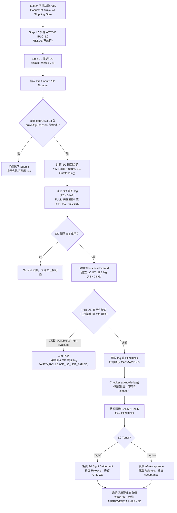

# A3S — 單據到單（含提貨擔保贖回）Document Arrival with Shipping Guarantee Redemption

> [!info] 2026-08-30 更新
> Transaction Index 一次选择 LC Number + SG Number，并显示 SG Amount。提交金额上限为 `Tight LC Balance + Selected SG Outstanding`；UI Submit、API 与 Checker Release 都执行适用检查，结果不得使 Tight LC Balance 小于 0。两条关联 legs 通过 atomic compound API 成功或回滚。

## 功能摘要

| 項目                       | 內容                                                                                                                                                                                                                                                                               |
| -------------------------- | ---------------------------------------------------------------------------------------------------------------------------------------------------------------------------------------------------------------------------------------------------------------------------------- |
| 功能代碼                   | **A3S**                                                                                                                                                                                                                                                                            |
| 功能說明（代碼原文 label） | `Document Arrival w/ Shipping Gtee`（`balance-component.model.ts:311`，中文暫譯：單據到單／含提貨擔保函贖回）                                                                                                                                                                      |
| instrumentType             | `IPLC_LC`（`balance-component.model.ts:313`）                                                                                                                                                                                                                                      |
| movementType               | `UTILIZE`（`balance-component.model.ts:314`）——與 A3（純單據到單）**完全相同的 movementType**，僅以是否顯式匹配一筆未償 SG 作區分（見 [[MOVEMENT-RULE-043]]）                                                                                                                      |
| subChoice                  | 無獨立 subChoice 選項；A3S 是一個**複合式（compound）Maker 提交**，固定包含兩段 leg：①SHGT 的 `FULL_REDEEM \| PARTIAL_REDEEM`（先行，贖回被匹配的 SG）②IPLC_LC 的 `UTILIZE`（隨後，同金額，即本筆信用證自身的單據到單）——見 `balance-component-api.yaml:865-876`（`compoundLegs`） |
| 方向                       | Import（進口）                                                                                                                                                                                                                                                                     |
| 母層功能                   | A1（LC Issue，`balance-component.model.ts` 註解 §294 起的資料結構脈絡；A3S 與 A3 皆作用於 A1 建立的 IPLC_LC 根合約之上）                                                                                                                                                           |
| 二級參照欄位               | IB Number（`secondaryRefLabel: 'IB Number'`，`balance-component.model.ts:315`）                                                                                                                                                                                                    |

**API 端點**（均為真實查證，非杜撰）：

- Microservice API（`analysis/balance-component-api.yaml`，通用端點，行為由 request body 的 `instrumentType`/`movementType` 決定）：
  - `POST /balance-movements` — 建立 PENDING 動帳（A3S 的兩段 leg 各自呼叫一次：先 `instrumentType: SHGT, movementType: FULL_REDEEM|PARTIAL_REDEEM`，再 `instrumentType: IPLC_LC, movementType: UTILIZE`，兩者共用同一個 `businessEventId`）（`balance-component-api.yaml:730` 起）
  - `GET /balance-movements?businessEventId=` — 依共用的 `businessEventId` 查出兩段已連動的 leg（供獨立 Checker session 定位配對記錄用，`balance-component-api.yaml:843` 起）
  - `POST /balance-movements/{movementId}/acknowledge` — A3/A3S 專屬的 Checker「確認但不放行」步驟，狀態維持 PENDING，僅寫入 `acknowledgedBy`/`acknowledgedAt`（`balance-component-api.yaml:1054-1111`）
  - `POST /balance-movements/{movementId}/release` — 真正的 Checker Release（A3S 本身的 Checker 動作**不會**呼叫這支，見下方 Business Decision 一節；僅 A4/A6 finalize 時才呼叫）
  - `POST /balance-movements/{movementId}/reject`、`POST /balance-movements/{movementId}/cancel` — Reject／Maker EC，以及 LC leg 失敗時對已建立的 SG 贖回 leg 的自動補償性回滾（見 [[MAKER-CHECKER-RULE-025]]）
- Web/Mobile Channel API（`analysis/balance-component-channel-api.yaml`，同樣是以 `functionCode` 驅動的通用端點）：
  - `GET /channel/functions` — 回傳 A3S 的 `compoundLegs`／`hasParent: false`／`currencyMode: CARRIED` 等 metadata（`balance-component-channel-api.yaml:865-876`）
  - `POST /channel/transactions`（`functionCode: A3S`）— 建立 PENDING 交易，channel 層的兩段 leg 提交
  - `POST /channel/transactions/{transactionId}/release`／`/reject`／`/cancel` — Checker／Maker 動作的 channel 層封裝

## Trigger（觸發點）

Maker 在 Transaction Processing 畫面選擇功能 A3S，並挑選一張存在未償 Shipping Guarantee（A8 已核准發行、尚有可用餘額）的 ACTIVE IPLC_LC。UNCLEAR：觸發本身沒有額外的系統事件驅動，純粹是 Maker 的人工選擇（CONFIRMED 屬 Maker/Checker 人工流程，非排程或事件觸發）。

## Input（輸入）

- LC 挑選（Step 1 Flat Catalog Picker，`requireIssueReleased` 過濾僅 ISSUE 已放行的 LC）
- SG 挑選（Step 2，`picker-selection.service.ts:90-131`）——**僅顯示即時可用餘額非零的 SG**（[[EXPOSURE-RULE-013]]），且 LC 層級的資格提示要求該 LC 至少存在一筆可用餘額非零的 SHGT 子合約（[[EXPOSURE-RULE-014]]）
- Bill Amount（單據金額，Maker 自由輸入，非鎖定欄位）
- IB Number（二級參照）
- Currency（`currencyMode: CARRIED`，從母層 LC 沿用，不可另輸入）

## Validation（校驗）

- Submit 前必須同時具備 `selectedArrivalSg` 與已解析的 `arrivalSgSnapshot`（半解析狀態——已選 SG 但快照尚未載入——同樣視為未完成）（[[MAKER-CHECKER-RULE-022]]）
- Amount 必須 > 0（全功能通用背檔規則，服務端 `assertValidAmount()` 於 `POST /balance-movements`／`/release` 皆有二次校驗）
- 貨幣代碼一律沿用母層 LC，不接受另行輸入（CARRIED，`currencyMode: CARRIED`）

## Classification（分類）

A3S 与 A3 底层 movementType 完全相同（皆为 `IPLC_LC`/`UTILIZE`），拆分 functionCode 是为了明确有无 SG 配对。A3S 属于 compound submission；B4 也有 compound legs，A6 关联既有 source。B5 已改为 plain 单一 Acceptance settlement，不属于此家族。

## Business Decision（業務決策）

1. **SG 贖回金額計算**：贖回金額 = MIN(Bill Amount, 所選 SG 的 Outstanding/confirmedBalance)；贖回類型依此值是否達到/超過 Outstanding，判定為 `FULL_REDEEM` 或 `PARTIAL_REDEEM`（[[MOVEMENT-RULE-021]]）。此為 A9（獨立 SG 贖回，現已鎖定僅限 Full Redeem）唯一合法允許 Partial Redeem 的例外情形，因其贖回金額與具體可識別的到單單據綁定，並非 Maker 任意輸入。
2. **提交順序**：先建立 SG 贖回（PENDING），再建立 LC 自身的 UTILIZE，兩者共用同一組生成的 `businessEventId`（[[EXPOSURE-RULE-015]]、[[a3s-matched-businesseventid-sg-redemption-netting-ordering]]）。
3. **客戶端即時預覽公式**與伺服端實際提交公式一致（`arrivalSgRedeemAmount`/`arrivalSgRedeemType`/`arrivalSgRemaining` getter，[[MOVEMENT-RULE-022]]）。
4. **Checker 動作**：Checker 的「Approve」在 A3/A3S 自身層級**從不呼叫真正的 release()**（`deferSettlement: true`），僅是確認性質的 `acknowledge`（狀態仍為 PENDING）；只有後續的 A4（Sight）或 A6（Usance）的真正 Release，才會終結這筆 UTILIZE（[[MAKER-CHECKER-RULE-015]]）。
5. Checker Queue 對 A3/A3S 這類 `deferSettlement` 功能會排除已 `acknowledgedAt` 的候選項，避免同一筆已確認的到單重複出現（[[MAKER-CHECKER-RULE-028]]）。

## Balance/Exposure Decision（表內 vs 表外）

- **表外（Off-Balance-Sheet）**：SHGT 的贖回 leg 直接減少該 LC 的 SG 表外風險敞口（`offBalanceExposure`）。A3S 的關鍵機制是：這筆 SG 贖回雖仍為 PENDING，但因與隨後的 LC UTILIZE 共用同一 `businessEventId`，在 UTILIZE 自身的充足性檢查執行「之前」就已被淨額扣除（[[EXPOSURE-RULE-001]]、[[EXPOSURE-RULE-015]]）——這是「增加從嚴、贖回預設僅 RELEASED 才抵扣」這條通用規則下**唯一**的例外。
- **表內（Contingent/On-Balance）**：LC 自身的 UTILIZE 段建立一筆 PENDING 佔用（earmark），暫無總帳影響；直到 A4/A6 真正 Release 時才過帳信用證或有負債帳戶對的沖銷分錄（[[MOVEMENT-RULE-062]]、[[MOVEMENT-RULE-052]]）。
- **顯示狀態**：A3/A3S 屬於 D3「實體事件、非法律事件」的 Earmark 分類，顯示狀態為 EARMARKING（未 acknowledged）／EARMARKED（已 acknowledged 或已 RELEASED），而非其他功能通用的 PENDING/APPROVED（[[STATUS-RULE-019]]）。

## Tolerance 決策（若適用）

不適用。`tolerancePct`/`ceilingAmount` 的容差換算僅適用於 `IPLC_LC`/`EPLC_LC`/`EPLC_CONFIRMATION` 的 `ISSUE`/`AMEND_*` 動作，UTILIZE（A3/A3S）與 SHGT 的 REDEEM 皆不在此列（CONFIRMED，見專案 CLAUDE.md「Tolerance conversion」一節）。

## Movement Posting Generation（過帳分錄）

- Submit 時：SG 贖回 leg（PENDING）+ LC UTILIZE leg（PENDING）各自建立一筆 `BalanceMovement`，共用 `businessEventId`；兩者皆為表外/earmark 性質，尚未產生正式 Dr/Cr 分錄。
- Release 時（由 A4/A6 觸發，而非 A3S 自身）：真正過帳信用證或有負債帳戶對的沖銷分錄（`contingentAccountEntry`），一次生成、不可變、不因重新查詢而重算。
- **失敗回滾**：若 SG 贖回 leg 成功但隨後 LC UTILIZE leg 失敗，服務端會自動對已建立的 SG 贖回呼叫 `cancel()`（原因碼 `AUTO_ROLLBACK_LC_LEG_FAILED`），使 SG 額度立即恢復可用，而非遺留孤立 PENDING 記錄；若回滾本身也失敗，兩則錯誤訊息會一併呈現，並指引改以 A9 的 Checker 面板做人工兜底（[[MAKER-CHECKER-RULE-025]]）。

## Output（輸出）

- 兩筆連動的 `BalanceMovement`（SG 贖回 + LC UTILIZE），共用 `businessEventId`
- 更新後的 SG 與 LC 即時快照（`tightAvailableBalanceForWarning` 會以所選 SG 的 `confirmedBalance` 放寬客戶端即時檢查門檻，見 [[BALANCE-RULE-012]]）
- Look Up Current Balance／Inquire Events 會將此事件顯示為 EARMARKING/EARMARKED

## Error/Exception（錯誤/例外）

- 兩級硬性 ERROR（皆為 409，無非阻斷性 WARNING 路徑）：Bill Amount 超出 plain Available Balance，或（在 SG 淨額扣除後）仍超出 Tight Available Balance，皆直接拒絕（[[EXPOSURE-RULE-002]]）
- 未選定 SG 或 SG 快照尚未解析 → Submit 前端擋下，訊息提示「請先挑選這筆 Document Arrival 所對應的 Shipping Guarantee」（[[MAKER-CHECKER-RULE-022]]）
- LC UTILIZE leg 失敗時，SG 贖回 leg 自動補償性回滾（見上）；回滾亦失敗則雙重錯誤訊息並指引人工介入 A9 Checker 面板
- Amount ≤ 0、貨幣不符、`sourceTransactionRef` 重複等，適用於本功能所屬 instrumentType/movementType 的通用校驗規則同樣適用（UNCLEAR：未見 A3S 專屬的額外錯誤碼，除上述兩項外均與 A3/其他 UTILIZE 類功能共用相同的伺服端校驗鏈）

## Mermaid Flowchart

## 交叉引用（Related Knowledge）

- [[Balance Component Overview]]
- [[a3s-matched-businesseventid-sg-redemption-netting-ordering]]（既有支援筆記，英文，事實依據來源）
- [[EXPOSURE-RULE-001]] — SHGT 表外風險敞口公式
- [[EXPOSURE-RULE-002]] — checkUtilizeSufficiency 兩級硬性 ERROR
- [[EXPOSURE-RULE-013]] — A3S 自身 SG 選擇器排除零餘額 SG
- [[EXPOSURE-RULE-014]] — A3S/A9 的 LC 層級 SG 資格提示
- [[EXPOSURE-RULE-015]] — A3S 已匹配 businessEventId 的淨額扣除順序
- [[BALANCE-RULE-012]] — tightAvailableBalanceForWarning 對 A3S 的放寬
- [[MAKER-CHECKER-RULE-015]] — Checker 放行路由：A3/A3S 為延後處理（deferSettlement）
- [[MAKER-CHECKER-RULE-022]] — A3S Submit 前必須綁定具體 SG 及其快照
- [[MAKER-CHECKER-RULE-025]] — A3S 自動回滾機制
- [[MAKER-CHECKER-RULE-028]] — Checker Queue 的 EARMARKING/EARMARKED 拆分
- [[MOVEMENT-RULE-021]] — A3S 為 A9 僅限 Full Redeem 規則的唯一例外
- [[MOVEMENT-RULE-022]] — A3S 客戶端預覽與伺服端公式一致
- [[MOVEMENT-RULE-043]] — A3 與 A3S 底層 movementType 相同
- [[MOVEMENT-RULE-052]] — Pending→Approved 遷移僅發生於 A4/A6 真正 Release
- [[MOVEMENT-RULE-062]] — 即期兌付的「先占用後釋放」複合步驟建模
- [[STATUS-RULE-019]] — 事件狀態顯示映射（EARMARKING/EARMARKED）
