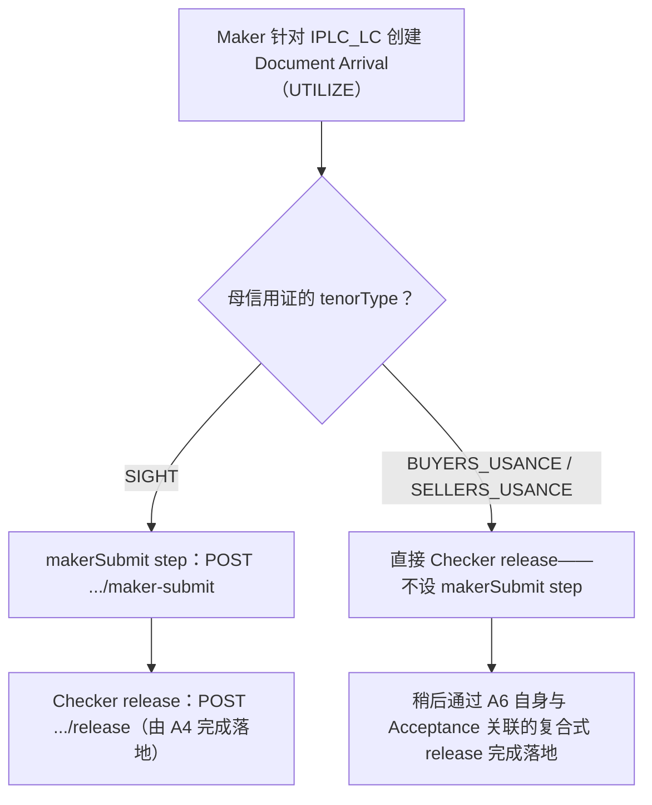

# A4 仅限 Sight 的 Maker Submit 关卡

按 tenor 分支的判断逻辑，存在于每个 Import 用例的 Document Arrival 流程之中，纯粹体现在 registry 自身的 step 形态里。

## 证据来源

- `backend/data/businessCases.js:123-134,297-302,1190-1191`
- `backend/data/businessCases.js:177-227 (Usance UTILIZE, no makerSubmit)`

## 相关知识

- Business Case Registry（后端编排器）+ Business Case Runner UI
- [[Business-Rule-Index]]
