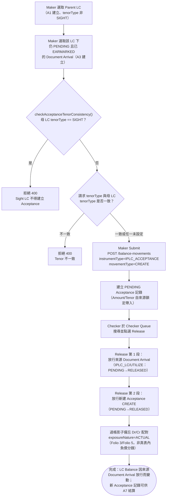

# A6 — 承兌／延期付款建立（Acceptance/Usance Create）

> [!info] 2026-08-30 更新
> Transaction Index 一次选择 LC Number + IB Number，并显示 IB Amount。候选必须是已 EARMARKED、尚未被 A6 消费的 Usance A3／A3S；来源 presentation 的金额、tenor type 与 tenor days 由系统带入并锁定。release 使用 atomic compound transaction。

本筆記是 Balance Component 具名業務功能 **A6** 在整個 Obsidian 知識庫中的主要入口，彙整其定義、真實 API 端點、端到端流程與已核實的相關業務規則。

## 功能摘要

| 項目 | 內容 |
|---|---|
| 功能代碼 | A6 |
| 功能說明（原始 label） | Acceptance (Usance) |
| instrumentType | `IPLC_ACCEPTANCE` |
| movementType | `CREATE` |
| tenorTypeOptions（subChoice） | `SELLERS_USANCE`、`BUYERS_USANCE`（僅 Usance，不含 Sight——CONFIRMED，`USANCE_ONLY_TENOR_OPTIONS`） |
| 所屬方向 | Import（進口） |
| 所屬母層功能 | A1（`defaultParentInstrumentType: IPLC_LC`，即 A1 建立的 IPLC_LC） |
| 是否為複合提交（compound） | 是——`payableMovementType: 'UTILIZE'`，一次 Checker Release 同時放行「來源 Document Arrival」與「新建 Acceptance」兩段 |

以上定義已用 Read 工具核實於 `/home/claude/balance-kb/repo/src/app/transaction-builder/balance-component.model.ts`（`IMPORT_FUNCTIONS` 陣列，`code === 'A6'` 項，約第 330–344 行）；`balance-component-channel-api.yaml` 中 `GET /channel/functions` 的 `A6` 條目（約第 886–896 行）與之一致，並額外確認 `hasParent: true`、`currencyMode: CARRIED`、`submitsTransaction: true`。CONFIRMED。

### API 端點

依步驟4 對 `analysis/balance-component-api.yaml` 與 `analysis/balance-component-channel-api.yaml` 的實際查證，A6 並非擁有專屬路徑的端點，而是透過通用端點以 request body 的 instrumentType/movementType（或 functionCode）驅動行為：

- **微服務層（權威）**：`POST /balance-movements`（`balance-component-api.yaml:730`）——body 帶 `instrumentType: IPLC_ACCEPTANCE`、`movementType: CREATE`、`parentLogicalContractId`（或可解析的自然鍵）、`tenorType`（BUYERS_USANCE/SELLERS_USANCE）等，建立 PENDING 的 Acceptance 記錄；規範文字明確標註「創建 IPLC_ACCEPTANCE/EPLC_ACCEPTANCE 若父合同為 Sight 或 tenorType 不一致，回傳 400」（同檔案第 771–774 行）。
- **Checker 放行（複合，兩段）**：`POST /balance-movements/{movementId}/release`（`balance-component-api.yaml:900`）——A6 一次 Release 會依序放行①來源 Document Arrival（`IPLC_LC/UTILIZE`）②新建的 Acceptance（`IPLC_ACCEPTANCE/CREATE`）。
- **Channel API 門面層**：`POST /channel/transactions`（`balance-component-channel-api.yaml:292`），body 帶 `functionCode: A6`，由該端點依 `GET /channel/functions` 的 A6 定義推導出真正的 instrumentType/movementType/tenorType 並轉呼叫微服務層；對應的 Checker 放行為 `POST /channel/transactions/{transactionId}/release`（同檔案第 404 行）。

UNCLEAR：兩份規範中未見到 A6 專屬（named）路徑，僅有以上通用端點依 body 欄位分派；未發現與此相左的證據，故按規範原文如實記錄。

## 端到端流程（Trigger → Output → Error/Exception）

- **Trigger（觸發點）**：Maker 在 A1 建立且 tenorType 非 SIGHT 的 IPLC_LC 之下，選取一筆該 LC 項下仍處 **PENDING** 狀態、由 A3（Document Arrival）建立的 `IPLC_LC/UTILIZE` 記錄，發起 A6 CREATE。CONFIRMED（`balance-component.model.ts` A6 條目 `pendingItemSourceHint: 'use A3 (Document Arrival) first'`）。

- **Input（輸入）**：Parent LC（LC Index，來源鍵為 `selectedParent.naturalKey.lcNumber`）＋ 該 LC 下仍 PENDING 的 Document Arrival（IB Index，`selectedPayMovement`）；Amount／Tenor Type／Tenor Days 由來源記錄帶入並鎖定為唯讀（protected）。IB Number 為 Maker 自由輸入，即使 LC Number 來自 Parent 選取器，IB/SG Number 也絕不取自 Parent（[[MAKER-CHECKER-RULE-019]]）。CONFIRMED。

- **Validation（校驗）**：
  1. `checkAcceptanceTenorConsistency()`（服務端強制，非僅前端）：若母 LC 的 tenorType 為 SIGHT 則無條件拒絕（400）；否則當母 LC 與請求 tenorType 皆已設定時必須一致，否則拒絕（400）（[[MOVEMENT-RULE-012]]、`checkacceptancetenorconsistency`、`sight-vs-usance-tenor-flow-control`、`acceptance-create-tenor-routing-decision`）。CONFIRMED。
  2. Step-1/Step-2 選取器要求候選 Document Arrival 必須是真正 **EARMARKED**（`acknowledgedAt` 已設定），僅 EARMARKING（Maker 已送出、Checker 尚未確認）不可選（[[MAKER-CHECKER-RULE-041]]、[[MAKER-CHECKER-RULE-052]]）。CONFIRMED。
  3. Submit 前必須先選定 `selectedPayMovement`，否則阻擋並提示「請先挑選仍處 PENDING 狀態的 Document Arrival（2ndary Index）以進行轉換」（[[MAKER-CHECKER-RULE-021]]）；`hasEligibleTargetSelected`：僅選 Parent 仍為 false，需同時選定 Parent 與 Document Arrival 才 true（[[MAKER-CHECKER-RULE-023]]）。CONFIRMED。
  4. Parent LC 選取器對 Available Balance = 0 的候選 LC 一律排除（無論 movementType），除非帶有 hintSet 豁免——與 Catalog/IB-Index 選取器僅在遞減型 movementType 才排除的規則不對稱（[[MAKER-CHECKER-RULE-020]]）。CONFIRMED。
  5. **tenorType 強制必填（2026-08-26 新增）**：A6 對應的 `IPLC_ACCEPTANCE:CREATE` 是服務端 `TENOR_TYPE_REQUIRED_PAIRS` 三組必填組合之一（另兩組為 A1／B1 自身的 ISSUE），未帶 `tenorType` 會被 `assertTenorRequired()` 拒絕（400）——CONFIRMED（[[MOVEMENT-RULE-080]]）。與 A1 不同，A6 本身**沒有**等同於 A1 專屬的 `tenorDays > 0` 服務端強制（該檢查刻意僅限 `IPLC_LC:ISSUE`）——CONFIRMED（[[MOVEMENT-RULE-081]]）。

- **Classification（分類）**：instrumentType=`IPLC_ACCEPTANCE`、movementType=`CREATE`；exposureNature=`ACTUAL`（非 CONTINGENT）——一旦承兌即依 IFRS 9 視為表內金融負債，而非或有負債（[[EXPOSURE-RULE-019]]）。CONFIRMED。

- **Business Decision（業務決策）**：A6 對 Buyer's Usance 與 Seller's Usance 一視同仁，皆走完全相同的 Acceptance CREATE 影子分錄流程，未依源規格對 Buyer's Usance 做 LC_HONOUR_BU 的差異化路由——此為已記錄的已知偏差（[[MOVEMENT-RULE-057]]）。CONFIRMED。

- **Balance/Exposure Decision（表內 vs 表外）**：Acceptance/DPU 於本元件僅過帳一組標記 `exposureNature=ACTUAL` 的**影子備忘（shadow-memo）** Dr/Cr 配對（Folio 3／Folio 5，供 MIS/MT 對帳用），並非真正的表內會計分錄；真實的 Acceptances & DPU Outstanding 負債及對應應收由範疇外的另一元件入帳（[[EXPOSURE-RULE-019]]）。CONFIRMED。

- **Tolerance 決策**：不適用。宽容度（Tolerance）換算僅適用於 `IPLC_LC`／`EPLC_LC`／`EPLC_CONFIRMATION`，`IPLC_ACCEPTANCE` 一律原樣回傳未換算面額（[[TOLERANCE-RULE-002]]）。CONFIRMED。

- **Movement Posting Generation（過帳分錄／複合放行）**：A6 屬於 `settlesDocumentArrival` 形態，Checker 一次 Release 依序完成兩段：① 放行來源 Document Arrival（此時仍為 PENDING，Pending→Approved 的遷移**只在此刻**發生，絕不在 A3 自身 Submit 或 Checker 確認時發生）；② 放行新建的 Acceptance CREATE（[[MAKER-CHECKER-RULE-015]]、[[MOVEMENT-RULE-052]]、[[MOVEMENT-RULE-038]]、[[MAKER-CHECKER-RULE-031]]）。CONFIRMED。兩段分腿透過共用的 `businessEventId`／`referencedTransactionId` 關聯；在真正獨立的 Checker 會話（非 Maker 提交時同一瀏覽器）中，會回退以 `GET /balance-movements?businessEventId=` 查詢解析（[[MAKER-CHECKER-RULE-032]]）。CONFIRMED。

- **Output（輸出）**：新建一筆 `IPLC_ACCEPTANCE`／`CREATE` 記錄（初始 PENDING），Checker Release 後狀態變為 RELEASED；同時來源 `IPLC_LC/UTILIZE` 記錄狀態由 PENDING/EARMARKING 轉為 RELEASED/EARMARKED（顯示層）；LC Balance 本身在 Maker Submit 階段不變，只在 Checker Release 時因來源 Document Arrival 被放行而變動。

- **Error/Exception（錯誤/例外）**：
  - 母 LC 為 Sight，或請求 tenorType 與母 LC 自身 tenorType 不一致 → 400 RequestValidationError（[[MOVEMENT-RULE-012]]）。
  - 未選定 `selectedPayMovement` 即嘗試 Submit → 前端阻擋，提示訊息如上（[[MAKER-CHECKER-RULE-021]]）。
  - Available Balance 不足 → 409（通用 `POST /balance-movements` 規則，非 A6 專屬）。
  - 同一 `(balanceContractId, eventSeq)` 重複提交 → 200，返回既有記錄（冪等，通用規則）。
  - 在真正獨立的 Checker 會話中點選 Release，若 businessEventId/referencedTransactionId 解析不到關聯分腿 → 回傳乾淨的 `'failed'` 結果，而非靜默無效或未處理例外（[[MAKER-CHECKER-RULE-032]]，此問題本身於 2026-08 曾被發現並修正——CLAUDE.md 決策日誌）。

## 流程圖

## 交叉引用（Related Knowledge）

支援技術細節筆記（英文，事實依據來源，尚待其他批次翻譯，僅連結不修改）：
- [[acceptance-create-tenor-routing-decision]]
- [[checkacceptancetenorconsistency]]
- [[sight-vs-usance-tenor-flow-control]]

相關業務規則：
- [[MOVEMENT-RULE-012]] — Acceptance Tenor 一致性由服務端強制校驗
- [[TOLERANCE-RULE-002]] — 宽容度換算的 instrumentType 適用性門控（IPLC_ACCEPTANCE 不適用）
- [[EXPOSURE-RULE-019]] — Acceptance/DPU 是影子備忘分錄，非真正表內負債
- [[MOVEMENT-RULE-057]] — A6 對 Buyer's/Seller's Usance 一視同仁（已知偏差）
- [[MAKER-CHECKER-RULE-021]] — A6/B4 必須轉換具體 PENDING 來源記錄
- [[MAKER-CHECKER-RULE-041]] — A4/A6 應付 movement 資格要求真正四眼（EARMARKED）
- [[MAKER-CHECKER-RULE-052]] — A4/A6 選擇器要求真正 EARMARKED（設計文件複述）
- [[MAKER-CHECKER-RULE-019]] — 自然鍵解析依功能形態而異（A6 屬 lcNumberFromParent 形態）
- [[MAKER-CHECKER-RULE-023]] — hasEligibleTargetSelected 依 Strategy 形態推導
- [[MAKER-CHECKER-RULE-020]] — Parent 選取器 0 餘額排除規則（A6 適用）
- [[MOVEMENT-RULE-038]] — A6 複合放行順序：來源先於 Acceptance CREATE
- [[MOVEMENT-RULE-052]] — Document Arrival Pending→Approved 只在 A4/A6 Release 時發生
- [[MAKER-CHECKER-RULE-015]] — Checker 放行路由依功能形態而異（A6 vs B4 vs A4 vs A3/A3S）
- [[MAKER-CHECKER-RULE-031]] — Checker release() 依複合提交形態分派四條分腿放行鏈
- [[MAKER-CHECKER-RULE-032]] — 跨會話關聯分腿解析回退機制
- [[MAKER-CHECKER-RULE-049]] — Channel API 除 A1/B1 外禁止輸入 Currency Code（規格層，A6 適用）
- [[MOVEMENT-RULE-080]] — tenorType 於 A1/B1/A6 三組組合強制必填（2026-08-26 新增，A6 屬 `IPLC_ACCEPTANCE:CREATE`）
- [[MOVEMENT-RULE-081]] — tenorDays > 0 僅限 A1（IPLC_LC:ISSUE）強制，A6 不適用（2026-08-26 新增）

- [[Balance Component Overview]]
