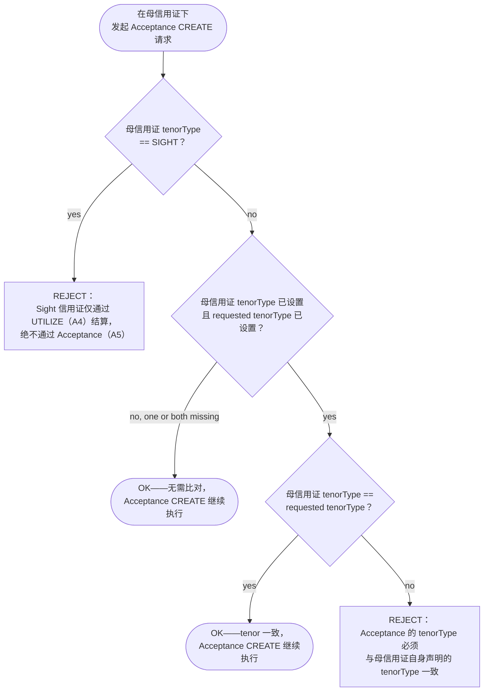

# Acceptance CREATE 的 tenor 路由判定

在允许针对母信用证发起 Acceptance CREATE 之前，会先运行 checkAcceptanceTenorConsistency()：若母信用证为 Sight，则无条件阻断；否则，当两者皆已提供时，传入的 requestedTenorType 必须与母信用证自身声明的 tenorType 一致。

## 证据来源

- `microservices/balance-component/src/domain/tenorRouting.ts (full file)`

## 相关知识

- Balance 推导（Derivation）、状态转换（Status Transition）、Tenor 路由（Tenor Routing）
- [[Business-Rule-Index]]
