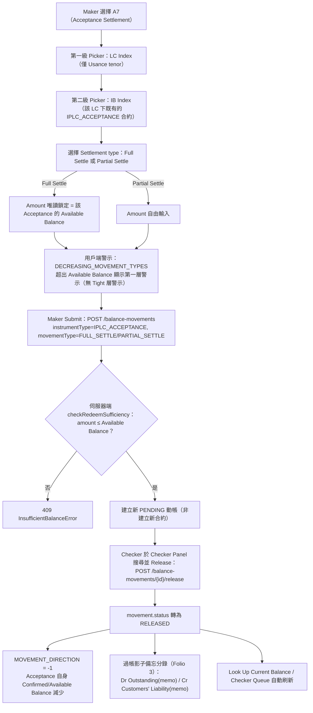

# A7 —— 承兌結算（Acceptance Settlement）功能分析

## 功能摘要

- **功能代碼**：A7
- **功能說明**：承兌結算（Acceptance Settlement）
- **instrumentType**：`IPLC_ACCEPTANCE`
- **movementType（subChoice：Settlement type）**：`FULL_SETTLE`（Full Settle）／`PARTIAL_SETTLE`（Partial Settle）—— 由 Maker 於下拉選單直接挑選（`subChoice.key: 'movementType'`，寫入 `model.movementType`），並非依 Amount 與 Available Balance 的比較關係在提交時自動推導（`balance-component.model.ts` code `'A7'` 定義，行 345-363；`function-strategy.ts` 行 128：`A7: { ...NO_SPECIAL_BEHAVIOR, code: 'A7' }`，`amountVsAvailableDerivation` 為 `null`）。
- **所屬方向**：進口 Import
- **所屬母層功能**：A6（Acceptance CREATE，建立本功能所要結算的 `IPLC_ACCEPTANCE` 合約；`catalogTenorFilter: 'USANCE'` —— 僅 Usance 母 LC 才有 Acceptance 可選，Sight LC 恆無候選）
- **API 端點**（CONFIRMED，逐一核實自 `balance-component-api.yaml`／`balance-component-channel-api.yaml`）：
  - `POST /balance-movements` —— 通用建立動帳端點，由 request body 的 `instrumentType`/`movementType` 決定行為；A7 提交時帶 `instrumentType: IPLC_ACCEPTANCE`、`movementType: FULL_SETTLE` 或 `PARTIAL_SETTLE`，針對**既有**的 Acceptance 合約（`balanceContractId` 已由 Step-1/Step-2 picker 解析得出）建立一筆新的 PENDING 動帳，非建立新合約（`movementTypeRegistry` 中 `PARTIAL_SETTLE`/`FULL_SETTLE` 皆為 `isCreating: false`，`balanceService.ts` 行 251-252）。
  - `POST /balance-movements/{movementId}/release` —— 通用 Checker Release 端點；A7 在 `function-strategy.ts` 的 `checkerRelease` 分類中屬於 `NO_SPECIAL_BEHAVIOR`（`releasesExistingMovementInPlace`/`settlesDocumentArrival`/`deferSettlement` 皆為 false），即單純的「一次提交、一次放行」單一動帳路徑，不涉及任何複合式（compound）連動放行。
  - `GET /balance-contracts/catalog` —— 通用目錄查詢端點，供 A7 的 LC Index（Step-1，篩選 Usance tenor）／IB Index（Step-2，該 LC 項下既有的 `IPLC_ACCEPTANCE` 合約）兩級 picker 使用，非 A7 專屬。
  - Channel API 對應（`balance-component-channel-api.yaml`）：`POST /channel/transactions`（`functionCode: A7`，`hasParent: true`，`movementTypeChoice: FULL_SETTLE` 或 `PARTIAL_SETTLE`，行 604、629、771-788）＋ `POST /channel/transactions/{transactionId}/release`。

## Trigger → Output 全流程

1. **Trigger（觸發點）** —— CONFIRMED（`balance-component.model.ts` code `'A7'` 定義）
   Maker 在 Transaction Builder 選擇 A7（Acceptance Settlement）功能。此功能只在母 LC `tenorType` 為 Usance（`BUYERS_USANCE`/`SELLERS_USANCE`）時才有候選可選（`catalogTenorFilter: 'USANCE'`）——Sight LC 從不會有 `IPLC_ACCEPTANCE` 子合約可供結算（model.ts 自身註解：「a Sight LC would always have zero IBs to pick in Step 2」）。

   **2026-08-26 更新（新增資格閘門，非本文原有記錄）**：使用者於 2026-08-25 回報「A07 交易選擇是 LC number 有 Acceptance balance 再顯示 2ndary ref」——修正之前，Step 1（LC Index）唯一的篩選信號是 `catalogTenorFilter: 'USANCE'`，任何 Usance LC 都會被列出，無論其名下是否真的存在尚有未結餘額的 `IPLC_ACCEPTANCE` 子合約；只有等 Maker 選定 LC 進入 Step 2（IB Index）後，才會事後發現「0 candidates」。現已修正：`balance-component.model.ts` 的 A7 條目新增 `requiresEligibleParentAcceptance: true`（第 269、399 行），與 `DocumentArrivalHintsService` 新增的 `loadParentAcceptanceEligibility()`（其底層是從原本 A3S/A9 專用的 `loadSgBalanceEligibility()` 泛化而成的 `loadChildBalanceEligibility()`，以 `childInstrumentType` 參數化，見第 181-215 行）配合，僅當該 LC 名下至少存在一個即時可用餘額非零的 `IPLC_ACCEPTANCE` 子合約時，才會出現在 Step 1 的候選清單中——與 A3S/A9 自身既有的 SG 餘額資格閘門（[[EXPOSURE-RULE-014]]）同一形態，只是子合約 instrumentType 換成 `IPLC_ACCEPTANCE`。CONFIRMED（Angular UI 側關注點，直接閱讀 `maker-panel.component.ts` 第 687-693、719-733 行核實：`resolveParentEligibilityRule()` 新增的 `requiresEligibleParentAcceptance` 分支，在原有 `catalogTenorFilter === 'USANCE'` 的無條件放行分支**之前**被檢查）。B5（同樣 `catalogTenorFilter: 'USANCE'`）刻意未套用此閘門，仍維持無條件放行——B5 走的是 `usesSettleableBalanceIndex`/EB Index 的獨立資格路徑，非本次變更範圍。詳見新規則 [[MOVEMENT-RULE-083]]。

2. **Input（輸入）** —— CONFIRMED（model.ts 對 A7 的 `help` 文字；`function-policy.ts`／[[MAKER-CHECKER-RULE-019]]）
   - 第一級：LC Index picker，篩選 Usance tenor 的 `IPLC_LC` 合約。
   - 第二級：IB Index picker，選取該 LC 項下既有的 `IPLC_ACCEPTANCE` 合約（一張 LC 可能有多筆 Document Arrival／Acceptance）。natural key 解析走 A7/A9/B5 共用的形態：以 `selectedContract` 為主，回退至雙欄位 `searchNaturalKey`（[[MAKER-CHECKER-RULE-019]]）。
   - 選定目標後，Maker 於 Settlement type 下拉選單挑選 `Full Settle` 或 `Partial Settle`（`onSubChoice()` → `model.movementType`）。
   - **Full Settle**：Amount 欄位**唯讀鎖定**，自動帶入該 Acceptance 合約當下的 Available Balance（`builder-fields.ts` 行 35-36 `amountFromFullSettle`；`maker-panel.component.ts` 行 484-486 `afterResolved()`：`model.amount = selectedContractSnapshot.availableBalance`）。
   - **Partial Settle**：Amount 欄位維持**自由輸入**（`builder-fields.ts` 行 27-28 註解：「Full Settle — Amount carries from the source record and is protected. Partial Settle stays free-typed.」）。

3. **Validation（校驗）** —— CONFIRMED
   - **2026-08-26 更新（新增）**：Step 1 LC Index 資格閘門——`resolveParentEligibilityRule()`（`maker-panel.component.ts:719-733`）依序判斷：`requiresEligibleParentDocumentArrival` → SG 贖回形態（`amountVsAvailableDerivation === 'REDEEM'`）→ **`requiresEligibleParentAcceptance`（A7 專屬，本次新增，`documentArrivalHints.parentAcceptanceEligible` hint-set）** → 才輪到通用的 `catalogTenorFilter === 'USANCE'` 無條件放行分支。`filteredParentCatalog`（同檔案 `resolveParentEligibilityRule()` 呼叫處）據此排除掉名下無任何非零可用餘額 `IPLC_ACCEPTANCE` 子合約的 Usance LC。CONFIRMED，Angular UI 側關注點，見 [[MOVEMENT-RULE-083]]。
   - 通用必填檢查：`instrumentType`／`movementType`／`amount`／`currency`／`createdBy` 皆需存在，且 `Amount > 0`（`submit-rules.ts` 行 61-77）。
   - 目標鎖定（`hasEligibleTargetSelected`）：A7 屬於「其餘非建立類功能」的通用分支——`selectedContract` 必須已解析出，否則輸入欄位與 Submit 按鈕維持鎖定（`submit-rules.ts` 行 246-247；[[MAKER-CHECKER-RULE-023]]）。
   - 用戶端餘額提示：`PARTIAL_SETTLE`/`FULL_SETTLE` 皆屬於 `DECREASING_MOVEMENT_TYPES`（`balance-component.model.ts` 行 181-193），因此 `movementTypeChecksAvailableBalance()` 為 true——A7 會顯示「金額超出 Available Balance」的第一層警示（`checksAgainstPlainAvailable` 為 true）。但 A7 **不在** `checksAgainstTightAvailable` 所列的函式集合中（`maker-panel.component.ts` 行 380-383：僅 `UTILIZE`/`HONOUR`/`ACCEPT`、AMEND_DECREASE 方向、`CREATE`+`EPLC_CONFIRMATION`），故不顯示 Tight Available Balance 第二層警示——與伺服器端實際檢查基準（見下）一致，非缺陷。
   - 伺服器端充足性檢查：`PARTIAL_SETTLE`/`FULL_SETTLE` 走 `outstandingCapped` 分支，呼叫 `checkRedeemSufficiency({ redeemAmount: ceilingAmount, sgAvailableBalance: availableBalance })`——與 SHGT 的 `PARTIAL_REDEEM`/`FULL_REDEEM` 共用同一純函式（`balanceService.ts` 行 189-198、247-252；[[checkredeemsufficiency]]）；金額超出該 Acceptance 合約當下 Available Balance 時回傳 `InsufficientBalanceError`（409）。
   - Tolerance 換算**不適用**：`IPLC_ACCEPTANCE` 不在 Tolerance 適用 instrumentType 集合內，`ceilingAmount` 原樣等於 `amount`（[[TOLERANCE-RULE-002]]）。
   - Channel API 面向：非 A1/B1 的 functionCode（含 A7）一律禁止在請求體中出現 `currency` 欄位，Currency Code 由母 LC 沿用（僅規格層要求，微服務尚未強制執行）（[[MAKER-CHECKER-RULE-049]]）。

4. **Classification（分類）** —— CONFIRMED
   `instrumentType = IPLC_ACCEPTANCE`，`movementType ∈ {FULL_SETTLE, PARTIAL_SETTLE}`。A7 由 Maker 直接选择 Full/Partial；B5 则按输入 Amount 与 Available Balance 自动推导 Full/Partial。两者当前都使用 `plain` 单一 movement，B5 不再联动 Reimbursement Receivable。

5. **Business Decision（業務決策）** —— CONFIRMED
   - **Maker Submit**：`POST /balance-movements`，對既有 `IPLC_ACCEPTANCE` 合約建立一筆新的 PENDING `FULL_SETTLE`/`PARTIAL_SETTLE` 動帳（非建立新合約）。
   - **Checker Release**：通用 `POST /balance-movements/{movementId}/release`；A7 不屬於任何複合式放行形態（非 A6/B4 的 `settlesDocumentArrival`、非 A3/A3S 的 `deferSettlement`、非 A4 的 `releasesExistingMovementInPlace`），為單一動帳的直接放行。

6. **Balance/Exposure Decision（表內 vs 表外）** —— CONFIRMED
   `IPLC_ACCEPTANCE` 動帳的 `exposureNature = ACTUAL`，而非 `CONTINGENT`——一旦承兌，該敞口在 IFRS 9 下已是現時、無條件的表內金融負債；Balance Component 本身不生成真正的表內負債分錄，僅為 MIS/對帳目的過帳一筆「影子備忘」Dr/Cr 配對（Folio 3），從不觸及母 LC 自身的 Balance（[[EXPOSURE-RULE-019]]）。`PARTIAL_SETTLE`/`FULL_SETTLE` 的 `MOVEMENT_DIRECTION` 皆為 `-1`（減額形態），使該 Acceptance 自身的 Confirmed Balance 減少（[[MOVEMENT-RULE-001]]）。具體 Dr/Cr 配對（`analysis/contingent-liability-ledger.html` Folio 3，逐行核實）：
   - Buyer's Usance／Seller's Usance 到期結算（A7 · FULL_SETTLE/PARTIAL_SETTLE）：Dr `Acceptances & DPU — Outstanding (memo)` ／ Cr `Acceptances & DPU — Customers' Liability (memo)`——恰為 A6 CREATE 當下所過分錄（Dr Customers' Liability／Cr Outstanding）的反轉。

7. **Tolerance 決策**（若適用） —— CONFIRMED：不適用
   Tolerance 換算（`ceilingAmount = amount × (1 + tolerancePct/100)`）僅適用於 `IPLC_LC`/`EPLC_LC`/`EPLC_CONFIRMATION` 三類合約的 `ISSUE`/`AMEND*` 動作；`IPLC_ACCEPTANCE`（含 A7 的 `FULL_SETTLE`/`PARTIAL_SETTLE`）一律原樣返回未經換算的面額（[[TOLERANCE-RULE-002]]）。

8. **Movement Posting Generation（過帳分錄）** —— CONFIRMED
   放行成功後，`contingentAccountEntry` 依 instrumentType/movementType 生成一組不可變的影子 Dr/Cr 分錄（見步驟 6 的 Folio 3 對照）；此分錄在動帳建立時一次性生成並持久化，永不重新計算（CLAUDE.md「Contingent Liability Ledger + live account-entry generation」段）。

9. **Output（輸出）** —— CONFIRMED
   - Maker Submit 成功：建立一筆新的 PENDING `IPLC_ACCEPTANCE`/`FULL_SETTLE`（或 `PARTIAL_SETTLE`）動帳；`eventSnapshot` 於建立當下擷取。
   - Checker Release 成功：`movement.status` 轉為 `RELEASED`；`eventSnapshot` 覆寫為 RELEASED 時點快照；該 Acceptance 自身的 Confirmed/Available Balance 依 `MOVEMENT_DIRECTION = -1` 減少；Look Up Current Balance／Checker Queue 自動刷新（CLAUDE.md「Common Requirement」段）。
   - Full Settle 結清後，該 Acceptance 合約 Available Balance 歸零；Partial Settle 則保留剩餘 Available Balance，可再次以 A7（Partial 或 Full）結算。

10. **Error/Exception（錯誤/例外）** —— CONFIRMED
    - `409 InsufficientBalanceError`：`amount`（`ceilingAmount`）超出該 Acceptance 合約當下 Available Balance（`checkRedeemSufficiency`，[[checkredeemsufficiency]]）。
    - `400`：必填欄位缺漏（Amount/Currency/CreatedBy／未選定 Settlement type／未選定目標 Acceptance 合約）。
    - Channel API：非 A1/B1 的 functionCode（含 A7）請求體出現 `currency` 欄位 → 400（僅規格層要求，[[MAKER-CHECKER-RULE-049]]）。
    - **UNCLEAR**：A7 自身的 Step-2 IB Index picker 是否對 0-Available-Balance 的既有 Acceptance 候選套用排除規則（`applyEligibilityRule` 的 `genericFallback`／`gatedByMovementType` 路徑，`eligibility-rule.ts`），本輪未逐一核對 A7 專屬的 picker 呼叫點，留待後續批次核實。

## 流程圖

## 交叉引用（Related Knowledge）

**Maker/Checker 相關規則**

- [[MAKER-CHECKER-RULE-019]] —— 自然鍵（LC/IB/SG Number）解析依功能形態而異：A7/A9/B5 共用「selectedContract 回退至雙欄位 searchNaturalKey」形態
- [[MAKER-CHECKER-RULE-023]] —— hasEligibleTargetSelected：A7 屬於「其餘非建立類功能」的通用 selectedContract 鎖定分支
- [[MOVEMENT-RULE-083]] —— 2026-08-26 新增：A7 自身 Step 1（LC Index）的 Acceptance 餘額資格閘門（`requiresEligibleParentAcceptance`），與 A3S/A9 的 SG 餘額資格閘門同一形態
- [[MAKER-CHECKER-RULE-049]] —— Channel API 對非 A1/B1（含 A7）的 functionCode 一律禁止輸入 Currency Code

**狀態／曝險／過帳相關規則**

- [[EXPOSURE-RULE-019]] —— Acceptance/DPU 是影子備忘分錄，`exposureNature=ACTUAL` 而非 `CONTINGENT`；涵蓋 A7 的 `FULL_SETTLE`/`PARTIAL_SETTLE`
- [[EXPOSURE-RULE-025]] —— B5（Export 对应功能）结算的影子配对反转规则；B5 为自动推导，A7 为手动选择，两者均为单一提交
- [[MOVEMENT-RULE-001]] —— MOVEMENT_DIRECTION 按 instrument/movementType 組合固定不變，`PARTIAL_SETTLE`/`FULL_SETTLE` 皆為 -1
- [[MOVEMENT-RULE-012]] —— Acceptance Tenor 一致性於 `resolveOrCreateContract()` 內部由服務端強制校驗（A6 CREATE 當下即已鎖定 tenorType，A7 結算沿用同一合約）
- [[MOVEMENT-RULE-018]] —— 功能按鈕操作圖示分組：A7 與 A9/B5 同屬 redeem 圖示群組
- [[MOVEMENT-RULE-038]] —— A6 複合放行順序（母層功能背景脈絡：單據到單須先於 Acceptance CREATE 放行）
- [[MOVEMENT-RULE-044]] —— Acceptance/DPU 一經承兌即不可撤銷；A6/A7 實際實作僅存在 `CREATE`/`PARTIAL_SETTLE`/`FULL_SETTLE` 三種 movementType，無任何修改類事件
- [[STATUS-RULE-006]] —— 關閉功能（A10/B6）僅限根票據；`IPLC_ACCEPTANCE` 屬非根票據，不適用關閉
- [[STATUS-RULE-017]] —— movementType 合法值清單的權威來源是 `buildMovementTypeRegistry()`，`FULL_SETTLE`/`PARTIAL_SETTLE` 皆列於其中
- [[checkredeemsufficiency]] —— `checkRedeemSufficiency()` 純函式，被 SHGT 的 `PARTIAL_REDEEM`/`FULL_REDEEM` 與 Acceptance 的 `PARTIAL_SETTLE`/`FULL_SETTLE`（含 A7）逐字共用

**Tolerance 相關規則**

- [[TOLERANCE-RULE-002]] —— Tolerance 換算的 instrumentType 適用性門控，`IPLC_ACCEPTANCE` 不適用

**總覽**

- [[Balance Component Overview]]

## Fix Pending UI 狀態一致性（2026-08-31）

A7 使用 Remarks-only Fix Pending：Amount、Currency、LC Number 與 IB Number保持 protected，只有非空白且有變更的 Remarks 可送出。進入 Fix Pending、送出有效 patch 與收到成功 outcome 時，Maker Panel 必須清除先前的 `submitError`；成功的 `POST /balance-movements/{movementId}/edit` 不得因 stale state 繼續顯示 `BAL-UI-UNEXPECTED`。真正失敗的 outcome 仍保留並呈現其新錯誤。

此修正只影響 Angular UI state machine，不改變 microservice OAS 或 channel OAS。回歸證據見 [[angular-maker-panel-submit-orchestration-test-scenarios]]。
