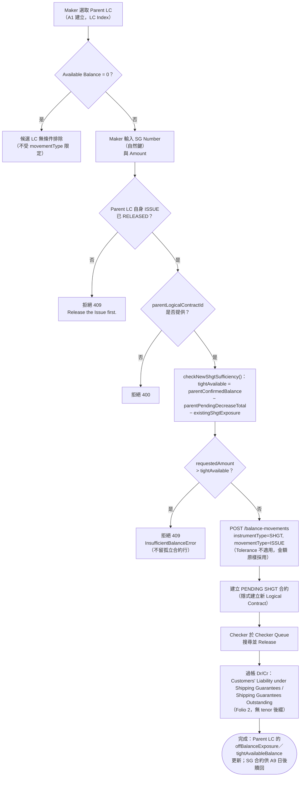

# A8 — 提貨擔保開立（Shipping Guarantee Issue）

本筆記是 Balance Component 具名業務功能 **A8** 在整個 Obsidian 知識庫中的主要入口，彙整其定義、真實 API 端點、端到端流程與已核實的相關業務規則。

## 功能摘要

| 項目 | 內容 |
|---|---|
| 功能代碼 | A8 |
| 功能說明（原始 label） | Shipping Gtee (Issue) |
| instrumentType | `SHGT` |
| movementType | `ISSUE`（無 subChoice，唯一固定值） |
| 所屬方向 | Import（進口） |
| 所屬母層功能 | A1（`defaultParentInstrumentType: IPLC_LC`，即 A1 建立的 `IPLC_LC`） |
| 是否為複合提交（compound） | 否——單一 movement 建立，非 `settlesDocumentArrival`/兩腿複合形態 |

以上定義已用 Read 工具核實於 `/home/claude/balance-kb/repo/src/app/transaction-builder/balance-component.model.ts`（`IMPORT_FUNCTIONS` 陣列，`code === 'A8'` 項，第 364–374 行）：`label: 'Shipping Gtee (Issue)'`、`side: 'IMPORT'`、`instrumentType: 'SHGT'`、`movementType: 'ISSUE'`、`defaultParentInstrumentType: 'IPLC_LC'`；原始碼自身註解明確記載「Amount is capped at the parent LC's current Available Balance — rejected at Submit if exceeded」。`balance-component-channel-api.yaml` 的 `GET /channel/functions` 之 `A8` 條目（第 907–916 行）與之一致，並額外確認 `hasParent: true`、`currencyMode: CARRIED`、`submitsTransaction: true`。CONFIRMED。

### API 端點

依步驟4 對 `analysis/balance-component-api.yaml` 與 `analysis/balance-component-channel-api.yaml` 的實際查證，A8 並非擁有專屬路徑的端點，而是透過通用端點以 request body 的 instrumentType/movementType（或 functionCode）驅動行為：

- **微服務層（權威）**：`POST /balance-movements`（`balance-component-api.yaml:730`）——body 帶 `instrumentType: SHGT`、`movementType: ISSUE`、`parentLogicalContractId`（**必填**，缺少則 400，同檔案第 777–779 行）、`sgNumber`（SHGT 自身的自然鍵）、`amount` 等，建立 PENDING 的 SHGT 記錄；此為「ISSUE/CREATE-type movements against a natural key that does not yet resolve to a Logical Contract implicitly create the Logical Contract」的具體實例（同檔案第 740–745 行）。
- **Checker 放行**：`POST /balance-movements/{movementId}/release`（`balance-component-api.yaml:900`）——單腿放行，非複合。
- **Channel API 門面層**：`POST /channel/transactions`（`balance-component-channel-api.yaml:292`），body 帶 `functionCode: A8`、`parentNaturalKey: {lcNumber}`、`naturalKey: {lcNumber, sgNumber}`、`amount`（範例見同檔案第 352–359 行 `a8_sg_issue`），由該端點依 `GET /channel/functions` 的 A8 定義推導出真正的 instrumentType/movementType 並轉呼叫微服務層；`currency` 欄位在此 functionCode 下完全不存在於請求 schema（`additionalProperties:false`，[[MAKER-CHECKER-RULE-049]]）。對應的 Checker 放行為 `POST /channel/transactions/{transactionId}/release`（同檔案第 404 行）。

UNCLEAR：兩份規範中未見到 A8 專屬（named）路徑，僅有以上通用端點依 body 欄位分派；未發現與此相左的證據，故按規範原文如實記錄。

## 端到端流程（Trigger → Output → Error/Exception）

- **Trigger（觸發點）**：Maker 選取一筆已由 A1 建立、且該 LC 自身的 ISSUE 已經 **RELEASED** 的 `IPLC_LC` 作為 Parent（[[STATUS-RULE-008]]：根合約自身尚未 Released 之前，其下不得建立任何新子合約包括 SHGT），輸入 SG Number（自然鍵，Maker 自由輸入）與金額，發起 A8 ISSUE。CONFIRMED。

- **Input（輸入）**：Parent LC（LC Index，來源鍵為 `selectedParent.naturalKey.lcNumber`，即 `lcNumberFromParent` 形態）＋ SG Number（自由輸入的自然鍵，即使 LC Number 來自 Parent 選取器，SG Number 也絕不取自 Parent，[[MAKER-CHECKER-RULE-019]]）＋ Amount；Currency 由 Parent LC 沿用（`currencyMode: CARRIED`），Channel API 層甚至不接受此欄位（[[MAKER-CHECKER-RULE-049]]）。A8/B3 無第二步選取器（Step-2 picker），`selectedContract` 由 `onSelectParent()` 別名指向 `selectedParent` 以驅動共享的餘額資訊框/預警模板（[[BALANCE-RULE-013]]）。CONFIRMED。

- **Validation（校驗）**：
  1. Parent LC 選取器對 Available Balance = 0 的候選 LC **無條件排除**（不受 movementType 限定，與 Catalog/IB-Index 選取器僅在遞減型 movementType 才排除的規則不對稱——此為 BAL-003 Phase 3 統一化時特意保留、避免悄悄改變的既有行為，[[MAKER-CHECKER-RULE-020]]）。CONFIRMED。
  2. `parentLogicalContractId` 缺失 → 400（`balance-component-api.yaml:777-779`）。CONFIRMED。
  3. `assertRootIssueReleased()`：Parent LC 自身的 ISSUE 若尚未 RELEASED，任何在其下建立新子合約（含 SHGT）的請求皆被拒絕（[[STATUS-RULE-008]]）。CONFIRMED。
  4. `checkNewShgtSufficiency()`/`checkShgtIssueSufficiency()`：`requestedAmount` 不得超過 `tightAvailable = parentConfirmedBalance − parentPendingDecreaseTotal − existingShgtExposure`，在 `createContract()` 執行**之前**完成檢查——被拒絕時不會留下孤立的 BalanceContract 行（[[EXPOSURE-RULE-003]]、[[BALANCE-RULE-007]]）。CONFIRMED，此為 A8 最核心的業務規則。
  5. Tolerance（宽容度）換算對 SHGT **不適用**——即便金額也叫 'ISSUE' 且與 LC 自身的 ISSUE 在傳輸字符串上相同，雙重門控（instrumentType 且 movementType）確保 SHGT 一律原樣返回未換算的 faceAmount（[[TOLERANCE-RULE-002]]、[[TOLERANCE-RULE-004]]）。CONFIRMED。
  6. 前端即時預警：A8（連同 B3）僅具備 Tight-tier 檢查、無獨立的 plain-Available 層級，因此無論輸入金額是否也超出 plain Available，一律直接顯示 Tight 級別預警（`checksAgainstTightAvailable=true`、`checksAgainstPlainAvailable=false`）——早期版本因誤加 `<= availableBalance` 防護導致 B3/A8 金額超出兩者時完全不顯示警示，已修正（[[BALANCE-RULE-011]]）。CONFIRMED。
  7. Amount 必須 > 0，前後端雙重校驗（`assertValidAmount()`，服務端於 `resolveOrCreateContract()` 之前執行，被拒絕的請求不留孤兒合約）。CONFIRMED。

- **Classification（分類）**：instrumentType=`SHGT`、movementType=`ISSUE`；`exposureNature` 未顯式提供時預設為 `CONTINGENT`（LC/SHGT earmark 類別的預設值，`balance-component-api.yaml` 第 1598 行）。CONFIRMED。

- **Business Decision（業務決策）**：SG Issue 是針對 Parent LC 的獨立或有負債（independent contingent liability），與 A1 LC Issue 本身完全分開計價。Balance Component 中**不存在**獨立的 SHGT AMEND/減少/索賠 movementType——若要增加既有 SG 的覆蓋額度，業務上是再開一筆全新的 A8 SG Issue 完成，過帳配對與新開完全相同；真正的金額減少與該 SG 項下的索賠，目前完全無法由本元件的任何功能表示（[[EXPOSURE-RULE-024]]）。CONFIRMED，此為已記錄的功能範疇限制而非缺陷。

- **Balance/Exposure Decision（表內 vs 表外）**：**表外**（Off-Balance-Sheet）。SHGT 本身不直接參與其 Parent LC 的 Confirmed/Available Balance 帳本——`computeOffBalanceExposure()` 將 SG 的 ISSUE（正向）與 PARTIAL_REDEEM/FULL_REDEEM（負向）淨額計入 Parent LC 的 `offBalanceExposure` 與 `tightAvailableBalance` 兩個衍生欄位（[[EXPOSURE-RULE-001]]、[[BALANCE-RULE-007]]、[[BALANCE-RULE-009]]）。適用「占用從寬」原則：一筆仍處 PENDING 狀態的 SG ISSUE 自 Maker Submit 起即立即佔用 Parent LC 的表外風險敞口與 Tight Available Balance，與 SG 贖回「增加從嚴」（僅 RELEASED 才抵扣，唯一例外是 A3S 自身匹配 businessEventId 的情形）刻意不對稱（[[EXPOSURE-RULE-001]]）。CONFIRMED。

- **Tolerance 決策**：不適用——見上方 Validation 第 5 點。CONFIRMED。

- **Movement Posting Generation（過帳分錄）**：Checker Release 後，`deriveContingentAccountEntry()` 依 instrumentType=SHGT 查得 SG_FAMILY 科目族（Folio 2，**不加** tenor 後綴，與 LC/Confirmation 需按 tenor 加後綴不同）：借方「Customers' Liability under Shipping Guarantees」／貸方「Shipping Guarantees Outstanding」（[[EXPOSURE-RULE-007]]）。CONFIRMED。SHGT 與其 Parent LC 之間的 `parent_logical_contract_id` 純屬應用層維護的邏輯關聯，資料庫 schema 並未以 FOREIGN KEY 強制約束（[[EXPOSURE-RULE-028]]）。CONFIRMED。在 Inquire Events 合併時間線中，A8 SG ISSUE 產生恰好**一條**「主行」（不像 A3→A4 那樣拆分為創建/終結兩行）（[[MOVEMENT-RULE-030]]）；功能按鈕圖標分組為 `issue`（[[MOVEMENT-RULE-018]]）。CONFIRMED。

- **Output（輸出）**：新建一筆 `SHGT`／`ISSUE` 記錄（初始 PENDING，隱式建立新的 Logical Contract version 1／ACTIVE），Checker Release 後狀態變為 RELEASED 並過帳上述 Dr/Cr 分錄；Parent LC 自身的 `offBalanceExposure`／`tightAvailableBalance` 隨之更新，但其 Confirmed/Available Balance（ceiling-level）不變。

- **Error/Exception（錯誤/例外）**：
  - 409 `InsufficientBalanceError`——Tight Available 不足，訊息會指明確切的嚴格可用額度及其三個組成部分（parentConfirmedBalance／parentPendingDecreaseTotal／existingShgtExposure），被拒絕時不留孤立合約行（[[EXPOSURE-RULE-003]]）。
  - 400——`parentLogicalContractId` 缺失。
  - 409 `IllegalStateTransitionError`「Release the Issue first.」——Parent LC 自身 ISSUE 尚未 RELEASED（[[STATUS-RULE-008]]）。
  - 409 `CURRENCY_MISMATCH`——僅在呼叫方誤傳與衍生值不符的 currency 時（一般情況下 A8 由 Parent 沿用，不應發生）。
  - Channel API 層若誤傳 `currency` 欄位 → 400 `REQUEST_VALIDATION_FAILED`（僅規格層要求，`ChannelDerivedTransactionRequest` schema 本身不含此欄位，[[MAKER-CHECKER-RULE-049]]；未獨立確認微服務端已強制執行）。
  - 同一 `(balanceContractId, eventSeq)` 重複提交 → 200，返回既有記錄（冪等，通用規則）。
  - Amount ≤ 0 → 拒絕（`assertValidAmount()`，通用規則）。
  - UNCLEAR/範疇限制：真正的 SG 金額減少或該 SG 項下的索賠，Balance Component 目前無任何功能（含 A8/A9）可表示（[[EXPOSURE-RULE-024]]）——非錯誤路徑，而是已記錄的功能缺口。

## 流程圖

## 交叉引用（Related Knowledge）

相關業務規則：
- [[EXPOSURE-RULE-003]] — SG Issue（A8）的上限為父 LC 的嚴格可用餘額，扣除既有 SG 風險敞口，在合約建立前完成檢查（本功能最核心的規則）
- [[EXPOSURE-RULE-001]] — SHGT 表外風險敞口計算公式（ISSUE/REDEEM 淨額，占用從寬／增加從嚴）
- [[EXPOSURE-RULE-007]] — 或有帳務分錄科目族查找（SHGT/ISSUE → SG_FAMILY，Folio 2，無 tenor 後綴）
- [[EXPOSURE-RULE-010]] — 未識別 movementType 的防禦性處理（offBalanceExposure 會 throw）
- [[EXPOSURE-RULE-024]] — SG Issue 與 SG 增加額度過帳相同配對；不存在獨立的 SG 減少/索賠功能
- [[EXPOSURE-RULE-028]] — parent_logical_contract_id 為應用層邏輯關聯，非資料庫 FOREIGN KEY
- [[BALANCE-RULE-007]] — 嚴格可用餘額（Tight Available）推導公式，A8 充足性檢查所比對的上限
- [[BALANCE-RULE-009]] — SG 表外風險敞口 Pending/Approved 拆分與 offBalanceExposure 的代數恆等關係
- [[BALANCE-RULE-011]] — 前端即時預警兩級制；A8（連同 B3）僅具 Tight-tier，無條件顯示
- [[BALANCE-RULE-013]] — B3/A8 的 selectedContract 別名指向 selectedParent，驅動共享餘額資訊框
- [[TOLERANCE-RULE-002]] — 宽容度換算的 instrumentType 適用性門控（SHGT 不適用）
- [[TOLERANCE-RULE-004]] — 雙重門控（instrumentType 且 movementType），防止 SHGT ISSUE 被誤認為 LC ISSUE
- [[STATUS-RULE-008]] — 根合約自身 ISSUE 必須先 RELEASED，才能在其下建立新子合約（含 SHGT）
- [[MOVEMENT-RULE-018]] — 功能按鈕圖標依領域語義分組（A8 屬 issue 組）
- [[MOVEMENT-RULE-030]] — A8 SG ISSUE 在合併 Inquire Events 時間線中只產生一條主行
- [[MAKER-CHECKER-RULE-019]] — 自然鍵解析依功能形態而異（A8 屬 lcNumberFromParent 形態，SG Number 恆為自由輸入）
- [[MAKER-CHECKER-RULE-020]] — Parent 選取器 0 餘額排除規則對 A8 無條件適用（既有不對稱現象，蓄意保留）
- [[MAKER-CHECKER-RULE-049]] — Channel API 除 A1/B1 外禁止輸入 Currency Code（規格層，A8 適用）

- [[Balance Component Overview]]
