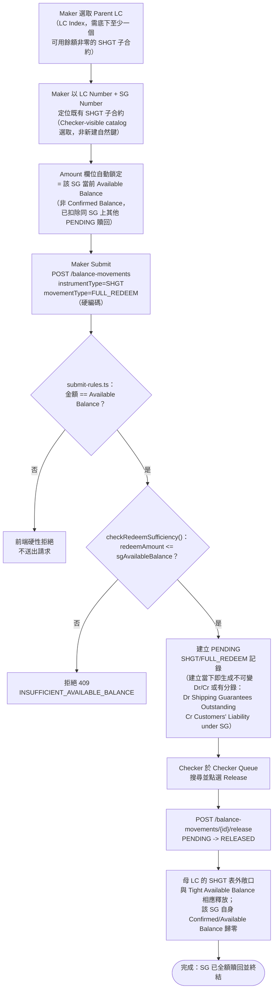

# A9 — 提貨擔保贖回（Shipping Guarantee Redemption，僅限全額 Full Redeem）

本筆記是 Balance Component 具名業務功能 **A9** 在整個 Obsidian 知識庫中的主要入口，彙整其定義、真實 API 端點、端到端流程與已核實的相關業務規則。

## 功能摘要

| 項目 | 內容 |
|---|---|
| 功能代碼 | A9 |
| 功能說明（原始 label） | `Shipping Gtee (Redemption)`（提貨擔保贖回） |
| instrumentType | `SHGT` |
| movementType | `FULL_REDEEM`——A9 **無** subChoice 選項，僅此單一 movementType；不支援 Partial Redeem（BA 於 2026-08-21 確認，見下方 Business Decision） |
| 所屬方向 | Import（進口） |
| 所屬母層功能 | A8（Shipping Gtee Issue）——A9 贖回的正是由 A8 建立的 SHGT 子合約本身。技術上 `defaultParentInstrumentType: IPLC_LC`，即 Maker 先透過 Parent LC 選取器（LC Index）選定母層 `IPLC_LC`，再於該 LC 之下以 LC Number + SG Number 兩段鍵定位既有 SHGT 子合約（既有子合約，並非新建自然鍵）——非新建新自然鍵，而是透過既有的 Checker-visible catalog 選取 |

以上定義已用 Read 工具核實於 `/home/claude/balance-kb/repo/src/app/transaction-builder/balance-component.model.ts`（`IMPORT_FUNCTIONS` 陣列，`code === 'A9'` 項，第 382–390 行）。`balance-component-channel-api.yaml` 的 `GET /channel/functions` A9 條目（第 917–925 行）與之一致，並確認 `hasParent: true`、`currencyMode: CARRIED`、`submitsTransaction: true`、`secondaryRefLabel` 為 null（SG Number 本身即為自然鍵，非另一個二級參照欄位——第 617 行）。CONFIRMED。

### API 端點

依步驟4 對 `analysis/balance-component-api.yaml` 與 `analysis/balance-component-channel-api.yaml` 的實際查證，A9 並非擁有專屬路徑的端點，而是透過通用端點以 request body 的 instrumentType/movementType（或 functionCode）驅動行為：

- **微服務層（權威）**：`POST /balance-movements`（`balance-component-api.yaml:730`）——body 帶 `instrumentType: SHGT`、`movementType: FULL_REDEEM`、`balanceContractId`（既有 SHGT 子合約，非新建自然鍵）、`amount`（等同該 SG 當前 Available Balance）等，建立 PENDING 的贖回記錄。
- **Checker 放行**：`POST /balance-movements/{movementId}/release`（`balance-component-api.yaml:900`）——單段、非複合放行（A9 不像 A6/A3S 有 businessEventId 配對的第二段 leg）。
- **Reject／Maker EC**：`POST /balance-movements/{movementId}/reject`、`POST /balance-movements/{movementId}/cancel`。
- **Channel API 門面層**：`POST /channel/transactions`（`balance-component-channel-api.yaml:292`），body 帶 `functionCode: A9`，由該端點依 `GET /channel/functions` 的 A9 定義（第 917–925 行）推導出真正的 instrumentType/movementType 並轉呼叫微服務層；對應的 Checker 放行為 `POST /channel/transactions/{transactionId}/release`（同檔案第 404 行）。

CONFLICT（詳見交叉引用 [[MOVEMENT-RULE-056]]）：`balance-component-channel-api.yaml` 第 925 行自身對 A9 的 `compoundLegs` 描述文字仍寫著「`FULL_REDEEM | PARTIAL_REDEEM (server-derived from amount vs. Available Balance)`」，是 2026-08-21 BA 將 A9 鎖定為僅限全額贖回之前的舊文字，尚未同步更新；Angular 參考前端本身已透過 `submit-rules.ts`（見下方 Validation）硬性鎖定為僅 FULL_REDEEM。微服務／`shgtRedeem.ts` 自身的 `checkRedeemSufficiency()` 對此無感知，任何直接呼叫 API 的用戶端仍可提交真正的 PARTIAL_REDEEM——此為已披露、尚未收口的範疇局限，非本筆記編造。

> [!info] 2026-08-26 更新
> 上一句「微服務／`shgtRedeem.ts` 自身的 `checkRedeemSufficiency()` 對此無感知，任何直接呼叫 API 的用戶端仍可提交真正的 PARTIAL_REDEEM——此為已披露、尚未收口的範疇局限」描述的是 2026-08-21/22 快照時點的狀態，現已過時。業務已於 2026-08-24 確認：`balanceService.ts` 的 `buildMovementTypeRegistry()` 現在會在呼叫 `checkRedeemSufficiency()` 之前，先判斷該筆請求是否為 SHGT 的 `PARTIAL_REDEEM` 且未帶 `businessEventId`——若是，Maker Submit 階段即以 409 `INSUFFICIENT_AVAILABLE_BALANCE` 拒絕；`release()` 亦鏡像同一判斷，作為 Checker 側的縱深防禦。區分依據是 `businessEventId`，而非 movementType 字串本身：A3S 自身配對到具體 Document Arrival 的 PARTIAL_REDEEM leg（帶 `businessEventId`）不受影響，即使其金額剛好等於該 SG 的全部未償餘額。`balance-component-channel-api.yaml` 第 925 行自身的舊文字仍未同步更新，這一半 CONFLICT 依然成立；但「後端 API 對直接呼叫方仍開放」這一半已不成立。詳見 [[MOVEMENT-RULE-020]]、[[MOVEMENT-RULE-056]] 各自的「2026-08-26 更新」章節（`balanceService.ts:305-326`、`:1907-1913`，`app.test.ts:726-846` 直接核實）。

UNCLEAR：兩份規範中未見到 A9 專屬（named）路徑，僅有以上通用端點依 body 欄位分派；未發現與此相左的證據，故按規範原文如實記錄。

## 端到端流程（Trigger → Output → Error/Exception）

- **Trigger（觸發點）**：Maker 選取一張 Import `IPLC_LC`（其下至少存在一個即時 Available Balance ≠ 0 的 SHGT 子合約——[[EXPOSURE-RULE-014]]），再以 LC Number + SG Number 定位該 LC 下由 A8 建立、仍 ACTIVE 且尚有可用餘額的既有 SHGT 合約，發起 A9 贖回。CONFIRMED（`balance-component.model.ts` A9 條目 help 文字：「Search by LC Number + SG Number... a single LC can have multiple Shipping Guarantees」）。

- **Input（輸入）**：Parent LC（LC Index）＋ 該 LC 下既有的 SHGT 子合約（經 Checker-visible catalog 選取，而非新輸入自然鍵）。**Amount 完全不可鍵入**——由該 SG 當前的 Available Balance 自動帶入並鎖定（disabled），而非 Confirmed Balance，因為 Available 會先扣除同一 SG 上任何仍處於 PENDING 狀態的其他贖回，避免對已預留額度重複計算（[[MOVEMENT-RULE-020]]）。CONFIRMED。

- **Validation（校驗）**：
  1. Parent LC 選取器的資格提示：僅當該 LC 至少存在一個即時可用餘額非零的 SHGT 子合約時才標記為具備資格（`parentSgEligible` Set，[[EXPOSURE-RULE-014]]）。CONFIRMED。
  2. 前端 `submit-rules.ts` 的 REDEEM 分支（縱深防禦）：任何與該 SG 當前 Available Balance 不完全一致的金額一律硬性拒絕，movementType 被硬編碼為 `FULL_REDEEM`，絕不會靜默降級為 `PARTIAL_REDEEM`（[[MOVEMENT-RULE-020]]）。CONFIRMED。
  3. 伺服端充足性檢查 `checkRedeemSufficiency()`：`redeemAmount <= sgAvailableBalance`（純函數，SHGT 的 PARTIAL_REDEEM/FULL_REDEEM 與 Acceptance 的 PARTIAL_SETTLE/FULL_SETTLE 共用同一實作）。該函式本身**不區分**呼叫者是 A9 還是任何其他直接 API 呼叫方，也沒有 businessEventId 配對檢查（`checkredeemsufficiency`）。CONFIRMED。
  4. 伺服端通用「Amount 必須 > 0」把關（`assertValidAmount()`），Submit 與 Release 兩處皆會檢查（MOVEMENT-RULE-020 之外的通用規則，CLAUDE.md 決策日誌）。CONFIRMED。
  5. UNCLEAR：SHGT 子合約自身的 ISSUE（A8）是否需先被 Release 才能對其發起 A9——`assertRootIssueReleased()` 的既有文字僅明確涵蓋「root contract 或新建 child contract」，SHGT 本身屬既有 child 而非 root，本次未在 `balanceService.ts` 中找到明確涵蓋 A9 此情境的直接證據，故標註 UNCLEAR 而非臆測。

- **Classification（分類）**：instrumentType=`SHGT`、movementType=`FULL_REDEEM`；`MOVEMENT_DIRECTION['FULL_REDEEM'] = -1`（減少形態）（`domain/balanceDerivation.ts`）。exposureNature 前端未顯式指定，伺服端預設帶入 `CONTINGENT`（`balanceService.ts:1062`，僅 EPLC_ACCEPTANCE/CREATE 才顯式覆寫為 ACTUAL）。CONFIRMED。

- **Business Decision（業務決策）**：經業務方確認（TF_Balance_Component_Mapping 規則 #1：「SG 的解除是以票據／金融工具本身為單位，而非以金額為單位」——承運人僅憑正本提單/空運提單繳回才解除保函責任），A9 於 2026-08-21 被鎖定為僅支援全額贖回：Amount 欄位停用、來源為該 SG 的 Available Balance、movementType 硬編碼 `FULL_REDEEM`（[[MOVEMENT-RULE-020]]、[[MOVEMENT-RULE-054]]）。A3S（單據到單＋SG，複合式 Maker 提交）是這條規則唯一經 BA 確認的合法例外——其贖回金額真正與一組具體、可識別的到達單據綁定（MIN(單據/汇票金額, SG Outstanding)），透過共享 businessEventId 與配對的 IPLC_LC UTILIZE 一同放行或一同回滾，而非 Maker 隨意輸入的數字（[[MOVEMENT-RULE-021]]、[[MOVEMENT-RULE-037]]）。CONFIRMED。

- **Balance/Exposure Decision（表內 vs 表外）**：SHGT 屬於表外或有負債（off-balance-sheet contingent liability），A9 的 FULL_REDEEM 會產生一組真實的 Dr/Cr 或有分錄（並非如 Acceptance 的影子備忘、亦非如 B3 的 MEMO_ONLY）：因 `MOVEMENT_DIRECTION['FULL_REDEEM']=-1`，過帳為 **Dr「Shipping Guarantees Outstanding」／Cr「Customers' Liability under Shipping Guarantees」**（`contingentAccountEntry.ts` SG_FAMILY，`tenorSuffix: NONE`——與母 LC 自身的 tenor 無關，恰與 A8 ISSUE 時 Dr/Cr 互為鏡像反轉）。此外，A9 的贖回也會被計入母 LC 的 SHGT 表外風險敞口公式：僅當贖回**真正 RELEASED** 時才從敞口中扣除（"增加從嚴"），除非該筆贖回與同一 LC 上仍 PENDING 的 UTILIZE 共享同一 businessEventId（僅 A3S 情境的例外——[[EXPOSURE-RULE-001]]）——一筆獨立、僅 Maker Submit 尚未 Checker 核准的 A9 贖回，不會提前釋放額度給另一筆無關交易使用。CONFIRMED。

- **Tolerance 決策**：不適用。宽容度（Tolerance）換算僅適用於 `IPLC_LC`／`EPLC_LC`／`EPLC_CONFIRMATION` 的 ISSUE/AMEND*，SHGT 一律不在宽容度換算範圍內，且雙重門控（instrumentType 且 movementType 皆須匹配）本身即是為了防止 SHGT 自身的 ISSUE 被誤判為 LC 的 ISSUE 而設計（[[TOLERANCE-RULE-004]]）。CONFIRMED。

- **Movement Posting Generation（過帳分錄）**：單段、非複合提交——`POST /balance-movements` 一次即建立 PENDING 的 `SHGT/FULL_REDEEM` 記錄，並在建立當下（而非 Release 當下）產生上述不可變的 Dr/Cr 或有分錄配對（一次生成、永久持久化，View Voucher 對話框從不重新計算）。Checker Release 後狀態轉為 RELEASED，母 LC 的 SHGT 表外敞口／`tightAvailableBalance` 才真正扣減。CONFIRMED。

- **Output（輸出）**：新建一筆 `SHGT`／`FULL_REDEEM` 記錄（初始 PENDING，金額等同 Release 前一刻該 SG 的 Available Balance）；Checker Release 後該 SG 自身的 Confirmed/Available Balance 歸零（因是全額贖回），母 LC 的 SHGT 表外敞口與 Tight Available Balance 相應釋放。

- **Error/Exception（錯誤/例外）**：
  - 鍵入金額與該 SG 當前 Available Balance 不完全一致 → 前端 `submit-rules.ts` 硬性拒絕，不送出請求（[[MOVEMENT-RULE-020]]）。
  - Available Balance 不足（理論上不會發生，因金額已鎖定為 Available Balance 本身；僅在極端競態下，例如兩個瀏覽器分頁對同一 SG 幾乎同時操作）→ 409 `INSUFFICIENT_AVAILABLE_BALANCE`（`checkRedeemSufficiency()` 通用規則，非 A9 專屬）。
  - Amount ≤ 0 → 409（`assertValidAmount()`，Submit 與 Release 兩處皆檢查，通用規則）。
  - 同一 `(balanceContractId, eventSeq)` 重複提交 → 200，返回既有記錄（冪等，通用規則）。
  - 直接繞過 Angular UI、以 API 呼叫方提交非全額的 `PARTIAL_REDEEM`（不帶 `businessEventId`）→ **2026-08-26 更新：此列原文已過時**——服務端已於 2026-08-24 收口，現會在 Maker Submit 階段以 409 `INSUFFICIENT_AVAILABLE_BALANCE` 拒絕（`balanceService.ts` 的 `outstandingCapped` 分支，`buildMovementTypeRegistry()`），`release()` 亦鏡像同一檢查作為 Checker 側的再確認（`IllegalStateTransitionError`）。帶 `businessEventId` 的 A3S 匹配式 PARTIAL_REDEEM 不受影響，仍可正常提交與放行。原始的「UI 層 vs API 層範疇差異」說法對應的是 2026-08-21/22 快照時點，詳見 [[MOVEMENT-RULE-020]]、[[MOVEMENT-RULE-056]] 的「2026-08-26 更新」章節（`microservices/balance-component/src/service/balanceService.ts:305-326,1907-1913`；`microservices/balance-component/test/unit/app.test.ts:726-846` 直接核實）。

## 流程圖

## 交叉引用（Related Knowledge）

支援技術細節筆記（英文，事實依據來源，尚待其他批次翻譯，僅連結不修改）：
- [[sg-redemption-amount-min-bill-amount-sg-outstanding]]

相關業務規則：
- [[MOVEMENT-RULE-020]] — A9 SG 贖回僅限 Full Redeem，Amount 硬鎖定為該 SG 當前的 Available Balance
- [[MOVEMENT-RULE-021]] — A3S 的單據匹配式 SG 贖回是 A9 僅限全額贖回規則的唯一合法例外
- [[MOVEMENT-RULE-037]] — SG 贖回金額（A3S 情境）= MIN(單據/汇票金額, SG Outstanding)
- [[MOVEMENT-RULE-054]] — （TF Mapping 規則#1）SG 解除以票據為單位，而非以金額為單位——A9 全額贖回鎖定的源文檔依據
- [[MOVEMENT-RULE-056]] — CONFLICT：ledger.html／channel API 規範文字仍描述 A9 支援 MIN() 部分贖回，與後續 A9 全額贖回鎖定決策之間的文檔時效性衝突
- [[EXPOSURE-RULE-001]] — SHGT 表外風險敞口公式（含「增加從嚴」的贖回淨額規則，及 A3S businessEventId 配對例外）
- [[EXPOSURE-RULE-014]] — A3S/A9 自身在 LC 層級的 SG 餘額資格提示
- [[EXPOSURE-RULE-015]] — A3S 已匹配 SG 贖回的建立順序（先 SG 贖回後 Document Arrival UTILIZE）——與 A9 獨立贖回情境對比參照
- [[TOLERANCE-RULE-004]] — 雙重門控（instrumentType 且 movementType）防止 SHGT 被誤判為 LC 的宽容度換算對象
- [[checkredeemsufficiency]] — `checkRedeemSufficiency()` 純函數，SHGT/Acceptance 共用的充足性檢查

- [[Balance Component Overview]]
