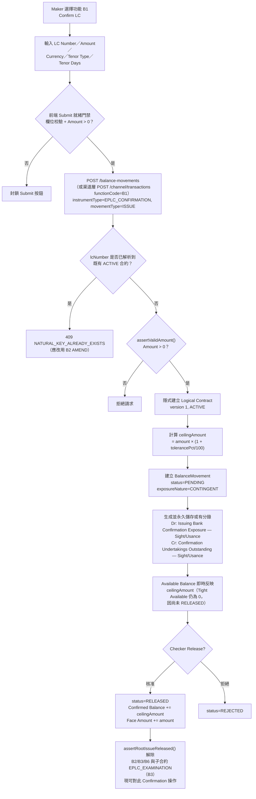

# B1 — 出口信用狀保兌（Confirm LC）

## 功能摘要

| 項目 | 內容 |
|---|---|
| 功能代碼 | B1 |
| 功能說明（label） | Confirm LC（`balance-component.model.ts` 中 `code: 'B1'` 項目的真實 label，經核實） |
| instrumentType | `EPLC_CONFIRMATION` |
| movementType | `ISSUE` |
| subChoice | 無——B1 沒有 `subChoice` 欄位，movementType 固定為 `ISSUE` |
| 所屬方向 | 出口 Export（`side: 'EXPORT'`） |
| 所屬母層功能 | 無——B1 本身即為根層功能（建立全新 `EPLC_CONFIRMATION` Logical Contract） |
| tenorTypeOptions | `EXPORT_TENOR_OPTIONS`（Sight／Usance 兩種，選項值分別為 `SIGHT`／`SELLERS_USANCE`，但顯示標籤僅為「Sight」／「Usance」）——這是保兌行自身對受益人的獨立承諾自身聲明的付款期限，僅代表保兌行自己視角下的期限，並非開狀行原始 LC 的 Buyer's／Seller's Usance 區分（保兌行對此無從得知） |
| 代碼內建說明（help text，逐字核實） | "Adds this bank's own confirmation — an independent undertaking to the beneficiary, obligor = issuing bank (rationale §7.1). Plain advising (no confirmation) and Unconfirmed negotiation (EBL) are out of Balance Component scope — see the module note above. Tenor Type is the LC's own stated payment term, declared at confirmation (Design doc §7) — Sight or Usance only from the confirming bank's own perspective (Seller's/Buyer's Usance is an Import-side financing-structure distinction the confirming bank has no visibility into)." |

**API 端點**（真實查證，來自 `analysis/balance-component-api.yaml` 與 `analysis/balance-component-channel-api.yaml`）：

- **微服務層（Microservice API，`balance-component-api.yaml`）**：`POST /balance-movements`——通用端點，由 request body 的 `instrumentType: 'EPLC_CONFIRMATION'` + `movementType: 'ISSUE'` 決定行為；`naturalKey.lcNumber` 尚未解析到任何 ACTIVE 合約時，此呼叫會**隱式建立**新的 Logical Contract（version 1, ACTIVE），並產生一筆 PENDING `BalanceMovement`。Checker 核准經 `POST /balance-movements/{movementId}/release`；拒絕經 `POST /balance-movements/{movementId}/reject`；Maker 自行撤回（EC）經 `POST /balance-movements/{movementId}/cancel`。
- **渠道層（Channel/façade API，`balance-component-channel-api.yaml`）**：`POST /channel/transactions`——以 `functionCode: 'B1'` 驅動，請求 body 為 `ChannelOriginTransactionRequest` 形狀（`functionCode` enum 僅含 `[A1, B1]`：這是唯二 Currency Code 為必填使用者輸入欄位的功能；其餘功能一律不接受此欄位、由伺服器端推導）。

## Trigger（觸發點）

Maker 在 Transaction Builder（`transaction-builder/`）選擇功能 B1，代表出口保兌行要對一組出口 LC 編號（自然鍵 `lcNumber`）加註自身的獨立保兌承諾——CONFIRMED（`balance-component.model.ts` `EXPORT_FUNCTIONS` 陣列，`code: 'B1'`）。

## Input（輸入）

- LC Number（自然鍵，`naturalKey.lcNumber`）
- Amount（面額，Maker 鍵入的原始金額，非 ceilingAmount）
- Currency Code（**A1/B1 專屬**——唯一由使用者直接輸入、且成為該合約永久幣別的功能；其餘功能一律 CARRIED，由既有合約/母合約推導，不接受此欄位）——CONFIRMED（[[MAKER-CHECKER-RULE-049]]）
- Tenor Type（Sight／Usance，來自 `EXPORT_TENOR_OPTIONS`；儲存值為 `SIGHT`／`SELLERS_USANCE`，但無獨立 `USANCE` 列舉值，顯示標籤統一收斂為「Usance」）
- Tenor Days（依 Tenor Type 而定）
- tolerancePct（容差百分比，選填）
- Event Seq、Created By（系統欄位，唯讀）

## Validation（校驗）

- **前端 Submit 就緒門禁**：B1 不需要「已選定合格目標」（因為是建立全新合約），但仍需通過欄位有效性校驗與通用 Amount > 0 檢查——CONFIRMED（[[MAKER-CHECKER-RULE-027]]）。
- **Tenor Days 正規化兜底存在 CONFLICT**：`validateSubmit()`（`submit-rules.ts:100`）在提交時強制正規化 Tenor Days（Sight 歸零、Usance 須大於 0），但此判斷式僅檢查 `selectedFunction.code === 'A1'`；而即時 Formly 表達式（`builder-fields.ts:139`）同時檢查 `'A1' || 'B1'`。因此 B1 在畫面上仍會被要求填寫 Tenor Days，但 `validateSubmit()` 自身的守衛鏈從未對 B1 執行此項兜底正規化——兩處程式碼路徑就適用範圍互相矛盾，且無直接證據可判定何者才是業務確認的既定行為——CONFLICT（[[MAKER-CHECKER-RULE-024]]）。
- **伺服器端金額校驗**：`assertValidAmount()` 在 `createMovement()`（於 `resolveOrCreateContract()` 之前）與 `release()` 兩處都會執行，B1 的 ISSUE 要求金額嚴格 > 0——CONFIRMED（[[MOVEMENT-RULE-011]]）。
- **重複 ISSUE 防護（Re-ISSUE Guard）**：若 `lcNumber` 已解析到一份 ACTIVE 的 `EPLC_CONFIRMATION` 合約，再次對其執行 B1 ISSUE 會被拒絕，回傳 `409 NATURAL_KEY_ALREADY_EXISTS`，既有合約的 Confirmed Balance 不受影響；正確途徑是改用 B2 的 AMEND——CONFIRMED（[[MAKER-CHECKER-RULE-008]]、[[MOVEMENT-RULE-009]]）。此防護僅在應用層（`createMovement()`）實現，非資料庫 UNIQUE 約束強制。
- **渠道層 Currency Code schema 校驗**：非 A1/B1 的 `functionCode` 若帶入 `currency` 欄位會被 Channel API 的 OAS schema 拒絕（400）；此為規格層要求，微服務本身尚未強制執行——CONFIRMED（[[MAKER-CHECKER-RULE-049]]）。
- **Expiry Date 強制必填（2026-08-26 新增）**：B1 對根層 `EPLC_CONFIRMATION` 的 ISSUE，`expiryDate` 由原本選填改為強制必填，三層防線一致（Angular 表單 `required` 綁定／Submit 兜底守衛／服務端 `assertExpiryDateRequired()`，於 `resolveOrCreateContract()` 建立合約之前執行）——CONFIRMED（[[MOVEMENT-RULE-075]]）。動機是 AUTO EXPIRY 批次掃描只挑選 `expiry_date IS NOT NULL` 的合約，缺此欄位的 ISSUE 將永遠無法被自動到期處理。
- **Expiry Date 必須為真實本國營業日（2026-08-26 新增）**：在必填之上，`expiryDate` 進一步要求不得是週六/週日或本國（台灣）公眾假期，檢查順序為先週末、後假日（`domesticCalendar.ts`）——CONFIRMED（[[MOVEMENT-RULE-076]]）。2026-2028 範圍外的年份被刻意視為「未知」而非拒絕（週末檢查仍生效，僅假日檢查查無資料），與兄弟服務 `business-days-mock` 自身的 fail-closed 姿態相反，屬已記錄的刻意設計差異。Checker `release()` 對已持久化的 `contract.expiryDate` 做同一邏輯復檢，但此復檢僅在該值本身非空時才觸發——見 [[MOVEMENT-RULE-075]] 對此非對稱之處的完整說明。

## Classification（分類）

B1 屬於「創設型」（creating）movementType（`ISSUE`），在 `functionActionIcon()` 的 5 組分類中歸入 `issue` 群組（與 A1/A6/A8 同組，區別於 `amend`/`utilize`/`redeem`/`cross`）——CONFIRMED（[[MOVEMENT-RULE-018]]）。`resolveFunctionForMovement()`（供 Inquire Events／Look Up 使用）將 `EPLC_CONFIRMATION` 的 `ISSUE` 解析為 B1，`AMEND` 解析為 B2，`CLOSE` 解析為 B6，僅 `HONOUR`/`ACCEPT` 解析為 B4——CONFIRMED（[[MOVEMENT-RULE-024]]）。

## Business Decision（業務決策）

- B1 建立的是**根層合約**（root instrumentType，`EPLC_CONFIRMATION`，與 `IPLC_LC`/`EPLC_LC` 同屬 `ROOT_INSTRUMENT_TYPES`）。在其自身的 ISSUE 尚未被 Checker Release 之前，該合約雖已是 `ACTIVE` 狀態（Maker Submit 時即設定），但任何其他 movementType（包含子合約如 `EPLC_EXAMINATION`（B3）的建立）都會被 `assertRootIssueReleased()` 以 `409 IllegalStateTransitionError` 拒絕，提示「Release the Issue first.」——CONFIRMED（[[STATUS-RULE-008]]）。
- 同一守衛也反映在 Maker 端選取器上：`requireIssueReleased` 目錄過濾會將自身 ISSUE 仍為 PENDING 的自然鍵排除在所有 Maker 操作類選取器之外，直到其 ISSUE 經 Checker 放行——CONFIRMED（[[MAKER-CHECKER-RULE-006]]）。
- **業務範疇邊界**：Export Confirmed side **只**建模 Confirmed Export LC——依業務分析師確認，「Export B1–B6 的全部流程均屬於 Confirmation 處理；EBL（提前融資）不在 Balance Component 的範疇內」，且 EBL 在 Business Case Registry 中僅表現為 note 型步驟，從不呼叫 Balance Component 的 API——CONFIRMED（[[EXPOSURE-RULE-017]]）。相對地，若 LC 未經保兌（無 B1 記錄），其 Acceptance 僅屬 `MEMO` 敞口，不產生任何 `accountEntries`——CONFIRMED（[[EXPOSURE-RULE-016]]），凸顯 B1 保兌本身才是使該 LC 產生 Export Bank 自身真實負債（`CONTINGENT`／後續轉為 `ACTUAL`）的關鍵事件。

## Balance/Exposure Decision（表內 vs 表外）

- B1 屬於 Balance Component 範疇內的**表外／或有風險敞口**（Off-Balance-Sheet Contingent Exposure）處理，`exposureNature` 採預設值 `CONTINGENT`（`req.exposureNature ?? 'CONTINGENT'`），不涉及表內分錄——CONFIRMED（`microservices/balance-component/src/service/balanceService.ts:1062`，直接核實）。
- **或有分錄科目族**：`deriveContingentAccountEntry()` 依 `instrumentType` 查找科目族，`EPLC_CONFIRMATION` → `CONFIRMATION_FAMILY`（Ledger Folio 4），並按 tenor 加後綴（Sight／Usance，二分法，非 LC_FAMILY 的三分法）。B1 ISSUE（方向 +1，建立）過帳：借方（Dr）「Issuing Bank Confirmation Exposure — Sight/Usance」，貸方（Cr）「Confirmation Undertakings Outstanding — Sight/Usance」——CONFIRMED（[[EXPOSURE-RULE-007]]，並直接核實 `contingentAccountEntry.ts:64-68,109-111`）。
- **方向與正負號**：`netDirection` 通常等於 `MOVEMENT_DIRECTION['ISSUE']`（+1，建立敞口）；B1 本身金額恆為正，不涉及 `EPLC_CONFIRMATION` 唯一的 AMEND（B2）才有的正負號折疊邏輯——CONFIRMED（[[EXPOSURE-RULE-009]]、[[MOVEMENT-RULE-001]]）。
- **Face Amount**：僅追蹤 RELEASED 狀態的 ISSUE/AMEND_INCREASE/AMEND_DECREASE/AMEND 的原始 `amount`（非 ceilingAmount）——B1 一旦 Release，即計入 Face Amount，亦計入 LC Master Records Index 的 `deriveLcAmount()` 展示值——CONFIRMED（[[BALANCE-RULE-005]]、[[BALANCE-RULE-014]]）。

## Tolerance 決策（若適用）

B1（`EPLC_CONFIRMATION`/`ISSUE`）**適用**容差換算：

- Instrument-Type 門控：`EPLC_CONFIRMATION` ∈ {IPLC_LC, EPLC_LC, EPLC_CONFIRMATION}——通過——CONFIRMED（[[TOLERANCE-RULE-002]]）。
- Movement-Type 門控：`ISSUE` ∈ {ISSUE, AMEND_INCREASE, AMEND_DECREASE, AMEND}——通過——CONFIRMED（[[TOLERANCE-RULE-003]]）。
- **Ceiling Amount 公式**：`ceilingAmount = faceAmount × (1 + tolerancePct/100)`——CONFIRMED（[[TOLERANCE-RULE-001]]，該規則範例雖以 `IPLC_LC` 示範，但公式與雙門控適用於任一通過門控之 instrumentType，含 `EPLC_CONFIRMATION`）。
- **一筆剛 Submit、仍 PENDING 的 B1 ISSUE 在自身獲 Checker 核准前完全無法被動用**（`tightAvailableBalance` 由 `confirmedBalance` 推導，PENDING 的 ISSUE 不會提升該值——「增加從嚴」）——CONFIRMED（[[TOLERANCE-RULE-008]]）。

## Movement Posting Generation（過帳分錄）

- Submit（Maker）：建立一筆 `status='PENDING'` 的 `BalanceMovement`，`ceilingAmount` 依上方容差公式計算；若 `naturalKey.lcNumber` 尚未解析到 ACTIVE 合約，同一次呼叫隱式建立 Logical Contract（version 1, ACTIVE）——CONFIRMED（`balance-component-api.yaml` `POST /balance-movements` 端點描述）。同時依 [[EXPOSURE-RULE-007]] 產生一組不可變的 Dr/Cr 或有分錄（Confirmation 科目族），於建立時一次生成並永久儲存，之後即便重新查詢也不重新計算。
- 可用餘額（Available Balance）在 Submit（PENDING）階段即完整反映此筆變動的全部影響；後續 Release 只是把同一總額在 PENDING／Confirmed 間搬移，數值本身不變——CONFIRMED（[[BALANCE-RULE-002]]）。
- Release（Checker）：`POST /balance-movements/{movementId}/release`——狀態轉為 `RELEASED`，Confirmed Balance 隨之增加，Face Amount 也開始計入此筆金額，`assertRootIssueReleased()` 隨即解除，後續 B2-B6 與子合約 B3（`EPLC_EXAMINATION`）方可對此 Confirmation 操作。
- 冪等性：Submit 端點在 `(balanceContractId, eventSeq)` 上冪等——重複提交同一組合會回傳既有記錄，不會重複計數或報錯。

## Output（輸出）

- 新建的 `BalanceContract`（`EPLC_CONFIRMATION`，`ACTIVE`）與其首筆 `BalanceMovement`（`ISSUE`，初始 `PENDING`，Checker 核准後轉 `RELEASED`），及其一組永久保存的或有 Dr/Cr 分錄。
- Look Up Current Balance／Inquire Events 可查詢到此出口 LC 的餘額快照與事件時間軸；B1 本身無 Step-2 次要選取器（建立全新 Confirmation，非對既有目標操作）。
- B1（與 A1 同理）僅在 Submit 或 Release 成功時才更新 Look Up Current Balance 對應該筆 LC Number 的查詢結果，與其他功能「一選取 LC 即自動查詢」的行為不同，因為 B1 尚無既有 LC 可供選取。

## Error/Exception（錯誤/例外）

| 情境 | 回應 |
|---|---|
| `lcNumber` 已解析到既有 ACTIVE 的 `EPLC_CONFIRMATION` 合約，仍提交 B1 ISSUE | `409 NATURAL_KEY_ALREADY_EXISTS`——CONFIRMED（[[MAKER-CHECKER-RULE-008]]、[[MOVEMENT-RULE-009]]） |
| Amount ≤ 0 | 伺服器端 `assertValidAmount()` 於 Submit／Release 兩處均拒絕——CONFIRMED（[[MOVEMENT-RULE-011]]） |
| `sourceTransactionRef` 於同一 `balanceContractId` 下重複使用（非相同 eventSeq 的重試） | `400 sourceTransactionRef already used`——CONFIRMED（OAS 端點描述） |
| 貨幣精度不符該幣別小數位規則 | 請求層拒絕（`CURRENCY_MINOR_UNITS`／`amountExceedsCurrencyDecimals()`）——CONFIRMED（一般性規則，非 B1 專屬） |
| （渠道層）非 A1/B1 的 functionCode 帶入 `currency` 欄位——用以對照理解 B1 本身「Currency Code 為何是例外」 | `400 REQUEST_VALIDATION_FAILED`（規格層要求，微服務未強制）——CONFIRMED（[[MAKER-CHECKER-RULE-049]]） |
| B1 是否有等效於 A1 的 Tenor Days Submit 時兜底正規化 | UNCLEAR／CONFLICT——`submit-rules.ts:100` 僅檢查 `'A1'`，`builder-fields.ts:139` 同時檢查 `'A1' \|\| 'B1'`，兩處程式碼路徑矛盾——CONFLICT（[[MAKER-CHECKER-RULE-024]]） |

## Mermaid Flowchart

## 交叉引用（Related Knowledge）

- [[Balance Component Overview]]
- [[MAKER-CHECKER-RULE-008]] — 重複 ISSUE 防護（409 NATURAL_KEY_ALREADY_EXISTS）
- [[MOVEMENT-RULE-009]] — Re-ISSUE 防護（naturalKey 路徑）
- [[MAKER-CHECKER-RULE-024]] — B1 Tenor Days Sight/Usance 正規化兜底缺失（與 A1 不一致，CONFLICT）
- [[MAKER-CHECKER-RULE-049]] — 渠道 API 僅 A1/B1 允許輸入 Currency Code
- [[MAKER-CHECKER-RULE-006]] — requireIssueReleased 目錄過濾（下游功能需等待 B1 Release）
- [[MAKER-CHECKER-RULE-027]] — A1/B1 額外要求 Amount 大於 0
- [[STATUS-RULE-008]] — 根合約自身 ISSUE 必須先 RELEASED（assertRootIssueReleased）
- [[MOVEMENT-RULE-018]] — 功能圖示分組（B1 屬 issue 群組）
- [[MOVEMENT-RULE-024]] — EPLC_CONFIRMATION 的 ISSUE 解析為 B1
- [[BALANCE-RULE-002]] — 可用餘額公式
- [[BALANCE-RULE-005]] — Face Amount 僅追蹤 RELEASED 的 ISSUE/AMEND_INCREASE/AMEND_DECREASE
- [[BALANCE-RULE-014]] — LC Master Records Index 面值金額展示（含 EPLC_CONFIRMATION 的 ISSUE/AMEND 加總規則）
- [[EXPOSURE-RULE-007]] — 或有分錄科目族查找（CONFIRMATION_FAMILY，Folio 4，按 tenor 加後綴）
- [[EXPOSURE-RULE-009]] — 方向到 Dr/Cr 對應規則
- [[EXPOSURE-RULE-016]] — 未保兌 LC 的 Acceptance 屬 MEMO 敞口（對照凸顯 B1 保兌的意義）
- [[EXPOSURE-RULE-017]] — Export B1-B6 全屬 Confirmation 處理；EBL 不在範疇內
- [[MOVEMENT-RULE-001]] — MOVEMENT_DIRECTION 固定方向表
- [[MOVEMENT-RULE-011]] — assertValidAmount() 伺服器端金額 > 0 兜底
- [[TOLERANCE-RULE-001]] — Ceiling Amount 公式
- [[TOLERANCE-RULE-002]] — 容差換算 instrumentType 適用性門控
- [[TOLERANCE-RULE-003]] — 容差換算 movementType 適用性門控
- [[TOLERANCE-RULE-008]] — 從嚴可用餘額公式
- [[MOVEMENT-RULE-075]] — Expiry Date 於 A1/B1 ISSUE 由選填改為強制必填（2026-08-26 新增，三層防線）
- [[MOVEMENT-RULE-076]] — Expiry Date 必須為真實本國營業日（2026-08-26 新增，先查週末後查假日）
- [[Business-Rule-Index]]
