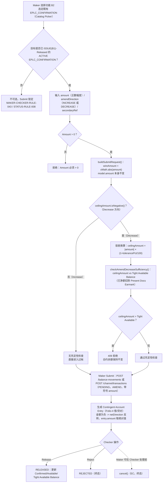

# B2 — 保兑信用证修改（Confirm LC Amendment）

## 功能摘要

- **功能代码**：B2
- **功能说明**：Confirm LC Amendment（保兑信用证修改）——调整既有 Export Confirmation 自身的 `confirmed_amount`；对应 UCP 600 第 10(b) 条"保兑行可以在不延伸自身保兑的情况下通知一笔修改"——因此 `confirmed_amount` 本可与 LC 自身的票面金额（face amount）真实分歧（`balance-component.model.ts` help 文本，第 436 行）。本功能只移动 Confirmation 自身的或有负债，不触碰 LC 本身。
- **instrumentType**：`EPLC_CONFIRMATION`
- **movementType**：固定字面量 `AMEND`（单一值，**没有**像 A2 那样独立拆分的 `AMEND_INCREASE`/`AMEND_DECREASE`）
- **subChoice（Direction）**：`key: 'amendDirection'`，`options: [{ INCREASE: 'Increase' }, { DECREASE: 'Decrease' }]`——与 movementType 是两个不同的写入目标；金额本身在 Formly 表单上始终保持正数，方向改由带符号的电文金额（wire amount）携带
- **secondaryRefLabel**：`"Amendment No./Times"`
- **所属方向**：出口 Export
- **所属母层功能**：[[B1-Confirm-LC|B1]]（B2 操作的是 B1 建立的既有 `EPLC_CONFIRMATION` 合约；`hasParent = false`——B2 自身直接 resolve/create `naturalKey` 对应的 `EPLC_CONFIRMATION` 合约，不像 A6/A8/B3 那样挂在一个 parent 合约之下）
- **API 端点**（真实查证结果，来自代码库 `analysis/` 下两份 OpenAPI 规范）：
  - **微服务层**（`balance-component-api.yaml`）：
    - `POST /balance-movements`（第 730 行起）——**通用端点**，创建一笔 PENDING 变动记录；B2 通过 request body 的 `instrumentType: 'EPLC_CONFIRMATION'` + `movementType: 'AMEND'` + 带符号的 `amount`（正数=Increase，负数=Decrease）决定行为，规范文件本身并无 B2 专属路径
    - `POST /balance-movements/{movementId}/release`（第 900 行）——Checker 放行
    - `POST /balance-movements/{movementId}/maker-submit`（第 999 行）——Maker Submit 二次确认（是否对 B2 生效未在本轮证据中确认，见下方 UNCLEAR）
    - `POST /balance-movements/{movementId}/reject`（第 1112 行）——Checker 驳回
    - `POST /balance-movements/{movementId}/cancel`（第 1155 行）——Maker EC/撤回
    - `GET /balance-movements/{movementId}/balance-as-of`（第 873 行）——事件快照查询
  - **Channel API（Web/Mobile 门面）**（`balance-component-channel-api.yaml`）：
    - `GET /channel/functions`（第 133 行）——返回 B2 的元数据（第 936-945 行）：`code: B2, label: "Confirm LC Amendment", side: EXPORT, instrumentType: EPLC_CONFIRMATION, movementType: AMEND, hasParent: false, currencyMode: CARRIED, secondaryRefLabel: "Amendment No./Times"`。**查证要点**：与 A2（第 853 行，`movementTypeChoice: { options: [AMEND_INCREASE, AMEND_DECREASE] }`）不同，B2 的 `GET /channel/functions` 条目中**没有** `movementTypeChoice` 字段——Channel API 层面 B2 没有独立的方向选择机制；`MonetaryAmount` schema（第 573-577 行，`pattern: '^-?\d{1,18}(\.\d{1,3})?$'`）本身即接受带负号的十进制字符串，与 B2"方向随 `amount` 自身正负号"的领域设计一致（CONFIRMED，见 [[MOVEMENT-RULE-026]]）
    - `POST /channel/transactions`（第 292 行）——Maker 提交，`ChannelDerivedTransactionRequest`（第 755-802 行）：`functionCode: B2`、`naturalKey`（B2 属于"非 hasParent 功能自行 resolve/create 自身 instrumentType"一类，第 775 行）、带符号 `amount`、`secondaryRef`、`eventSeq`、`createdBy`；`currency` 字段被 `additionalProperties:false` 拒绝（CARRIED，非 A1/B1 不可输入）
    - `POST /channel/transactions/{transactionId}/release` / `/reject` / `/cancel`（第 404、452、489 行）——Checker/Maker 操作的门面封装

## Trigger → Output 全流程

### Trigger（触发点）
Maker 在 Transaction Builder 中选择功能 B2，选定既有 `EPLC_CONFIRMATION` 合约（Catalog Picker，条件：ACTIVE 状态，且该 Confirmation 自身的 ISSUE（即 B1）已经过 Checker Release——`requireIssueReleased` 客户端默认为 true，[[MAKER-CHECKER-RULE-043]]；服务端有对等的 `assertRootIssueReleased` 硬性守卫，[[STATUS-RULE-008]]）。CONFIRMED，源自 `function-strategy.ts`/`catalog-picker.service.ts`/`balanceService.ts`。

### Input（输入）
- `naturalKey`（lcNumber，对应既有 Confirmation）
- `amount`（Maker 在 Formly 表单中始终输入**正数**幅度，必须 > 0）
- `amendDirection`（subChoice：`INCREASE` 或 `DECREASE`）
- `secondaryRef`（"Amendment No./Times"，自由文本次要参考号）
- `eventSeq`、`createdBy`（系统字段，只读）

Currency Code **不作为输入**——由既有 Confirmation 合约携带（`carriedCurrency`）。CONFIRMED，见 [[MAKER-CHECKER-RULE-049]]。

### Validation（校验）
- 通用 Amount > 0 门禁（客户端 `submit-rules.ts` + 服务端 `assertValidAmount()`，Submit 与 Release 两处都检查；`assertValidAmount()` 对 B2 的 `AMEND` 专门豁免了"必须为正"的符号检查，只拒绝恰好为零的金额——因为方向本身就要靠负号表达）。
- 提交时若缺少 `amendDirection` -> 失败（[[MOVEMENT-RULE-026]]）。
- 目标必须是已 ISSUE-Released 的 ACTIVE `EPLC_CONFIRMATION`（[[MAKER-CHECKER-RULE-043]]、[[STATUS-RULE-008]]）。
- Submit 就绪门禁：已选定合格目标 + 字段校验通过 + Amount>0（[[MAKER-CHECKER-RULE-027]]，明确提到"A2-A9/B2-B5 在真正可用的目标记录被挑选之前，会锁定自身的提交按钮与输入字段"）。CONFIRMED。

### Classification（分类）
B2 **没有**像 A2 那样独立拆分的 `AMEND_INCREASE`/`AMEND_DECREASE` movementType——`model.movementType` 永远固定为字符串 `'AMEND'`，方向完全由 `amendDirection` subChoice 决定，并在 `buildSubmitRequest()` 内部换算为带符号的电文金额（`wireAmount = ±Math.abs(model.amount)`）；`model.amount` 本身从不被修改，因此 Formly 输入框上始终显示 Maker 输入的正数（[[MOVEMENT-RULE-026]]）。领域层（`movementTypeRegistry`）按 `ctx.ceilingAmount.isNegative()` 二分处理，而非按一个独立的 movementType 分支（[[MOVEMENT-RULE-013]]）。

展示层用 `displayMovementType()`/`displayMovementAmount()` 反向重建 `AMEND_INCREASE`/`AMEND_DECREASE` 的读者可读区分（金额 ≥0 含恰好为 0 视为 INCREASE，<0 视为 DECREASE，展示金额一律取绝对值）——只影响列表/详情视图，不修改底层模型/电文数值本身（[[MOVEMENT-RULE-017]]）。`isAmendDecreaseDirection` getter 将 A2 真正的 `AMEND_DECREASE` movementType 与 B2 的『`AMEND` + `amendDirection==='DECREASE'`』组合统一归入同一个"减少"预警分类器（[[MOVEMENT-RULE-027]]）。

### Business Decision（业务决策）
- **Increase 分支**（`amendDirection='INCREASE'`，即金额为正或恰好为零）：`movementTypeRegistry` 中 `AMEND` 条目的 `checkSufficiency` 只有在 `ctx.ceilingAmount.isNegative()` 为真时才会调用 `checkDecreaseShapedSufficiency`——增加方向完全不运行任何充足性检查，直接进入过帐（[[MOVEMENT-RULE-013]]）。
- **Decrease 分支**（`amendDirection='DECREASE'`，即金额为负）：运行与 A2 `AMEND_DECREASE` 结构相同的 `checkAmendDecreaseSufficiency()` 纯函数，按幅度（`Math.abs`）比对——经容差换算后的 `ceilingAmount` 与 Tight Available Balance（净额已扣除 Present Docs Earmark 表外占用）（[[TOLERANCE-RULE-013]]）。此项检查为 2026-08 的一项业务修正后新增——此前 `NO_CHECK_MOVEMENT_TYPES` 曾无条件包含 `'AMEND'`，B2 的减少方向曾完全未被校验（CLAUDE.md 决策日志"B2's own AMEND Decrease direction gained a real sufficiency check"）。

### Balance/Exposure Decision（表内 vs 表外）
B2 影响的是 `EPLC_CONFIRMATION` 自身的 Confirmed/Available/Tight Available Balance（表内合约层面的保兑金额与其容差换算后的 ceiling），不直接产生新的表外风险敞口（B2 自身不创建/结清 Present Docs Earmark——那是 B3/B4 的范畴）；但 Decrease 方向的充足性检查必须把既有的 Present Docs Earmark（呈单占用额，Pending+Approved 净额，含 B4 对仍处于 PENDING 状态的 B3 记录的临时抵扣）扣除后才能核准，即"减少从严，不得侵蚀已被交单占用的表外风险敞口"，与 A2 对 SHGT 表外风险敞口的对称处理一致（[[TOLERANCE-RULE-013]]、[[BALANCE-RULE-010]]、[[EXPOSURE-RULE-005]]）。

### Tolerance 决策（若适用）
`ceilingAmount = amount × (1 + tolerancePct/100)`；容差换算的门禁明确覆盖 `instrumentType ∈ {IPLC_LC, EPLC_LC, EPLC_CONFIRMATION}` 且 `movementType ∈ {ISSUE, AMEND_INCREASE, AMEND_DECREASE, AMEND}`——B2 自身的固定 `AMEND` movementType 明确被列入换算范围（CONFIRMED，见 [[TOLERANCE-RULE-001]]）。`checkAmendDecreaseSufficiency()` 比对的是经容差换算后的 `ceilingAmount`，而非原始票面金额，基准是 Tight Available Balance 而非普通 Available Balance——这是 2026-08 的一项业务修正（CLAUDE.md 决策日志"A2/B2 Decrease now checked against Tight Available Balance"），使其与 A3/B3 的规则对齐（[[TOLERANCE-RULE-013]]）。客户端实时预警通过 `isAmendDecreaseDirection` getter 识别 B2 的 Decrease 方向，同步套用与 A3 UTILIZE 相同的 Tight-Available 预警层级——在该 getter 出现之前，B2 的 Decrease 方向根本不会显示任何客户端余额预警（[[MOVEMENT-RULE-027]]）。

### Movement Posting Generation（过帐分录）
- 方向到 Dr/Cr 的映射：`netDirection` 通常等于 `MOVEMENT_DIRECTION[movementType]`，唯一例外正是 B2 自身——当提交金额本身为负数时，基础方向会反转，因为 `EPLC_CONFIRMATION` 唯一的 `AMEND` movementType 没有独立的 Increase/Decrease 拆分，靠金额本身的正负号携带方向。分录中的 `amount` 字段永远以绝对值输出（[[EXPOSURE-RULE-009]]）。
- 借/贷科目对（Contingent Account Entry）：B2 使用单一固定的 `AMEND` movementType，携带一个带正负号的增减额；无论增加还是减少方向，都过帐至完全相同的 Folio-4 账户对（借=Issuing Bank Confirmation Exposure／贷=Confirmation Undertakings Outstanding，或反之），只是减少情形下借贷方互换——与 Folio-1 自身 A2 的处理方式一致（[[MOVEMENT-RULE-059]]）。一笔带负数金额的 B2 修改，所过帐的分录恰好是 B1 自身建立分录的镜像。

### Output（输出）
- `201`：新建 PENDING 变动记录（`POST /balance-movements` 或 `POST /channel/transactions`）
- `200`：同一 `(balanceContractId, eventSeq)` 重复提交，幂等返回原记录
- Checker Release 后：变动记录转为 RELEASED，Confirmation 的 Confirmed/Available/Tight Available Balance 相应更新（增加：立即计入 Confirmed；减少：同样立即计入，见下方"增加从严，占用从宽"备注）；Maker 亦可在 Checker 处理前调用 `cancel()`（EC）撤回，Checker 则调用 `reject()` 驳回——两者是不同的终态动作，各自有独立审计列（`cancelledBy`/`cancelledAt` 与 `releasedBy`/`releasedAt` 分列，CLAUDE.md 决策日志"Submit/EC/Approve 审计轨迹"）。
- 事件状态展示（Look Up/Inquire Events）：B2 属于"其他所有功能"分组，未 Released 时显示 PENDING，Released 后显示 APPROVED——不适用 A3/A3S/B3 专属的 EARMARKING/EARMARKED 展示（CLAUDE.md"REQUIREMENT — Event Status Display Mapping"表）。

### Error/Exception（错误/例外）
- `409`：Decrease 方向金额超出 Tight Available Balance 时，`checkAmendDecreaseSufficiency()` 硬性拒绝，绝不会被静默裁剪到允许的最大减少幅度——被拒绝后合约余额可验证保持不变（[[MOVEMENT-RULE-041]]）。
- **UNCLEAR/CONFLICT（已知业务缺口）**：B2 的 Decrease 方向在 Maker 提交后即刻入账/占用（经过正常 Maker/Checker 释放流程），并未实现 UCP 600 第 10(a)/(c) 条要求的受益人（及保兑行自身）同意门禁——设计文档层面有此要求，代码层面完全没有同意跟踪字段/门控/状态，属已披露缺口（[[MOVEMENT-RULE-061]]、[[STATUS-RULE-028]]）。
- **CONFLICT**：数据库设计文档要求修改类事件应创建新合约版本（`markSuperseded()`），但真实运行的 B2 `AMEND` 流程从未调用该机制——属于死代码；B2 实际上是对**现有、不变的合约版本**新增一笔变动记录，而非新建版本，条件明确包含"当前代码库中任何真实的 A2/B2 修改流程"（[[STATUS-RULE-014]]）。
- Checker Queue 范围限定为 B2 自身可能产生的变动记录（`movementTypeMatchesFunction()`），即便同一 Confirmation 上存在 B3/B4 的 PENDING 记录，B2 自身的复核队列也不会显示（业务指令"各功能 RELEASE 自己产生的 PENDING 或 EARMARKING 交易"）。
- Channel API 层面，除 A1/B1 外包括 B2 在内的所有功能都禁止输入 Currency Code（仅规范层面，微服务尚未强制执行）（[[MAKER-CHECKER-RULE-049]]）。
- **UNCLEAR**：`POST /balance-movements/{movementId}/maker-submit`（服务端 A4 式的二次 Maker 确认端点）是否对 B2 生效，本轮证据未直接确认——CLAUDE.md 决策日志明确记载该端点的服务端 409 门控范围限定为"Sight-tenor `IPLC_LC`/`UTILIZE`"（BAL-123），未提及 B2/`EPLC_CONFIRMATION`/`AMEND`，故标记为 UNCLEAR 而非假定适用或不适用。

## 流程图

## 交叉引用（Related Knowledge）

**Balance / Tolerance / 充足性检查**
- [[MOVEMENT-RULE-013]] — AMEND（B2 共用的 movementType）方向由金额正负号决定，充足性检查仅在真正减少时才运行
- [[MOVEMENT-RULE-017]] — B2 展示用的方向/幅度去符号化处理（displayMovementType/displayMovementAmount）
- [[MOVEMENT-RULE-026]] — B2 的方向通过 subChoice.key='amendDirection' 传递，绝不通过独立 movementType 或 model.amount 传递
- [[MOVEMENT-RULE-027]] — isAmendDecreaseDirection 统一归类 A2 AMEND_DECREASE 与 B2 带负号的 AMEND
- [[MOVEMENT-RULE-041]] — 超出容量的减少被硬性拒绝，绝不默默截断
- [[MOVEMENT-RULE-059]] — B2 单一带符号 AMEND 对 Folio-4 的处理方式（与 A2 分开的 Increase/Decrease 对照）
- [[MOVEMENT-RULE-061]] — ⚠️ CONFLICT：Amendment Decrease（含 B2）提交后立即入账，未实现受益人同意门禁
- [[MOVEMENT-RULE-024]] — movementTypeMatchesFunction：EPLC_CONFIRMATION 的 AMEND 正确解析为 B2（而非 B4/B6）
- [[EXPOSURE-RULE-009]] — 方向到 Dr/Cr 的映射规则，以及 EPLC_CONFIRMATION AMEND（B2）的正负号折叠
- [[EXPOSURE-RULE-005]] — B4 仍处于 PENDING 的 HONOUR/ACCEPT 对 B3 呈现的临时抵扣（影响 B2 Decrease 所比对的 Tight Available 基准）
- [[BALANCE-RULE-010]] — 交单占用额（Pending+Approved）之和，等于 EPLC_CONFIRMATION 严格可用余额所减去的合计指标
- [[TOLERANCE-RULE-001]] — Ceiling 金额公式，明确覆盖 EPLC_CONFIRMATION 的 AMEND movementType
- [[TOLERANCE-RULE-013]] — checkAmendDecreaseSufficiency 比对 ceilingAmount 与 Tight Available Balance（涵盖 A2/B2）

**状态机 / 一致性（含已知冲突）**
- [[STATUS-RULE-008]] — 根合约（含 EPLC_CONFIRMATION）自身的 ISSUE 必须先被 RELEASED，才能进行 B2 等其他动作
- [[STATUS-RULE-014]] — ⚠️ CONFLICT：数据库设计文档的"新建合约版本"协议未被真实 A2/B2 代码执行
- [[STATUS-RULE-028]] — ⚠️ CONFLICT：LC/保兑的减额修改（含 B2）缺少 UCP 600 第 10(a)/(c) 条要求的受益人同意门禁

**Maker/Checker 生命周期**
- [[MAKER-CHECKER-RULE-027]] — Submit 就绪门禁（A2-A9/B2-B5，含金额必须 > 0）
- [[MAKER-CHECKER-RULE-043]] — Maker-ACTION 选择器默认要求自然键自身 ISSUE 已 Checker Release
- [[MAKER-CHECKER-RULE-049]] — 除 A1/B1 外，Channel API 禁止输入 Currency Code（含 B2）

**总览**
- [[Balance Component Overview]]
