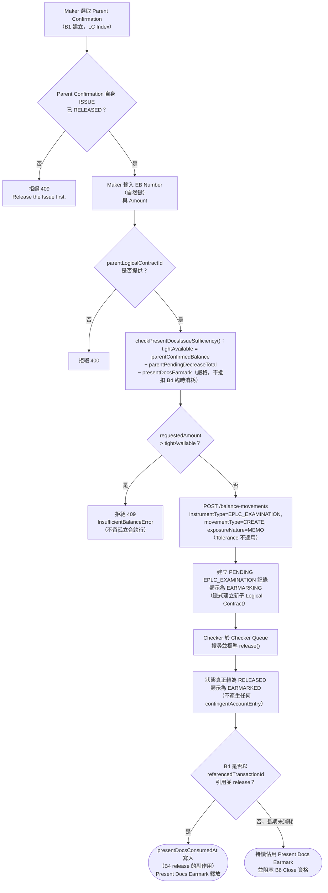

# B3 — 交單（Present Docs）

本筆記是 Balance Component 具名業務功能 **B3** 在整個 Obsidian 知識庫中的主要入口，彙整其定義、真實 API 端點、端到端流程與已核實的相關業務規則。

## 功能摘要

| 項目 | 內容 |
|---|---|
| 功能代碼 | B3 |
| 功能說明（原始 label） | Present Docs |
| instrumentType | `EPLC_EXAMINATION` |
| movementType | `CREATE`（無 subChoice，唯一固定值） |
| 所屬方向 | Export（出口） |
| 所屬母層功能 | B1（`defaultParentInstrumentType: EPLC_CONFIRMATION`，即 B1 建立的 `EPLC_CONFIRMATION`） |
| 是否為複合提交（compound） | 否——單一 movement 建立，非複合腿形態；但屬於一個更大複合鏈（B3→B4）的**上游**一環 |

以上定義已用 Read 工具核實於 `/home/claude/balance-kb/repo/src/app/transaction-builder/balance-component.model.ts`（`EXPORT_FUNCTIONS` 陣列，`code === 'B3'` 項，第 440–455 行）：`label: 'Present Docs'`、`side: 'EXPORT'`、`instrumentType: 'EPLC_EXAMINATION'`、`movementType: 'CREATE'`、`defaultParentInstrumentType: 'EPLC_CONFIRMATION'`；原始碼自身緊鄰註解明確記載「B3 is a genuinely separate physical event (D3): it never auto-derives Sight/Usance or touches the Confirmation, only creates a MEMO_ONLY EPLC_EXAMINATION earmark. B4 is the actual legal-event step.」以及「B3 uses the standard release()/reject() path directly (same as A1/A2/A8/A9/B1/B2)」。`balance-component-channel-api.yaml` 的 `GET /channel/functions` 之 B3 條目（第 946–955 行）與之一致，並額外確認 `hasParent: true`、`currencyMode: CARRIED`、`submitsTransaction: true`、`compoundLegs` 僅一腿（`EPLC_EXAMINATION`/`CREATE`）。CONFIRMED。

**無 `secondaryRefLabel`**——`EPLC_EXAMINATION` 以 `ibNumber`（EB Number）作為自身自然鍵，兼具識別與稽核參照雙重角色（原始碼註解，同上第 447–448 行）。CONFIRMED。

### API 端點

依步驟4 對 `analysis/balance-component-api.yaml` 與 `analysis/balance-component-channel-api.yaml` 的實際查證，B3 並非擁有專屬路徑的端點，而是透過通用端點以 request body 的 instrumentType/movementType（或 functionCode）驅動行為：

- **微服務層（權威）**：`POST /balance-movements`（`balance-component-api.yaml:730`）——body 帶 `instrumentType: EPLC_EXAMINATION`、`movementType: CREATE`、`parentLogicalContractId`（**必填**，缺少則 400，同檔案第 1573 行「Required for SHGT ISSUE and EPLC_EXAMINATION CREATE」）、`ibNumber`（EB Number，`EPLC_EXAMINATION` 自身的自然鍵，同檔案第 1280 行）、`amount` 等，建立 PENDING 的 EPLC_EXAMINATION 記錄；`exposureNature` 未顯式提供時預設為 `MEMO`（同檔案第 1598 行、第 179 行「a Present Docs / EPLC_EXAMINATION earmark is MEMO, never CONTINGENT/ACTUAL」）。
- **Checker 放行**：`POST /balance-movements/{movementId}/release`（`balance-component-api.yaml:900`）——B3 自身走**標準單腿** release，真正將 `status` 由 `PENDING` 轉為 `RELEASED`（第 900–954 行、第 1450–1452 行：「v1.12.0 (2026-08-18): POST /balance-movements/{id}/acknowledge removed... standard POST /balance-movements/{id}/release (a genuine PENDING -> RELEASED transition)」）；舊有專屬的 `POST /balance-movements/{movementId}/acknowledge`（`balance-component-api.yaml:1054`）已於 v1.12.0（2026-08-18）針對 B3 移除，該端點後於 v1.14.0 重新啟用但**改為服務 A3/A3S 的 Checker 確認動作**，不再是 B3 的路徑（第 406 行）。
- **Channel API 門面層**：`POST /channel/transactions`（`balance-component-channel-api.yaml:292`），body 帶 `functionCode: B3`、`parentNaturalKey: {ibNumber 所屬之 Confirmation 自然鍵}`、`naturalKey: {ibNumber}`、`amount`；`currency` 欄位在此 functionCode 下完全不存在於請求 schema（`ChannelDerivedTransactionRequest`，`additionalProperties:false`，[[MAKER-CHECKER-RULE-049]] 同類門控）。對應的 Checker 放行為 `POST /channel/transactions/{transactionId}/release`（同檔案第 404 行）；舊有 `POST /channel/transactions/{transactionId}/acknowledge` 已於 v1.2.0（2026-08-18）針對 B3 移除（同檔案第 527–528、641–642 行）。

UNCLEAR：兩份規範中未見到 B3 專屬（named）路徑，僅有以上通用端點依 body 欄位分派；未發現與此相左的證據，故按規範原文如實記錄。

## 端到端流程（Trigger → Output → Error/Exception）

- **Trigger（觸發點）**：Maker 選取一筆已由 B1 建立、且該 Confirmation 自身的 ISSUE 已經 **RELEASED** 的 `EPLC_CONFIRMATION` 作為 Parent，輸入 EB Number（自然鍵，Maker 自由輸入）與金額，發起 B3 CREATE，記錄一筆出口單據交單事件。CONFIRMED。

- **Input（輸入）**：Parent Confirmation（LC Index）＋ EB Number（自由輸入的自然鍵）＋ Amount；Currency 由 Parent Confirmation 沿用（`currencyMode: CARRIED`），Channel API 層不接受此欄位。B3 無第二步選取器（Step-2 picker），`selectedContract` 由 `onSelectParent()` 別名指向 `selectedParent` 以驅動共享的餘額資訊框/預警模板（[[BALANCE-RULE-013]]，此修正原本 B3/A8 完全沒有即時餘額回饋的缺口）。CONFIRMED。

- **Validation（校驗）**：
  1. `parentLogicalContractId` 缺失 → 400。CONFIRMED。
  2. `assertRootIssueReleased()`：Parent Confirmation 自身的 ISSUE 若尚未 RELEASED，任何在其下建立新子合約（含 EPLC_EXAMINATION）的請求皆被拒絕（409）。CONFIRMED。
  3. `checkPresentDocsIssueSufficiency()`（`microservices/balance-component/src/domain/offBalanceExposure.ts:197-218`）：`requestedAmount` 不得超過 `tightAvailable = parentConfirmedBalance − parentPendingDecreaseTotal − presentDocsEarmark`（已在建立合約**之前**完成檢查，被拒絕時不留孤立合約行）——此為業務指令 2026-08-15「Present Docs 須有一個 Present Docs Earmark（Pending/Approved）來控制」的具體實作（[[EXPOSURE-RULE-004]]、[[BALANCE-RULE-010]]）。**嚴格限定，不享有 B4 側的臨時消耗抵扣**——`presentDocsEarmark` 淨值不扣除任何仍為 PENDING 的 B4 提前消耗（那項抵扣只單向存在於 assembleSnapshot() 供展示用，不回饋進本檢查，見下方 Exposure 決策，[[EXPOSURE-RULE-004]]、[[EXPOSURE-RULE-005]]）。CONFIRMED，此為 B3 最核心的業務規則。
  4. Tolerance（寬容度）換算對 `EPLC_EXAMINATION` **不適用**——僅 `IPLC_LC`/`EPLC_LC`（及 `EPLC_CONFIRMATION`）自身的 ISSUE/AMEND* 才做 `ceilingAmount` 換算，B3 一律原樣採用 faceAmount。CONFIRMED。
  5. 前端即時預警：B3（連同 A8）僅具備 Tight-tier 檢查、無獨立的 plain-Available 層級，因此無論輸入金額是否也超出 plain Available，一律直接顯示 Tight 級別預警（`checksAgainstTightAvailable=true`、`checksAgainstPlainAvailable=false`）——早期版本因誤加 `<= availableBalance` 防護，導致金額同時超出兩者時 B3 完全不顯示警示，已修正（[[BALANCE-RULE-011]]）。CONFIRMED。
  6. Amount 必須 > 0，前後端雙重校驗（`assertValidAmount()`，服務端於 `resolveOrCreateContract()` 之前執行，被拒絕的請求不留孤兒合約）。CONFIRMED。

- **Classification（分類）**：instrumentType=`EPLC_EXAMINATION`、movementType=`CREATE`；`exposureNature` 固定為 `MEMO`（Present Docs earmark 專屬類別，不可為 `CONTINGENT`/`ACTUAL`）。CONFIRMED。

- **Business Decision（業務決策）**：B3 是一個**純物理事件**（cs-tf-balance-knowhow D3：「documents arriving... only legal events move balances」）——單據送達僅代表銀行收單並著手審單，本身不構成任何法律上的付款/承兌承諾，因此 Parent Confirmation 自身的 confirmed_amount 完全不受觸碰，Sight/Usance 皆然。真正的法律事件（決定 Honour 或 Accept）留給 B4 處理；B3 只建立一個 `MEMO_ONLY` 的檢查用圈存（examination earmark），佔用 Present Docs Earmark 容量直到 B4 消耗它為止。CONFIRMED，見 `b3-genuinely-releases-the-removed-acknowledge-only-design.md` 與原始碼 help 文字。

- **Balance/Exposure Decision（表內 vs 表外）**：**表外**（Off-Balance-Sheet，MEMO 性質，比表外的 SHGT CONTINGENT 更弱一級）。`EPLC_EXAMINATION` 不直接參與 Parent Confirmation 的 Confirmed/Available Balance 帳本，而是透過 `computePresentDocsEarmark()`/`computePresentDocsEarmarkApproved()`（Pending／Approved 兩種拆分形式）計入 Parent Confirmation 的 `presentDocsEarmarkPending`/`presentDocsEarmarkApproved` 與 `tightAvailableBalance` 衍生欄位——兩者之和等於嚴格可用餘額所減去的合計指標（[[BALANCE-RULE-010]]）。這兩個指標**均排除**已被 B4 消耗（`presentDocsConsumedAt` 已設）或臨時已消耗（見下）的呈現（[[EXPOSURE-RULE-006]]）。B3 自身建立/新增一筆呈現時採**嚴格**基準（見 Validation 第 3 點），但 B4 側有一項**單向、僅供展示**的臨時抵扣：一筆仍為 PENDING 的 B4 HONOUR/ACCEPT，會在 `assembleSnapshot()` 內部把它所引用的 B3 呈現臨時視為已消耗，避免 Maker 在 B4 Submit 後、Release 前看到誤導性的負值 Tight Available Balance；這項抵扣只存在於展示層，B3 自身新呈現的充足性檢查與 B2 的 AMEND_DECREASE 檢查皆刻意不採用此抵扣，維持「增加從嚴，對 LC Balance 而言」的一致姿態（[[EXPOSURE-RULE-005]]）。CONFIRMED。

- **Tolerance 決策**：不適用——見上方 Validation 第 4 點。CONFIRMED。

- **Movement Posting Generation（過帳分錄）**：**永不產生 `contingentAccountEntry`**。`EPLC_EXAMINATION` 原本曾有一組專屬 Dr/Cr 分錄，後續設計覆核後認定 B3（D3、MEMO_ONLY）本質上從未真正過帳，該分錄對已被移除，`EPLC_EXAMINATION` 現與表內資產類 instrumentType 一同被歸入 `contingentAccountEntry.ts` 傳回 `null` 的分組（[[EXPOSURE-RULE-008]]）。單據/交單收訖不產生任何或有 GL 影響。`parent_logical_contract_id`（SHGT/Acceptance/EPLC_EXAMINATION → 父 LC/Confirmation）純屬應用層維護的邏輯關聯，資料庫 schema 並未以 FOREIGN KEY 強制約束（[[EXPOSURE-RULE-028]]）。CONFIRMED。

- **Output（輸出）**：新建一筆 `EPLC_EXAMINATION`／`CREATE` 記錄（初始 PENDING，隱式建立新的子 Logical Contract）。Checker Release 後 `status` 真正轉為 `RELEASED`（[[STATUS-RULE-009]]）——事件狀態顯示映射對此有特別規則：未 Release 前顯示為 `EARMARKING`，Release 後顯示為 `EARMARKED`，與 A3/A3S 共用同一套「佔用類功能」映射，區別於其他一般功能的 `PENDING`/`APPROVED`（[[STATUS-RULE-019]]）。RELEASED 之後該記錄仍持續佔用 Present Docs Earmark 容量，直到 B4 透過 `referencedTransactionId` 指向它、並於自身 release 的**副作用**中寫入 `presentDocsConsumedAt`（獨立於 `status` 欄位單獨追蹤，[[STATUS-RULE-009]]）——B4 自身的複合放行順序上，主 Honour/Accept 分支先於其關聯的複合分支被釋放，並在此時消耗所引用的 B3 記錄（[[MOVEMENT-RULE-039]]）；B4 自身跨合約候選項挑選時，也必須排除已經 `presentDocsConsumedAt`（或狀態非真正 RELEASED）的候選（[[MAKER-CHECKER-RULE-042]]）。若略過 B4，該記錄會停留在 `RELEASED` 但永不被消耗的狀態，並將持續阻塞 B6（Confirmed LC Close）的資格判定（[[EXPOSURE-RULE-011]]）。在「查詢目前餘額（Look Up Current Balance）」畫面中，出口保兌 LC 會把 B3 事件併入 LC 自身的分頁，B3 本身並無獨立的餘額分頁（[[MAKER-CHECKER-RULE-039]]）。

- **Error/Exception（錯誤/例外）**：
  - 409 `InsufficientBalanceError`——Present Docs Earmark 調整後的 Tight Available Balance 不足，訊息會指明確切的嚴格可用額度及其組成部分（parentConfirmedBalance／parentPendingDecreaseTotal／presentDocsEarmark／parentConfirmationBalanceContractId），被拒絕時不留孤立合約行（`offBalanceExposure.ts:197-218`）。
  - 400——`parentLogicalContractId` 缺失。
  - 409——Parent Confirmation 自身 ISSUE 尚未 RELEASED（`assertRootIssueReleased()`）。
  - 同一 `(balanceContractId, eventSeq)` 重複提交 → 200，返回既有記錄（冪等，通用規則）。
  - Amount ≤ 0 → 拒絕（`assertValidAmount()`，通用規則）。
  - Checker Release 對一筆已被 B4 消耗（`presentDocsConsumedAt` 已設）的記錄再度嘗試視為候選 → 於挑選階段即被排除（[[MAKER-CHECKER-RULE-042]]），非執行期錯誤而是候選過濾。
  - UNCLEAR：兩份 OAS 規範與已讀原始碼中，未見到針對「同一 EB Number 重複交單」的專屬去重檢查說明（不同於 A1 的 re-ISSUE guard），僅有通用的 `sourceTransactionRef` 去重防護；未發現與此相左的證據，故如實標註為 UNCLEAR 而非臆測。

## 流程圖

## 交叉引用（Related Knowledge）

支援筆記：
- [[b3-genuinely-releases-the-removed-acknowledge-only-design]] — B3 由舊有 acknowledge()-only 設計改為真正 release 的完整背景與測試斷言依據

相關業務規則：
- [[EXPOSURE-RULE-004]] — B3 新交單呈現的充足性檢查，嚴格限定於 Present Docs Earmark 調整後的嚴格可用餘額，不享有臨時消耗抵扣（本功能最核心的規則）
- [[EXPOSURE-RULE-005]] — B4 仍為 PENDING 的 HONOUR/ACCEPT 對其所引用之 B3 呈現的臨時抵扣，僅存在於 assembleSnapshot() 展示層
- [[EXPOSURE-RULE-006]] — computePresentDocsEarmark／Pending／Approved 兩種拆分形式，均排除已消耗與臨時已消耗的呈現
- [[EXPOSURE-RULE-008]] — EPLC_EXAMINATION 永不產生 contingentAccountEntry
- [[EXPOSURE-RULE-011]] — 已 RELEASED 但尚未被消耗的 B3 呈現會阻塞 B6 Close 資格判定
- [[EXPOSURE-RULE-028]] — parent_logical_contract_id 為應用層邏輯關聯，非資料庫 FOREIGN KEY
- [[BALANCE-RULE-010]] — Present Docs Earmark（Pending＋Approved）之和等於嚴格可用餘額所減去的合計指標
- [[BALANCE-RULE-011]] — 前端即時預警兩級制；B3（連同 A8）僅具 Tight-tier，無條件顯示
- [[BALANCE-RULE-012]] — tightAvailableBalanceForWarning 對 B4（引用 B3 呈現的 HONOUR/ACCEPT）放寬客戶端檢查閾值
- [[BALANCE-RULE-013]] — B3/A8 的 selectedContract 別名指向 selectedParent，驅動共享餘額資訊框
- [[MAKER-CHECKER-RULE-039]] — 查詢目前餘額中，出口保兌 LC 會將 B3 事件併入 LC 分頁，B3 本身無獨立餘額分頁
- [[MAKER-CHECKER-RULE-042]] — B4 跨合約候選項必須真實 RELEASED 且尚未被交單消耗
- [[MOVEMENT-RULE-039]] — B4 複合放行順序，主 Honour/Accept 分支先於關聯複合分支釋放並消耗所引用的 B3 記錄
- [[STATUS-RULE-009]] — B3 在自身 Checker 動作後真正轉為 RELEASED；presentDocsConsumedAt 獨立於狀態欄位單獨追蹤 B4 後續消耗
- [[STATUS-RULE-019]] — 事件狀態顯示映射，B3（連同 A3/A3S）採 EARMARKING/EARMARKED，區別於其他功能的 PENDING/APPROVED

- [[Balance Component Overview]]
