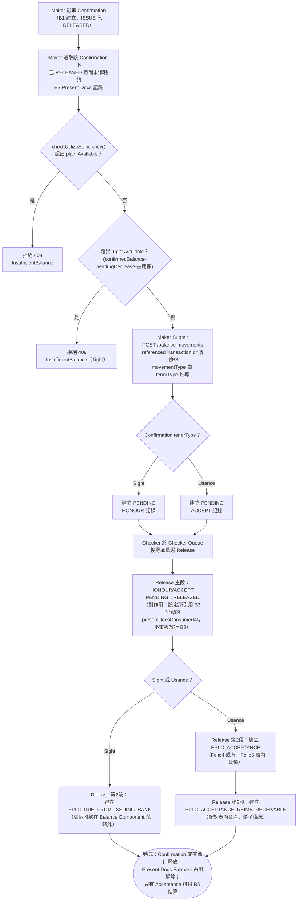

# B4 — 兌付／承兌（Honour/Acceptance）

> [!info] 2026-08-30 更新
> Transaction Index 一次选择 LC Number + EB Number，并显示 EB Amount。候选必须是已 EARMARKED 且尚未被 B4 消费的 B3；Honour／Acceptance 的关联 legs 通过 atomic compound submit／release 完成。

本筆記是 Balance Component 具名業務功能 **B4** 在整個 Obsidian 知識庫中的主要入口，彙整其定義、真實 API 端點、端到端流程與已核實的相關業務規則。

## 功能摘要

| 項目                       | 內容                                                                                                                                                                                                                                                                                                                                                                          |
| -------------------------- | ----------------------------------------------------------------------------------------------------------------------------------------------------------------------------------------------------------------------------------------------------------------------------------------------------------------------------------------------------------------------------- |
| 功能代碼                   | B4                                                                                                                                                                                                                                                                                                                                                                            |
| 功能說明（原始 label）     | Honour / Acceptance                                                                                                                                                                                                                                                                                                                                                           |
| instrumentType             | `EPLC_CONFIRMATION`                                                                                                                                                                                                                                                                                                                                                           |
| movementType               | `HONOUR`（Sight）／`ACCEPT`（Usance）——B4 是唯一一個真實 movementType 於 Submit 時由所選 Confirmation 合約自身的 `tenorType` 讀取推導、而非在註冊表中固定或透過 `subChoice` 選擇的功能（[[MOVEMENT-RULE-019]]）                                                                                                                                                               |
| subChoice                  | 無——B4 沒有 `subChoice` 欄位，Sight/Usance 由 Tenor Type 自動判定，統一為單一法律事件步驟                                                                                                                                                                                                                                                                                     |
| 所屬方向                   | Export（出口）                                                                                                                                                                                                                                                                                                                                                                |
| 所屬母層功能               | B1（`EPLC_CONFIRMATION` 由 B1 建立）／B3（`pendingItemSourceCode: 'B3'`，Present Docs 必須先由 B3 建立並經 Checker 真正 RELEASED）                                                                                                                                                                                                                                            |
| 是否為複合提交（compound） | 是——`payableMovementType: 'CREATE'`、`payableMovementInstrumentType: 'EPLC_EXAMINATION'`。Sight 為 2 段（HONOUR + `EPLC_DUE_FROM_ISSUING_BANK` CREATE）；Usance 為 4 段（ACCEPT + `EPLC_ACCEPTANCE` CREATE + `EPLC_ACCEPTANCE_REIMB_RECEIVABLE` CREATE，外加所轉換的 B3 記錄本身以副作用形式被消耗，不再重複 Release）（`balance-component-channel-api.yaml` `compoundLegs`） |

以上定義已用 Read 工具核實於 `/home/claude/balance-kb/repo/src/app/transaction-builder/balance-component.model.ts`（`EXPORT_FUNCTIONS` 陣列，`code === 'B4'` 項，第 463–476 行）；`balance-component-channel-api.yaml` 中 `GET /channel/functions` 的 `B4` 條目（第 956–969 行）與之一致，並額外確認 `hasParent: false`、`currencyMode: CARRIED`、`submitsTransaction: true`、`secondaryRefLabel: "EB Number"`。CONFIRMED。

### API 端點

依步驟 4 對 `analysis/balance-component-api.yaml` 與 `analysis/balance-component-channel-api.yaml` 的實際查證，B4 並非擁有專屬路徑的端點，而是透過通用端點以 request body 的 instrumentType/movementType（或 functionCode）驅動行為：

- **微服務層（權威）**：`POST /balance-movements`（`balance-component-api.yaml:731`）——body 帶 `instrumentType: EPLC_CONFIRMATION`、`movementType: HONOUR|ACCEPT`、`referencedTransactionId`（指向已 RELEASED 的 B3 `EPLC_EXAMINATION` CREATE 記錄之 movementId——v1.3.0 起 schema 明確標註「A6/B4 only」，`balance-component-api.yaml:1618`）等，建立 PENDING 的主段記錄；Amount/EB Number 由所選 B3 記錄帶入並鎖定。
- **Checker 放行（複合，2–4 段）**：`POST /balance-movements/{movementId}/release`（`balance-component-api.yaml:901`）——B4 一次 Release 依序放行①主段（HONOUR 或 ACCEPT，同時以副作用設定其引用之 B3 記錄的 `presentDocsConsumedAt`）②（Sight）`EPLC_DUE_FROM_ISSUING_BANK` CREATE，或（Usance）`EPLC_ACCEPTANCE` CREATE 與 `EPLC_ACCEPTANCE_REIMB_RECEIVABLE` CREATE。v1.12.0 起 B3 本身已由其自身 Checker 真正 RELEASED，故 B4 的複合 Release **不再**重複放行 B3 記錄本身，僅放行自身主段與關聯資產/負債段（`balance-component-api.yaml:388-392`）。
- **跨會話關聯分腿查詢**：`GET /balance-movements?businessEventId=`（`balance-component-api.yaml:841`）——供真正獨立的 Checker 會話（未在本機 Submit）解析複合分腿之用。
- **Channel API 門面層**：`POST /channel/transactions`（`balance-component-channel-api.yaml:292`），body 帶 `functionCode: B4`；`originTransactionId` 對應所選的 B3 記錄（第 784 行說明），由該端點依 `GET /channel/functions` 的 B4 定義推導出真正的 instrumentType/movementType/compoundLegs 並轉呼叫微服務層；對應的 Checker 放行為 `POST /channel/transactions/{transactionId}/release`（同檔案第 404 行），文件明確標註 B4 由 Checker 依 `compoundLegs` 對此端點發起多次呼叫，均共用同一 `businessEventId`。

UNCLEAR：兩份規範中未見到 B4 專屬（named）路徑，僅有以上通用端點依 body 欄位分派；未發現與此相左的證據，故按規範原文如實記錄。

## 端到端流程（Trigger → Output → Error/Exception）

- **Trigger（觸發點）**：Maker 在 B1 建立、B3 已建立並經其自身 Checker 真正 RELEASED（`presentDocsConsumedAt` 仍為 null、尚未被消耗）的 `EPLC_CONFIRMATION` 之下，選取該 Confirmation 項下一筆符合資格的 B3 `EPLC_EXAMINATION`/CREATE 記錄，發起 B4 HONOUR/ACCEPT。CONFIRMED（`balance-component.model.ts` B4 條目 `pendingItemSourceHint: 'use B3 (Present Docs) first'`；[[STATUS-RULE-009]]）。

- **Input（輸入）**：Confirmation（Catalog/LC Index，`requireIssueReleased` 預設要求 B1 自身 ISSUE 已 RELEASED）＋ 該 Confirmation 下已 RELEASED 且尚未消耗的 B3 記錄（2nd Index，`selectedPayMovement`）；Amount／EB Number 由來源 B3 記錄帶入並鎖定為唯讀（protected）。CONFIRMED。

- **Validation（校驗）**：
  1. 根合約自身的 ISSUE（B1）必須先被 RELEASED，否則任何後續 movementType（含 HONOUR/ACCEPT）一律被 `assertRootIssueReleased` 拒絕為 409 IllegalStateTransitionError（[[STATUS-RULE-008]]）。CONFIRMED。
  2. B4 的跨合約候選項（B3 記錄）必須真正處於 **RELEASED** 狀態（因 `checkerRelease.sourceAlreadyReleasedBeforePick` 已設定——B3 本就會自行真正放行），且尚未被更早的一筆 B4 消耗（`presentDocsConsumedAt` 為 null）（[[MAKER-CHECKER-RULE-042]]）。CONFIRMED。
  3. Submit 前必須先選定 `selectedPayMovement`，否則阻擋並提示「請先挑選仍處 PENDING 狀態的 Present Docs（2ndary Index）以進行轉換」（`pendingItemLabel: 'Present Docs'`）（[[MAKER-CHECKER-RULE-021]]）。CONFIRMED。
  4. `checkUtilizeSufficiency()`（A3/A3S/B4 共用的 UTILIZE-HONOUR-ACCEPT 充足性檢查）：requestedAmount 超出 plain Available Balance 即拒絕（409）；即便未超出 plain Available，若額外超出 Tight Available Balance（= confirmedBalance − pendingDecreaseTotal − 合計交單占用額）亦拒絕（409）——兩者皆為硬性拒絕，無非阻斷式預警（[[EXPOSURE-RULE-002]]）。CONFIRMED。
  5. 客戶端即時預警的 Tight Available 門檻，會為 B4 依所選 B3 記錄自身的 `ceilingAmount` 放寬（`tightAvailableBalanceForWarning`），避免因交單占用額尚未反映最新臨時抵扣而產生假警報（[[BALANCE-RULE-012]]）。CONFIRMED。
  6. Channel API 除 A1/B1 外一律禁止輸入 Currency Code（含 B4）——僅規範層面如此，微服務尚未強制執行（[[MAKER-CHECKER-RULE-049]]）。CONFIRMED。

- **Classification（分類）**：instrumentType=`EPLC_CONFIRMATION`；movementType 由 Confirmation 自身 tenorType 推導——Sight → `HONOUR`，其餘（Usance）一律 → `ACCEPT`，將源規格 Sight/Buyer's Usance/Seller's Usance 三分歸併為 Sight/Usance 二分，不區分源規格所稱 Buyer's Usance 的「Case 1」（即期兌付、不生 Acceptance）與「Case 2」（承兌延付、生 Acceptance）——每一筆非 Sight 的 Confirmation 一律走 Acceptance 路徑（[[MOVEMENT-RULE-058]]）。CONFIRMED。movementTypeMatchesFunction/resolveFunctionForMovement 的 `derivesMovementTypeFromTenor` 分支僅為 B4 匹配 `HONOUR`/`ACCEPT`，明確不匹配 `CLOSE`（避免誤吞併 B6 事件）（[[MOVEMENT-RULE-024]]）。CONFIRMED。

- **Business Decision（业务决策）**：Sight 分支（HONOUR）释放 Confirmation 或有敞口并建立 `EPLC_DUE_FROM_ISSUING_BANK`；其实际收款属于 Balance Component 范畴外，不走 B5。Usance 分支（ACCEPT）释放 Confirmation 或有敞口，同时建立 `EPLC_ACCEPTANCE` 与配对的 `EPLC_ACCEPTANCE_REIMB_RECEIVABLE`。B5 后续只结算 Acceptance，不处理该 Receivable。CONFIRMED。

- **Balance/Exposure Decision（表內 vs 表外）**：主段（HONOUR/ACCEPT）釋放 `EPLC_CONFIRMATION` 的或有敞口（Folio 4，依 tenor 加後綴的科目族，[[EXPOSURE-RULE-007]]）；資產/負債段（`EPLC_DUE_FROM_ISSUING_BANK`／`EPLC_ACCEPTANCE`／`EPLC_ACCEPTANCE_REIMB_RECEIVABLE`）屬表內或影子備忘性質，其中 Acceptance/Reimb Receivable 一組屬 Folio 5 影子備忘配對（供 MIS/MT 對帳），真正的表內負債/資產分錄由範疇外的另一元件記錄（[[EXPOSURE-RULE-020]]、[[EXPOSURE-RULE-007]]）。CONFIRMED。B4 仍處於 PENDING 狀態的 HONOUR/ACCEPT，會臨時抵扣其所引用的 B3 記錄——但**僅限展示/讀取路徑**（`assembleSnapshot()` 內的 `derivePresentDocsProvisionallyConsumedIds()`），任何全新、無關的 B3 交單充足性檢查與 B2 的 AMEND_DECREASE 檢查均維持嚴格、不享有此抵扣（[[EXPOSURE-RULE-005]]、[[BALANCE-RULE-010]]）。CONFIRMED。

- **Tolerance 決策**：不適用。宽容度換算雖然 `EPLC_CONFIRMATION` 屬於適用 instrumentType 之一（[[TOLERANCE-RULE-002]]），但僅 `ISSUE`／`AMEND_INCREASE`／`AMEND_DECREASE`／`AMEND` 這幾個 movementType 會被換算，`HONOUR`／`ACCEPT`／`UTILIZE`／`CREATE` 一律原樣回傳未換算面額——測試明確以 `EPLC_CONFIRMATION`/`HONOUR`/`ACCEPT` 為例證實此排除（[[TOLERANCE-RULE-003]]）。CONFIRMED。

- **Movement Posting Generation（過帳分錄／複合放行）**：B4 屬 `settlesDocumentArrival` 形態，但與 A6 不同的是其來源（B3）在挑選當下已是 RELEASED（`sourceAlreadyReleasedBeforePick=true`），故 Checker 一次 Release 依序完成：①主段（HONOUR 或 ACCEPT，同時以副作用將所引用 B3 記錄的 `presentDocsConsumedAt` 設定，解除其對 Present Docs Earmark 的占用，**不再重複放行 B3 記錄本身**）②（Sight）`EPLC_DUE_FROM_ISSUING_BANK` CREATE，或（Usance）依序 `EPLC_ACCEPTANCE` CREATE → `EPLC_ACCEPTANCE_REIMB_RECEIVABLE` CREATE（[[MAKER-CHECKER-RULE-015]]、[[MOVEMENT-RULE-039]]、[[MOVEMENT-RULE-060]]、[[MAKER-CHECKER-RULE-031]]）。CONFIRMED。各分腿透過共用的 `businessEventId`／`referencedTransactionId` 關聯；在真正獨立的 Checker 會話中，會回退以 `GET /balance-movements?businessEventId=` 或 `selectedCheckerMovement.referencedTransactionId` 查詢解析（[[MAKER-CHECKER-RULE-032]]）——此問題本身於 B4 上曾被實際發現並修正（CLAUDE.md 決策日誌：獨立 Checker 會話點選 Release 靜默無效）。CONFIRMED。

- **Output（輸出）**：新建一筆 `EPLC_CONFIRMATION`／`HONOUR`或`ACCEPT` 記錄（初始 PENDING，`referencedTransactionId` 指向所選 B3 記錄）；Checker Release 後主段狀態轉為 RELEASED，來源 B3 記錄的 `presentDocsConsumedAt` 被設定（狀態本身不變，仍為 RELEASED，但不再占用 Present Docs Earmark）；同步建立並放行 Sight 的 `EPLC_DUE_FROM_ISSUING_BANK`，或 Usance 的 `EPLC_ACCEPTANCE`＋`EPLC_ACCEPTANCE_REIMB_RECEIVABLE`。Inquire Events／Look Up 時間線將此類事件解析回 B4（而非其創建方 B3——`payExistingUtilizeFunctionFor` 的 `'finalize'` 階段特判邏輯，標題明確涵蓋 A4/B4；[[MOVEMENT-RULE-032]]，UNCLEAR：B3→B4 是否真的走與 A3→A4 相同的『同一筆記錄拆分 create/finalize 行』機制，或僅是 Inquire Events 通用查找對 EPLC_CONFIRMATION 情形的類比命名，源碼註解未逐字區分，維持 CONFIRMED 但標註此細節待進一步核對）。Usance 完成後，Confirmation 之 Balance Tab 額外顯示 Acceptance 分頁（[[STATUS-RULE-025]]）。

- **Error/Exception（錯誤/例外）**：
  - Confirmation（B1）自身 ISSUE 尚未 RELEASED → 409 IllegalStateTransitionError，「Release the Issue first.」（[[STATUS-RULE-008]]）。
  - 未選定已 RELEASED 且未消耗的 B3 記錄即嘗試 Submit → 前端阻擋，提示訊息如上（[[MAKER-CHECKER-RULE-021]]、[[MAKER-CHECKER-RULE-042]]）。
  - requestedAmount 超出 plain Available Balance 或 Tight Available Balance → 409（兩級皆硬性拒絕，[[EXPOSURE-RULE-002]]）。
  - 同一 `(balanceContractId, eventSeq)` 重複提交 → 200，返回既有記錄（冪等，通用規則）。
  - 在真正獨立的 Checker 會話中點選 Release，若 businessEventId/referencedTransactionId 解析不到關聯分腿 → 回傳乾淨的 `'failed'` 結果，而非靜默無效或未處理例外（[[MAKER-CHECKER-RULE-032]]）。
  - 已 RELEASED 但尚未被 B4 消耗的 B3 記錄，會阻擋該 Confirmation 之 B6 Close 資格判定，直到被 B4 消耗為止（[[EXPOSURE-RULE-011]]）。

## 流程圖

## 交叉引用（Related Knowledge）

相關業務規則：

- [[MOVEMENT-RULE-019]] — B4 的 movementType 由 Confirmation 自身 tenorType 推導，從不由用戶手動選擇
- [[MOVEMENT-RULE-024]] — movementTypeMatchesFunction 的 derivesMovementTypeFromTenor 分支只為 B4 匹配 HONOUR/ACCEPT，不匹配 CLOSE
- [[MOVEMENT-RULE-032]] — 'finalize' 階段事件解析回其終結功能（A4/B4），而非通用產生方
- [[MOVEMENT-RULE-039]] — B4 複合放行順序：主段（同時消耗其引用的 B3 記錄）先於關聯複合段被放行
- [[MOVEMENT-RULE-058]] — 出口 tenor 收縮為 Sight/Usance 二分——B4 不區分源規格 Buyer's Usance 的 Case 1/Case 2
- [[MOVEMENT-RULE-060]] — B4 Usance Accept 是橫跨 Folio 4 與 Folio 5 的複合「釋放+建立」，與 A6 模式相符
- [[EXPOSURE-RULE-002]] — checkUtilizeSufficiency（A3/A3S/B4 的 UTILIZE-HONOUR-ACCEPT）兩級硬性 ERROR
- [[EXPOSURE-RULE-004]] — B3 新交單充足性檢查嚴格，不享有 B4 臨時消耗抵扣
- [[EXPOSURE-RULE-005]] — B4 仍處 PENDING 的 HONOUR/ACCEPT 臨時抵扣所引用的 B3 記錄——僅展示用
- [[EXPOSURE-RULE-007]] — 或有帳務分錄科目族查找（EPLC_CONFIRMATION 依 tenor 加後綴，Folio 4）
- [[EXPOSURE-RULE-011]] — 已 RELEASED 但尚未被消耗的 Present Docs Presentation 會阻塞 B6 Close 資格
- [[EXPOSURE-RULE-020]] — Acceptance/DPU 於承兌當下即以表內全額方式確認
- [[BALANCE-RULE-007]] — Tight Available Balance 由已確認餘額（而非可用餘額）推導
- [[BALANCE-RULE-010]] — 交單占用額（Pending+Approved）等於 EPLC_CONFIRMATION 場景下 Tight Available 所減之合計指標
- [[BALANCE-RULE-012]] — tightAvailableBalanceForWarning 為 B4 依所選 B3 記錄的 ceilingAmount 放寬即時預警門檻
- [[STATUS-RULE-008]] — 根合約自身 ISSUE 必須先被 RELEASED（assertRootIssueReleased）
- [[STATUS-RULE-009]] — B3 真正 RELEASE；presentDocsConsumedAt 獨立於狀態，單獨追蹤 B4 的消耗動作
- [[STATUS-RULE-017]] — movement_type 權威合法值來自 BalanceService 註冊表（含 HONOUR/ACCEPT）
- [[STATUS-RULE-025]] — Acceptance 分頁僅在 IPLC_LC/EPLC_CONFIRMATION 根合約為 Usance tenor 時顯示
- [[TOLERANCE-RULE-002]] — 宽容度換算的 instrumentType 適用性門控（EPLC_CONFIRMATION 屬適用範圍）
- [[TOLERANCE-RULE-003]] — 宽容度換算的 movementType 適用性門控（HONOUR/ACCEPT 明確排除，不換算）
- [[MAKER-CHECKER-RULE-006]] — requireIssueReleased 目錄篩選（Maker-ACTION 選擇器排除 ISSUE 尚未核准者）
- [[MAKER-CHECKER-RULE-015]] — Checker 放行路由依功能形態而異（B4 vs A6：來源在挑選時是否已放行）
- [[MAKER-CHECKER-RULE-021]] — A6/B4 必須轉換具體來源記錄（B4 為已 RELEASED），絕不憑空新建
- [[MAKER-CHECKER-RULE-031]] — Checker release() 依複合提交形態分派四條分腿放行鏈
- [[MAKER-CHECKER-RULE-032]] — 跨會話關聯分腿解析回退機制（businessEventId/referencedTransactionId）
- [[MAKER-CHECKER-RULE-039]] — Look Up Current Balance 將 B3 事件併入 Confirmation 分頁，無獨立餘額分頁
- [[MAKER-CHECKER-RULE-042]] — B4 跨合約候選項必須真實 RELEASED 且尚未被交單消耗
- [[MAKER-CHECKER-RULE-048]] — 服務端冪等性、重複 ISSUE 防護記錄於 OAS，與實作一致
- [[MAKER-CHECKER-RULE-049]] — Channel API 除 A1/B1 外禁止輸入 Currency Code（B4 適用）

- [[Balance Component Overview]]
