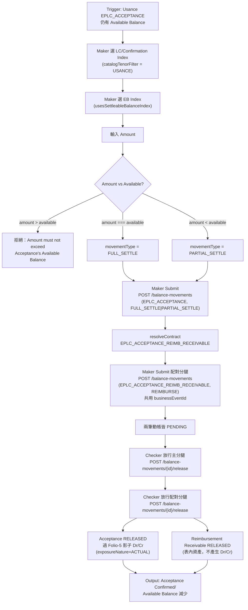

# B5 — 結算（償付／到期）Settlement — Reimbursement / Maturity

## 狀態
CONFIRMED（依代碼與 OpenAPI 規範核實；個別細節依下文標註 INFERRED/UNCLEAR/CONFLICT）

## 功能摘要

| 項目 | 內容 |
|---|---|
| 功能代碼 | B5 |
| 功能說明（label） | `Settlement — Reimbursement / Maturity`（結算 — 償付／到期） |
| instrumentType | `EPLC_ACCEPTANCE`（出口承兌） |
| movementType | `FULL_SETTLE`（登記表中的預設值；提交時實際依 Amount 對比 Available Balance，可能推導為 `PARTIAL_SETTLE`——見下文 Business Decision） |
| catalogTenorFilter | `USANCE`——第一步 LC/Confirmation Index 僅顯示 Usance 承兌信用狀，Sight 不適用本功能 |
| defaultParentInstrumentType | `EPLC_CONFIRMATION` |
| 所屬方向 | Export 出口 |
| 母層功能 | B4（Honour / Acceptance）——Usance 分支在 Accept 時同時建立本功能要結算的 `EPLC_ACCEPTANCE` 負債與其配對的 `EPLC_ACCEPTANCE_REIMB_RECEIVABLE` 應收資產 |
| 業務原理引用 | 原始碼註解引用 cs-tf-balance-knowhow §7.6（CNF_MATURE）；held-to-maturity 與提前貼現兩種結算路徑，Balance Component 均映射為同一組 FULL_SETTLE/PARTIAL_SETTLE（[[EXPOSURE-RULE-025]]） |

### API 端點（已對照兩份 OpenAPI 規範查證，皆為依 body 中 instrumentType/movementType 或 functionCode 決策行為的通用端點，非 B5 專屬路徑）

**Web/Mobile Channel API**（`analysis/balance-component-channel-api.yaml`，業務功能語彙層）：
- `GET /channel/functions`——回傳含 B5 的功能清單，其中 `compoundLegs` 明列 B5 的兩個分腿：`EPLC_ACCEPTANCE` `FULL_SETTLE|PARTIAL_SETTLE`（held-to-maturity only — CNF_MATURE）與 `EPLC_ACCEPTANCE_REIMB_RECEIVABLE` `REIMBURSE`（同金額、同一次 Checker Release）（第 970-981 行）
- `POST /channel/transactions`（body 含 `functionCode: B5`）——Maker 提交，B5 的 `submitsTransaction: true`（第 978 行），走本端點而非直接解析既有 PENDING 記錄
- `POST /channel/transactions/{transactionId}/release`、`.../reject`、`.../cancel`——Checker 放行／拒絕，Maker EC
- `GET /channel/contracts/catalog`——LC Index／EB Index 選取器的資料來源

**微服務 API**（`analysis/balance-component-api.yaml`）：
- `POST /balance-movements`——通用建立動帳端點，B5 提交的兩腿（`EPLC_ACCEPTANCE`/`FULL_SETTLE`或`PARTIAL_SETTLE`、`EPLC_ACCEPTANCE_REIMB_RECEIVABLE`/`REIMBURSE`）各自呼叫一次，由 body 的 instrumentType/movementType 決定行為
- `GET /balance-movements?businessEventId=`——規範文字明確點名 B5（"B5's Acceptance settle + Reimbursement Receivable REIMBURSE"，第 847 行），供真正獨立的 Checker 會話解析兩腿的關聯 movementId
- `POST /balance-movements/{movementId}/release`——Checker 放行，一次呼叫放行一筆動帳；B5 需分別呼叫兩次（主分腿、配對應收款分腿）
- `POST /balance-movements/{movementId}/reject`、`.../cancel`——Checker 拒絕／Maker 撤銷

## Trigger（觸發點）
一筆先前由 B4（Usance ACCEPT）建立、目前仍持有至到期（held-to-maturity）或已被提前貼現、且 Available Balance 仍大於 0 的 `EPLC_ACCEPTANCE` 承兌記錄，到達到期日或需要辦理償付結算時，觸發本功能。Sight 分支的 Due from Issuing Bank 收款不屬本功能範疇（依原始碼註解，屬 Balance Component 之外的另一元件）；已貼現（Nego'd/discounted，`EPLC_EXPORT_BILLS_DISCOUNTED`）的後續處理同樣不在本功能範圍內。

## Input（輸入）
- 第一步：LC/Confirmation Index（`catalogTenorFilter: 'USANCE'`，僅 Usance 信用狀可選）
- 第二步：EB Index（可結算餘額索引，`usesSettleableBalanceIndex`，[[MAKER-CHECKER-RULE-016]] 為 B5 專屬——第二步選取器展示的是仍處於未結清狀態的可結算餘額候選項，而非 A4/A6 那種單純 PENDING movement 選取器）。一個 LC 可有多筆單據到單／承兌，故此清單可能有多筆候選
- 承兌 Amount 由 Maker 手動輸入，但受上限保護（見 Validation）
- Currency Code 沿用自 B1（`currencyMode: CARRIED`），本功能不接受呼叫端另行提供幣別欄位

**CONFLICT 標註**：CLAUDE.md 決策日誌與 [[MAKER-CHECKER-RULE-016]] 均稱「B5 的 EB Index 會合併兩種可能 instrumentType 下的候選項」，但直接核實 `src/app/transaction-builder/picker-selection.service.ts:195-238` 的 `loadSettleableBalances()`，其 `forkJoin` 陣列中僅含一次 `api.catalog(instrumentType, ...)` 呼叫，且呼叫端（`maker-panel.component.ts:969`）傳入的 `instrumentType` 固定為 `this.selectedFunction?.instrumentType`，對 B5 而言即固定為單一值 `EPLC_ACCEPTANCE`。因此就目前原始碼實際行為而言，EB Index 目前只查詢單一 instrumentType，並未合併第二種——與既有文件敘述有出入，標記為 CONFLICT，未逕自採信任一方。

## Validation（校驗）
- `strategy.movementDerivation.amountVsAvailableDerivation === 'SETTLE'` 且 `model.instrumentType === 'EPLC_ACCEPTANCE'` 時（`submit-rules.ts:139-148`）：
  - 未先搜尋／選取欲結算的 Acceptance（`selectedContractSnapshot` 為空）→ 拒絕："Search for the Acceptance to settle first."
  - `amount > available` → 拒絕："Amount must not exceed the Acceptance's Available Balance (...)"
- Tolerance 換算不適用於本功能：[[TOLERANCE-RULE-002]] 確認 `computeCeilingAmount()` 僅對 `IPLC_LC/EPLC_LC/EPLC_CONFIRMATION` 換算，`EPLC_ACCEPTANCE` 一律原樣返回未經換算的面額
- 伺服器端：`POST /balance-movements` 對任一決減式（decreasing-shaped）movementType 一律先核算 Available Balance，不足即 `409 INSUFFICIENT_AVAILABLE_BALANCE`，不建立 PENDING 記錄（`balance-component-api.yaml:737-739`）
- Amount 必須 > 0（伺服器端 `assertValidAmount()` 前端與後端雙重檢查，CLAUDE.md 決策日誌）

## Classification（分類）
- `strategy.movementDerivation.amountVsAvailableDerivation === 'SETTLE'`（`function-strategy.ts:150-156`）——與 A9 的 `'REDEEM'` 同一種「依 Amount 對比 Available 推導」形態，但 A9 已於 2026-08-21 業務確認鎖定為僅 Full Redeem；B5 未被此決策影響，仍保留「可編輯但有上限」的 Full/Partial 推導行為（[[MOVEMENT-RULE-023]]）
- `resolveFunctionForMovement()`／`movementTypeMatchesFunction()` 將 `EPLC_ACCEPTANCE`/`FULL_SETTLE` 或 `PARTIAL_SETTLE` 回溯歸類為 B5（`function-strategy.ts:195,222`），供 Inquire Events／Look Up 重建欄位使用

## Business Decision（業務決策）
[[MOVEMENT-RULE-023]]：`amount > available` → 拒絕；`amount === available` → `FULL_SETTLE`；`amount < available` → `PARTIAL_SETTLE`（`submit-rules.ts:136-148`，範例：available=80000，amount=80000→FULL_SETTLE；amount=30000→PARTIAL_SETTLE；amount=90000→拒絕）。此推導在 Maker Submit 當下完成，並非使用者直接挑選 movementType。

## Balance/Exposure Decision（表內 vs 表外）
[[EXPOSURE-RULE-019]]：Acceptance/DPU 一旦被承兌即依 IFRS 9 成為表內金融負債，不再是或有性質——Balance Component 對 `EPLC_ACCEPTANCE` 的 CREATE/FULL_SETTLE/PARTIAL_SETTLE 動帳標記 `exposureNature = ACTUAL`（而非 CONTINGENT），所過的 Dr/Cr 僅為 MIS/對帳用的「影子備忘分錄」（Folio 3/5），從不是真正的會計記錄；真正的表內 Acceptance/DPU 負債與其收付，由 Balance Component 範疇外的另一元件負責。

## Tolerance 決策（若適用）
不適用。[[TOLERANCE-RULE-002]] 明確將 `EPLC_ACCEPTANCE`（及其延伸的 `EPLC_EXAMINATION`/資產端對應項）排除在宽容度換算之外，`ceilingAmount` 恆等於 `amount` 本身。

## Movement Posting Generation（過帳分錄）
B5 是複合提交（`compoundSubmission.possibleShapes: ['acceptanceSettleWithReceivable']`），由 `submitAcceptanceSettleWithReceivable()`（`maker-submit.service.ts:268-317`）驅動，共用一個新產生的 `businessEventId`：
1. **主分腿**：對 Maker 選取的 `EPLC_ACCEPTANCE` 合約提交 `FULL_SETTLE`／`PARTIAL_SETTLE`（PENDING）——依 [[EXPOSURE-RULE-019]] 過一組 `exposureNature=ACTUAL` 的影子 Folio-5 Dr/Cr（[[EXPOSURE-RULE-025]]：`Confirmed Acceptances & DPU — Outstanding (memo)` 反轉為 `Customers' Liability (memo)`，無論該筆債權是持有至到期或提前貼現，兩者反轉的影子分錄完全相同）
2. **配對分腿**：透過 `resolveContract('EPLC_ACCEPTANCE_REIMB_RECEIVABLE', {lcNumber, ibNumber})` 找到同一 LC/EB 下配對的償付應收款合約，提交同金額的 `REIMBURSE`（PENDING）——依 [[EXPOSURE-RULE-008]]，`EPLC_ACCEPTANCE_REIMB_RECEIVABLE` 屬「表內資產類工具」，`deriveContingentAccountEntry()` 對其無條件回傳 `null`，本分腿**不**產生任何 Dr/Cr 配對

Checker Release（[[MAKER-CHECKER-RULE-031]]）：`amountVsAvailableDerivation === 'SETTLE'` 對應的放行鏈為「先放行主分腿（Acceptance FULL_SETTLE/PARTIAL_SETTLE），再放行配對的償付應收款（REIMBURSE）」，共呼叫 2 次 `POST /balance-movements/{id}/release`。真正獨立的 Checker 會話（未在本會話 Submit 過）會經 `GET /balance-movements?businessEventId=` 解析出配對分腿的 movementId，而非依賴本會話記憶（[[MAKER-CHECKER-RULE-032]]，修正曾發生過的「跨會話放行靜默無效」缺陷）。

Maker EC／撤銷（`deleteMakerPending()`）：[[MAKER-CHECKER-RULE-036]]，狀態欄雖標 CONFIRMED，但條目本身「驗證說明」已將順序主張自行降級為 **INFERRED**——依源碼調用結構（`checker-actions.service.ts:166-223`）強烈暗示反向撤銷（先撤銷配對的 REIMBURSE 分腿，最後撤銷主 FULL_SETTLE/PARTIAL_SETTLE 分腿），但未有直接測試逐一斷言完整順序。

## Output（輸出）
- 成功：`{kind: 'submitted', result: <主分腿 BalanceMovement>, secondary: {matchedReceivableMovementId}}`
- 兩筆動帳皆 PENDING，待 Checker 兩次放行後分別轉為 RELEASED，Acceptance 的 Confirmed Balance／Available Balance 隨之減少（結算），配對應收款合約同步減少

## Error/Exception（錯誤／例外）
- 主分腿（Acceptance 結算）建立失敗：整體回傳 `failed`，`result` 保持缺席（F-08 修正的既定行為），訊息取自 `err.error?.message ?? err.message`
- 主分腿成功但找不到配對的償付應收款合約：`"Acceptance settled (PENDING), but its matching Reimbursement Receivable could not be found: ..."`
- 主分腿成功、配對合約已找到但 REIMBURSE 建立失敗：`"Acceptance settled (PENDING), but the matching Reimbursement Receivable failed to record: ..."`
- Amount 超過 Available Balance：Maker 端在 Submit 前即被 `submit-rules.ts` 攔下（見 Validation）；若繞過客戶端直接呼叫 API，伺服器端 `POST /balance-movements` 回 `409 INSUFFICIENT_AVAILABLE_BALANCE`
- Checker 在真正獨立會話中放行/拒絕：已由 [[MAKER-CHECKER-RULE-032]] 所述的 `businessEventId`／`referencedTransactionId` 回退解析機制修正（原本會靜默無效，現在會正確找到配對分腿或乾淨地回傳 `failed`）

## Mermaid Flowchart

## 交叉引用（Related Knowledge）
- [[MOVEMENT-RULE-023]] — B5 依 Amount 與 Available Balance 的關係推導 FULL_SETTLE 或 PARTIAL_SETTLE
- [[EXPOSURE-RULE-025]] — B5 Settlement 無論持有至到期或提前貼現，皆反轉相同的影子分錄配對
- [[MAKER-CHECKER-RULE-016]] — 唯有 B5 使用專屬的可結算餘額索引（EB Index）第二步選取器
- [[MAKER-CHECKER-RULE-031]] — Checker release() 依複合提交形態分派放行鏈（含 B5 的 SETTLE 分支）
- [[MAKER-CHECKER-RULE-032]] — 跨會話關聯分腿解析（businessEventId／referencedTransactionId 回退機制，含 B5）
- [[MAKER-CHECKER-RULE-036]] — deleteMakerPending() 按建立順序反向撤銷複合分腿（含 B5-SETTLE，INFERRED）
- [[MOVEMENT-RULE-028]] — MakerSubmitService 分發邏輯（含 B5 的 submitAcceptanceSettleWithReceivable）
- [[MAKER-CHECKER-RULE-014]] — amountAutoFilledFrom 與 amountVsAvailableDerivation 為兩個不同維度（A9/B5 仍允許手動輸入比較用金額）
- [[EXPOSURE-RULE-019]] — Acceptance/DPU 為影子備忘分錄，真實負債屬表內且不在範疇內
- [[EXPOSURE-RULE-008]] — EPLC_ACCEPTANCE_REIMB_RECEIVABLE 等表內資產類工具永不產生 contingentAccountEntry
- [[TOLERANCE-RULE-002]] — 宽容度換算之工具類型適用性門控（EPLC_ACCEPTANCE 不適用）
- [[MOVEMENT-RULE-012]] — 承兌期限一致性由伺服器端強制校驗（B4 建立本功能所結算之 Acceptance 時所受的同一原則）
- [[Balance Component Overview]]
