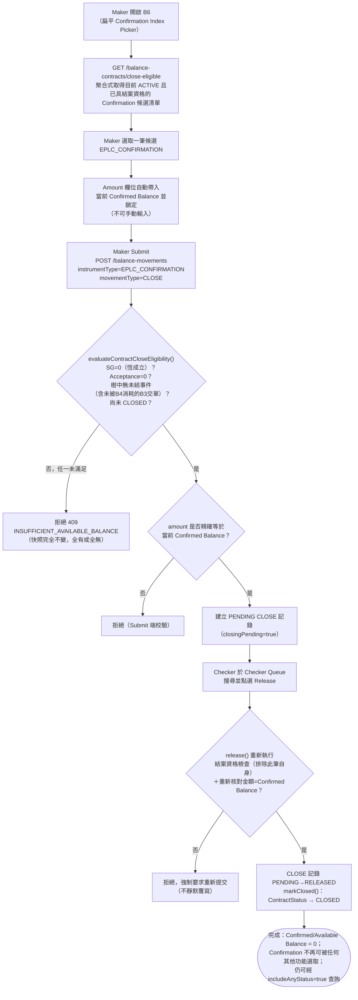

# B6 — 保兌信用狀結案（Confirmed LC Close）

本筆記是 Balance Component 具名業務功能 **B6** 在整個 Obsidian 知識庫中的主要入口，彙整其定義、真實 API 端點、端到端流程與已核實的相關業務規則。

## 功能摘要

| 項目 | 內容 |
|---|---|
| 功能代碼 | B6 |
| 功能說明（原始 label） | Confirmed LC Close |
| instrumentType | `EPLC_CONFIRMATION` |
| movementType | `CLOSE`（`requiresCloseEligibility: true`） |
| subChoice | 無——B6 沒有 tenor/方向等次選項 |
| 所屬方向 | Export（出口） |
| 所屬母層功能 | 無父層概念——B6 直接作用於根層 Confirmation 本身，採用如 A2/A3 的「扁平 Catalog 選取器」形態（非 A6/B4 等 parent-child 形態），僅過濾為目前具備結案資格（close-eligible）的 Confirmation |
| 是否為複合提交（compound） | 否——`FunctionStrategy` 為 `NO_SPECIAL_BEHAVIOR` 基底 + `movementDerivation.amountAutoFilledFrom: 'confirmedBalance'`，`checkerRelease`／`compoundSubmission`／`selectionFlow` 均維持預設（非 `settlesDocumentArrival`，非 `usesSettleableBalanceIndex`） |

以上定義已用 Read 工具核實於 `/home/claude/balance-kb/repo/src/app/transaction-builder/balance-component.model.ts`（`EXPORT_FUNCTIONS` 陣列，`code === 'B6'` 項，約第 491–499 行），其 `help` 文字明確載明：「Writes off whatever Confirmed Balance remains and retires the Confirmation. Only Confirmations with Acceptance Balance = 0 and no open Events anywhere in the tree — including a RELEASED-but-not-yet-consumed B3 Present Docs presentation (B4 has not Honoured/Accepted it yet) — are shown below; settle the Acceptance (B5) or complete B4 first if either is still outstanding. Amount is never typed — it is carried from the current Confirmed Balance and locked; 0 is a normal figure once every presentation has been fully honoured/accepted. Once Released, this Confirmation can no longer be selected by any other function.」（注意：Export 側的 help 文字只明確提及 Acceptance Balance = 0 與樹中無未結事件，未像 Import 側 A10 那樣另外提及 SG，因為 Confirmation 底下本就不會有 SG 子項——SG 只掛在 Import 側 `IPLC_LC` 下；`closeEligibility.ts` 的共用檢查邏輯仍會對 Confirmation 一併計算 SG 子項合計，但該值恆為 0，不構成實質阻斷條件）。`function-strategy.ts`（約第 157–161 行）之 `B6` 條目與此一致，`amountAutoFilledFrom: 'confirmedBalance'`。CONFIRMED。

### API 端點

依步驟4 對 `analysis/balance-component-api.yaml` 與 `analysis/balance-component-channel-api.yaml` 的實際查證，B6 並非擁有專屬路徑的端點，而是透過與 A10 共用的通用端點以 request body 的 instrumentType/movementType 驅動行為：

- **Step-1 Picker 提示（微服務層，權威）**：`GET /balance-contracts/close-eligible`（`balance-component-api.yaml:616`）——`summary`（第 619 行）明確標註「A10 (Import LC Close) / B6 (Export Confirmed LC Close) — Step-1 picker hint」；query 帶 `instrumentType`（必填，僅 `IPLC_LC`/`EPLC_LC`/`EPLC_CONFIRMATION`，其他值 400）、可選 `lcNumber`、`page`/`pageSize`；回傳一頁「目前 ACTIVE 且已具結案資格」的根合約清單（v1.16.0 新增）。
- **Maker Submit（微服務層，權威）**：`POST /balance-movements`（`balance-component-api.yaml:730`）——body 帶 `instrumentType: EPLC_CONFIRMATION`、`movementType: CLOSE`，`amount` 必須精確等於該合約當前 Confirmed Balance（可為 0，不可為負）；若結案資格未滿足，回傳 `409 INSUFFICIENT_AVAILABLE_BALANCE`（規範第 805–813 行，v1.16.0 changelog 第 805 行明確列出 `IPLC_LC/EPLC_LC/EPLC_CONFIRMATION only`）。
- **Checker Release**：`POST /balance-movements/{movementId}/release`（`balance-component-api.yaml:900`）——針對 CLOSE 會重新執行一次結案資格檢查（排除該筆自身，因其此刻仍為 PENDING）並重新核對金額仍等於當前 Confirmed Balance，通過後才將 `ContractStatus` 轉為 `CLOSED`（規範第 953–958 行）。
- **查詢層**：`GET /balance-contracts?includeAnyStatus=true`（v1.16.0 新增查詢參數）讓 Look Up Current Balance／Inquire Events 等純查詢呼叫端仍可解析已 CLOSED 的 Confirmation（規範第 481–486、518–520 行）；一般交易建立呼叫端不帶此參數，維持僅解析 ACTIVE 合約的既有行為。

UNCLEAR／CONFLICT：以 Grep 直接搜尋整份 `balance-component-channel-api.yaml`（`A10`/`B6` 兩個關鍵字），零筆匹配——`BalanceTransaction.functionCode`／`POST /channel/transactions` 的 functionCode 列舉僅含 `A1, A2, A3, A3S, A4, A6, A7, A8, A9, B1, B2, B3, B4, B5`。故 B6 目前僅可透過微服務層 API（`instrumentType`/`movementType` 直接驅動）呼叫；Channel API 門面尚未同步更新以暴露 B6 這個具名業務功能代碼，屬已核實的規格落差，非本筆記編造。

## 端到端流程（Trigger → Output → Error/Exception）

- **Trigger（觸發點）**：Maker 從 B6 的扁平 Confirmation Index Picker 中選取一筆目前 ACTIVE、且已滿足結案資格（close-eligible）的 `EPLC_CONFIRMATION` 根合約，發起 CLOSE。Picker 本身以 `GET /balance-contracts/close-eligible` 的聚合式伺服端調用取得候選清單（而非對每一候選逐一呼叫，[[STATUS-RULE-027]]）。CONFIRMED。

- **Input（輸入）**：Confirmation Number（Flat Catalog 選取，無 Parent 概念）；Amount 欄位完全不可手動輸入——一旦合約快照解析完成即自動帶入當前 Confirmed Balance 並鎖定為唯讀（[[MAKER-CHECKER-RULE-014]]）。CONFIRMED。

- **Validation（校驗）**：
  1. `evaluateContractCloseEligibility()` 遍歷整棵事件樹（根合約自身變動記錄 + SG 子項 + Acceptance 子項）判定四項條件：尚未為 CLOSED；SG 子項 Confirmed Balance 合計為 0；Acceptance 子項 Confirmed Balance 合計為 0；樹中任何位置皆無仍處未結狀態的事件（[[STATUS-RULE-004]]）。對 B6 而言 SG 子項合計恆為 0（Confirmation 底下無 SG），實質仍需核驗的是 Acceptance 子項與整棵樹的未結事件。CONFIRMED。
  2. 一筆已 RELEASED 但尚未被 B4 消耗（`presentDocsConsumedAt` 仍為 null）的 B3 交單呈現（`EPLC_EXAMINATION`／`CREATE`），即使已不處於 PENDING，仍會被視為未結事件而阻斷 B6 的 Close 資格（[[EXPOSURE-RULE-011]]）——這是 B6 相較於 A10 特有的一項出口側細節（Import 側 A10 沒有對應的「交單呈現」子事件形態）。CONFIRMED。
  3. Submit 時通用「Amount > 0」防護唯一豁免 CLOSE——0 為合法核銷值，但這一客戶端檢查甚至不攔截負數，改由服務端 `assertValidAmount()` 之 CLOSE 專屬規則（只拒絕負數）把關（[[MOVEMENT-RULE-025]]、[[MOVEMENT-RULE-011]]）。CONFIRMED。
  4. 金額必須與當前 Confirmed Balance 完全相等，此檢查在 Submit 與 Release 兩端都會重新驗證，Submit 與 Release 之間若餘額變動，會強制要求重新提交而非靜默覆寫（[[MOVEMENT-RULE-053]]、[[MAKER-CHECKER-RULE-014]]）。CONFIRMED。
  5. Close 僅限用於根層級 instrumentType（`IPLC_LC`/`EPLC_LC`/`EPLC_CONFIRMATION`）——B6 本身即符合此限制，此規則主要防護的是誤對非根票據（如 `EPLC_ACCEPTANCE`、`EPLC_EXAMINATION`）發起 CLOSE（[[STATUS-RULE-006]]）。CONFIRMED。

- **Classification（分類）**：instrumentType=`EPLC_CONFIRMATION`、movementType=`CLOSE`；`movementTypeMatchesFunction()` 的 `derivesMovementTypeFromTenor` 分支只為 B4 匹配 `HONOUR`/`ACCEPT`，CLOSE 明確解析為 B6 而非被 B4 吞併（[[MOVEMENT-RULE-024]]）。exposureNature／UNCLEAR：本次查證未在步驟1、2、4 的證據中找到 CLOSE 本身明確標註的 `exposureNature` 值；由於其性質是核銷既有 Confirmed Balance 而非建立新曝險，不排除沿用被核銷合約自身既有的 exposureNature，惟未見直接證據，故標註 UNCLEAR，不予臆測。

- **Business Decision（業務決策）**：A10/B6 Close 之設計明確參照 cs-tf-balance-knowhow 論證中「到期前取消（cancellation before expiry）」§3.9/§7.7 的類比——採用與自然到期相同的核銷會計處理，但由 Maker/Checker 操作觸發，而非按日期驅動的批次作業（`domain/closeEligibility.ts` 文件註解，`CLAUDE.md` 決策日誌 A10/B6 條目佐證）。CONFIRMED。

- **Balance/Exposure Decision（表內 vs 表外）**：CLOSE 核銷合約目前剩餘的全部 Confirmed Balance（金額精確等於核銷前的 Confirmed Balance），使其歸零；Release 後合約狀態轉為 `ContractStatus.CLOSED`，之後不得再被任何其他功能選取（[[STATUS-RULE-007]]）。CONFIRMED。

- **Tolerance 決策**：UNCLEAR——步驟1、2、4 的證據並未明確說明 CLOSE 對 `ceilingAmount`／Tolerance 換算的處理方式（Tolerance 換算的既有規則僅明確涵蓋 `EPLC_CONFIRMATION` 的 ISSUE/AMEND* 動作）；未見證據顯示 CLOSE 有另外的 Tolerance 換算步驟，暫標 UNCLEAR，不予臆測。

- **Movement Posting Generation（過帳分錄）**：Maker Submit 建立一筆 `EPLC_CONFIRMATION`／`CLOSE` 的 PENDING 記錄（金額鎖定＝Confirmed Balance）；Checker Release 時重新執行資格檢查與金額比對，通過後呼叫 `contracts.markClosed(balanceContractId, releasedAt)` 將 `ContractStatus` 設為 `CLOSED`（[[STATUS-RULE-007]]）。UI 顯示層對 CLOSE 變動記錄一律以帶紅色徽標的 CLOSING/PENDING、CLOSED/RELEASED 形式呈現，覆蓋一般狀態與占用狀態兩條展示軌跡（[[STATUS-RULE-021]]）；根合約上仍為 PENDING 的 CLOSE 記錄本身會設定 `closingPending: true`（[[STATUS-RULE-024]]），連帶使合約層級狀態徽章顯示為紅色/「CLOSING」（[[STATUS-RULE-023]]）。CONFIRMED。

- **Output（輸出）**：新建一筆 `EPLC_CONFIRMATION`／`CLOSE` 記錄；Release 後合約 Confirmed/Available Balance 均為 0，`ContractStatus` 轉為 `CLOSED`。`GET /balance-contracts?includeAnyStatus=true` 之後仍可供 Look Up Current Balance／Inquire Events 查詢到此已結案 Confirmation 及其 CLOSE 事件（[[MAKER-CHECKER-RULE-040]]、[[STATUS-RULE-013]]），但一般交易建立呼叫端（僅解析 ACTIVE）不會再選取到它。CONFIRMED。

- **Error/Exception（錯誤/例外）**：
  - 結案資格未滿足（尚有未清零 Acceptance 餘額，或存在已 RELEASED 但未被 B4 消耗的 B3 交單呈現，或事件樹中存在其他未結事件，或合約已是 CLOSED）→ `409 INSUFFICIENT_AVAILABLE_BALANCE`，且不留下任何部分核銷的痕跡（合約與其子項快照維持完全不變，符合「全有或全無」的原子性）——已於業務用例 export-case-11（出口側 Acceptance 未清零）及單元測試 CLOSE-B6-002（已 released 但未被 B4 消耗的 Examination CREATE 阻斷 Close）驗證此行為（[[EXPOSURE-RULE-011]]）。
  - Amount 與當前 Confirmed Balance 不精確相等 → 拒絕（Submit 與 Release 皆重新校驗）。
  - Amount 為負數 → 服務端 `assertValidAmount()` 拒絕（客戶端 Amount>0 通用檢查對 CLOSE 已豁免，不會攔截負數）。
  - 同一 `(balanceContractId, eventSeq)` 重複提交 → 200，返回既有記錄（冪等，通用規則）。

## 流程圖

## 交叉引用（Related Knowledge）

相關業務規則：
- [[STATUS-RULE-004]] — A10/B6 關閉資格判定：SG=0、Acceptance=0、整棵樹中無未結事件、尚未 CLOSED
- [[EXPOSURE-RULE-011]] — 已 RELEASED 但尚未被消費的 Present Docs Presentation 會阻塞 Export（B6）的 Close 資格判定
- [[MAKER-CHECKER-RULE-014]] — A10/B6 Close：Amount 欄位從不人工輸入，自動填入並鎖定為 Confirmed Balance
- [[MAKER-CHECKER-RULE-002]] — Close 資格判定的三層防線——選取器提示、Submit 與 Release 共用同一項檢查
- [[MOVEMENT-RULE-053]] — A10/B6 CLOSE 金額必須與當前 Confirmed Balance 完全相等，Submit 與 Release 皆重新校驗
- [[MOVEMENT-RULE-025]] — Submit 時通用「Amount > 0」校驗，CLOSE 為唯一豁免
- [[MOVEMENT-RULE-011]] — assertValidAmount() 服務端金額必須 > 0 兜底校驗，CLOSE 僅拒絕負數
- [[MOVEMENT-RULE-024]] — movementTypeMatchesFunction 正確區分 EPLC_CONFIRMATION 的 CLOSE 與 B4 的 HONOUR/ACCEPT
- [[MOVEMENT-RULE-029]] — 選定合約/快照時的金額自動填充推導：A10/B6 取 confirmedBalance，而非 availableBalance
- [[STATUS-RULE-006]] — Close 僅限用於根層級 instrumentType（IPLC_LC / EPLC_LC / EPLC_CONFIRMATION）
- [[STATUS-RULE-007]] — Close 釋放的副作用：合約轉為 CLOSED 狀態並鎖定，無法再進行後續操作
- [[STATUS-RULE-013]] — findByNaturalKey 可解析已 CLOSED 合約，findActiveByNaturalKey 僅限 ACTIVE
- [[STATUS-RULE-021]] — CLOSE 變動記錄（A10/B6）以帶紅色徽標的 CLOSING/CLOSED 展示，覆蓋一般狀態軌跡
- [[STATUS-RULE-023]] — 合約層級狀態徽章配色：ACTIVE 綠色、CLOSED/CANCELLED 紅色、SUPERSEDED 灰色，並有 CLOSING 覆蓋規則
- [[STATUS-RULE-024]] — 僅當根合約上的 CLOSE 記錄確實仍為 PENDING 時，closingPending 才為 true
- [[STATUS-RULE-027]] — A10/B6 Close 資格透過一次聚合式服務端調用解析，絕不逐一候選項呼叫
- [[MAKER-CHECKER-RULE-040]] — Look Up Current Balance 亦能解析已 CLOSED 合約，僅供查詢
- [[MOVEMENT-RULE-001]] — MOVEMENT_DIRECTION 正負號按 instrument/movementType 固定：CLOSE 為 -1
- [[STATUS-RULE-030]] — LC/保兌到期與撤銷的餘額沖正是已定義需求但無專屬 movementType；A10/B6 Close 提供功能相近但非日期觸發的替代機制

延伸背景（Import 側同構功能，僅供比對，不代表 B6 本身的證據）：
- [[A10-LC-Close]]

- [[Balance Component Overview]]
