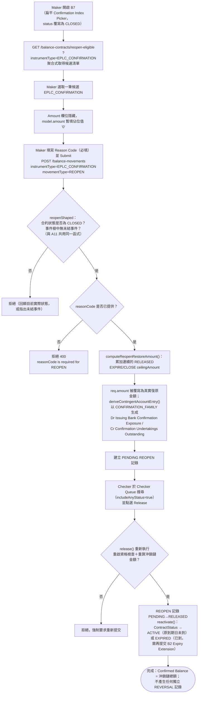

# B7 — 出口保兌信用狀重啟（Confirmed LC Reopen）

本筆記是 Balance Component 具名業務功能 **B7** 在整個 Obsidian 知識庫中的主要入口，是 [[A11-LC-Reopen]] 的出口對稱功能（F1 提案 §10.2「進出口對稱性」明確要求 REOPEN 須進出口兩側都設計）。B7 與 A11 共用完全相同的機制（同一段 `reopenShaped`/`computeReopenRestoreAmount()`/`deriveContingentAccountEntry()` 程式碼，僅 instrumentType 不同），本筆記聚焦於 Export／`EPLC_CONFIRMATION` 特有之處，共同機制細節請對照 [[A11-LC-Reopen]]，避免重複贅述。

## 功能摘要

| 項目 | 內容 |
|---|---|
| 功能代碼 | B7 |
| 功能說明（原始 label） | Confirmed LC Reopen |
| instrumentType | `EPLC_CONFIRMATION` |
| movementType | `REOPEN`（`requiresReopenEligibility: true`） |
| subChoice | 無 |
| 所屬方向 | Export（出口） |
| 所屬母層功能 | 無父層概念——扁平 Catalog 選取器，過濾條件為目前狀態 **CLOSED** 且具備重啟資格（reopen-eligible）的 Confirmation |
| 是否為複合提交（compound） | 否——`FunctionStrategy` 為 `NO_SPECIAL_BEHAVIOR` 基底 + `movementDerivation.amountFixed: '0'` |
| Amount 欄位 | 完全不顯示，與 A11 相同的「佔位 '0' → 伺服端覆寫」機制 |
| Reason Code | 必填（與 B6/A10/A11 相同的規則，見 [[MAKER-CHECKER-RULE-059]]） |

以上定義已用 Read 工具核實於 `src/app/transaction-builder/balance-component.model.ts`（`EXPORT_FUNCTIONS` 陣列，`code === 'B7'` 項，第 559-568 行）；`help` 文字明確載明：「Reopens a CLOSED Confirmation — restores whatever Confirmed Balance it had immediately before its EXPIRE/CLOSE write-off chain (sums every not-yet-reversed EXPIRE/CLOSE movement in its history, not only the last one). Only CLOSED Confirmations with no open Events anywhere in the tree are shown below. Status returns to ACTIVE, or to EXPIRED if the original Expiry Date has since passed (use B2's "Expiry Date" option afterward to extend it). No Amount to type...」該條目緊接在 A11 條目下方，程式碼註解明確標註「Export analog of A11 — see A11's own help text/doc comment above for the shared rationale」。`function-strategy.ts`（第 182-186 行）之 `B7` 條目與 A11 完全同構：`movementDerivation.amountFixed: '0'`。CONFIRMED。

### API 端點

與 A11 完全共用同一組微服務端點，僅 `instrumentType` 查詢參數改為 `EPLC_CONFIRMATION`：

- **Step-1 Picker 提示**：`GET /balance-contracts/reopen-eligible?instrumentType=EPLC_CONFIRMATION`（`microservices/balance-component/src/routes/balanceContracts.ts:78-92`；`BalanceService.listReopenEligibleContracts()`，`balanceService.ts:927-955`——同一函式，`ROOT_INSTRUMENT_TYPES.has(instrumentType)` 守衛同時涵蓋 `IPLC_LC`/`EPLC_LC`/`EPLC_CONFIRMATION` 三者）。CONFIRMED。
- **Maker Submit / Checker Release**：與 A11 相同的通用端點與 `reopenShaped`/`computeReopenRestoreAmount()`/`assertReasonCodeRequired()` 邏輯（`balanceService.ts:452-464`、`1603-1608`、`1488-1492`），僅 `instrumentType` 不同。CONFIRMED。
- **Checker Queue 查詢**：`checker-panel.component.ts:173-178` 的 `includeAnyStatus` 覆寫同樣適用於 B7（判斷條件是 `this.selectedFunction.requiresReopenEligibility`，與方向無關）。CONFIRMED。
- **Channel API 對照**：`analysis/balance-component-channel-api.yaml` v1.3.0（第 1046-1054 行）之 `code: B7` 條目，`help` 文字為「F1, v1.19.0 — Export-side symmetric counterpart of A11; same mechanism and eligibility rule.」——與 A11 同樣正確列入 `functionCode` 列舉（第 626、746 行）。CONFIRMED。

## 端到端流程（Trigger → Output → Error/Exception）

與 A11 的流程完全同構（同一段服務層程式碼，僅置換 instrumentType），差異點如下：

- **Trigger（觸發點）**：Maker 從 B7 的扁平 Confirmation Index Picker 中選取一筆目前 CLOSED、具備重啟資格的 `EPLC_CONFIRMATION` 根合約。與 A11 相同，`maker-panel.component.ts:513-520` 的 `status` 覆寫（CLOSED）與 `loadReopenEligibility()` 的聚合式取得邏輯完全共用同一段程式碼，僅由 `selectedFunction.instrumentType` 決定實際查詢的是 `IPLC_LC` 還是 `EPLC_CONFIRMATION`。CONFIRMED。

- **Input（輸入）**：Confirmation 對應的 LC Number（Flat Catalog）；Reason Code（必填）；Amount 隱藏。與 A11 完全一致。CONFIRMED。

- **Validation（校驗）**：
  1. `reopenShaped` 對 `EPLC_CONFIRMATION` 的判定與 `IPLC_LC` 完全相同——合約狀態必須是 CLOSED，事件樹中不得有未結事件（`gatherEventTree()` 對 `EPLC_CONFIRMATION` 會額外遍歷 `EPLC_EXAMINATION`（Present Docs）子項，與 A10/B6 的 `evaluateContractCloseEligibility()` 共用同一棵事件樹遍歷邏輯，但 Reopen **不**額外要求 Acceptance 餘額歸零——這一點與 CLOSE 的資格判定不同，REOPEN 本身沒有 B6 式的餘額歸零前提，`microservices/balance-component/src/service/balanceService.ts:452-464` 的 `reopenShaped` 並未讀取 `acceptanceConfirmedBalance`）。CONFIRMED。
  2. `assertReasonCodeRequired()`／`assertValidAmount()` 與 A11 完全共用同一段程式碼，無 instrumentType 分支。CONFIRMED。
  3. Release 時重新驗證：與 A11 相同的「狀態仍為 CLOSED」＋「事件樹無未結事件」＋「重算沖銷鏈金額仍相符」三重檢查（`balanceService.ts:1877-1898`）。CONFIRMED。

- **Classification（分類）**：instrumentType=`EPLC_CONFIRMATION`、movementType=`REOPEN`，exposureNature 沿用通用預設 `CONTINGENT`。CONFIRMED。

- **Business Decision（業務決策）**：與 A11 相同的 v1.19.0→v1.24.0 重新設計歷程（見 [[A11-LC-Reopen]] 該節完整摘要，不重複），F1 提案 §10.2 明確要求 Import/Export 對稱設計，B7 與 A11 在同一次程式碼變更中一併交付，未見任何 Export 特有的行為分歧。CONFIRMED。

- **Balance/Exposure Decision（表內 vs 表外）**：B7 使用 `computeReopenRestoreAmount()` 重新建立 Confirmation 自身歷史上「最近一段連續、尚未被反轉的 RELEASED EXPIRE/CLOSE 沖銷鏈」金額總和（與 A11 完全相同的演算法，`domain/reopenRestoration.ts` 對 instrumentType 無任何分支）。Release 後合約狀態依原 `expiryDate`（此處是 Confirmation 自身聲明的 UCP 600 到期日）轉為 `ACTIVE` 或 `EXPIRED`；回到 EXPIRED 者需再透過 B2 的「Expiry Date」子選項提交 Expiry Extension Amendment 才能回到 ACTIVE。CONFIRMED。

  **契約層面差異提示**：Confirmation（`EPLC_CONFIRMATION`）作為 Export 側唯一的根層 contingent 記錄，其子項只有 `EPLC_ACCEPTANCE`（Usance held-to-maturity）與 `EPLC_EXAMINATION`（B3 Present Docs，MEMO_ONLY），沒有 Import 側 SHGT 這種獨立子契約類型——但如上所述，這個差異對 REOPEN **本身**的資格判定不構成影響，因為 REOPEN（不同於 CLOSE）從未讀取任何子項餘額，只看 `hasOpenEvents`。UNCLEAR：本輪查證 `gatherEventTree()` 對 `EPLC_CONFIRMATION` 的事件樹遍歷是否完整涵蓋一筆「RELEASED 但尚未被 B4 消費」的 B3 Present Docs（`presentDocsConsumedAt` 為 null）視為未結事件——這是 `evaluateCloseEligibility()`（B6 專用）已明確記載的規則（見既有 [[a10-b6-close-eligibility-gate-and-write-off-flow]] 筆記），但 REOPEN 專用的 `gatherEventTree()` 呼叫路徑本輪未逐行單獨核對是否對 REOPEN 也適用完全相同的判定，僅確認兩者呼叫的是同一個共用函式簽名；標記 UNCLEAR，非臆測。

- **Tolerance 決策**：UNCLEAR，理由與 A11 相同（REOPEN 不在 `TOLERANCE_APPLICABLE_MOVEMENT_TYPES` 之中）。

- **Movement Posting Generation（過帳分錄）**：`deriveContingentAccountEntry()` 對 `EPLC_CONFIRMATION` 使用 `CONFIRMATION_FAMILY`（`domain/contingentAccountEntry.ts`：`establishDr: 'Issuing Bank Confirmation Exposure'`、`establishCr: 'Confirmation Undertakings Outstanding'`，`tenorSuffix: 'CONFIRMATION'`），REOPEN 的固定方向 `+1` 對應「Dr = Issuing Bank Confirmation Exposure — {Sight/Usance}，Cr = Confirmation Undertakings Outstanding — {Sight/Usance}」，與 ISSUE（B1）建立 CONF LIAB 時方向相同、帳戶名稱相同——REOPEN 在會計語意上等同「重新確認一筆與此前被沖銷金額完全相等的保兌」。CONFIRMED（依 `contingentAccountEntry.ts` 全文邏輯直接推導；本輪未見 REOPEN 對 `EPLC_CONFIRMATION` 的專屬單元測試逐一核對帳戶名稱字串，標記為 CONFIRMED 但非逐行測試核實——邏輯路徑與 A10/B6/ISSUE 共用同一個 `accountFamilyFor()`/`withTenorSuffix()` 函式，已對這兩個函式本身讀取全文）。

- **Output（輸出）**：新建一筆 `EPLC_CONFIRMATION`／`REOPEN` 記錄，帶真實 Dr/Cr 分錄；Release 後 Confirmation 的 Confirmed/Available Balance 恢復為沖銷鏈總額，`ContractStatus` 轉為 `ACTIVE` 或 `EXPIRED`。CONFIRMED。

- **Error/Exception（錯誤/例外）**：與 A11 完全相同的四類拒絕情形（非 CLOSED、非根層 instrumentType、事件樹有未結事件、缺少 reasonCode），詳見 [[A11-LC-Reopen]] 對應小節，程式碼路徑完全共用，僅將測試證據中的 `IPLC_LC`／LC Number 換成 `EPLC_CONFIRMATION`／Confirmation 的等價案例——`expiryExtensionAndReopen.test.ts` 內多數 REOPEN 測試（如第 279-580 行區間）以 `IPLC_LC` 撰寫，但 `reopenShaped` 與 `computeReopenRestoreAmount()` 本身對 instrumentType 無任何分支邏輯，故對 `EPLC_CONFIRMATION` 的適用性屬於「同一段程式碼、不同輸入」的直接邏輯推論，非另行臆測。UNCLEAR（記錄性質）：本輪未見專門以 `EPLC_CONFIRMATION` 為主體撰寫的 REOPEN 測試案例（`expiryExtensionAndReopen.test.ts` 的 REOPEN 測試群組看似全部使用 `issueImportLc()` 建置 `IPLC_LC` 情境），Export 側缺乏獨立測試覆蓋是本次查證發現的一個真實的測試覆蓋缺口，而非本筆記自行推測的業務規則缺口——本節標記為知識缺口（Knowledge Gap）供後續補測。

## 流程圖

## 交叉引用（Related Knowledge）

相關業務規則（與 A11 共用同一批規則，Import/Export 對稱）：
- [[MOVEMENT-RULE-064]] — REOPEN 復原金額計算（`computeReopenRestoreAmount()`，對 instrumentType 無分支）
- [[MOVEMENT-RULE-065]] — `MOVEMENT_DIRECTION.REOPEN = 1`，不再產生 REVERSAL 副作用
- [[MOVEMENT-RULE-066]] — 動態反轉方向；EXPIRED Extension 在同一筆 PENDING Amendment 上使用，不另建 REVERSAL
- [[MOVEMENT-RULE-067]] — CLOSE/EXPIRE/REOPEN 共用的金額校驗豁免（0 合法、負數拒絕）
- [[MOVEMENT-RULE-063]] — EXPIRE 資格判定不比照 CLOSE 的餘額歸零條件
- [[STATUS-RULE-032]] — REOPEN 對合約狀態的重啟規則
- [[STATUS-RULE-033]] — Auto Close Grace Period
- [[STATUS-RULE-034]] — `isRecentlyReopened()` 一個掃描週期的豁免窗口
- [[STATUS-RULE-035]] — `findClosedByNaturalKey()`／`findExpiredByNaturalKey()` 專屬解析路徑
- [[STATUS-RULE-036]] — 合約狀態徽標色彩與 Checker Queue `includeAnyStatus`
- [[MAKER-CHECKER-RULE-058]] — `BATCH_MAKER_ACTOR`/`BATCH_CHECKER_ACTOR` 保留真實四眼原則
- [[MAKER-CHECKER-RULE-059]] — CLOSE／REOPEN 強制 `reasonCode`
- [[EXPOSURE-RULE-030]] — ACTIVE `AMEND_EXPIRY_DATE` 無分錄；EXPIRED Extension 在 PENDING 即攜帶可供 Checker 審核的復原分錄
- [[STATUS-RULE-004]] — B6 關閉資格判定（B7 的「反面」條件）

支援技術細節與背景文件：
- [[A11-LC-Reopen]] — Import 對稱功能，本筆記大量共用其技術細節，避免重複
- [[a10-b6-close-eligibility-gate-and-write-off-flow]]
- [[auto-expiry-auto-close-background-sweep-and-grace-period]]

- [[Balance Component Overview]]
