# 出口保兌信用狀完整生命週期（Export Confirmed LC Full Lifecycle）

> [!info] 2026-08-30 lifecycle clarification
> B3 Maker Submit → EARMARKING → Checker Approve → EARMARKED；之后 B4 Honour／Acceptance 消费该已核准 B3。B4 的关联 legs 通过 atomic compound submit／release 处理。Transaction Index 一次选择 LC Number + EB Number，并显示 EB Amount。

## 定位說明

本筆記是**整合／總覽層**筆記，串接出口保兌側 6 個具名業務功能（B1、B2、B3、B4、B5、B6）在單一 `EPLC_CONFIRMATION` 根合約（及其 `EPLC_EXAMINATION`／`EPLC_ACCEPTANCE` 子合約）上，從保兌到結案的端到端生命週期。每個功能自身的欄位、校驗、過帳分錄、錯誤情境等**完整技術細節一律不在此重複**，僅連結至各功能自身的筆記（[[B1-Confirm-LC]]、[[B2-Confirm-LC-Amendment]] 等）。本筆記只負責回答「這些功能彼此如何銜接、順序為何、哪些是必經路徑、哪些是可選分支」。

以下路徑代表**單一批次交單**的最簡代表性路徑；一張保兌信用狀若涉及多批分批交單，B3／B4 可能會依批次交錯重複執行多次——技術筆記中未見對「多批次交叉排序規則」的專屬說明，此處不予臆測，標註 **UNCLEAR**。

## 生命週期階段總覽

| 階段 | 功能代碼 | instrumentType / movementType | 是否必要 | 銜接前置條件 |
|---|---|---|---|---|
| 保兌 | [[B1-Confirm-LC\|B1]] | `EPLC_CONFIRMATION` / `ISSUE` | 必要（起點） | 無——建立根合約，保兌行對受益人的獨立承諾 |
| 修改 | [[B2-Confirm-LC-Amendment\|B2]] | `EPLC_CONFIRMATION` / `AMEND`（帶符號金額表達 Increase／Decrease） | 可選，可重複 | B1 的 ISSUE 已 RELEASED |
| 交單 | [[B3-Present-Docs\|B3]] | `EPLC_EXAMINATION` / `CREATE` | 必要，可依批次重複 | B1 的 ISSUE 已 RELEASED；未超出 Present Docs Earmark 調整後的 Tight Available Balance |
| 兌付／承兌 | [[B4-Honour-Acceptance\|B4]] | `EPLC_CONFIRMATION` / `HONOUR`（Sight）或 `ACCEPT`（Usance）——由所選 Confirmation 自身 tenorType 伺服端推導 | 必要（每筆已 RELEASED 的 B3 都需要對應一次 B4） | 對應的 B3 記錄已真正 RELEASED 且尚未被消耗 |
| 結算（償付／到期） | [[B5-Settlement-Reimbursement-Maturity\|B5]] | `EPLC_ACCEPTANCE` / `FULL_SETTLE`／`PARTIAL_SETTLE`（複合，另含 `EPLC_ACCEPTANCE_REIMB_RECEIVABLE` / `REIMBURSE`） | 僅 Usance（B4 走 ACCEPT）分支需要，可重複至歸零 | B4 的 Usance 分支已建立並 RELEASED 的 `EPLC_ACCEPTANCE` |
| 結案 | [[B6-Confirmed-LC-Close\|B6]] | `EPLC_CONFIRMATION` / `CLOSE` | 必要（終點） | Acceptance 子項合計 = 0；樹中無未結事件（含已 RELEASED 但尚未被 B4 消耗的 B3）；尚未 CLOSED |

## Mermaid 流程圖

```mermaid
flowchart TD
    B1_ISSUE["B1 Confirm LC<br/>POST /balance-movements（ISSUE）<br/>建立 EPLC_CONFIRMATION 根合約，保兌行自身聲明 Tenor（Sight／Usance）"] --> B1_REL{"Checker Release B1？"}
    B1_REL -- 核准 --> ROOT["根合約 ACTIVE ＋ ISSUE RELEASED<br/>下游功能解鎖（assertRootIssueReleased）"]
    B1_REL -- 拒絕 --> B1_REJ(["REJECTED，流程終止"])

    ROOT --> B2_GATE{"是否需要修改保兌金額？<br/>（可選，可於任何時點重複執行；<br/>依 UCP600 10(b)，僅移動 Confirmation 自身或有負債，不觸碰 LC 本身）"}
    B2_GATE -- 是 --> B2_DO["B2 Confirm LC Amendment<br/>POST /balance-movements（AMEND，正數=Increase／負數=Decrease）<br/>調整 confirmed_amount"]
    B2_DO --> B2_GATE
    B2_GATE -- 否／已完成 --> B3_DO

    B3_DO["B3 Present Docs<br/>POST /balance-movements（EPLC_EXAMINATION / CREATE）<br/>建立 MEMO_ONLY 交單圈存（純物理事件，不動 Confirmation 或有敞口）"] --> B3_REL{"Checker Release B3<br/>（標準單腿 release，PENDING→RELEASED）"}
    B3_REL -- 拒絕 --> B3_REJ(["REJECTED"])
    B3_REL -- 核准 --> B3_DONE["B3 記錄 RELEASED，佔用 Present Docs Earmark<br/>直到被 B4 消耗（presentDocsConsumedAt）"]

    B3_DONE --> B4_PICK["Maker 選取一筆已 RELEASED 且<br/>尚未被消耗的 B3 記錄"]
    B4_PICK --> B4_DO["B4 Honour／Acceptance<br/>POST /balance-movements（referencedTransactionId 指向所選 B3）<br/>movementType 由 Confirmation 自身 tenorType 推導：Sight→HONOUR／其餘→ACCEPT"]
    B4_DO --> B4_REL{"Checker 一次 Release 複合放行：<br/>①主段（副作用：設定所引用 B3 的 presentDocsConsumedAt）<br/>②依 tenor 建立資產／負債段"}

    B4_REL -- "Sight（HONOUR）" --> DUE_FROM["建立 EPLC_DUE_FROM_ISSUING_BANK<br/>（表內資產，Confirmation 或有敞口釋放）"]
    B4_REL -- "Usance（ACCEPT）" --> B5_CREATE["建立 EPLC_ACCEPTANCE ＋ 配對<br/>EPLC_ACCEPTANCE_REIMB_RECEIVABLE<br/>（Folio5 表內負債/影子備忘資產）"]

    DUE_FROM --> DUE_FROM_NOTE["實際收款／結算 EPLC_DUE_FROM_ISSUING_BANK<br/>不屬於本圖任何具名功能的既定範圍<br/>（UNCLEAR，見下方說明）"]

    B5_CREATE --> B5_DO["B5 Settlement — Reimbursement／Maturity<br/>POST /balance-movements/compound<br/>EPLC_ACCEPTANCE FULL/PARTIAL_SETTLE ＋ EPLC_ACCEPTANCE_REIMB_RECEIVABLE REIMBURSE<br/>整组原子成功或回滚"]
    B5_DO --> B5_CHK{"Acceptance 餘額<br/>是否已歸零？"}
    B5_CHK -- 否（Partial Settle） --> B5_DO
    B5_CHK -- 是 --> MERGE

    DUE_FROM_NOTE --> MERGE["合流"]

    MERGE --> CLOSE_ELIG{"B6 結案資格檢查<br/>evaluateContractCloseEligibility()：<br/>Acceptance 合計=0？<br/>樹中無未結事件<br/>（含已 RELEASED 但尚未被 B4 消耗的 B3）？<br/>尚未 CLOSED？"}
    CLOSE_ELIG -- 任一未滿足 --> BLOCK(["暫不可結案<br/>409 INSUFFICIENT_AVAILABLE_BALANCE<br/>需先完成 B4／B5 或先消耗殘留 B3"])
    CLOSE_ELIG -- 全部滿足 --> B6_DO["B6 Confirmed LC Close<br/>GET /balance-contracts/close-eligible（Step-1 候選，僅微服務層 API）<br/>→ POST /balance-movements（CLOSE，Amount 鎖定＝當前 Confirmed Balance）<br/>→ POST .../release（重新核對資格與金額）"]
    B6_DO --> DONE(["ContractStatus → CLOSED<br/>Confirmed／Available Balance = 0<br/>不再可被任何其他功能選取<br/>（僅 includeAnyStatus=true 查詢可見）"])
```

## 關鍵銜接點說明（不重複各功能自身細節，只講銜接邏輯）

- **B1 是唯一的起點，也是所有下游功能的共同閘門**：B1 自身的 ISSUE 尚未經 Checker Release 之前，`assertRootIssueReleased()` 會擋下包含 B2／B3 在內的一切下游操作，與進口側 A1 的機制一致——見 [[B1-Confirm-LC]]。
- **B1 聲明的 Tenor Type 是保兌行自身視角下的獨立宣告**：僅代表保兌行自身的 Sight／Usance 承諾，並非開狀行原始 LC 的 Buyer's／Seller's Usance 區分（保兌行對開狀行內部融資結構安排無從得知）——見 [[B1-Confirm-LC]]。
- **B3 是純物理事件，B4 才是真正的法律事件**：B3（交單）僅代表銀行收單並著手審單，`MEMO_ONLY` 圈存，完全不觸碰 Confirmation 的 `confirmed_amount`；真正決定 Honour 或 Accept 的是 B4，B4 的 movementType 由所選 Confirmation 自身的 `tenorType` 伺服端推導（Sight→`HONOUR`，其餘一律→`ACCEPT`，將原規格 Sight/Buyer's Usance/Seller's Usance 三分歸併為二分）——見 [[B3-Present-Docs]]、[[B4-Honour-Acceptance]]。
- **B4 是複合放行**：Checker 一次 Release 依序完成①主段 HONOUR／ACCEPT（副作用：消耗所引用的 B3 記錄，解除其對 Present Docs Earmark 的占用，但不重複放行 B3 本身，因 B3 在挑選當下已是 RELEASED）②依 tenor 建立資產／負債段——與進口側 A6 的「一次 Release 完成兩件事」模式相符，通用骨架見 [[a6-b4-b5-compound-linked-leg-release-pattern]]。
- **B5 僅適用於 Usance（ACCEPT）分支**：B5 自身的 `catalogTenorFilter: USANCE` 明確限定僅 Usance 承兌信用狀才有候選可選，Sight LC 恆無 `EPLC_ACCEPTANCE` 子合約可供結算——見 [[B5-Settlement-Reimbursement-Maturity]]。
- **B6 是唯一的終點閘門**，其資格檢查會遍歷整棵事件樹（根 Confirmation 自身變動記錄 ＋ Acceptance 子項），任何一項未滿足（含仍有已 RELEASED 但尚未被 B4 消耗的 B3 呈現）都會全有或全無地拒絕——詳見 [[B6-Confirmed-LC-Close]]。

## UNCLEAR／已知落差（如實標註，不臆測）

- **Sight 分支（HONOUR）之後，`EPLC_DUE_FROM_ISSUING_BANK` 的實際收款／結算不在本流程圖任何具名功能之內**：[[B4-Honour-Acceptance]] 自身文字稱「實際收款留待 B5，且屬 Balance Component 範疇外」，但 [[B5-Settlement-Reimbursement-Maturity]] 自身的 `catalogTenorFilter` 明確限定為 `USANCE`——兩份筆記對「Sight 收款是否走 B5」的文字描述並不完全一致。本圖如實呈現兩者原文，不代為調解此落差，標註為 CONFLICT／UNCLEAR，任務指示的「B5（僅限 Usance 情境，可選）」與 B5 自身 `catalogTenorFilter: USANCE` 的定義一致，故本圖按此處理：Sight 分支的資產收款/結算步驟在 Balance Component 具名功能之外，不畫入 B5。
- **Channel API 尚未收錄 B6**：`balance-component-channel-api.yaml` 的 `POST /channel/transactions` functionCode 列舉僅含 `A1, A2, A3, A3S, A4, A6, A7, A8, A9, B1, B2, B3, B4, B5`，並不含 B6；B6 目前僅能透過微服務層 API 呼叫，Channel API 門面尚未同步——已在 [[B6-Confirmed-LC-Close]] 中核實，本圖 B6 節點的 API 描述以微服務層為準。
- **多批次交單下 B3／B4 的交錯順序**：本圖僅呈現單一批次的最簡代表性路徑；技術筆記中未見對多批次交叉排序的專屬業務規則說明，標註 UNCLEAR，不予臆測。
- **B2（Amendment）在生命週期中的精確可執行時間窗**：本圖將 B2 畫在 B3 之前，但 B2 實際上只要求 B1 的 ISSUE 已 RELEASED，理論上可在整個 Confirmation ACTIVE 期間隨時執行；圖中位置僅為可讀性安排，非嚴格時序限制。

## 交叉引用（Related Knowledge）

- [[Balance Component Overview]]
- [[B1-Confirm-LC]]
- [[B2-Confirm-LC-Amendment]]
- [[B3-Present-Docs]]
- [[B4-Honour-Acceptance]]
- [[B5-Settlement-Reimbursement-Maturity]]
- [[B6-Confirmed-LC-Close]]
- [[a6-b4-b5-compound-linked-leg-release-pattern]] — B4/B5 複合終結來源記錄的通用骨架
- [[b3-genuinely-releases-the-removed-acknowledge-only-design]] — B3 由舊有 acknowledge()-only 設計改為真正 release 的背景
- [[b3-b4-compound-release-export-present-docs-honour-accept]] — B3→B4 交單到兌付/承兌的複合放行細節
- [[a10-b6-close-write-off-lifecycle]] — A10/B6 核銷生命週期通用模式
- [[a10-b6-close-submit-through-release-lifecycle]] — A10/B6 Submit→Release 全程狀態轉換
- [[a10-b6-close-as-a-maker-checker-triggered-write-off-modelled-on-natura]] — A10/B6 核銷與自然到期核銷的類比設計
- [[a10-b6-close-write-off-pattern-import-case-8-9-10-11-12-export-case-8-]] — 已驗證的業務用例對照
- [[evaluatecontractcloseeligibility-private-service-method-3-call-sites]] — B6 結案資格判定核心邏輯（與 A10 共用）
- [[listcloseeligiblecontracts-step-1-picker-hint-with-n-1-batch-fetch]] — B6 Step-1 候選清單聚合查詢
- [[closeeligibilityinputs-closeeligibilityresult-evaluatecloseeligibility]] — 結案資格輸入/輸出型別
- [[release-s-close-specific-re-check-and-markclosed-side-effect]] — B6 Release 端重新核對與 markClosed 副作用
- [[Business-Rule-Index]]
