# 進口信用狀完整生命週期（Import LC Full Lifecycle）

## 定位說明

本筆記是**整合／總覽層**筆記，串接進口側 10 個具名業務功能（A1、A2、A3／A3S、A4、A6、A7、A8、A9、A10）在單一 `IPLC_LC` 根合約（及其 SHGT／Acceptance 子合約）上，從開立到結案的端到端生命週期。每個功能自身的欄位、校驗、過帳分錄、錯誤情境等**完整技術細節一律不在此重複**，僅連結至各功能自身的筆記（[[A1-LC-Issue]]、[[A2-LC-Amendment]] 等）。本筆記只負責回答「這些功能彼此如何銜接、順序為何、哪些是必經路徑、哪些是可選分支」。

以下路徑代表**單一批次裝運、單一 SG、單一 Acceptance** 的最簡代表性路徑；一張 LC 若涉及多批分批裝運或多筆 SG，A3／A3S／A8（甚至 A6／A7）可能會依批次交錯重複執行多次——技術筆記中未見對「多批次交叉排序規則」的專屬說明，此處不予臆測，標註 **UNCLEAR**。

## 生命週期階段總覽

| 階段 | 功能代碼 | instrumentType / movementType | 是否必要 | 銜接前置條件 |
|---|---|---|---|---|
| 開立 | [[A1-LC-Issue\|A1]] | `IPLC_LC` / `ISSUE` | 必要（起點） | 無——建立根合約 |
| 修改 | [[A2-LC-Amendment\|A2]] | `IPLC_LC` / `AMEND_INCREASE`／`AMEND_DECREASE` | 可選，可重複 | A1 的 ISSUE 已 RELEASED |
| 提貨擔保開立 | [[A8-SG-Issue\|A8]] | `SHGT` / `ISSUE` | 可選 | A1 的 ISSUE 已 RELEASED；金額受母 LC 當前 Available Balance 上限 |
| 單據到單（一般） | [[A3-Document-Arrival\|A3]] | `IPLC_LC` / `UTILIZE` | 與 A3S 二擇一，必要 | A1 的 ISSUE 已 RELEASED；該 LC 無待匹配之未贖回 SG |
| 單據到單（含 SG 贖回） | [[A3S-Document-Arrival-SG\|A3S]] | `IPLC_LC` / `UTILIZE`（複合，另含 `SHGT` / `FULL_REDEEM`\|`PARTIAL_REDEEM`） | 與 A3 二擇一，必要 | A8 已建立且尚有未贖回 SG 餘額與本次交單金額匹配 |
| 即期結匯 | [[A4-Sight-Settlement\|A4]] | `IPLC_LC` / `UTILIZE`（終結 A3／A3S 既有記錄，不新建） | Sight 分支必要，與 A6 二擇一 | LC 自身 `tenorType === SIGHT`（A1 聲明）；A3／A3S 已 EARMARKED |
| 承兌／延期付款建立 | [[A6-Acceptance-Usance\|A6]] | `IPLC_ACCEPTANCE` / `CREATE`（複合：同時終結來源 A3／A3S） | Usance 分支必要，與 A4 二擇一 | LC 自身 `tenorType` 為 Buyer's／Seller's Usance；A3／A3S 已 EARMARKED |
| 承兌結算 | [[A7-Acceptance-Settlement\|A7]] | `IPLC_ACCEPTANCE` / `FULL_SETTLE`／`PARTIAL_SETTLE` | 僅 Usance 分支必要，可重複至歸零 | A6 已建立並 RELEASED 的 `IPLC_ACCEPTANCE` |
| 提貨擔保贖回 | [[A9-SG-Redemption\|A9]] | `SHGT` / `FULL_REDEEM` | 可選（若 A8 的 SG 未透過 A3S 全數贖回，則此步驟為 A10 結案前置必要條件） | A8 已建立、尚有未贖回 SG 餘額 |
| 結案 | [[A10-LC-Close\|A10]] | `IPLC_LC` / `CLOSE` | 必要（終點） | SG 子項合計 = 0；Acceptance 子項合計 = 0；整棵事件樹無未結事件；LC 尚未 CLOSED |

## Mermaid 流程圖

```mermaid
flowchart TD
    A1_ISSUE["A1 LC Issue<br/>POST /balance-movements（ISSUE）<br/>建立 IPLC_LC 根合約，聲明 Tenor Type"] --> A1_REL{"Checker Release A1？"}
    A1_REL -- 核准 --> ROOT["根合約 ACTIVE ＋ ISSUE RELEASED<br/>下游功能解鎖（assertRootIssueReleased）"]
    A1_REL -- 拒絕 --> A1_REJ(["REJECTED，流程終止"])

    ROOT --> A2_GATE{"是否需要修改面額？<br/>（可選，可於任何時點重複執行）"}
    A2_GATE -- 是 --> A2_DO["A2 LC Amendment<br/>POST /balance-movements（AMEND_INCREASE／AMEND_DECREASE）<br/>面額增／減（Decrease 需通過 Tight Available 充足性檢查）"]
    A2_DO --> A2_GATE
    A2_GATE -- 否／已完成 --> A8_GATE{"應付貨物是否須先於<br/>正本單據到達前提貨？"}

    A8_GATE -- 是，需提貨擔保 --> A8_DO["A8 SG Issue<br/>POST /balance-movements（SHGT / ISSUE）<br/>建立 SHGT 子合約，佔用容量至母 LC Available Balance 上限"]
    A8_DO --> DOC_ARR{"正本單據送達"}
    A8_GATE -- 否 --> DOC_ARR

    DOC_ARR -- "該 LC 有未贖回 SG，<br/>金額與本次交單匹配" --> A3S_DO["A3S Document Arrival w/ SG<br/>POST /balance-movements/compound<br/>SHGT FULL/PARTIAL_REDEEM ＋ IPLC_LC UTILIZE<br/>一次 atomic Checker Release 贖回 SG 並記錄交單"]
    DOC_ARR -- "無 SG 或金額不匹配" --> A3_DO["A3 Document Arrival<br/>POST /balance-movements（IPLC_LC / UTILIZE）<br/>建立 Presentation Earmark（PENDING，Checker 確認後顯示 EARMARKED，<br/>但 status 仍為 PENDING，真正終結留給 A4／A6）"]

    A3S_DO --> TENOR{"LC 自身 Tenor Type<br/>（A1 已聲明）"}
    A3_DO --> TENOR

    TENOR -- Sight --> A4_DO["A4 Sight Settlement<br/>POST /balance-movements/{id}/maker-submit<br/>＋ POST /balance-movements/{id}/release<br/>終結既有 A3／A3S 記錄，PENDING → RELEASED<br/>（A4 本身不新建 movement）"]
    TENOR -- "Buyer's／Seller's Usance" --> A6_DO["A6 Acceptance Create<br/>POST /balance-movements（IPLC_ACCEPTANCE / CREATE）<br/>Maker Submit 建立 PENDING Acceptance；<br/>Checker 一次 Release 複合放行：①終結來源 A3／A3S ②建立 Acceptance"]

    A6_DO --> A7_DO["A7 Acceptance Settlement<br/>POST /balance-movements（FULL_SETTLE 或 PARTIAL_SETTLE）<br/>單一動帳、單一放行，非複合"]
    A7_DO --> A7_CHK{"Acceptance 餘額<br/>是否已歸零？"}
    A7_CHK -- 否（Partial Settle） --> A7_DO
    A7_CHK -- 是 --> MERGE

    A4_DO --> MERGE["合流"]

    MERGE --> A9_GATE{"母 LC 項下是否仍有<br/>A8 建立、尚未透過 A3S 贖回的 SG 餘額？"}
    A9_GATE -- 是 --> A9_DO["A9 SG Redemption<br/>POST /balance-movements（SHGT / FULL_REDEEM）<br/>僅支援全額贖回，不支援 Partial Redeem"]
    A9_DO --> CLOSE_ELIG
    A9_GATE -- 否／N.A. --> CLOSE_ELIG{"A10 結案資格檢查<br/>evaluateContractCloseEligibility()：<br/>SG 合計=0？Acceptance 合計=0？<br/>樹中無未結事件？尚未 CLOSED？"}

    CLOSE_ELIG -- 任一未滿足 --> BLOCK(["暫不可結案<br/>409 INSUFFICIENT_AVAILABLE_BALANCE<br/>需先清理未結 SG／Acceptance／事件"])
    CLOSE_ELIG -- 全部滿足 --> A10_DO["A10 LC Close<br/>GET /balance-contracts/close-eligible（Step-1 候選）<br/>→ POST /balance-movements（CLOSE，Amount 鎖定＝當前 Confirmed Balance）<br/>→ POST .../release（重新核對資格與金額）"]
    A10_DO --> DONE(["ContractStatus → CLOSED<br/>Confirmed／Available Balance = 0<br/>不再可被任何其他功能選取<br/>（僅 includeAnyStatus=true 查詢可見）"])
```

## 關鍵銜接點說明（不重複各功能自身細節，只講銜接邏輯）

- **A1 是唯一的起點，也是所有下游功能的共同閘門**：在 A1 自身的 ISSUE 尚未經 Checker Release 之前，`assertRootIssueReleased()` 會擋下包含 A2／A3／A3S／A8 在內的一切下游操作——見 [[A1-LC-Issue]] 的 STATUS-RULE-008。
- **Tenor Type 在 A1 開立時一次性聲明，之後不可變更**，並直接決定 A3／A3S 完成後要路由到 A4（Sight）或 A6（Usance）——A3／A3S 本身刻意保持中性，不做 Sight／Usance 分流判斷（見 [[A3-Document-Arrival]]）。
- **A3 與 A3S 是互斥的二選一路徑**，movementType 完全相同（皆為 `IPLC_LC`/`UTILIZE`），差別僅在於是否顯式匹配一筆未贖回的 SG；若該 LC 存在未贖回 SG 且金額可匹配，一般 A3 會被 Tight Available Balance 檢查硬性拒絕，訊息建議改用 A3S（見 [[A3-Document-Arrival]]、[[A3S-Document-Arrival-SG]]）。
- **A4／A6 都是「終結」既有 A3／A3S 記錄的動作，而非新建**：A4 對既有 PENDING 記錄呼叫 `/maker-submit` 再 `/release`；A6 則是「Maker Submit 建立新 Acceptance，Checker 一次 Release 同時放行來源記錄與新記錄」——兩者是同一種「先 Utilize 後 Release」複合骨架下的不同實作形態，詳見 [[a6-b4-b5-compound-linked-leg-release-pattern]]。
- **A8／A9 是圍繞同一顆 SHGT 子合約的一組獨立配對動作**：A8 建立、A9（或 A3S 內含的贖回腿）贖回。A9 本身僅支援全額贖回（`FULL_REDEEM`），不支援 Partial；若 SG 已透過 A3S 的複合贖回腿全數消耗，則不再需要獨立執行 A9——本流程圖將 A9 標示為「若 A3S 尚未替其贖回，則為 A10 前置必要」。
- **A10 是唯一的終點閘門**，其資格檢查會遍歷整棵事件樹（根 LC 自身變動記錄 ＋ SG 子項 ＋ Acceptance 子項），任何一項未滿足都會全有或全無地拒絕（不留部分核銷痕跡）——詳見 [[A10-LC-Close]] 與 [[evaluatecontractcloseeligibility-private-service-method-3-call-sites]]。

## UNCLEAR／已知落差（如實標註，不臆測）

- **Channel API 尚未收錄 A10**：`balance-component-channel-api.yaml` 的 `POST /channel/transactions` functionCode 列舉僅含 `A1, A2, A3, A3S, A4, A6, A7, A8, A9`，並不含 A10；A10 目前僅能透過微服務層 API（`instrumentType`/`movementType` 直接驅動）呼叫，Channel API 門面尚未同步——已在 [[A10-LC-Close]] 中核實，本圖 A10 節點的 API 描述以微服務層為準。
- **多批次裝運下 A3／A3S／A8／A6／A7 的交錯順序**：本圖僅呈現單一批次的最簡代表性路徑；技術筆記中未見對多批次交叉排序的專屬業務規則說明，標註 UNCLEAR，不予臆測。
- **A2（Amendment）在生命週期中的精確可執行時間窗**：本圖將 A2 畫在 A8／A3 之前，但 A2 實際上只要求 A1 的 ISSUE 已 RELEASED，理論上可在整個 LC ACTIVE 期間（含單據到單後、承兌期間）隨時執行；圖中位置僅為可讀性安排，非嚴格時序限制。

## 交叉引用（Related Knowledge）

- [[Balance Component Overview]]
- [[A1-LC-Issue]]
- [[A2-LC-Amendment]]
- [[A3-Document-Arrival]]
- [[A3S-Document-Arrival-SG]]
- [[A4-Sight-Settlement]]
- [[A6-Acceptance-Usance]]
- [[A7-Acceptance-Settlement]]
- [[A8-SG-Issue]]
- [[A9-SG-Redemption]]
- [[A10-LC-Close]]
- [[a6-b4-b5-compound-linked-leg-release-pattern]] — A6 複合終結來源記錄的通用骨架
- [[a3s-matched-businesseventid-sg-redemption-netting-ordering]] — A3S 兩段 leg 的 businessEventId 配對與淨額順序
- [[sg-redemption-amount-min-bill-amount-sg-outstanding]] — A9 贖回金額與 Bill Amount／SG Outstanding 的關係
- [[evaluatecontractcloseeligibility-private-service-method-3-call-sites]] — A10 結案資格判定核心邏輯
- [[listcloseeligiblecontracts-step-1-picker-hint-with-n-1-batch-fetch]] — A10 Step-1 候選清單聚合查詢
- [[closeeligibilityinputs-closeeligibilityresult-evaluatecloseeligibility]] — 結案資格輸入/輸出型別
- [[release-s-close-specific-re-check-and-markclosed-side-effect]] — A10 Release 端重新核對與 markClosed 副作用
- [[a10-b6-close-write-off-lifecycle]] — A10/B6 核銷生命週期通用模式
- [[a10-b6-close-submit-through-release-lifecycle]] — A10/B6 Submit→Release 全程狀態轉換
- [[a10-b6-close-as-a-maker-checker-triggered-write-off-modelled-on-natura]] — A10/B6 核銷與自然到期核銷的類比設計
- [[a10-b6-close-write-off-pattern-import-case-8-9-10-11-12-export-case-8-]] — 已驗證的業務用例對照
- [[Business-Rule-Index]]
