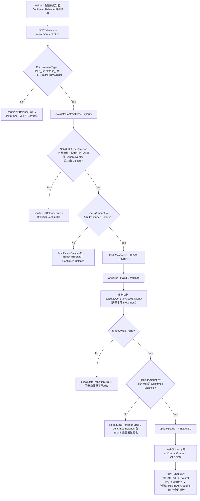

# A10/B6 Close——从 Submit 到 Release 的生命周期

A10（Import LC Close）/ B6（Export Confirmed LC Close）完整的三层防护：一个共享的资格检查（eligibility check）会同时把关 Step-1 picker（图中未展示）、Maker Submit 与 Checker Release；核销金额在 Submit 与 Release 时都必须精确匹配 Confirmed Balance。

## 证据来源

- `microservices/balance-component/src/domain/closeEligibility.ts`
- `microservices/balance-component/src/service/balanceService.ts lines 200-230, 413-467, 1159-1266`

## 相关知识

- [[Close Eligibility|SHGT/Acceptance 赎回、Amend Decrease、Close 资格]]
- [[Business-Rule-Index]]
