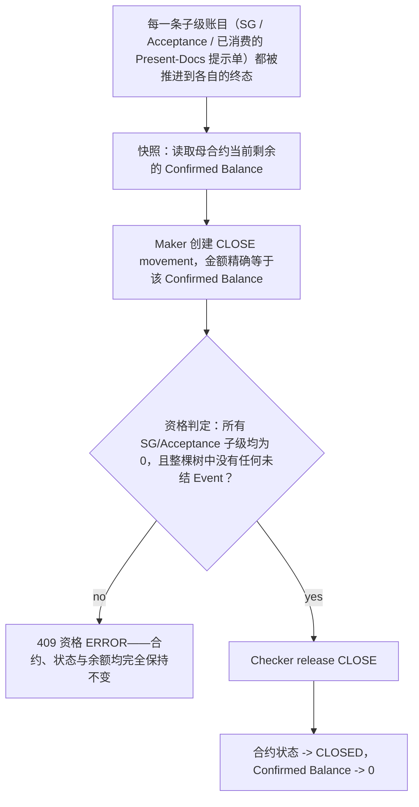

# A10 / B6 Close 核销生命周期

每个以 Close 终结的用例都遵循的模式，以及资格不通过的反例用例（import-case-11/12、export-case-11）如何证明该操作在原子性上是全有或全无（all-or-nothing）。

## 证据来源

- `backend/data/businessCases.js:839-1027,1029-1135,1137-1362,2007-2102,2317-2412`

## 相关知识

- Business Case Registry（后端编排器）+ Business Case Runner UI
- [[Business-Rule-Index]]
