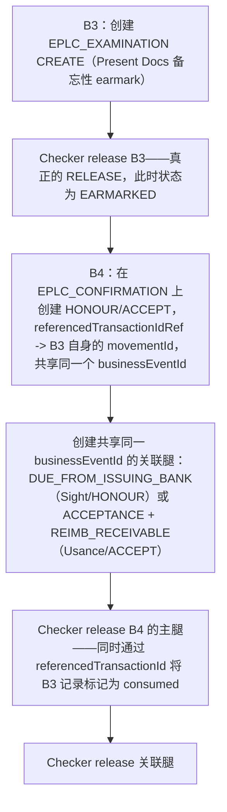

# B3 -> B4 复合式 release（Export Present Docs -> Honour/Accept）

Export Case #6/#7/#8/#9 所采用的当前（2026-08-18 之后）架构：B3 会先真正独立完成自身的 release，然后 B4 才会接手；B4 自身的 release 会将该 B3 记录标记为 consumed，作为其副作用。

## 证据来源

- `backend/data/businessCases.js:1792-1855,1882-1997`

## 相关知识

- Business Case Registry（后端编排器）+ Business Case Runner UI
- [[Business-Rule-Index]]
