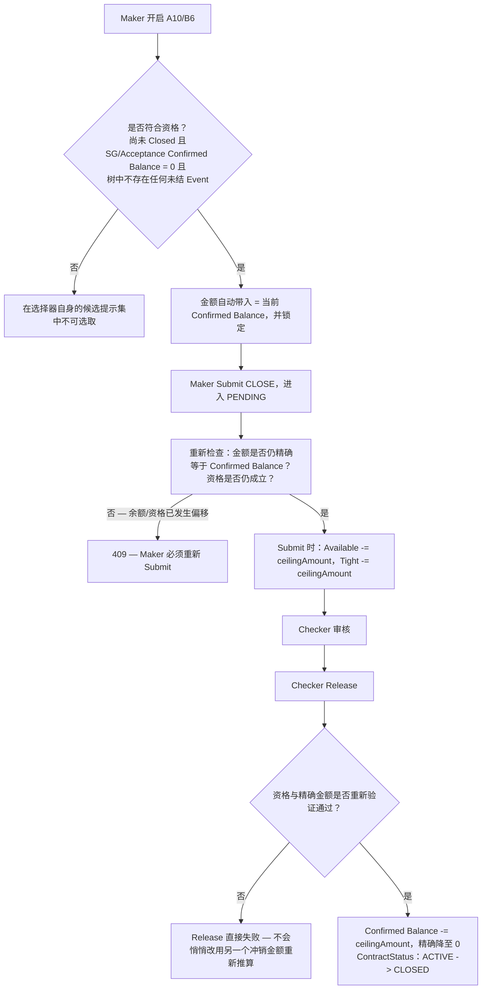

# A10/B6 — Submit 与 Approve 时的 Close 资格闸门

CLOSE 会冲销剩余的 Confirmed Balance 并终止该逻辑合约（Logical Contract），但前提是资格条件在 Submit 与 Approve 两个时点都必须成立——因为在这两者之间的窗口期，资格条件是有可能不再成立的。

## 来源证据

- `Balance-Figures-Calculation-Logic.txt lines 128-141 (banner)`
- `Balance-Figures-Calculation-Logic.txt lines 925-974 (A10)`
- `Balance-Figures-Calculation-Logic.txt lines 1260-1306 (B6)`

## 相关知识

- Balance Figures Calculation Logic + TF Balance Component Mapping Workbook
- [[Business-Rule-Index]]
