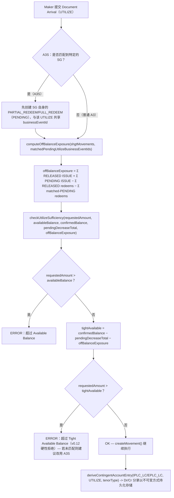

# Document Arrival（UTILIZE）充分性检查与 SHGT 表外净额处理

Maker 提交的 Document Arrival（普通 A3，或 A3S「含 Shipping Gtee 的提货文件到单」）如何针对母信用证的额度进行检查，包括刻意设计的 matched-businessEventId 例外——它让 A3S 提交能在信用证侧的检查真正运行之前，先行净额计入自身的 SG 赎回。

## 相关知识

- [[Off-Balance-Sheet Exposure|表外风险敞口与或有负债科目分录]]
- [[Business-Rule-Index]]
