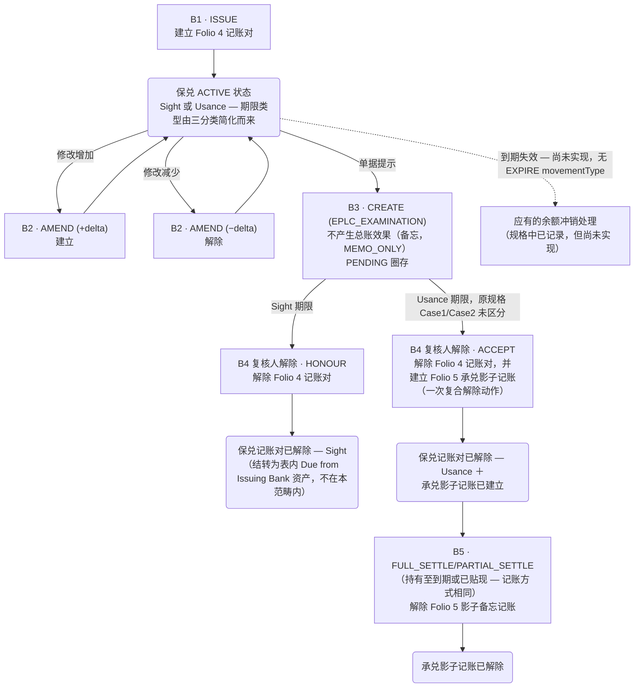

# 出口保兑信用证或有负债生命周期（Folio 4–5）

根据 analysis/contingent-liability-ledger.html Folio 4–5 的记载，本图展示出口保兑信用证（Export Confirmed LC）或有负债 Dr/Cr 记账的完整流程：从建立（B1／B2-增加）、单据提示备忘步骤（B3），经 Honour/Accept 解除（B4），到仅适用于 Usance 期限的承兑影子分支（B5）。

## Source Evidence

- `analysis/contingent-liability-ledger.html #folio-4, #folio-5, #coverage, Notes items 2,10,11,12,13`

## Related Knowledge

- 或有负债分类账（Dr/Cr 参考）
- [[Business-Rule-Index|业务规则索引]]
