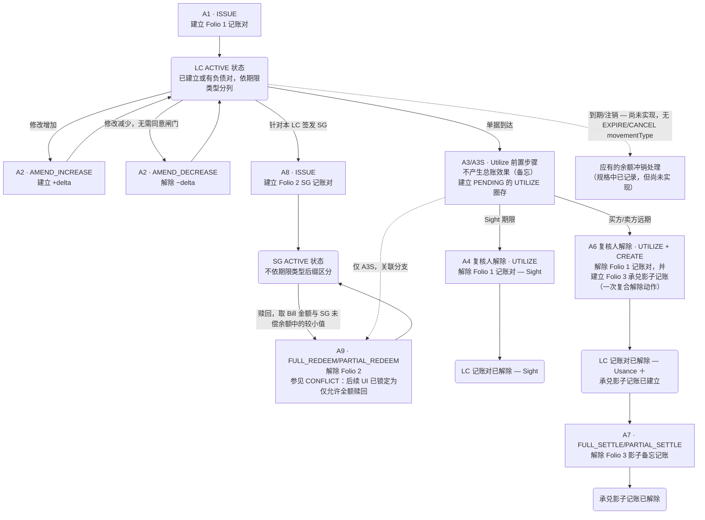

# 进口信用证或有负债生命周期（Folio 1–3）

根据 analysis/contingent-liability-ledger.html Folio 1–3 与功能代码覆盖索引所记载，本图展示进口信用证（Import LC）或有负债 Dr/Cr 记账的完整流程：从建立（A1/A2-增加）、解除（A2-减少/A4/A6/A7），到 SG 分支（A8/A9/A3S）。虚线路径标示不产生总账效果（仅备忘）或尚未实现的事件。

## Source Evidence

- `analysis/contingent-liability-ledger.html #folio-1, #folio-2, #folio-3, #coverage, Notes items 3,4,6,7,8,9`

## Related Knowledge

- 或有负债分类账（Dr/Cr 参考）
- [[Business-Rule-Index|业务规则索引]]
