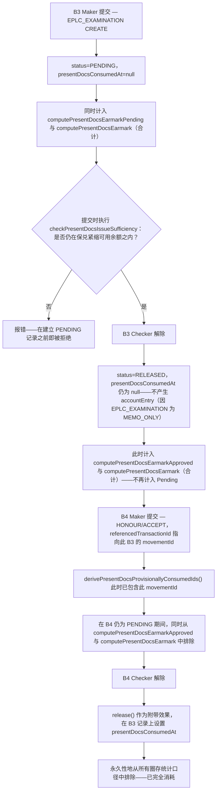

# 单据提示圈存跨 B3（单据提示）与 B4（Honour/Accept）的生命周期

本图展示一笔出口提示对保兑紧缩可用余额的贡献，如何随着 B3 与 B4 各自经历 Maker 提交与 Checker 解除，依次流转于 Pending（待处理）、Approved（已核准）、Provisionally-Consumed（暂时性已消耗）三种状态之间。

## Related Knowledge

- [[Off-Balance-Sheet Exposure|表外风险敞口与或有科目分录]]
- [[Business-Rule-Index|业务规则索引]]
