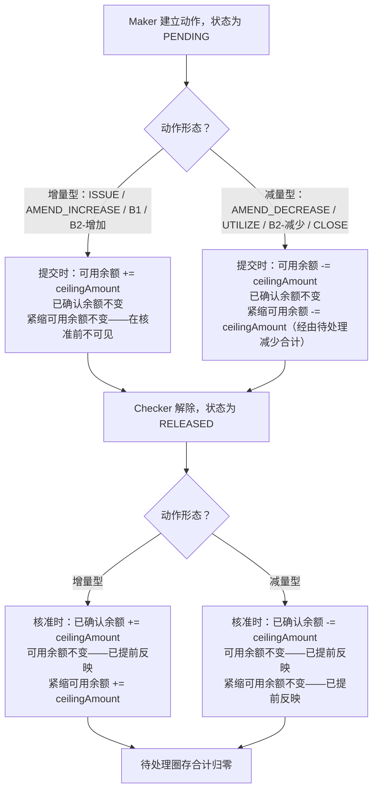

# 提交 → 核准 — 单笔动作余额生命周期（通用模式）

这是每一张 A1–A10/B1–B6 各功能表格，针对单一非复合动作所共同遵循的主时序模式，展示了增量型与减量型动作之间的不对称性（增加从严，占用从宽）。

## Source Evidence

- `Balance-Figures-Calculation-Logic.txt lines 348-397 (§5 General Pattern)`

## Related Knowledge

- 余额数字计算逻辑与 TF 余额组件对照工作簿
- [[Business-Rule-Index|业务规则索引]]
