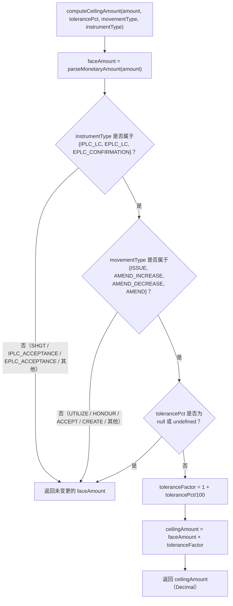

# computeCeilingAmount() 决策流程

computeCeilingAmount() 依照实际实现的确切顺序，依次应用三道闸门，最终返回原始面值金额或经容差换算后的上限（Ceiling）金额。

## 来源证据

- `src/domain/tolerance.ts:53-68`

## 相关知识

- 容差／上限换算（Tolerance / Ceiling Conversion）
- [[Business-Rule-Index]]
