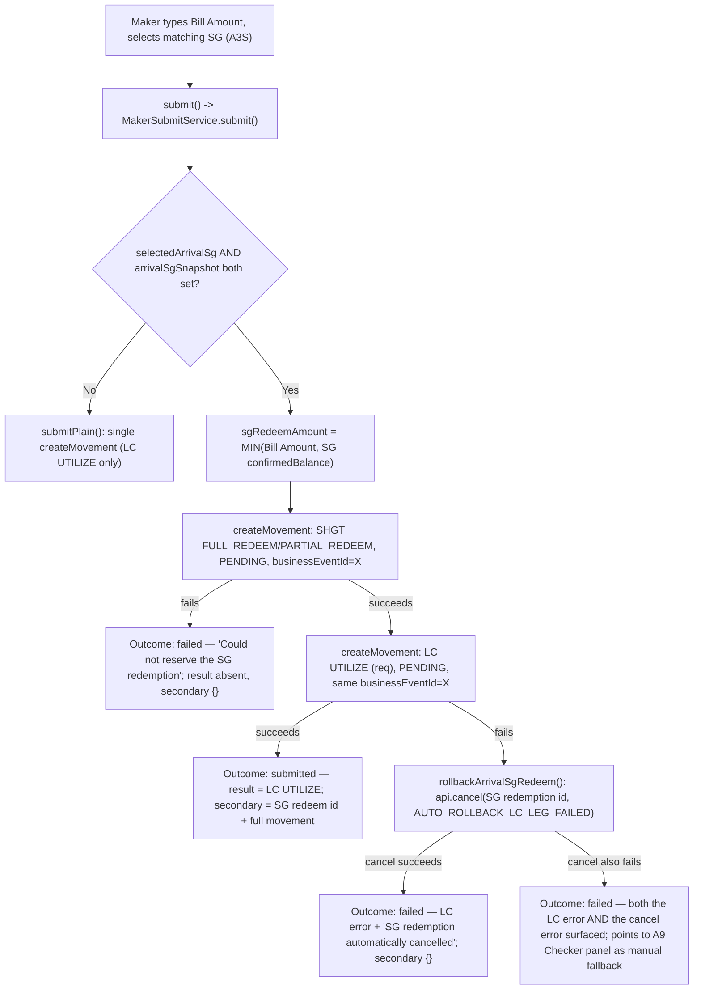

# A3S 组合提交与自动回滚（Auto-Rollback）

A3S（Document Arrival 与一笔 SG 赎回相匹配）端到端 Maker 提交流程，包括当第二条（LC）leg 在第一条（SG）leg 已经成功之后失败时的补偿性事务（compensating-transaction）回滚。

## Source Evidence

- `maker-submit.service.ts:66-150`

## Related Knowledge

- Angular Maker 面板 + Submit 编排
- [[Business-Rule-Index]]
