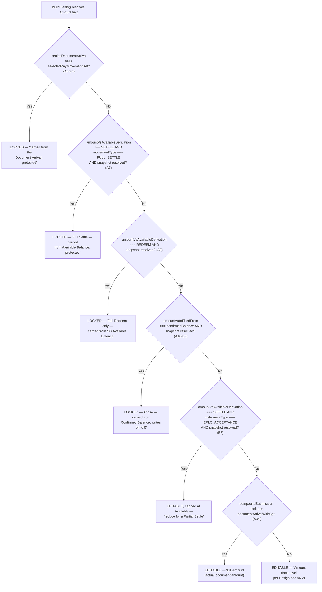

# Amount 字段锁定解析（buildFields）

buildFields() 如何判定 Amount 输入框是禁用、可编辑但有上限、还是完全可编辑，以及从 6 种提示文案中选出哪一种——按照源代码逐条判断条件的优先顺序呈现。

## Source Evidence

- `builder-fields.ts:24-102`

## Related Knowledge

- Angular 业务功能目录（Strategy/Policy/Rules）
- [[Business-Rule-Index]]
