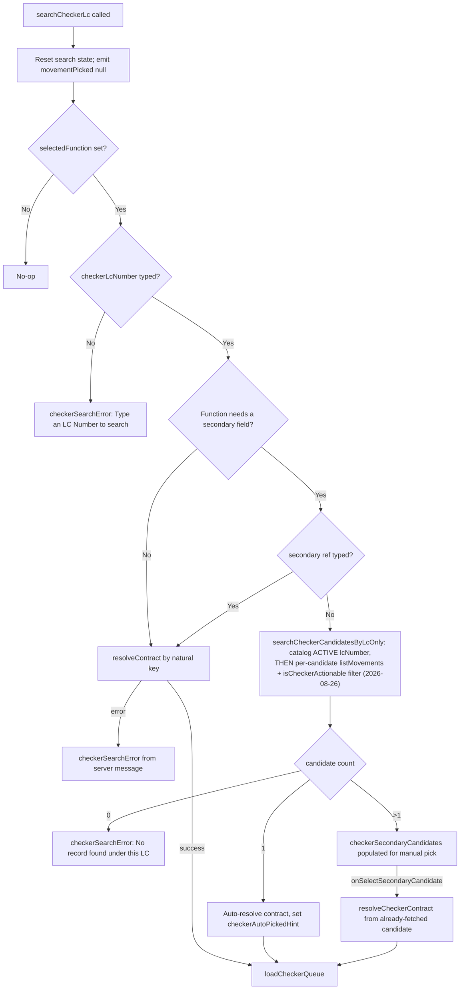

# Checker 独立搜索：按候选数量自动解析

searchCheckerLc() 在 Checker 的次要键（IB/SG Number）留空时的决策路径——浏览所输入 LC Number 下所有 ACTIVE 候选记录，而不是一开始就要求给出精确键值。

## 2026-08-26 更新 —— Browse 步骤新增「候选是否存在可操作项」过滤

上方 Mermaid 图中的 `Browse` 步骤，在本笔记最初写就时（2026-08-22 快照）只是 `catalog()` 的一次 ACTIVE 状态查询，得到候选记录后直接按数量分支（0/1/>1）。业务于 2026-08-24 报告缺口后（"B3/A3/A3S 單獨使用 Checker，已經 earmarked 的交易不應該再被選出"），`searchCheckerCandidatesByLcOnly()` 现在会对 `catalog()` 返回的每个候选，再逐一 `listMovements()` 并套用 `isCheckerActionable()`（与 `loadCheckerQueue()` 共享的同一判断式）过滤掉已经 Checker-Released（earmarked）、名下已无可操作项的候选，之后才进入原有的按数量分支决策。数量分支本身（0 报错／1 自动解析／>1 手动挑选）未变，只是候选集合的定义收紧了。详见 [[checker-s-own-independent-search-auto-resolve-when-the-secondary-key-i]] 的同一更新与新规则 [[MAKER-CHECKER-RULE-062]]。

## Source Evidence

- `checker-panel.component.ts:139-230`
- `checker-panel.component.ts:209-260,328-336`（2026-08-26 更新：新增的 per-candidate `listMovements`+`isCheckerActionable` 过滤）
- `checker-panel.component.spec.ts:422-467`（2026-08-26 更新：专项测试）

## Related Knowledge

- Angular Checker 面板 + Actions
- [[MAKER-CHECKER-RULE-062]]
- [[Business-Rule-Index]]
