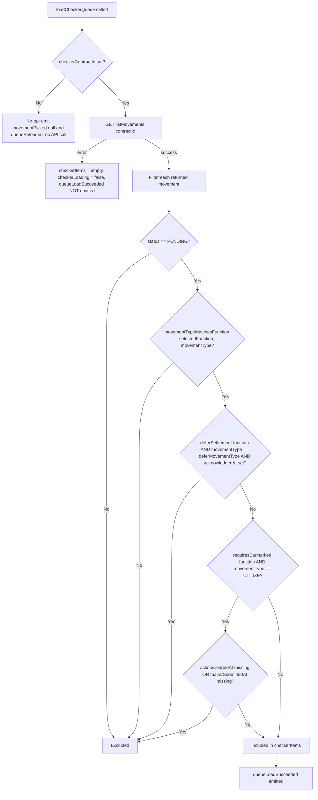

# Checker Queue 加载与过滤流水线（loadCheckerQueue）

loadCheckerQueue() 如何把一份合约的原始 movement 列表，转换成呈现给 Checker 的、按功能限定范围且已通过 4-eyes 门控的一组可操作 PENDING 项目。

## Source Evidence

- `checker-panel.component.ts:232-293`

## Related Knowledge

- Angular Checker 面板 + Actions
- [[Business-Rule-Index]]
