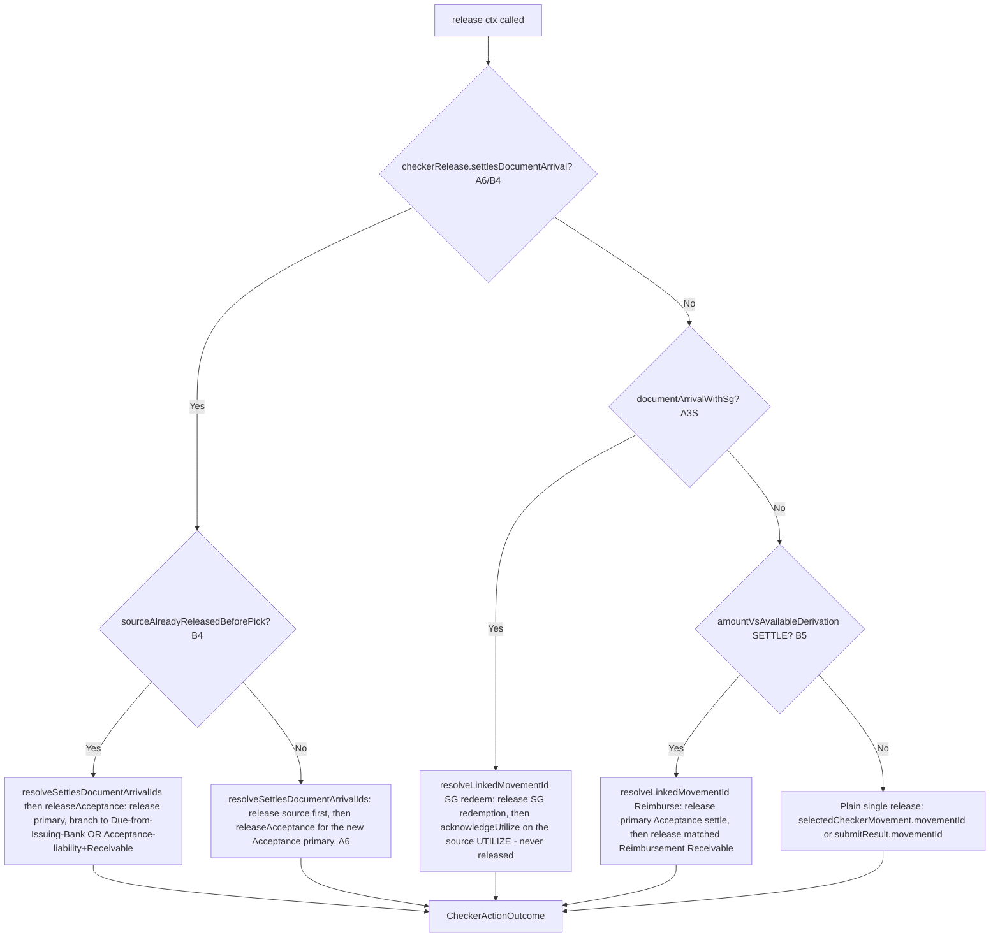

# CheckerActionsService.release() 按组合提交形态分发

一次 Release 点击如何依据所选功能被路由到正确的多 leg 释放链，包括每个分支所依赖的跨会话 businessEventId/referencedTransactionId 兜底机制。

## Source Evidence

- `checker-actions.service.ts:49-128`

## Related Knowledge

- Angular Checker 面板 + Actions
- [[Business-Rule-Index]]
