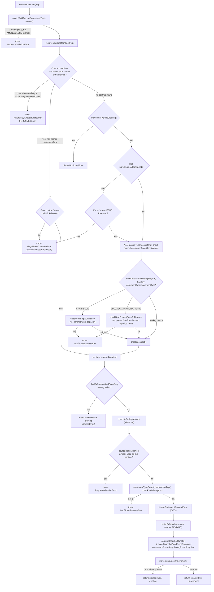

# createMovement()——端到端编排

从一个原始的 CreateMovementRequest 到一笔已持久化、携带快照的 PENDING BalanceMovement（或幂等地返回一笔已存在的记录）的完整路径。

## Source Evidence

- `balanceService.ts:839-1103`

## Related Knowledge

- Maker/Checker 服务编排（balanceService.ts）
- [[Business-Rule-Index]]
