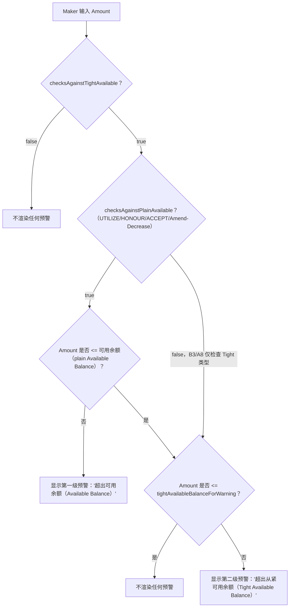

# 实时余额充足性预警门控（逐按键触发）

Maker 面板在 Amount 每次按键输入时，如何判定应渲染普通的"超出可用余额（Available Balance）"预警、"超出从紧可用余额（Tight Available Balance）"预警，还是两者都不显示——包含 B3/A8 仅检查 Tight 类型的例外情形。

## Source Evidence

- `maker-panel.component.ts:358-405, 774-808`

## Related Knowledge

- Angular Maker 面板与提交编排（Submit Orchestration）
- [[Business-Rule-Index]]
