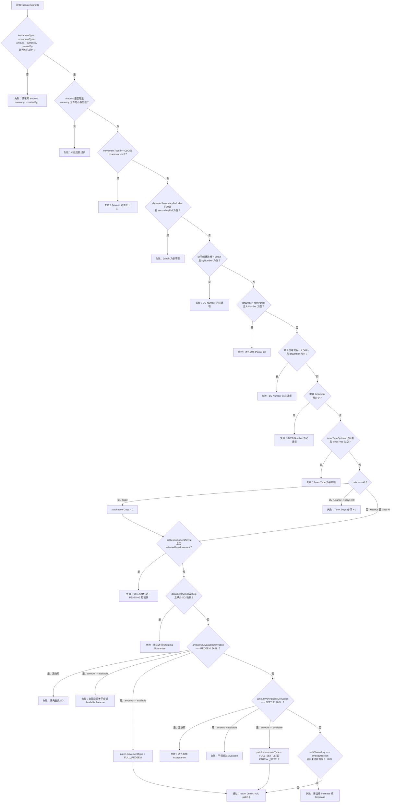

# Maker Submit 校验守卫链（validateSubmit）

这是每一次 A1-A10/B1-B6 的 Submit 操作，在组装出 CreateMovementRequest 之前必须依次通过的守卫链。各守卫按固定顺序执行；第一个失败的守卫会以自身的提示信息短路终止后续校验，但前面守卫已产生的 patch（例如 A1 的 tenorDays 归一化）即便后面的守卫在同一次调用中失败，依然会被保留应用。

## Source Evidence

- `submit-rules.ts:55-158`

## Related Knowledge

- Angular 业务功能目录（Strategy/Policy/Rules）
- [[Business-Rule-Index]]
