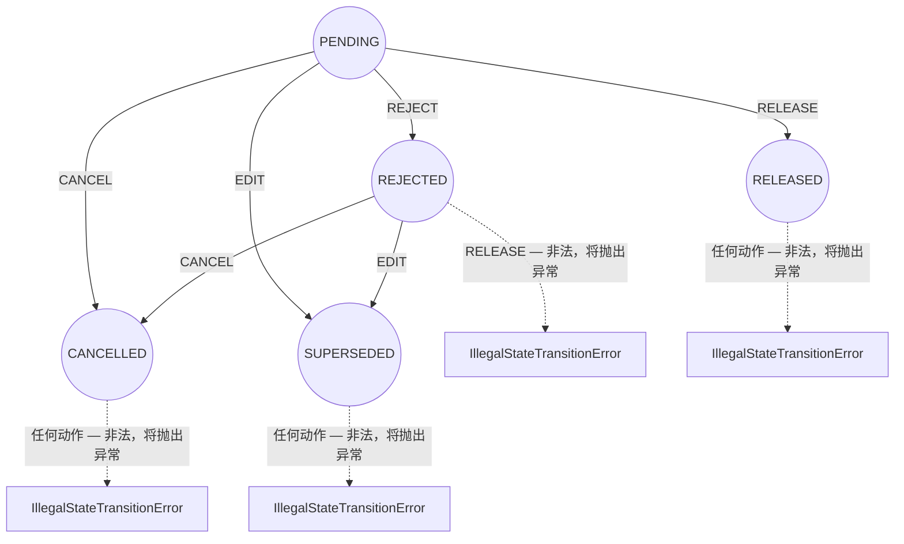

# MovementStatus 状态机（Maker/Checker 四眼原则生命周期）

一条变动记录在由 Maker 创建时即为 PENDING。从 PENDING 状态开始，Checker 的 RELEASE 或 REJECT，或者 Maker/Checker 发起的 CANCEL/EDIT，都可以使其脱离该状态。从 REJECTED 状态出发，唯一合法的后续动作只有 CANCEL 或 EDIT（绝不能再次 RELEASE）。RELEASED、CANCELLED、SUPERSEDED 均为终态——对它们执行任何动作都属于非法操作，会直接抛出异常。

## Source Evidence

- `microservices/balance-component/src/domain/statusTransition.ts (full file)`
- `microservices/balance-component/test/unit/domain/statusTransition.test.ts (full file)`

## Related Knowledge

- 余额推导（Balance Derivation）、状态迁移（Status Transition）、Tenor 路由（Tenor Routing）
- [[Business-Rule-Index]]
