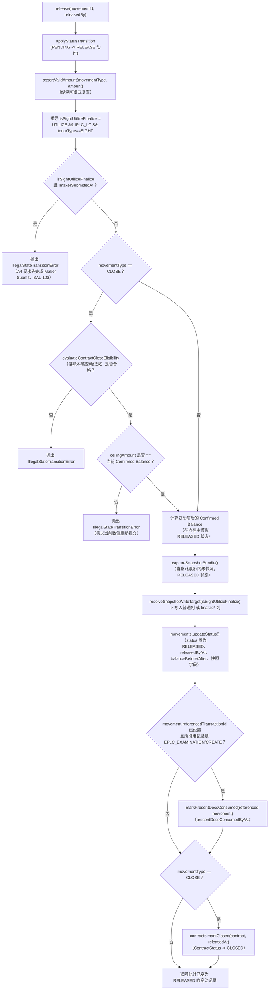

# release()——Checker Approve 编排流程，包含 B3/B4 消耗与 A10/B6 Close 的副作用

描述一条 PENDING 变动记录如何迁移为 RELEASED，涵盖 Sight-UTILIZE 的 Maker-Submit 门控、CLOSE 的重新校验、快照路由，以及 release() 执行时的两项副作用（单据消耗、合约关闭）。

## 2026-08-26 补充——流程图中「movements.updateStatus()」这一步，此前会静默清空 reason_code（真实 Bug，现已修复）

流程图中 `movements.updateStatus()` 这一步所写入的字段里，`reason_code` 此前用的是普通覆盖而非本图其余快照字段所用的 COALESCE 保留模式——`release()` 自身从不传入 `reasonCode`（CLOSE/REOPEN 的必填 Reason Code 是在 createMovement() 时就已捕获），所以每次 Release 都会把它静默清空。已修复为 `COALESCE(@reasonCode, reason_code)`，与其余字段的保留语义一致。完整说明与测试证据见 event-snapshot-column-write-semantics-coalesce-preserve-vs-explicit-in 笔记的 2026-08-26 补充小节。已知遗留数据现象：既有演示数据（LC `S01` 的 CLOSE/REOPEN）仍显示空白 Reason Code，属修复前遗留、不可逆的数据现象。

## Source Evidence

- `balanceService.ts:1105-1269`

## Related Knowledge

- Maker/Checker 服务编排（balanceService.ts）
- [[Business-Rule-Index]]
