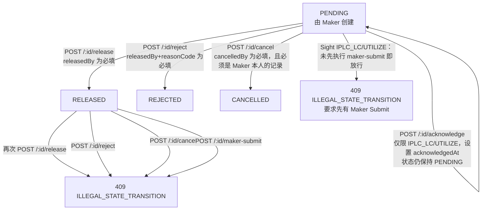

# 跨动作端点的 Maker/Checker 生命周期

一笔 PENDING 状态的 Movement 可以如何流转，以及哪些端点在哪些状态下是合法的——涵盖标准的放行/驳回/取消路径，以及两个从不改变状态本身的可选次要动作端点（maker-submit、acknowledge）。

## Source Evidence

- `src/routes/balanceMovements.ts:25-82`
- `test/unit/app.test.ts:1924-2035`
- `test/unit/app.test.ts:1282-1406`
- `test/unit/app.test.ts:2464-2811`

## Related Knowledge

- Express Routes + End-to-End API Behavior
- [[Business-Rule-Index]]
