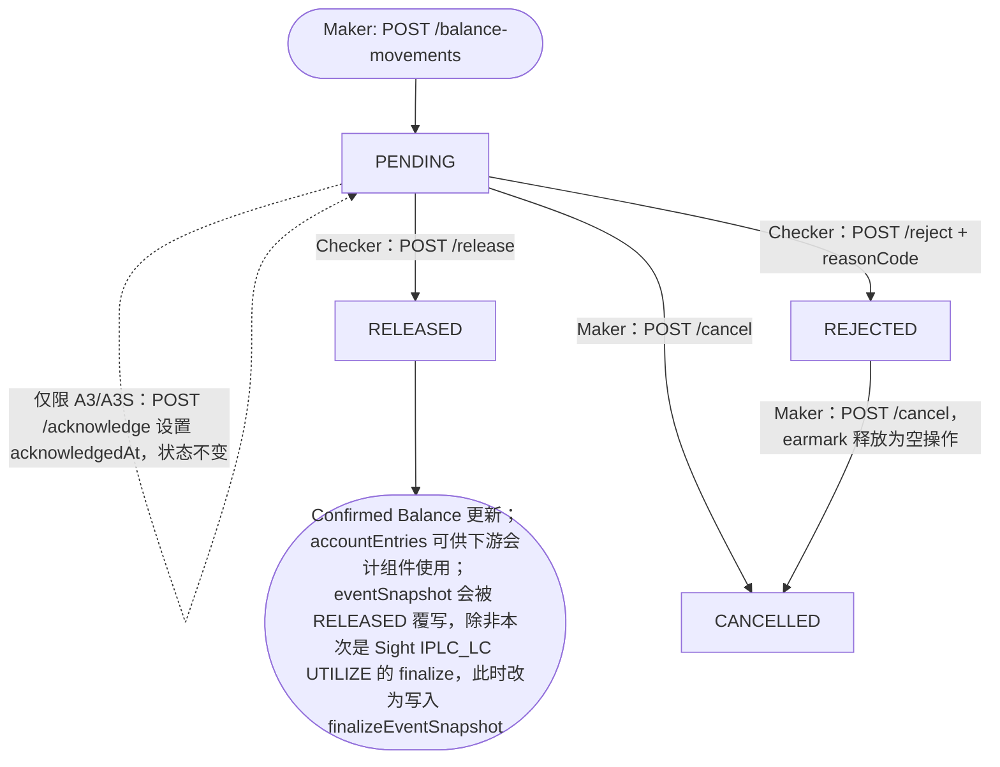

# Maker/Checker Movement 生命周期（MovementStatus 状态机）

每一笔 BalanceMovement 都遵循的通用 PENDING 生命周期，包括两个不触发状态迁移的旁路动作（maker-submit、acknowledge）——它们起到门禁作用，但从不推动状态前进。

## Source Evidence

- `balance-component-api.yaml lines 900-1194, 292-355`

## Related Knowledge

- OpenAPI Specs — Microservice + Channel API
- [[Business-Rule-Index]]
